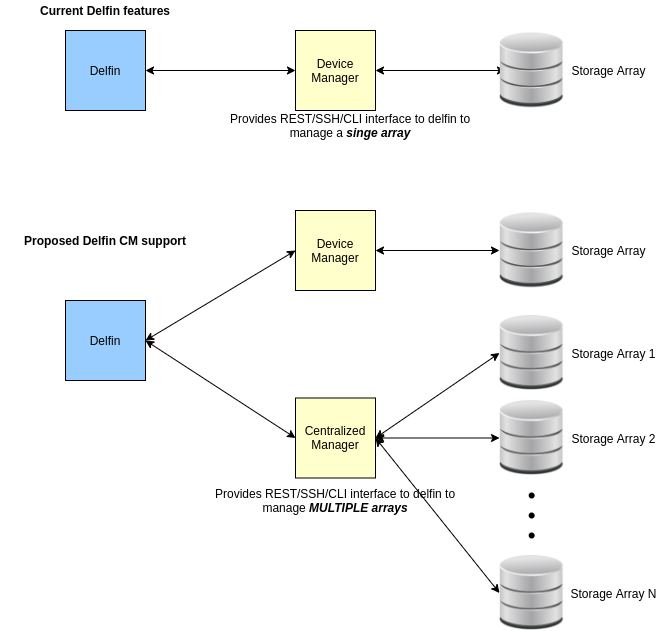
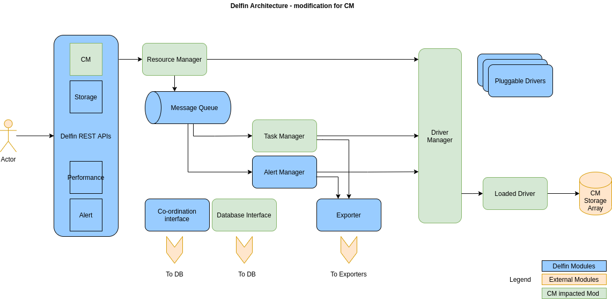
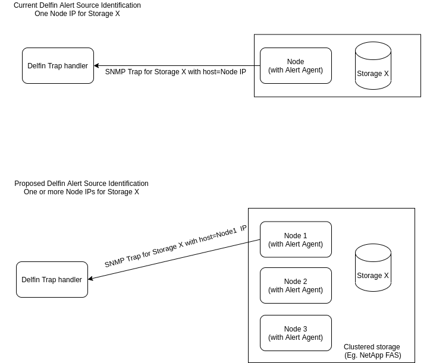
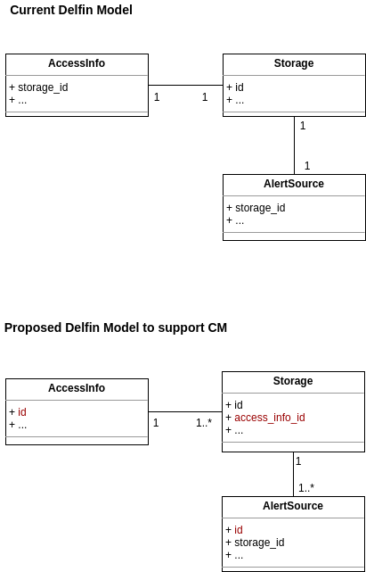

# SODA Delfin - Centralized Manager Support

Delfin is a Storage Infrastructure Management framework under SODA foundation projects for Heterogenious storage backends (cloud-enabled, offline-storage, etc.) for management, status collection, telemetry and alerting.

## Motivation and background

The storage vendors generally provide a software based manager to manage their storage arrays. This software based manager, referred here as **Device Manager** will be the interface to storage array, for doing configurations, getting performance details, check realtime status and alerts. An example for Device Manager is DELL-EMC Unisphere.

The Device Manager may be deployed in storage array or in a separate Node in the network where storage array is connected. Depending on the vendor, type of Device Manager and its deployment, the Device Manager will be managing either a single storage array or multiple storage arrays. If the Device Manager is managing multiple storage arrays, we refer it as **Centralized Manager**.

For a user to utilize the services from Device Manager, user needs to connect with supported protocol and authenticate itself with credentials. The protocols that Device Managers use in general, will be REST, SSH, CLI and SMI-S. Depending on the protocol used to connect, user needs to provide credentials like username and password, IP address and port, certificates, tokens etc. This protocol and credentials needed to connect and use Device Managers are referred as **Access Info**.

Current delfin implementation only support Device Managers that manages only single storage arrays. Delfin do not differentiate between a Device Manager and storage array.

Delfin needs to support Centralized Manager (CM) from the storage vendors, that manages multiple storage arrays.

## Goals

- Enable third party Centralized storage Manager to be supported in Delfin framework
- Collect major third party centralized storage manager access information details
- Analysis of impact on Delfin framework while adding centralized manager support

## Non-Goals

- Explain specific implementation details
- Explain internal or higher level framework specific details
- Support CMs that manages Heterogeneous (multi-vendor) storages

## Requirement Analysis

### Functional Requirements

- Users of delfin should be able to register a CM for the given Access Info (protocol and credentials)

  Registration of CM shall discover all the storage arrays managed by CM and add those arrays to delfin for management, performance monitoring and alerting.

  Registration shall fail if provided Access Info is insufficient or wrong

  Registration shall fail with 'Storage Already Exists' error, if user tries to register an already existing Access Info.

- Users of delfin should be able to delete individual storages that are registered with CM using storage id

  Delete shall remove Storages arrays, resources etc. from delfin management, monitoring and alerting.

  When all storages from CM are deleted from Delfin, CM access info shall be removed from delfin.

  Delete shall report failed status for invalid storage ids

- Users of delfin should be able to list all registered CM storage details

- Users of delfin should be able to show details for a registered CM storages, providing its id

- Users of delfin should be able to update CM Access Info details for a registered CM, providing access id

  Update shall verify the Access Info and if verification is success, update the CM details for the id of the access info, that is currently managed by delfin

  Invalid Access Info for CM shall report error and no changes shall be done to delfin

- Users of delfin should be able to SYNC all CM registered storages like normal storages

### Non Functional Requirements

- Centralized Manager support needs to be generic to support different storage vendors
- Centralized Manager support needs to be easely adaptable for existing API users of Delfin

## Architecture Analysis

Adding support for CM requires the update of current storage APIs and db models. Driver Manager and Driver API will require update. Impacted modules of delfin are highlighted below

### High Level Design

To support CM in current Delfin, some of the APIs and models require modification.

 - Update the current Delfin Storage APIs to support CM operations

 - Update the current Delfin models for Access Info and Alert source

### Alert Source Update

In the current implementation, Delfin supports to configure a SNMP alert source from one host IP to a storage . When the SNMP Trap is received at Delfin, the storage is derived from the host ip of the Trap source

But some storages supports multiple SNMP alert sources from multiple host IPs (Eg. NetAPP FAS). This requires changes in Delfin to identify the storage from Trap source's host IP

### Model update to support CM

Currently Delfin uses Access Info to register one Storage and there is one to one relationship between Access Info and Storage.

When supporting CM, one Access Info can register multiple Storages creating one to many relationship between Access Info and Storage.

### Steps involved to use CM in delfin

- Configure vendor device manager and create a management user and role if required for delfin
- Add access details (IP, Port, Protocol, user, credentials, array details etc.) to delfin
- Delfin driver connects to device manager and start collection/management on individual arrays
