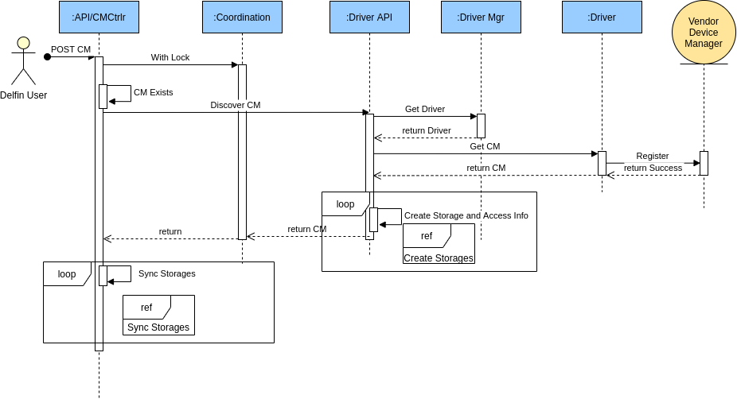
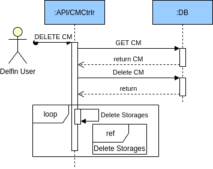
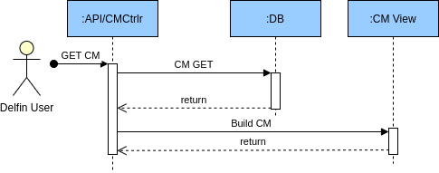
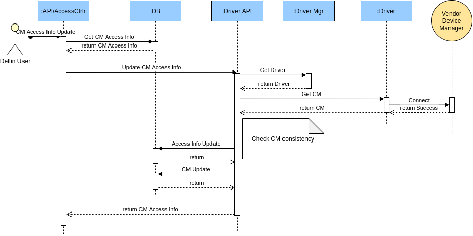
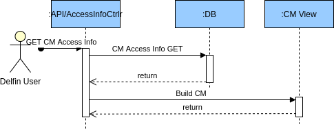
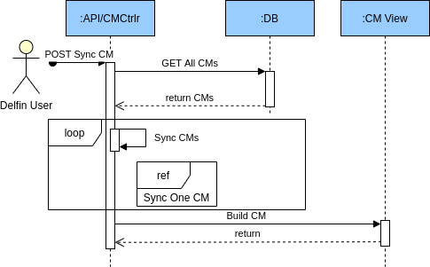
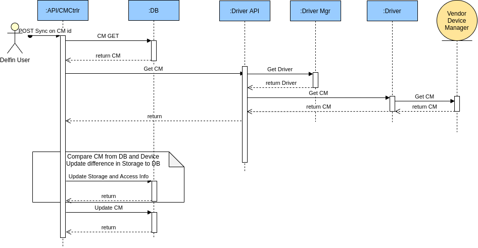

# SODA Delfin - Centralized Manager Support

Delfin is a Storage Infrastructure Management framework under SODA foundation projects for Heterogenious storage backends (cloud-enabled, offline-storage, etc.) for management, status collection, telemetry and alerting.

## Motivation and background

The storage vendors generally provide a software based manager to manage their storage arrays. This software based manager, referred here as **Device Manager** will be the interface to storage array, for doing configurations, getting performance details, check realtime status and alerts. An example for Device Manager is DELL-EMC Unisphere.

The Device Manager may be deployed in storage array or in a separate Node in the network where storage array is connected. Depending on the vendor, type of Device Manager and its deployment, the Device Manager will be managing either a single storage array or multiple storage arrays. If the Device Manager is managing multiple storage arrays, we refer it as **Centralized Manager**.

For a user to utilize the services from Device Manager, user needs to connect with supported protocol and authenticate itself with credentials. The protocols that Device Managers use in general, will be REST, SSH, CLI and SMI-S. Depending on the protocol used to connect, user needs to provide credentials like username and password, IP address and port, certificates, tokens etc. This protocol and credentials needed to connect and use Device Managers are referred as **Access Info**.

Current delfin implementation only support Device Managers that manages only single storage arrays. Delfin do not differentiate between a Device Manager and storage array.

Delfin needs to support Centralized Manager (CM) from the storage vendors, that manages multiple storage arrays.


## Goals

- Enable third party Centralized storage Manager to be supported in Delfin framework
- Collect major third party centralized storage manager access information details
- Analysis of impact on Delfin framework while adding centralized manager support

## Non-Goals

- Explain specific implementation details
- Explain internal or higher level framework specific details
- Support CMs that manages Heterogeneous (multi-vendor) storages

## Requirement Analysis

### Functional Requirements

- Users of delfin should be able to register a CM for the given Access Info (protocol and credentials)

  Registration of CM shall discover all the storage arrays managed by CM and add those arrays to delfin for management, performance monitoring and alerting.

  Registration shall fail if provided Access Info is insufficient or wrong

  Registration shall fail with 'CM Already Exists' error, if user tries to register an already registered CM.

- Users of delfin should be able to delete an already registered CM with its id

  Delete shall remove CM, CM details, CM managed storages arrays, resources etc. from delfin management, monitoring and alerting.

  Delete shall report failed status for invalid CM ids

- Users of delfin should be able to list all registered CMs details

  List shall report all the registered CMs and its properties excluding sensitive details like password

  If no CM is registered, the listing will return an empty list

- Users of delfin should be able to show CM details for a registered CM, providing its id

  Show shall get CM details for the id of the CM, that is currently managed by delfin

  Invalid id for CM shall report error

- Users of delfin should be able to update CM Access Info details for a registered CM, providing its id

  Update shall verify the Access Info and if verification is success, update the CM details for the id of the CM, that is currently managed by delfin

  Invalid Access Info for CM shall report error and no changes shall be done to delfin

- Users of delfin should be able to SYNC all registered CMs for updating list of managed storage arrays of each CM

  When user calls SYNC all, delfin with re-discover all the storage arrays from CM and update managed storage arrays

- Users of delfin should be able to SYNC a specific CM with the its id, for updating list of managed storage arrays by that CM

  When user calls SYNC for a CM, delfin with re-discover all the storage arrays from the CM and update managed storage arrays

### Non Functional Requirements

- Centralized Manager feature needs to be generic to support different storage vendors
- Centralized Manager feature needs to be compatible with already existing APIs of Delfin

## Architecture Analysis

Adding support for CM requires the addition of CM related APIs to current delfin APIs. Driver Manager and Driver API will require update. Impacted modules of delfin are highlighted below


### High Level Design

Add the Centralized Manager as a separate entity with APIs to support Create, Delete and Get operations. Access Info for CM can be with different Schema and supports APIs Update/Get. APIs for CM sync and sync-all also will be added for updating managed storages by CMs.

- Add REST APIs to support CRUD operations of CM and its access info.
- Update framework, driver manager APIs for supporting CM drivers
- None of the existing REST APIs will be impacted, existing delfin users will not require changes for existing features

#### Delfin DB Schema changes for CM

Changes in Delfin DB Schema to support the CM is captured here.

These changes will require migrating or re-creating of the DB for existing users of Delfin.

##### Centralized Manager model

A new CM Model will be added to the Delfin schemas

Attributes | Type | Description/enum
-- | -- | --
id | string | UUID of the Centralized Manager
vendor | string | Vendor of the CM
model | string | Model of the CM
storages | JSON | Array of storages the associated CM

##### Centralized Manager and Storage mapping model

A new CM-Storage-Mapping Model will be added to the Delfin schemas.

This table will be used to check whether the storage belong to CM.

Attributes | Type | Description/enum
-- | -- | --
storage_id | string | UUID of the Storage
cm_id | string | ID of the Centralized Manager

#### New APIs for CM

Following new REST APIs will be added to Delfin REST APIs to support CM

```sh
POST /centralized-managers -d <access-info>

DELETE /centralized-managers/<cm-id>

GET /centralized-managers

GET /centralized-managers/<cm-id>

PUT /centralized-managers/access-info -d <access-info>

GET /centralized-managers/access-info

PUT /centralized-managers/sync-all

PUT /centralized-managers/<cm-id>/sync
```

#### CM discovered Storages and normal Storages Differences

Following are the APIs that are different between CM discovered storages and normal storages.

Operation | Support in CM Storage | Description
-- | -- | --
Get Access Info | No Support | access info is for CM, discovered storage do not have access info
Update Access Info | No Support | Discovered storage do not have access info
Delete Storage | No Support | CM discovered storage deleted as part of CM delete
Update AlertSource | Supported | CM discovered storages support Alert source config. But CM do not.
Get AlertSource | Supported | CM discovered storages support Alert source get. But CM do not.

#### Sequence Diagrams

- **Register Centralized Manager**



- **Delete Centralized Manager**



- **List Centralized Manager**



- **Update Centralized Manager Access Info**



- **List Centralized Manager Access Info**



- **Sync Centralized Managers**



- **Sync One Centralized Manager**




#### Common Access Info for storage managers

| Access Info Field | Description                                                                    |
| ------------------|--------------------------------------------------------------------------------|
| User ID/Password  | User ID with correct security permissions/roles (for Manager/Storage/CLI/SMI-S)|
| CM IP:Port        | IP and Port with protocol (HTTP/HTTPS)                                         |
| CLI Path          | Path to the CLI executable                                                     |
| Operating System  | Windows and Linux os requirement                                               |
| IPs/Hostnames     | Comma separated IPs of servers, with user id and password same for all servers |

### Steps involved to use CM in delfin

- Configure CM and create a Manager user and role if required for delfin
- Add access details (IP, Port, Protocol, user, credentials, array details etc.) to delfin
- Delfin driver connects to CM and start collection/management on individual arrays
