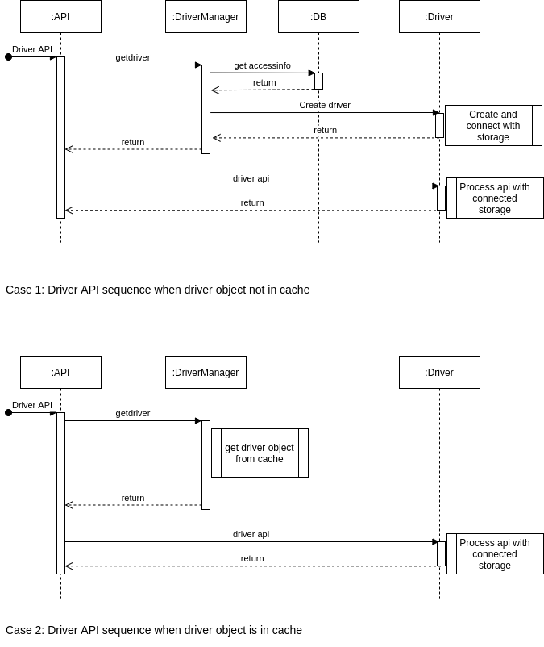

# Delfin Driver Manager and Driver Design Document

**Authors:** [Joseph V](https://github.com/joseph-v)

This is design document for Driver manager and Driver modules of SODA Infrastructure Management project Delfin.

## Goal

This document propose, how driver manager can be used by higher modules in Delfin and how it manage individual storage backend drivers for connect & retrieve backend storage information.

This document also describe the driver interfaces (APIs) and its attributes

## Non-Goals

This does not include implementation details of the driver manager and driver modules

## Assumptions and Constraints

NA

## Requirement Analysis


### Feature Requirements

#### Users (Services like API, TaskManager, AlertManager, etc.) should be able to use driver manager as below

1. Create driver instances
2. Update driver instances
3. Delete driver instances
4. Query driver instances

#### Functional requirements

In Delfin, Driver manager is responsible for managing different drivers and its mapping for the respective storage backend.

1. Driver manager should be able to load right driver from the given access info

Driver manager uniquely identify the driver plug-in, for a storage backend from the **vendor** and **model** fields of [**access info**](#data-model).

Driver manager use python dynamic loading features to load driver plug-in from entry-points in `setup.py` and stevedore module.

2. Given input access information, user should be able to discover, connect and retrieve information about backend storage

Storage needs to be registered using access information.

In the registration process, driver will verify connection to storage, user credentials, versions etc.
Once driver successfully validates access info, by connection, credential & version check, it will be updated to database.
This completes the registration, and driver returns updated storage information from database.

When driver failed to register storage, it returns reason for the failure (Invalid IP & Port, Invalid Username or Password etc)
Details of steps captured below.

* Driver should be able to communicate with backend with right connection protocols (REST/SSH/CLI/SMI-S)

* Driver should be able to verify storage availability (from ip and port address)

* Driver should be able to verify credentials of the user to access storage (from username & password, certificate)

* Driver should be able to verify supported backend (from versions of driver and storage)

* Driver should be able to get storage array, resource, alert information from storage

Once storage is registered, driver provides APIs (listed in the later sections in this document) to retrieve information from backend storage.

3. User should be able to update access_info for a registered backend storage

When user wants to update access info of a registered backend registration/validation steps listed in requirement above should be satisfied.

On successful validation of new access_info database should be updated and previous registration states should be cleaned.

#### Non Functional requirements

* Connection between Delfin and backend storage can be made secure with TLS/SSL certificate mechanisms

Driver should be able to support secure communication with REST or SSH using TLS/SSL certificate if backend storage supports it.

* User provided credentials should not be stored/cached in plain text format

* Driver manager should support multi-node deployment of Delfin

Delfin needs to support high availability using multi-node deployment of its services (**api, task & alert**).

This means Driver Manager should handle driver object create, update, delete and caching in multi-node aware mechanisms.
If the driver is used in one of the services (**api, task, alert**), the created driver object can be cached as optimization.
If the driver is updated or deleted by user, the node that handling that user request should inform the other nodes, that cache the driver.
This is required to ensure that any resources, sessions, states, etc. that driver holds, can be cleaned in correct and timely manner.

So the solution could be,

* 1. Whenever driver is removed, the node that handle that request, should broadcast the driver removal to all other nodes

* 2. Nodes should not cache driver object, if it cannot handle/receive the above broadcast message to do the driver removal

## Architecture Analysis

### Intermodule interaction diagram


### Sequence diagram



### Code flow to driver APIs


### Submodules

* Driver API : Interface functions for upper layer softwares to retrieve information about resources, performance etc. from backend storages.
* Driver Manager : Manages driver objects creation, caching, update, removal, etc.
The driver manager shall retrieve storage driver for given access information or given storage backend
The driver manager shall update storage driver of the given storage backend for caching
The driver manager shall delete storage driver of the given storage backend

* Drivers: Backend specific implementation for communication with the backend storages
The storage driver shall connect and register storage for given access information
The storage driver shall support all the APIs defined for the driver
The storage driver shall cleanup all resources and states when removed

## Detailed Design

### Interface Design

#### Interfaces consumed by Driver API

|  Consumer | Interfaces |
|-----------------|---------------------------|
| Driver Manager | Name: get_driver |
|                | Description: To get driver object, either from cache or create new |
|                | Input: storage_id or access_info |
|                | Output: driver object |
| Driver Manager | Name: remove_driver |
|                | Description: To delete and clean driver and storage backend |
|                | Input: storage_id or access_info |
|                | Output: driver object |
| Driver Manager | Name: update_driver |
|                | Description: To update driver object in the cache |
|                | Input: storage_id, driver |
|                | Output: None |
| Driver         | Name: get_storage |
|                | Description: To get storage details |
|                | Input: storage_id or access_info |
|                | Output: storage information |
| Driver         | Name: list_storage_pools, list_volumes, list_alerts |
|                | Description: To list storage resource details |
|                | Input: storage_id |
|                | Output: list of storage resource |
| Driver         | Name: parse_alert, clear_alert |
|                | Description: To process alerts in the storage backend  |
|                | Input: storage_id, alert |
|                | Output: storage alert information |
| DB             | Name: access_info_create |
|                | Description: To add database storage backend model details  |
|                | Input: access_info |
|                | Output: created access_info|
| DB             | Name: access_info_update |
|                | Description: To update database storage backend model details  |
|                | Input: storage_id, access_info |
|                | Output: updated access_info |

#### Interfaces exposed by Driver API

|  Provider | Interfaces |
|-----------------|---------------------------|
| API              | Name: discover_storage |
|                  | Description: Load driver plugin, connect and register storage backend |
|                  | Input: access_info from user request |
|                  | Output: registered storage model |
| API              | Name: update_access_info |
|                  | Description: To change storage backend access info |
|                  | Input: access_info from user request |
|                  | Output: updated access_info model |
| API              | Name: remove_storage |
|                  | Description: To un-register and remove storage |
|                  | Input: storage id |
|                  | Output: NA |
| API              | Name: get_storage |
|                  | Description: To get registered storage backend information |
|                  | Input: storage id |
|                  | Output: backend storage model |
| API              | Name: list_storage_pools |
|                  | Description: To list storage pools in the storage backend|
|                  | Input: storage id |
|                  | Output: list of storage pool model |
| API              | Name: list_volumes |
|                  | Description: To list volumes in the storage backend |
|                  | Input: storage id |
|                  | Output: list of volume model in the storage  |
| API              | Name: add_trap_config |
|                  | Description: To add a trap configuration to storage |
|                  | Input: storage id, trap_config |
|                  | Output: added trap configuration |
| API              | Name: remove_trap_config |
|                  | Description: To remove a trap configuration to storage |
|                  | Input: storage id |
|                  | Output: NA |
| API              | Name: parse_alert |
|                  | Description: To parse alert data got from snmp trap server |
|                  | Input: storage id, alert |
|                  | Output: parsed alert |
| API              | Name: clear_alert |
|                  | Description: To clear alert from the storage backend |
|                  | Input: storage id, alert_sequence_number |
|                  | Output: clear alert response |
| API              | Name: list_alert |
|                  | Description: To list alert from the storage backend |
|                  | Input: storage id, alert_query |
|                  | Output: alert list |

### Data Model

* AccessInfo: All the information required for the Driver to connect and communicate with backend storage

#### The AccessInfo JSON

```yaml
{
  "name": "name",
  "description": "description",
  "vendor": "company-ABC",
  "model": "array-XYZ",
  "rest": {
    "host": "127.0.0.1",
    "port": 8000,
    "username": "rest-user",
    "password": "rest-password"
  },
  "ssh": {
    "host": "127.0.0.1",
    "port": 22,
    "username": "ssh-user",
    "password": "ssh-password",
    "pub_key": "73:d8:34:18:70:2a:ae:d8:1c:a5:44:40:ef:50:d0:63",
    "pub_key_type": "ed25519"
  },
  "extra_attributes": {
      "array_id": "00012345"
  }
}
```

#### The AccessInfo Description

| Attribute      | Data Type    | Constraint Level | Description                                                          |
|----------------|:------------:|:----------------:|----------------------------------------------------------------------|
| name           | String       | Optional         | Name for the storage backed                                          |
| description    | String       | Optional         | Description for the storage backed                                   |
| vendor         | String       | Mandatory        | Vendor for identifying driver plug-in for the storage backed         |
| model          | String       | Mandatory        | Model for identifying driver plug-in for the storage backed          |
| rest           | Enum(json)   | Mandatory<sup>[1](#note)</sup>       | REST connection details for driver to access the storage backed      |
| ssh            | Enum(json)   | Mandatory<sup>[1](#note)</sup>       | SSH connection details for driver to access the storage backed       |
| host           | String       | Mandatory       | REST or SSH IP address to access the storage backed                  |
| port           | Int          | Mandatory       | REST or SSH PORT to access the storage backed                        |
| username       | String       | Mandatory       | REST or SSH username to access the storage backed                    |
| password       | String       | Mandatory       | REST or SSH password to access the storage backed                    |
| pub_key        | String       | Mandatory<sup>[2](#note)</sup>       | SSH pub_key to access the storage backed                             |
| pub_key_type   | String       | Mandatory<sup>[2](#note)</sup>       | SSH pub_key_type to access the storage backed                        |
| extra_attributes | Enum(json) | Optional         | The storage backed specific extra attributes                         |

##### Note

Mandatory<sup>1</sup>: At least, one of the fields, `rest` or `ssh` is mandatory in AccessInfo

Mandatory<sup>2</sup>: Mandatory if `ssh` connection is used
