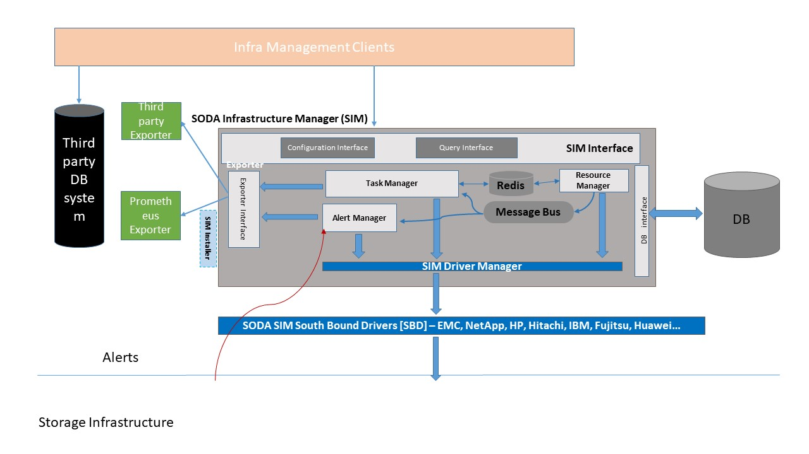
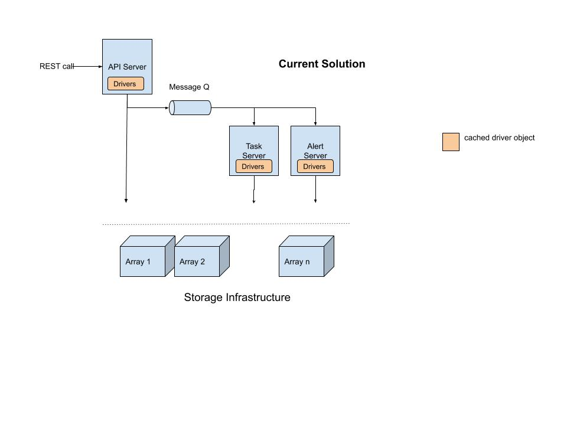
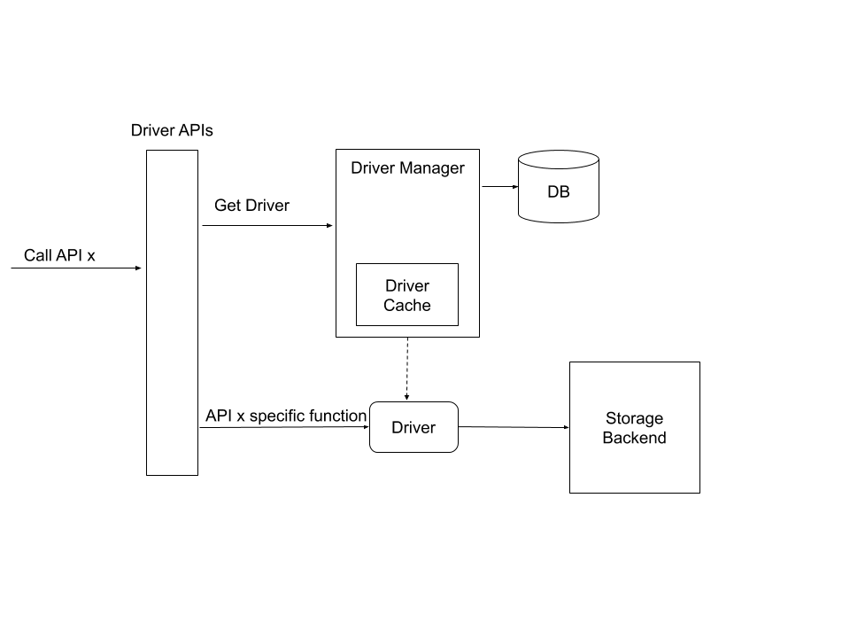
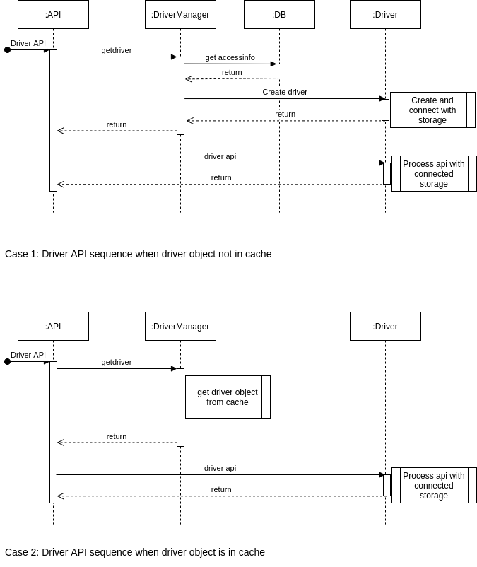
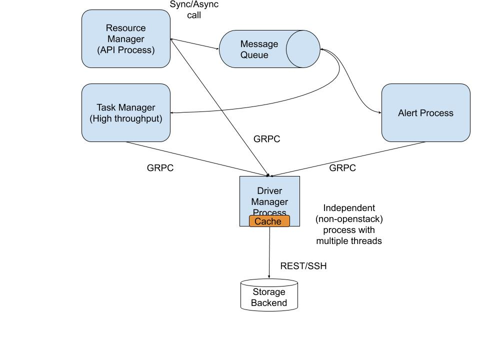
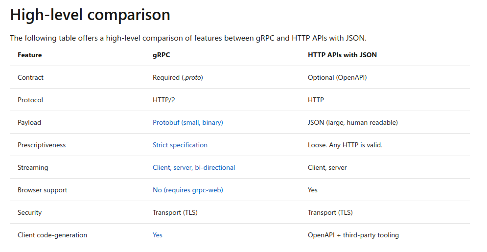
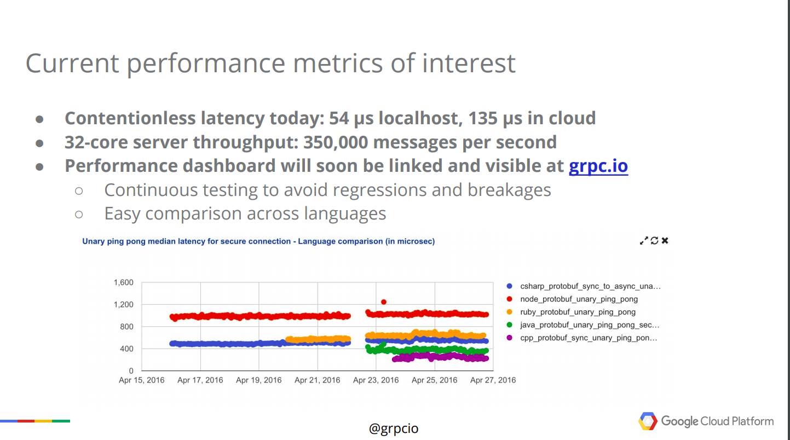
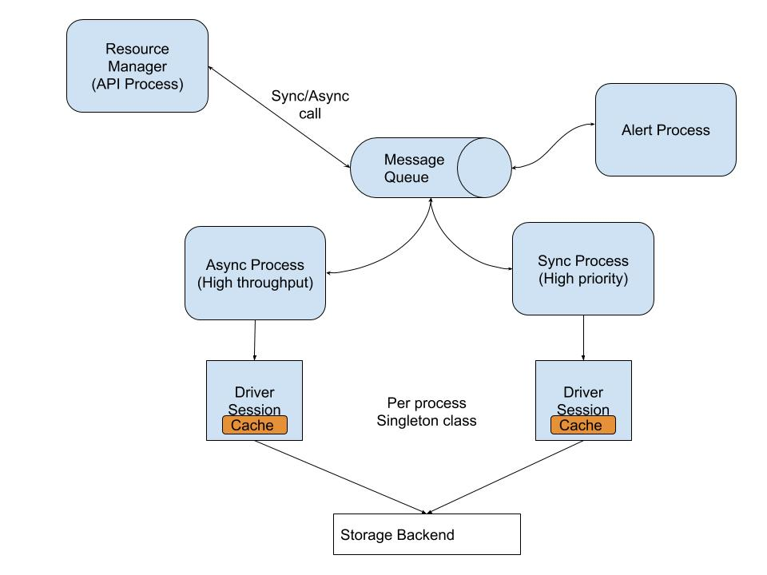

# **Driver Manager Re-Architecture**

This document analysis issues in current Delfin architecture for Driver Manager and propose potential solutions.

## User Scenarios

Delfin Driver Manager provides the following use cases for the upper layers of Delfin modules.

* User create storage with accessinfo
* User update storage accessinfo
* User credentials expire at backend storage (access info becomes invalid)
* User delete storage (all drivers cached in all process require cleanup)
* User uses other driverAPIis (Sync, alert, etc)
* How to handle ‘not supported’ resources in a storage backend

### Current Architecture

In current [Delfin architecture](https://github.com/sodafoundation/architecture-analysis/blob/master/specs/SIM/SODA_InfrastructureManagerDesign.md), Driver Manager lies in lowest layers and manages heterogeneous driver instances. Driver manager instances are maintained (cached) by all processes.

#### Intermodule interaction diagram

#### Sequence diagram

## Issues

#### 1. Lots of connections to the backend opened and cached. (For 3 node deployment 3x3=9)

Delfin accesses Driver APIs from all of its three processes (API, Task & Alert). Each of this access will cache the driver object and its session with the backend as optimization. In a Three node distributed deployment of Delfin may cache up to 9 connections to the same backend.

#### 2. Delete is not propagated to all the process those used/cached a driver to that storage

Delete storage is currently handled by the Task process and it will not propagate delete to other processes or other nodes. So delete will only remove cached driver objects from the Task process whoever handled the delete.

#### 3. If credentials for the user expired at storage backend, there is no retry (no update access info)

If there is a change in user credentials at the storage backend, Delfin Driver APIs will fail with InvalidUsernameOrPassword exception. There can be an option to alert the Delfin user about the access failure, so that the user can update accessinfo that will clear all the old cached driver objects and sessions. So that the Driver APIs can retry  the failed operation.

#### 4. Separate driver for handling resources that are not present in the backend

In the current Delfin implementation when we do sync to collect all resources details, even if a resource is not supported in a backend, we get a zeroed resource. That is even if there a resource but backend do not support collection API, we wrongly display a zero resource

#### 5. High priority APIs and Low priority APIs handling

Some of the Driver APIs in Delfin need to be High priority (Create storage, UpdateAccessInfo) compared to other APIs (collection APIs, Delete, Alert etc). These High priority APIs are handled in a synchronous call to the backend.

## Re-Architecture Scope

* Introduce a session manager between Driver Manager and Driver APIs
* Session Manager will be responsible for managing driver object cache and clean up
* Session Manager should handle retry and alert user, when access info becomes invalid in storage backend

### Approach1 [Proposed] (Driver Manager as GRPC Server)

* Separate Driver Manager as process with GRPC interface to Delfin process of API, Task and Alert.
* Driver Manager Process acts as a server, provides driver API implementations for Heterogeneous storage backend

#### GRPC Performance comparison with REST

Delfin needs to handle, typically 5k LUNs/Storage * 10 Metrics * per 1 Minutes.

Assuming 5k LUNs, 1k metrics per LUN, (5k * 1k * 8 / 60) = ~**700 kbps** for a Single storage.

Drivers talk with backend Servers using REST or SSH. So the higher layer implementation should not be bottleneck for the high throughput data exchange.

Generally GRPC is considered faster than REST. 

Following link claims, 7 to 10 Times Faster Message Transmission: 

https://blog.dreamfactory.com/grpc-vs-rest-how-does-grpc-compare-with-traditional-rest-apis

https://jet-start.sh/blog/2020/05/25/grcp

Source: https://docs.microsoft.com/en-us/aspnet/core/grpc/comparison?view=aspnetcore-5.0

#### GRPC Performance

Source: https://platformlab.stanford.edu/Seminar%20Talks/gRPC.pdf

#### Challenges

Separating function calls with **distributed** GRPC deployment introduces lots of challenges, like **service discovery, load balancing, failure handling** etc.

*A thick client based Loadbalancing with Zookeeper may be considered for storage use-cases as Delfin.*

https://github.com/grpc/grpc/blob/master/doc/load-balancing.md

#### Advantages

1. Decoupled separate module can be used by any control layer (manage layer)
2. Can be used by SODA control layer also with expansion/replacement to dock layer
3. Driver Manager will be the only one entity responsible for managing sessions to backend

#### Disadvantage

1. Driver Manager Process will be implemented out of OpenStack framework
2. Performance overhead of GRPC for a distributed multi-node deployment
3. The development effort required may be high (yet to explore)

### Approach2 (Two Process to handle Message Q requests)

* Create two new processes to handle (one process for High throughput, one for High priority) messages from Message Queue, these will replace all Task and Alert processes.
* Async Process will handle scheduled tasks, performance collection, sync etc. and replace current Task Manager
* Sync Process will handle direct calls like register storage, update access_info etc. These will be blocking calls
* Then, only two processes will be (caching driver objects - Task & Driver)
* Storage Delete will be broadcast to both above processes that cache driver objects and needs cleanup

#### Advantages

1. Minimal changes required to support this model in the current implementation
2. Async process will be able to handle multiple simultaneous requests

#### Disadvantages

1. Sync process will block other requests when handling one. (This is restriction is from the OpenStack Framework)
2. Minimum one Async and one Sync process are required in a single node deployment leading to at least two Driver sessions.

## Reference

Delfin Architecture: https://github.com/sodafoundation/architecture-analysis/blob/master/specs/SIM/SODA_InfrastructureManagerDesign.md
