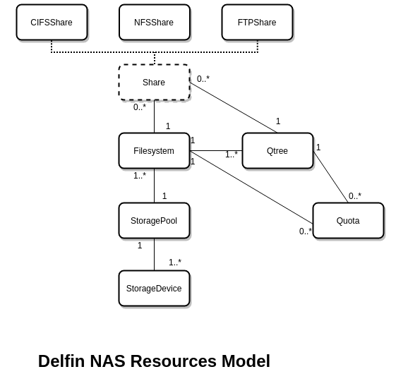

# Delfin NAS Resource Model Analysis

**Authors:** [SODA Team](https://github.com/sodafounation)

This is NAS resource model analysis for SODA Infrastructure Management project Delfin.

## Goal

This documents purpose is to define NAS data models of Delfin resources including Filesystem, Qtree, Quota etc.

## Non-Goals

NA

## Assumptions and Constraints

NA

## Requirement Analysis

### 1. Delfin project needs to support NAS resource when managing heterogenous storage backends

In order to manage storage resources in a heterogenous environment, we need to derive a NAS model for resources from different storage vendors.

### 2. Delfin project needs to support NAS resource models of Filesystem, Qtree and Quota

Users of the Delfin project should be able to get details of NAS resources of Filesystem, Qtree and Quota.

## NAS Resource Model Analysis

Following are the resource models derived from analyzing some the leading storage vendors including DELL, Hitachi, HP, Huawei, IBM etc.

### NAS Resource Model implementation diagram

### Filesystem

Filesystem impose structure on the address spaces of one or more storage devices. It supports local filesystem access, data sharing, remote file access, distributed file access etc.

The Filesystem provides flexible support for both traditional and transactional usecases.

- Scalability
- Storage Efficiency
- Availability and Recoverablity
- Performance
- Virtualization

Attributes | Type | Description
-- | -- | --
id | string | UUID of the Filesystem
native_filesystem_id | string | Original Filesystem id in the device
name | string | Name of the Filesystem
type | string | Allocation type (thick, thin)
status | enum | Running status of the Filesystem (normal, faulty)
storage_id | string | Delfin id of the associated storage
native_pool_id | string | Original storage pool id in the device
total_capacity | long | Total capacity in bytes of the Filesystem
used_capacity | long | Used capacity in bytes of the Filesystem
free_capacity | long | Free capacity in bytes of the Filesystem
worm | enum | WORM type (non_worm, audit_log, compliance, enterprise)
deduplicated | bool | Filesystem deduplication (true, false)
compressed | bool | Filesystem compression (true, false)
security_mode | string | Security Mode of Filesystem (mixed, native, ntfs, unix)

### Qtree

Qtree is similar to a directory under root Filesystem of a storage device.

Unlike directory, Qtree provides support for following features

- Hard and Soft limits on space and number of files.
- Security mode for accesses that can be Unix, NT, mixed etc.
- Oplocks on CIFS, which helps clients optimize access

Also depending on vendors,

- Snapshot copies cannot be enabled or disabled for individual qtrees
- Qtrees do not support space reservations or space guarantees

Qtree also support,

- Access control, using export policies

Attributes | Type | Description/enum
-- | -- | --
id | string | UUID of the Qtree
native_qtree_id | string | Original Qtree id in the device
name | string | Name of the Qtree
storage_id | string | Delfin id of the associated storage
native_filesystem_id | string | Original id of the parent filesystem
path | string | Path of the Qtree
security_mode | string | Security Mode of Qtree (mixed, native, ntfs, unix)

### Quota

Quota is limit applied to types like Qtrees, Users and User Groups

Attributes | Type | Description
-- | -- | --
id | string | UUID of the quota
native_quota_id | string | Original Quota id in the device
type | string | Quota type (tree, user, group)
storage_id | string | Delfin id of the associated storage
native_filesystem_id | string | Original Filesystem id in the device
native_qtree_id | string | Original Qtree id in the device
capacity_hard_limit | long | Hard limit for the space
capacity_soft_limit | long | Soft limit for the space
file_hard_limit | long | Hard limit on the number of files
file_soft_limit | long | Soft limit on the number of files
file_count | long | Total number of files
used_capacity | long | Used total capacity
user_group_name | string | User or user group name

### Share

Share is used for sharing files using one of the protocols below

#### Types of Shares

##### CIFSShare

File share protocol used to access NAS storage in Windows environment. Multiple CIFS Shares can be created for a Filesystem or Qtree to be accessed by different users and clients. It allows multiple access rules and supports authorized access

##### NFSShare

File share protocol used in Unix or Unix like OS environment. Multiple NFS Shares can be created for a Filesystem or Qtree to be access by different users and clients

##### FTPShare

The Filesystem or Qtree is accessed using FTP. Multiple FTP share access modes can be created for a Filesystem.

Attributes | Type | Description
-- | -- | --
id | string | UUID of the Share
native_share_id | string | Original Share id in the device
name | string | Name of the Share
storage_id | string | Delfin id of the associated storage
native_filesystem_id | string | Original id of the parent filesystem
native_qtree_id | string | Original id of the associated Qtree
protocol | string | Share protocol (cifs, nfs, ftp, unknown)
path | string | Path of the share in the Filesystem

## Impact on Delfin API

The addition of NAS resource that are modeled here, will have following impact on Delfin OpenAPI Specification

Latest OpenAPI Specification for delfin may be obtained from [here](https://github.com/sodafoundation/delfin/blob/master/openapi-spec/swagger.yaml)

### 1. Addition of new APIs

New API | Description
-- | --|
GET /v1/filesystems | List filesystem details from all backends
GET /v1/filesystems/{id} | List filesystem details of a specific filesystem id
GET /v1/qtrees | List qtrees details from all backends
GET /v1/qtrees/{id} | List qtrees details of a specific qtree id
GET /v1/shares | List shares details from all backends
GET /v1/shares/{id} | List shares details of a specific share id

### 2. Extension of functionalities for existing APIs

Updated API | Description
-- | --|
POST /v1/storages/sync | Sync functionality extended to support new NAS resources
POST /v1/storages/{storage_id}/sync | Sync functionality extended to support new NAS resources
