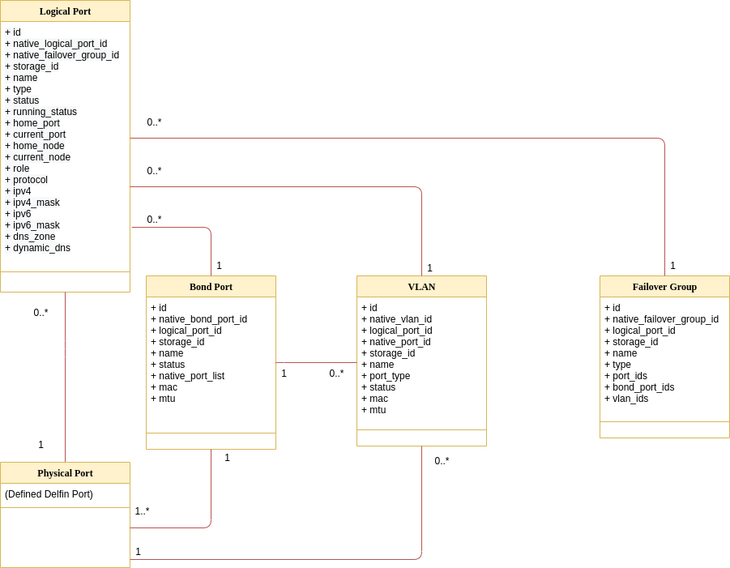

# Delfin Logical Port Models Analysis

**Authors:** [SODA Team](https://github.com/sodafounation)

This document analyse and design resource models to support Logical Port (or Logical Interface/LIF) in SODA Delfin Project.

## Goal

This documents purpose is to define  data models of Virtual Port Delfin resources including Logical Port, Bond Ports, VLAN and Failover Groups etc.

## Non-Goals

NA

## Assumptions and Constraints

NA

## Requirement Analysis

### 1. Delfin project needs to support Logical Port resource when managing heterogenous storage backends

In order to manage storage resources in a heterogenous environment, we need to derive Logical Port models for resources from different storage vendors.

### 2. Delfin project needs to support resource models of Logical Port, Bond Ports, VLAN and Failover Group

Users of the Delfin project should be able to get resource details of Logical Port, Bond Port, VLAN and Failover Group.

## Logical Ports Resource Model Analysis

Following are the resource models derived from analyzing some the leading storage vendors including NetApp and Huawei etc.

### Logical Port Resource Model relationship diagram

### Logical Port

Logical ports are virtual ports created based on Physical ports, Bond ports or VLANs. A unique IP address is allocated to each logical port to carry host services

Attributes | Type | Description
-- | -- | --
id | string | UUID of the Logical Port
native_logical_port_id | string | Original Logical Port id in the device
native_failover_group_id | string | Failover group id in the device
storage_id | string | Delfin id of the associated storage
name | string | Name of the Logical Port
type | enum | Type of the Logical Port port (physical, bond_port, vlan)
status | enum | Operation status of the Logical Port (active, not_active)
running_status | enum | Running status of the Logical Port (normal, abnormal, unknown)
home_port | string | ID in the device of parent port
current_port | string | ID in the device of current port
home_node | string | ID in the device of parent node
current_node | string | ID in the device of current node
role | enum | Role of the Logical Port (management, service, management_and_service, data, other)
protocol | enum | Data Protocol (NFS, CIFS, NFS_AND_CIFS, iSCSI, FC, None)
ipv4 | string | V4 IP Address
ipv4_mask | string | V4 IP Address Mask
ipv6 | string | V6 IP Address
ipv6_mask | string | V6 IP Address Mask
dns_zone | string | DNS Zone name
dynamic_dns | enum | Dynamic DNS (enabled, disabled, invalid)

### Bond Port

Bond port is used to improve reliability of paths for accessing file systems and increase bandwidth. Multiple physical or ethernet ports in the same controller are are bond to form a bond port

Attributes | Type | Description/enum
-- | -- | --
id | string | UUID of the Bond Port
native_bond_port_id | string | Original Bond Port id in the device
logical_port_id | string | Logical Port id of the Bond Port
storage_id | string | Delfin id of the associated storage
name | string | Name of the Bond Port or Bond port
status | enum | Active ports status (full, partial, unknown)
native_port_list | string | List of comma separated port IDs
mtu | string | MTU (Maximum Transfer Unit)
mac | string | MAC Address

### VLAN

VLANs logically divide the physical ports or bond ports of a storage system into multiple broadcast domains. On a VLAN, when service data is being sent or received, a VLAN ID is configured for the data to isolate it from other VLANs, ensuring data security and reliability.

Attributes | Type | Description
-- | -- | --
id | string | UUID of the VLAN
native_vlan_id | string | Original VLAN id in the device
logical_port_id | string | Logical Port id of the VLAN
native_port_id | string | Original VLAN Port id in the device
storage_id | string | Delfin id of the associated storage
name | string | Name of the VLAN
port_type | enum | Port type (physical, bond_port)
status | enum | VLAN status (normal, abnormal, unknown)
mtu | string | MTU (Maximum Transfer Unit)
mac | string | MAC Address

### Failover Group

A group of ports where IP addresses fail over. Ports from the same controller enclosure are preferred when creating a failover group.

Attributes | Type | Description
-- | -- | --
id | string | UUID of the Failover Group
native_failover_group_id | string | Original Failover Group id in the device
logical_port_id | string | Logical Port id of the Failover Group
storage_id | string | Delfin id of the associated storage
name | string | Name of the Failover Group
type | enum | Failover Group type (system, vlan, custom, local, disabled, broadcast)
port_ids | string | Comma separated physical ports in Failover Group
bond_ports_ids | string | Comma separated bond ports in Failover Group
vlan_ids | string | Comma separated vlans in Failover Group

## Impact on Delfin API

The addition of Logical Port resource that are modeled here, will have following impact on Delfin OpenAPI Specification

Latest OpenAPI Specification for delfin may be obtained from [here](https://github.com/sodafoundation/delfin/blob/master/openapi-spec/swagger.yaml)

### 1. Addition of new APIs

New API | Description
-- | --|
GET /v1/logical_ports | List Logical Port details from all backends
GET /v1/logical_ports/{id} | List Logical Port details of a specific Logical Port id
GET /v1/bond_ports | List interface group details from all backends
GET /v1/bond_ports/{id} | List interface group details of a specific interface group id
GET /v1/vlan | List VLAN details from all backends
GET /v1/vlan/{id} | List VLAN details of a specific VLAN id

### 2. Extension of functionalities for existing APIs

Updated API | Description
-- | --|
POST /v1/storages/sync | Sync functionality extended to support new Logical Port resources
POST /v1/storages/{storage_id}/sync | Sync functionality extended to support new Logical Port resources.
