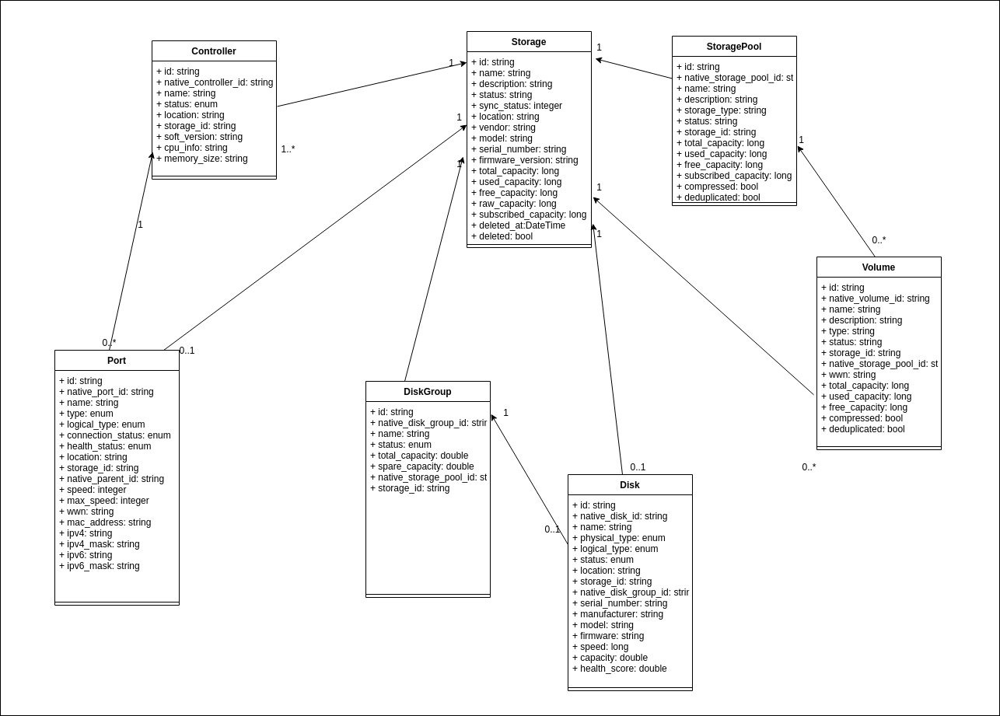

# Delfin Resource Model Analysis

**Authors:** [SODA Team](https://github.com/sodafounation)

This is resource model analysis for SODA Infrastructure Management project Delfin.

## Goal

This documents purpose is to define data models of Delfin resources including Controller, Port, Disk, Disk Group, Volume, Pool etc.

## Non-Goals

NA

## Assumptions and Constraints

NA

## Requirement Analysis

### 1. Delfin project needs to support a Common Data Model for resource when managing heterogenous storage backends

In order to manage storage resources in a heterogenous environment, we need to derive a common model for resources from different storage vendors.

### 2. Delfin project needs to support visualization and management of vendor specific resource information

Users of the Delfin project should be able to get details or manage storage backends without needs to switch to vendor specific portals.

## Resource Model Analysis

Following are the resource models derived from analyzing some the leading storage vendors including DELL, Hitachi, HP, Huawei, IBM etc.

### Resource Model implementation diagram

### Controller

Attributes | Type | Description
-- | -- | --
id | string | UUID of the controller
native_controller_id | string | id of the controller in device
name | string | name of the controller
status | enum | running status of the controller (normal, offline, unknown)
location | string | node/rack/slot/module location
storage_id | string | delfin id of the associated storage
soft_version | string | software version/firmware version
cpu_info | string | processor information
memory_size | string | cache memory size in bytes

### Port

Attributes | Type | Description/enum
-- | -- | --
id | string | UUID of the port
native_port_id | string | id of the port in actual device
name | string | name of the port
type | enum | port type (FC,ISCSI,FICON,FCoE,ETH,SAS,OTHER,IB)
logical_type | enum | front_end_service, back_end_service, service, management,internal,maintenance,management_service,maintenance_service,interconnect, other
connection_status | enum | connection status (connected, disconnected, unknown)
health_status | enum | health status of the port (normal,abnormal,unknown)
location | string | position of the port (controller, slot, port number)
storage_id | string | delfin id of the associated storage
native_parent_id | string | id of the controller where this port is associated
speed | int | running (current) speed of the port
max_speed | int | maximum supported  speed of the port
wwn | string | wwn for a FC/FCoE port
mac_address | string | mac_address of a Ethernet port
ipv4 | string | ipv4 of an Ethernet port
ipv4_mask | string | ipv4_mask of an Ethernet port, gateway
ipv6 | string | ipv6 of an Ethernet port
ipv6_mask | string | ipv6_mask of an Ethernet port, gateway

### Disk

Attributes | Type | Description
-- | -- | --
id | string | UUID of the disk
native_disk_id | string | original ID of the disk
name | string | Name   of the device
physical_type | enum | physical type [sata, sas, ssd,nl-sas, unknown]
logical_type | enum | logical type [free, member, hotspare, cache]
status | enum | status of the disk [normal, offline, abnormal]
location | string | location
storage_id | string | delfin storage ID this disk belong
native_disk_group_id | string | delfin disk group ID
serial_number | string | serial number of the disk
manufacturer | string | manufacturer of the disk
model | string | model of the disk
firmware | string | firmware of the disk
speed | long | rotational speed (HDD)
capacity | double | capacity in bytes
health_score | double | health score

### Disk Group

Attributes | Type | Description
-- | -- | --
id | string | UUID of the disk group
native_disk_group_id | string | original ID of the disk group
name | string | name of the disk group
status | enum | status [normal, offline, abnormal]
storage_id | string | delfin storage ID this disk group belong
native_storage_pool_id | string | delfin storage pool ID this disk group belong
total_capacity | double | total capacity of disk group
spare_capacity | double | spare capacity of disk group

### Storage Pool

Attributes | Type | Description
-- | -- | --
id | string | UUID of the storage pool
native_storage_pool_id | string | origin pool id from storage
name | string | name of the storage pool
description | string | description for the storage pool
storage_type | string | storage type of the storage pool
status | string | status of the storage pool
storage_id | string | delfin storage ID this storage pool belong
total_capacity | Integer | total capacity of the storage pool
used_capacity | Integer | used capacity of the storage pool
free_capacity | Integer | free capacity of the storage pool
subscribed_capacity | Integer | subscribed capacity of the storage pool
compressed | Boolean | whether compression enabled for the storage pool
deduplicated | Boolean | whether deduplication enabled for the storage pool

### Volumes

Attributes | Type | Description
-- | -- | --
id | string | UUID of the volume
native_volume_id | string | original id of the volume
name | string | name of the volume
description | string | description of the volume
type | string | type of the volume
status | string | status of the volume
storage_id | string | delfin ID of storage this volume belong
native_storage_pool_id | string | original id of pool this volume belong
wwn | string | wwn of the volume
total_capacity | Integer | total capacity of the volume
used_capacity | Integer | used capacity of the volume
free_capacity | Integer | free capacity of the volume
compressed | Boolean | whether compression enabled for the volume
deduplicated | Boolean | whether deduplication enabled for the volume
