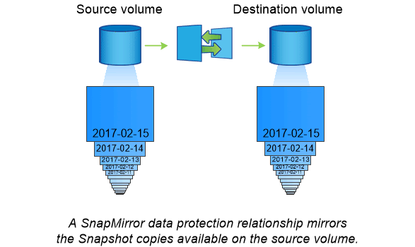

# Array based data replication on ontap_netapp


## What is Data Replication:

Replication in computing involves sharing information so as to ensure consistency between redundant resources, such as software or hardware components, to improve reliability, fault-tolerance, disaster recovery or accessibility

## How Netapp Handle Replication:

Traditionally, in netapp ONTAP replication for disaster recovery(DR) is handled based on snapshot technologies. Some of the technologies are described below:

#### Snapshot copies
A Snapshot copy is a read-only, point-in-time image of a volume. The image consumes minimal storage space and incurs negligible performance overhead because it records only changes to files since the last Snapshot copy was made.

#### SnapMirror disaster recovery and data transfer

SnapMirror is disaster recovery technology, designed for failover from primary storage to secondary storage at a geographically remote site. As its name implies, SnapMirror creates a replica, or mirror, of your working data in secondary storage from which you can continue to serve data in the event of a catastrophe at the primary site.

Data is mirrored at the volume level. The relationship between the source volume in primary storage and the destination volume in secondary storage is called a data protection relationship. The clusters in which the volumes reside and the SVMs that serve data from the volumes must be peered. A peer relationship enables clusters and SVMs to exchange data securely.

The first time you invoke SnapMirror, it performs a baseline transfer from the source volume to the destination volume. The baseline transfer typically involves the following steps:

* Make a Snapshot copy of the source volume.

* Transfer the Snapshot copy and all the data blocks it references to the destination volume.

* Transfer the remaining, less recent Snapshot copies on the source volume to the destination volume for use in case the active mirror is corrupted.

Once a baseline transfer is complete, SnapMirror transfers only new Snapshot copies to the mirror. Updates are asynchronous, following the schedule you configure. Retention mirrors the Snapshot policy on the source. You can activate the destination volume with minimal disruption in case of a disaster at the primary site, and reactivate the source volume when service is restored.

Because SnapMirror transfers only Snapshot copies after the baseline is created, replication is fast and nondisruptive. As the failover use case implies, the controllers on the secondary system should be equivalent or nearly equivalent to the controllers on the primary system to serve data efficiently from mirrored storage.



#### Using SnapMirror for data transfer

You can also use SnapMirror to replicate data between endpoints in the NetApp data fabric. You can choose between one-time replication or recurring replication when you create the SnapMirror policy.

### The Implementation approach to achieve replication in netapp

#### CreateReplication:

##### 1. snapmirror create

  ##### Note:
  Before using this command to create a volume SnapMirror relationship, make sure the source volume should be in the online state and a read-write (RW) type and the destination volume should be in the online state and a data protection (DP) type. And also destination volume size should be greater equal than source volume size.


  To create a synchronous SnapMirror relationship between the source Flexvol vs1.example.com:vol_log, and the destination Flexvol vs2.example.com:vol_log_sync_dp when the source cluster is running ONTAP 9.5 or above, type the following command:

  * ##### snapmirror create -destination-path vs2.example.com:vol_log_sync_dp -source-path vs1.example.com:vol_log -policy Sync

##### 2. snapmirror initialize:
* Start a baseline transfer

* The initial transfer to an empty destination volume is called a baseline transfer. During a baseline transfer for a data protection (DP) or extended data protection (XDP) relationship, the snapmirror initialize command takes a Snapshot copy on the source volume to capture the current image of the source volume. For data protection relationships, the snapmirror initialize command transfers all of the Snapshot copies up to and including the Snapshot copy created by it from the source volume to the destination volume.

* ##### snapmirror initialize -destination-path vs2.example.com:vol_log_sync_dp

#### Pseudo code:

##### CreateReplication
```    
func (r *ReplicationDriver) CreateReplication(opt *pb.CreateReplicationOpts) (*model.ReplicationSpec, error) {

1. check the status of snapmirror: It should on/active
   snapmirror show

2. check the access of snapmirror for destination host
   snapmirror access

3. create the snapmirror relationship for data replication
   snapmirror create

4. Initialize the baseline transfer
   snapmirror initialize

return  *model.ReplicationSpec, nil
}
```

##### Delete Replication:

```
func (r *ReplicationDriver) DeleteReplication(opt *pb.DeleteReplicationOpts) error {
1. Delete the replication relationship
  Snapmirror delete --<destination-path> --<source-path>

return nil
}
```

##### Enable, Disable and Failover replication:
```
func (r *ReplicationDriver) EnableReplication(opt *pb.EnableReplicationOpts) error {

Enable the further replication relationship
snapmirror resume
	return nil
}

func (r *ReplicationDriver) DisableReplication(opt *pb.DisableReplicationOpts) error {

Disable the further replication relationship
snapmirror quiesce

	return nil
}

func (r *ReplicationDriver) FailoverReplication(opt *pb.FailoverReplicationOpts) error {

	return nil
}
```
