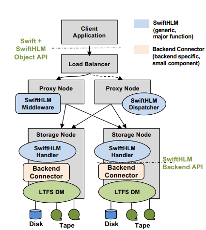
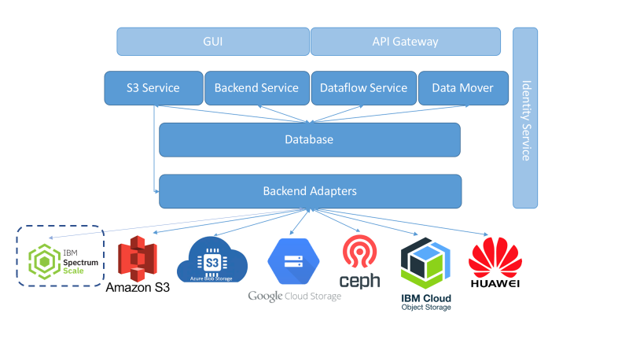

### Design Spec for Integration of COLD Storage Support in SodaFoundation

#### Summary:
In Gelato project of SODA foundation, currently it supports to perform object operations, lifecycle management and object migration on various cloud vendors like AWS, Azure, GCP, IBM, Huawei, YIG and Ceph. So, adding IBM Spectrum Scale as a backend will allow user to perform object management and COLD Storage related operation like Change Storage Class and Recall using SwiftHLM integration with IBM Spectrum Archive EE.

#### Motivation:
In existing SodaFoundation Gelato project, we don't have any module for COLD storage support for user by which object management is performed with additional features of Change Storage Class (Migration of Object from Disk to Tape) and Recall (Recalling of Object from Tape to Disk) operations. This is design spec for adding IBM Spectrum Scale as a backend for Object management and SwiftHLM integration with IBM Spectrum Archive EE for COLD Storage Support.

#### Non-Goals:
Object lifecycle will be in the future scope.

### Goals:
IBM Spectrum Scale as a backend for Object management and SwiftHLM integration with IBM Spectrum Archive EE for COLD Storage Support.

### Assumptions and Constraints:

•	Configuration of IBM Spectrum Archive EE on Virtualization platform like Oracle VirtualBox.

•	Enabling S3 Service on IBM Spectrum Scale node.

•	Object Service must be started to perform the integration of SwiftHLM with IBM Spectrum Archive EE.

•	SwiftHLM Integration with IBM Spectrum Archive EE.

### Requirement Analysis:
#### SwiftHLM Integration with IBM Spectrum Archive EE:


SwiftHLM can be added to OpenStack Swift (without modifying Swift itself) to extend Swift's interface and thus allow to explicitly control and query the state (on disk or on HLM) of Swift objects data, including efficient prefetch of bulk of objects from HLM to disk when those objects need to be accessed. This function previously missing in Swift can be seen like Amazon Glacier, either through the Glacier API or the Amazon S3 Lifecycle Management API.
SwiftHLM provides the following basic HLM functions on the external Swift interface:
1.	MIGRATE (container or an object from disk to HLM)
2.	RECALL (i.e. prefetch a container or an object from HLM to disk)
3.	STATUS (get status for a container or an object)
4.	REQUESTS (get status of migration and recall requests previously submitted for a container or an object).

MIGRATE and RECALL are asynchronous operations, meaning that the request from user is queued and user's call is responded immediately, then the request is processed as a background task. Requests are currently processed in a FIFO manner.  REQUESTS and STATUS are synchronous operations that block the user's call until the queried information is collected and returned.
For each of these functions, SwiftHLM Middleware invokes additional SwiftHLM components to perform the task, which includes calls to HLM storage backend.
An HLM backend that supports SwiftHLM functions (MIGRATE, RECALL, STATUS) is exposed to Swift in the same way as if SwiftHLM is not used (via a file system interface and a Swift ring definition), plus it needs to additionally support processing and responding requests from SwiftHLM middleware for performing SwiftHLM functions.

##### IBM Spectrum Scale Integration for SodaFoundation: 


By adding IBM Spectrum Scale as adapter in SodaFoundation will help users to perform all Container and object related operations as follow:

•	Add Backend for IBM Spectrum Scale (Object).

•	Create SodaFoundation Container on IBM Spectrum Scale (Object).

•	Delete Container from IBM Spectrum Scale.

•	Upload Object on IBM Spectrum Scale Container (PUT Object).

•	Download Object from IBM Spectrum Scale (GET Object)

•	Object life cycle Management.


|               |    Tier_1     |    Tier_99   |    Tier_999  |    
| ------------- | ------------- |  ------------|--------------|
| AWS S3        | STANDARD      | STANDARD_IA  |    GLACIER   |
| Azure Blob    |   HOT           |   COOL       |    ARCHIVE   |
| HW OBS        | STANDARD      |   WARM       |    COLD      |
| GCP           | Multi-Regional |             |            | 
| Ceph S3       | STANDARD      |             |             |
| Fusion Storage Object | STANDARD |         |             |
|IBM Spectrum Scale (Integration of SwiftHLM with IBM Spectrum Archive EE) | HOT (IBM Spectrum Scale) |   | COLD (IBM Spectrum Archive) |

#### API Usage (COLD Storage Support Using SwiftHLM Integration with IBM Spectrum Archive EE)
##### 1. External Interface and Usage Examples 
* Syntax for using SwiftHLM enabled Swift via a standard (unmodified) curl Swift client:
```cassandraql
 curl -H "X-Auth-Token: $TOKEN" -X POST "http://zagreb.zurich.ibm.com:8080/hlm/v1/migrate/AUTH_test/cont1
 curl -H "X-Auth-Token: $TOKEN" -X POST "http://zagreb.zurich.ibm.com:8080/hlm/v1/recall/AUTH_test/cont1
 curl -H "X-Auth-Token: $TOKEN" -X GET "http://zagreb.zurich.ibm.com:8080/hlm/v1/status/AUTH_test/cont1
 curl -H "X-Auth-Token: $TOKEN" -X GET "http://zagreb.zurich.ibm.com:8080/hlm/v1/requests/AUTH_test/cont1
```
* Examples of outputs for the above commands:
##### Get status of Object cont3/obj00:
```cassandraql
[root@belgrade ~]# time curl -H "X-Auth-Token: $TOKEN" -X GET "http://zagreb:8080/hlm/v1/status/AUTH_test/cont3/obj00" | python -mjson.tool
  % Total    % Received % Xferd  Average Speed   Time    Time     Time  Current
                                 Dload  Upload   Total   Spent    Left  Speed
100    38  100    38    0     0     46      0 --:--:-- --:--:-- --:--:--    46
{
    "/AUTH_test/cont3/obj00": "resident"
}

real    0m0.831s
user    0m0.017s
sys     0m0.008s
[root@belgrade ~]#
```
##### Get status of all Objects of Container cont3:

```cassandraql
[root@belgrade ~]# time curl -H "X-Auth-Token: $TOKEN" -X GET "http://zagreb:8080/hlm/v1/status/AUTH_test/cont3" | python -mjson.tool
  % Total    % Received % Xferd  Average Speed   Time    Time     Time  Current
                                 Dload  Upload   Total   Spent    Left  Speed
100   114  100   114    0     0    128      0 --:--:-- --:--:-- --:--:--   128
{
    "/AUTH_test/cont3/obj00": "resident",
    "/AUTH_test/cont3/obj01": "resident",
    "/AUTH_test/cont3/obj02": "resident"
}

real    0m0.892s
user    0m0.016s
sys     0m0.007s
[root@belgrade ~]#
```
##### Migrate Object cont3/obj00:

```cassandraql
[root@belgrade ~]#
[root@belgrade ~]# time curl -H "X-Auth-Token: $TOKEN" -X POST "http://zagreb:8080/hlm/v1/migrate/AUTH_test/cont3/obj00"
Accepted migrate request.

real    0m0.058s
user    0m0.001s
sys     0m0.003s
[root@belgrade ~]#
```
##### Check if request to migrate Object cont3/obj00 is completed:

```cassandraql
[root@belgrade ~]# time curl -H "X-Auth-Token: $TOKEN" -X GET "http://zagreb:8080/hlm/v1/requests/AUTH_test/cont3/obj00" | python -mjson.tool
  % Total    % Received % Xferd  Average Speed   Time    Time     Time  Current
                                 Dload  Upload   Total   Spent    Left  Speed
100    68  100    68    0     0   1910      0 --:--:-- --:--:-- --:--:--  1942
[
    "20170303034043.566--migrate--AUTH_test--cont3--0--obj00--pending"
]

real    0m0.041s
user    0m0.017s
sys     0m0.007s
[root@belgrade ~]#

[root@belgrade ~]# time curl -H "X-Auth-Token: $TOKEN" -X GET "http://zagreb:8080/hlm/v1/requests/AUTH_test/cont3/obj00" | python -mjson.tool
  % Total    % Received % Xferd  Average Speed   Time    Time     Time  Current
                                 Dload  Upload   Total   Spent    Left  Speed
100    53  100    53    0     0   1566      0 --:--:-- --:--:-- --:--:--  1606
[
    "There are no pending or failed SwiftHLM requests."
]

real    0m0.039s
user    0m0.013s
sys     0m0.010s
[root@belgrade ~]#
```
##### Get status of all Objects of Container cont3:

```cassandraql
[root@belgrade ~]# time curl -H "X-Auth-Token: $TOKEN" -X GET "http://zagreb:8080/hlm/v1/status/AUTH_test/cont3" | python -mjson.tool
  % Total    % Received % Xferd  Average Speed   Time    Time     Time  Current
                                 Dload  Upload   Total   Spent    Left  Speed
100   114  100   114    0     0    115      0 --:--:-- --:--:-- --:--:--   115
{
    "/AUTH_test/cont3/obj00": "migrated",
    "/AUTH_test/cont3/obj01": "resident",
    "/AUTH_test/cont3/obj02": "resident"
}

real    0m0.991s
user    0m0.013s
sys     0m0.010s
[root@belgrade ~]#
```
##### Migrate entire container cont3 (but make tape backend unavailable on one of the storage nodes):

```cassandraql
root@belgrade ~]# time curl -H "X-Auth-Token: $TOKEN" -X POST "http://zagreb:8080/hlm/v1/migrate/AUTH_test/cont3"
Accepted migrate request.

real    0m0.062s
user    0m0.003s
sys     0m0.003s
[root@belgrade ~]#
```
##### Check requests for Container cont3:

```cassandraql
[root@belgrade ~]# time curl -H "X-Auth-Token: $TOKEN" -X GET "http://zagreb:8080/hlm/v1/requests/AUTH_test/cont3" | python -mjson.tool
  % Total    % Received % Xferd  Average Speed   Time    Time     Time  Current
                                 Dload  Upload   Total   Spent    Left  Speed
100    61  100    61    0     0   1923      0 --:--:-- --:--:-- --:--:--  1967
[
    "20170303034800.465--migrate--AUTH_test--cont3--0--pending"
]

real    0m0.039s
user    0m0.015s
sys     0m0.007s
[root@belgrade ~]#

[root@belgrade ~]# time curl -H "X-Auth-Token: $TOKEN" -X GET "http://zagreb:8080/hlm/v1/requests/AUTH_test/cont3" | python -mjson.tool
  % Total    % Received % Xferd  Average Speed   Time    Time     Time  Current
                                 Dload  Upload   Total   Spent    Left  Speed
100    60  100    60    0     0   1673      0 --:--:-- --:--:-- --:--:--  1714
[
    "20170303034800.465--migrate--AUTH_test--cont3--0--failed"
]

real    0m0.041s
user    0m0.015s
sys     0m0.008s
[root@belgrade ~]#
```
##### Get status of all Objects of Container cont3 (tape backend is fixed and again available):

```cassandraql

[root@belgrade ~]# time curl -H "X-Auth-Token: $TOKEN" -X GET "http://zagreb:8080/hlm/v1/status/AUTH_test/cont3" | python -mjson.tool
  % Total    % Received % Xferd  Average Speed   Time    Time     Time  Current
                                 Dload  Upload   Total   Spent    Left  Speed
100   113  100   113    0     0    103      0  0:00:01  0:00:01 --:--:--   103
{
    "/AUTH_test/cont3/obj00": "migrated",
    "/AUTH_test/cont3/obj01": "unknown",
    "/AUTH_test/cont3/obj02": "migrated"
}

real    0m1.103s
user    0m0.014s
sys     0m0.009s
[root@belgrade ~]#

```

##### Resubmit migration for Container cont3:

```cassandraql

[root@belgrade ~]# time curl -H "X-Auth-Token: $TOKEN" -X POST "http://zagreb:8080/hlm/v1/migrate/AUTH_test/cont3"
Accepted migrate request.

real    0m0.057s
user    0m0.000s
sys     0m0.004s
[root@belgrade ~]#
[root@belgrade ~]#
[root@belgrade ~]#

```
##### Check requests for Container cont3:

```cassandraql
[root@belgrade ~]# time curl -H "X-Auth-Token: $TOKEN" -X GET "http://zagreb:8080/hlm/v1/requests/AUTH_test/cont3" | python -mjson.tool
  % Total    % Received % Xferd  Average Speed   Time    Time     Time  Current
                                 Dload  Upload   Total   Spent    Left  Speed
100   121  100   121    0     0   3275      0 --:--:-- --:--:-- --:--:--  3361
[
    "20170303035302.857--migrate--AUTH_test--cont3--0--pending",
    "20170303034800.465--migrate--AUTH_test--cont3--0--failed"
]

real    0m0.043s
user    0m0.015s
sys     0m0.009s
[root@belgrade ~]#

[root@belgrade ~]# time curl -H "X-Auth-Token: $TOKEN" -X GET "http://zagreb:8080/hlm/v1/requests/AUTH_test/cont3" | python -mjson.tool
  % Total    % Received % Xferd  Average Speed   Time    Time     Time  Current
                                 Dload  Upload   Total   Spent    Left  Speed
100    53  100    53    0     0   1780      0 --:--:-- --:--:-- --:--:--  1827
[
    "There are no pending or failed SwiftHLM requests."
]

real    0m0.035s
user    0m0.011s
sys     0m0.012s
[root@belgrade ~]#
```
##### Get status of Objects of Container cont3:

```cassandraql
[root@belgrade ~]# time curl -H "X-Auth-Token: $TOKEN" -X GET "http://zagreb:8080/hlm/v1/status/AUTH_test/cont3" | python -mjson.tool
  % Total    % Received % Xferd  Average Speed   Time    Time     Time  Current
                                 Dload  Upload   Total   Spent    Left  Speed
100   114  100   114    0     0    104      0  0:00:01  0:00:01 --:--:--   105
{
    "/AUTH_test/cont3/obj00": "migrated",
    "/AUTH_test/cont3/obj01": "migrated",
    "/AUTH_test/cont3/obj02": "migrated"
}

real    0m1.092s
user    0m0.017s
sys     0m0.006s
[root@belgrade ~]#

```
##### Recall all Objects of Container cont3:
```cassandraql
[root@belgrade ~]# time curl -H "X-Auth-Token: $TOKEN" -X POST "http://zagreb:8080/hlm/v1/recall/AUTH_test/cont3"
Accepted recall request.

real    0m0.064s
user    0m0.000s
sys     0m0.005s
[root@belgrade ~]# time curl -H "X-Auth-Token: $TOKEN" -X GET "http://zagreb:8080/hlm/v1/requests/AUTH_test/cont3" | python -mjson.tool
  % Total    % Received % Xferd  Average Speed   Time    Time     Time  Current
                                 Dload  Upload   Total   Spent    Left  Speed
100    53  100    53    0     0   1821      0 --:--:-- --:--:-- --:--:--  1827
[
    "There are no pending or failed SwiftHLM requests."
]

real    0m0.035s
user    0m0.011s
sys     0m0.012s
[root@belgrade ~]#

```
##### Get status of Objects of Container cont3 (now on disk and tape, thus "premigrated"):

```cassandraql
[root@belgrade ~]# time curl -H "X-Auth-Token: $TOKEN" -X GET "http://zagreb:8080/hlm/v1/status/AUTH_test/cont3" | python -mjson.tool
  % Total    % Received % Xferd  Average Speed   Time    Time     Time  Current
                                 Dload  Upload   Total   Spent    Left  Speed
100   123  100   123    0     0    125      0 --:--:-- --:--:-- --:--:--   125
{
    "/AUTH_test/cont3/obj00": "premigrated",
    "/AUTH_test/cont3/obj01": "premigrated",
    "/AUTH_test/cont3/obj02": "premigrated"
}

real    0m0.986s
user    0m0.015s
sys     0m0.007s
[root@belgrade ~]#
```