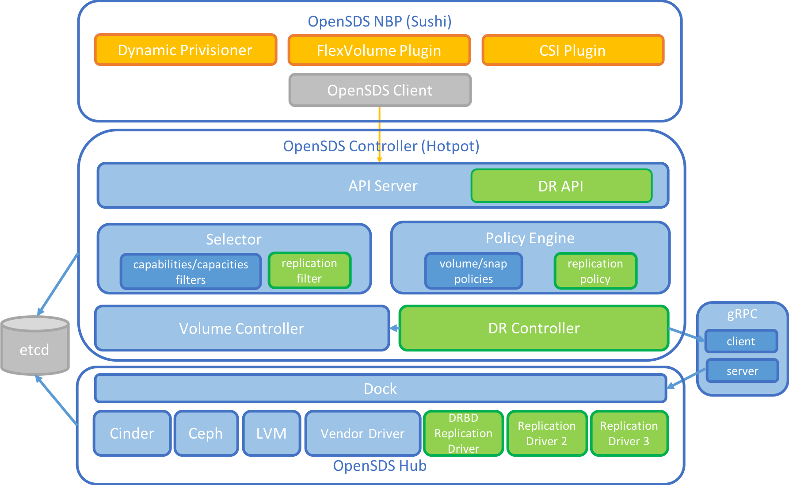
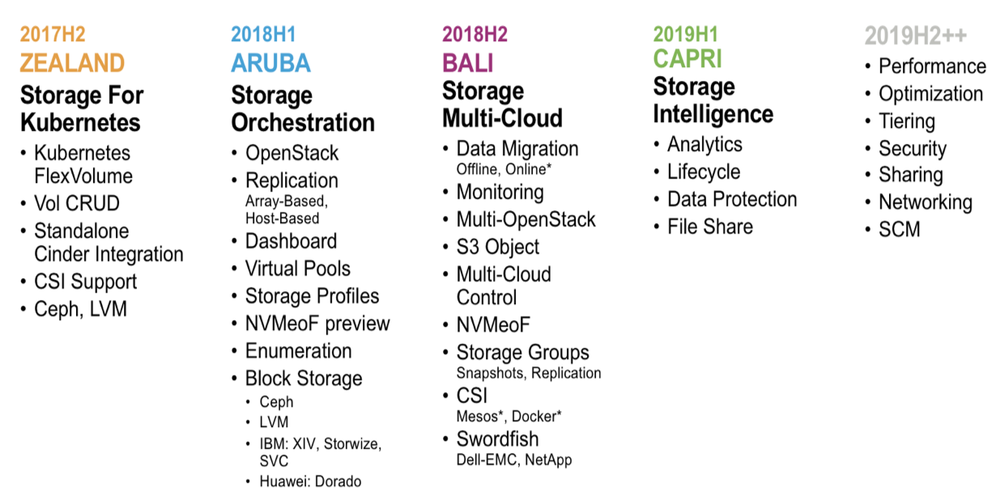

# OpenSDS Design Specs

This repo contains
[design specs](https://github.com/opensds/design-specs/tree/master/specs) for
OpenSDS features.

## OpenSDS Technical Meetings

Design specs and development progress are discussed weekly. Technical meetings
are spread out to try to ease participation for different timezones.

### Meeting Time

#### Meeting Cancellations

Meeting on November 6th, 2018 is canceled due to F2F meeting with Swordfish team.

Meeting on November 15th, 2018 will be canceled due to KubeCon Shanghai.

#### Meeting on Tuesdays

Next Meeting Date: Nov 20, 2018

It is held bi-weekly at 4:00pm-5:00pm UTC (9:00am-10:00am PT and 12:00pm-1:00pm
ET) on Tuesdays.

Zoom Link: [https://zoom.us/j/777978108](https://zoom.us/j/777978108)

#### Meeting on Thursdays Pacific Time (or Fridays UTC)

Next Meeting Time will be on Nov 29, 2018 Thursday 6:00pm-7:00pm PT or
9:00pm-10:00pm ET (or Nov 30, 2018 Friday 1:00am-2:00am UTC)

It is held bi-weekly at 6:00pm-7:00pm PT or 9:00pm-10:00pm ET on Thursdays
(1:00am-2:00am UTC on Fridays).

Zoom Link: [https://zoom.us/j/229373941](https://zoom.us/j/229373941)

### Meeting Agenda

Meeting agenda and notes can be found
[here](https://docs.google.com/document/d/1JlxAAOtvZvvf_KhVr8XQa6mUD7lkHOXlxuGruTKEukE/edit?usp=sharing).

## OpenSDS Architecture

High level architecture of the OpenSDS system:

## OpenSDS Roadmap

## Design Proposal Links

Planned feature designs can be found for each release cycle here.

### Bali Proposals

[Multi-Cloud Design](specs/bali/MultiCloud_Design.md)

[Modularize OpenSDS](https://docs.google.com/document/d/1q02NVogtnzauzVwxyyLxwbAv_RktnYKHHpFuVWM6Ihs/edit#)

[Thin OpenSDS](https://docs.google.com/document/d/16zLCE1X8bNjkGoKvBpqDZaxEHZapWluQVgdvlxuR_tE/edit#)

[Multi-OpenStack](specs/bali/Multi_OpenStack_Design.md)

[OpenSDS Group Snapshots Design](https://docs.google.com/document/d/1mlnuVfRFhu_bczp8EWMdE2XR9xyNImOvVokLGgM6kCc/edit#)

### Aruba Proposals

[Replication Design](specs/aruba/Replication_Design.md)

[Host-based Replication Design](specs/aruba/Host-base_Replication_Design.md)

[OpenSDS Profiles Design](https://docs.google.com/document/d/1irNnz019j0XuW6SZNigs6QuYFOCC3uL44EkRYJiHyq8/edit#)

[OpenSDS Groups Design](https://docs.google.com/document/d/1bjDaeEQd1Zf9av8Vd4Yn7jfp1Eiv-bBBxafAAsAACrU/edit#)

[OpenSDS Minimum Requirements](https://docs.google.com/document/d/1lOntboT99pN-5iS4Z6_gz1Dzwlx7y1Q2weo1VxC_Knk/edit#)

[OpenSDS and OpenStack Integration](https://docs.google.com/document/d/1xZWMlVSd1ove-N-xWv3ZmRbiauzBmdgiQu2C6HRSJKI/edit#)

## Project Tracking

Progress is tracked through our
[project tracking sheet](https://docs.google.com/spreadsheets/d/1OZat5p1Hz5Df7eCb30stPp112Wg8_pfnceVvATGgeVI/edit?usp=sharing).

## Conference Presentations

You can find some of our past [conference presentations here](https://github.com/opensds/presentations)
