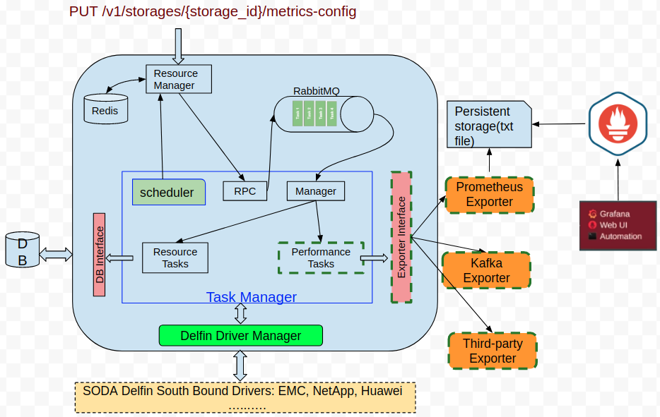
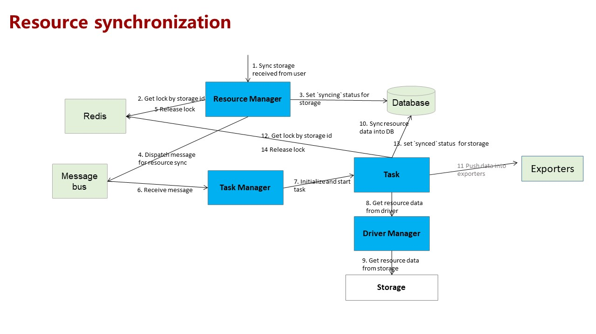

# Task Manager Requirements and design

**Author(s)**: [Pravin Ranjan](https://github.com/pravinranjan10), [Liu Yu](https://github.com/ThisIsClark), [Xu Lin](https://github.com/wisererik)

Major Version Updates

Date 22/10/2020 : Version : Description  : Author

## Goals
* Retrieve or collect the resources(storage, volumes and pools)
  information from registered backends.
* Perform the syncing process of resources whenever required and/or
  periodically.

## Motivation and background
Delfin is an infrastructure management platform for heterogeneous storage environments in SODA foundation. To support this project, resources discovery and data collection required which are implemented in this module.   

### Non-Goals

* Currently periodic Synchronization is not considered

### Assumptions and Constraints

NA

### Requirement Analysis

### Input Requirements

Overall Input requirements can be referred from [here](https://github.com/sodafoundation/design-specs/blob/master/specs/SIM/SODA_InfrastructureManagerDesign.md)

### Feature Requirements

#### Requirement Analysis

There are few major requirements for this module:
1. Develop framework for task manager
2. Collect Pool  information
3. Collect LUN(Volume) information
4. Collect Device information
5. Task scheduling
6. Task synchronization
7. Performance metrics collection
8. Push the metrics data to exporters

#### List of Requirements
##### Functional Requirements
The detailed requirements are given below.
##### Develop framework for task scheduler
* Create/Schedule a task, when device is registered
* Create/Schedule a task, periodically
* Create/Schedule a task, at given time
* Create/Schedule a task, at priority basis
* Create/Schedule a task, now (may be based on call from admin)
* Support for the configuration file/Policy setup
* Publish the task on Bus
* Retrieval Manager should be able to read the Task from Bus
* Clear task from scheduling
* Update the Performance metrics configurations for storage

##### Collect Pool  Information
* Collect pool information of a device
* Store the pool information to DB
* Forward the pool information to exporter

##### Collect Volume  Information
* Collect volume information of a device
* Store the volume information to DB
* Forward the volume information to exporter

##### Collect device Information
* Collect device information
* Store the device information to DB
* Forward the device information to exporter

##### Collect performance metrics data
* Collect performance metrics data for storage arrays
* Collect performance metrics data for storage pools
* Collect performance metrics data for storage volumes

##### Non Functional Requirements

* Performance Requirements

* Security Requirements

* Other Non Functional Requirements (Scalability, HA etc…)

## Architecture Analysis
### High level Architecture
The high level architecture design can be referred from [here](https://github.com/sodafoundation/design-specs/blob/master/specs/SIM/SODA_InfrastructureManagerDesign.md)

### Module Architecture
This is a Retrieval management module which performs two subtasks:

#### 1. Registration and retrieving resource information:
The 1st task of this module is to support registration of the storage devices. Once the storage device is registered, retrieve the information of resources(like storage, volumes and pools) and store into the database. This module also supports periodic and on-demand(manual API call) synchronization of resources of the registered storages.
Below is the list of API which are used for registration and synchronization:

  ###### Registration: POST /v1/storages

  ###### Synchronization: POST /v1/storages/sync

#### 2. Performance collection:
The 2nd task of this module is to collect performance metrics data of storages and push to exporters periodically based on configuration time. To enable the performance collection of a storage, metrics-configuration file needs to be updated.
For example, to enable and collect array performance of a storage, metrics-config should be: {
  "array_polling": {"perf_collection": true, "interval": 900, "is_historic": true }}). A user can update the metrics-config by below API:

  ###### PUT /v1/storages/{storage_id}/metrics-config

The other major components of the Retrieval management module are Redis, TaskManager and RabbitMq as shown in the diagram below. The Resource Manager and Driver Manager are part of the whole project delfin which also are shortly described below (For more details high level architecture can be referred from the [link](https://github.com/sodafoundation/design-specs/blob/master/specs/SIM/SODA_InfrastructureManagerDesign.md)).

##### Redis:
* Redis is a in-memory data structure store, used as a database, cache
  and message broker.
* In this project, redis is used to store the lock variables so that other nodes of a cluster can access these variables in a distributed environment.

##### RabbitMq:
* RabbitMQ is used as a message broker in this project. The tasks are
  pushed to the queue of RabbitMQ, and later it publishes those tasks to connected consumer nodes.

##### Resource Manager:

* Act as the API server for all REST requests . Resource Manager takes
  care of syncing registered storages with SIM DB. In other words, this takes input from /v1/storages/sync API and calls other methods to Synchronize the resources information of registered backends.

##### Task Manager:

* Task manager is responsible for collecting the information of
  resources and updating the DB. It contains three submodules.
* RPC: This module is a Client side of the task manager. Resource
  Manager make a procedural call to RPC methods(i.e sync_storage_resource()). Later, it cast the task to RabbitMq message bus.
* Manager: It is tasks consumer part of the task manager. It receive the
  tasks from RabbitMq and make a procedural call to appropriate methods based on received input tasks.
* Resource Tasks: It contains the implementation code for   
  retrieving the resources information and updating the DB. To get the latest information from storage backends, it calls driver manager methods, and later updates the DB with collected information.
* Performance Tasks: It contains the implementation code for
  performance metrics collection and push to exporters.

##### Delfin Driver manager:
* This layer contains driver’s code. Drivers are lightweight processes
  that configure and collect data from various sources including storage, switch, host etc.
* Each driver’s connected to a single storage backend and performs
  specific tasks(storage, volumes, pools collection) on that backend. Driver manager’s responsibility is to take input from the task manager and select specific drivers based on input parameters. Once the task is performed, return the response with collected information.
* Task manager to driver manager is a procedural call. And from driver
  manager to delfin south bound drivers are REST, CLI, SNMP, SSH, SMI etc.

#### Interface Model

##### External Driver Interfaces

The interface for storage/volume/pool collections:

1. driver_api.get_storage(context, storage_id)

2. driver_api.list_pools(context, storage_id)

3. driver_api.list_volumes(context, storage_id)

##### Databases Interfaces:
###### DB Storage Interface
1. db.storage_get(context, storage_id)

2. db.storage_create(context, values)

3. db.storage_update(context, storage_id, storage)

4. db.storage_delete(context, storage_id)

###### DB Pool Interface
5. db.storage_pool_get_all(context, filters={"storage_id": storage_id})

6. db.storage_pools_delete(context, delete_id_list)

7. db.storage_pools_update(context, update_list)

8. db.storage_pools_create(context, add_list)

###### DB Volume Interface
9. db.storage_volume_get_all(context, filters={"storage_id": storage_id})

10. db.storage_volumes_delete(context, delete_id_list)

11. db.storage_volumes_update(context, update_list)

12. db.storage_volumes_create(context, add_list)

###### DB AccessInfo Interface
13. db.access_info_delete(context, storage_id)

###### DB Alertsource Interfaces
14. db.alert_source_delete(context, storage_id)

##### Exporter Interface
15.  perf_exporter.dispatch(context, array_metrics)

### Data View

#### Data Model
Data Model can be referred from [here](https://github.com/sodafoundation/design-specs/blob/master/specs/SIM/SODA_InfrastructureManagerDesign.md#data-model)

### Development and Deployment Context

#### Code
The module code can be found [here](https://github.com/sodafoundation/delfin/tree/master/delfin/task_manager)

### Execution View

NA

## Sequence Diagrams

Below are sequence diagrams of the resource management module.

1. POST (Add a device ): It is a POST call from API Server to Registration manager

## Design Alternatives and other notes

NA

## Open Issues

NA

## Design Requirements / Tasks

NA

## Scratchpad

NA
