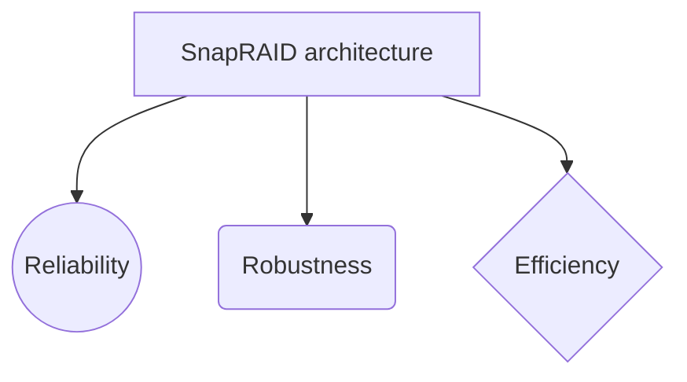

## SnapRAID

  
  RAIDS are mirroring solutions that propagate changes immediately to the parity data. In this sense, RAIDS are not backups because they don’t allow to restore an old state of array

  

## **INTRODUCTION:**

  
**SnapRAID**  is a free and open-source project licensed under GPLv3 which  calculates parity information for disk arrays and will protect against up to 6 disk  failures at once. It essentially takes JBOD and provides a cohesive glue for them  protecting against drive failure and bitrot. It is primarily targeted at media centre  users with lots of big files that rarely change.

## **PROJECT SUMMARY:**

|**Website**          |**https://www.snapraid.it**                      |                        |
|----------------|-------------------------------|-----------------------------|
|**Organization/Foundation name**|`**—**            |           |
|**License**        |`**GPL v3 License**  [GPL v3 is a strong copyleft license, meaning that any copy or  modification of the original code must also be released under the  GPL v3. In other words, you can take the GPL v3'd code, add to it  or make major changes, then distribute your version.]            |            
|**Open/Proprietary**      |`**Open source software**                    [It is code that is designed to be publicly accessible—anyone can  see, modify, and distribute the code as they see fit. Open source  software is developed in a decentralized and collaborative way,  relying on peer review and community production.]|
|**Brief description**|**SnapRAID** is a backup program for disk arrays. It stores parity  information of your data and it recovers from up to six disk failures .It can be also called a folder-based backup tool that  behaves like a software or hardware RAID 5/6 disk raid, but is not  a disk raid itself. There is no real time recovery, free space  between disks cannot be combined and manual execution of  backup is needed.||
|**Author**|**Andrea Mazzoleni**||
|**Cost**|Nothing.Its a **FREE SOFTWARE** application released with GPLv3 license|
|**Requirements**|**SnapRAID requires about TS*(1+HS)/BS bytes of RAM  memory to store the hashes of the data.**[TS is the total size  in bytes of your disk array]|
--------------------------------------------------------------------------------------------------------

## PROJECT DETAILS:

  
**FEATURES:**

-   You can use disk already filled with files,  without the need to reformat them. You will access them like now.
    
-   All your data is hashed to ensure data integrity and to avoid silent corruption.
    
-   If the failed disks are too many to allow a recovery, you lose the data only on the failed disks. All the data in the other disks is safe.
    
-   If you accidentally delete some files in a disk, you can recover them.
    
-   The disks can have different sizes.
    
-   You can add disks at any time.
    
-   It doesn't lock-in your data. You can stop using SnapRAID at any time without the need to reformat or move data.
    
-   To access a file, only a single disk needs to spin, saving power and producing less noise.
    
-   A strong advantage of SnapRAID is the integrity and silent error management that is at the same level (if not better) of the ZFS and Btrfs file-systems. Instead, unRAID and Storage Space have no integrity check at all! FlexRAID is at least able to report silent errors, but not to fix them.
    
-   Provide fault tolerance to protect against (inevitable) hard drive failure
    
-   Checksum files to guard against bitrot
    
-   Support hard drives of differing / mismatched sizes
    
-   Enable incremental upgrading of hard drives in batches as small as one
    
-   Each drive should have a separately readable filesystem with no striping of data

**ARCHITECTURE:**

  

**SnapRAID** provides us some basic protection against drive failures and is the perfect pairing with [**MergerFS**]. This diagram illustrates the relationship between **MergerFS** and SnapRAID - each is responsible for a different area and the two operate independently of each other.

**SnapRAID** was created following the  (Unix philosophy). It has 3 main design principle:

**RELIABILITY:** The first design principle was reliability. The result is a simple architecture and an easy to understand implementation. Extensive and automated tests with the runtime checker  Valgrind and with the Google Sanitizers are done to ensure the correctness of the final application. The test has a code coverage of over 90%, measured with lcov. SnapRAID is also verified with the Coverity Scan and clang static analyzers, and with the American Fuzzy Lop tester.

**ROBUSTNESS:**  The second design principle was robustness. It supports any kind of problem. Even on kernel panics, power-downs or any other hard failure at runtime, your redundancy data is in safe hands.  
It uses all the possible storage techniques to ensure to always keep consistent redundancy even after critical interruptions.

**EFFICIENCY:** The third design principle was efficiency. It's a native C application highly optimized using all the possible OS services to ensure the maximum output through the disk array. For integrity checks is used the highly efficient murmur3 and  Spooky Hash hashes at 128 bits. For the redundancy computations we use a RAID library written from scratch that supports up to six levels of parity delivering top-notch performance. The library design is originally based, and also binary compatible, with the Linux Kernel RAID library made by H. Peter Anvin. As internal data base it's used the TommyDS library of data structures.

**CURRENT USAGE:**

1)**SnapRAID** is used in different operating systems and has its own version and specifications.
|  FILE                     |      DESCRIPTION    |                         |
|----------------|-------------------------------|-----------------------------|
|**[snapraid-12.2.tar.gz](https://github.com/amadvance/snapraid/releases/download/v12.2/snapraid-12.2.tar.gz)**  |`Sources for Linux, Mac OS X, BSD, Solaris, OpenIndiana and any other Unix         |           |
|**[snapraid-12.2-windows-x64.zip](https://github.com/amadvance/snapraid/releases/download/v12.2/snapraid-12.2-windows-x64.zip)**    |Binaries for Windows x64 (the most recent Windows versions)            |            |
|**[snapraid-12.2-windows-x86.zip](https://github.com/amadvance/snapraid/releases/download/v12.2/snapraid-12.2-windows-x86.zip)**      |`Binaries for Windows x86||

There is also an Italian manual by Luciano Lampi  and Ubuntu packages are present in launchpad.

  

2) It is used with **MergerFS** and **ZFS**:
If you have a large collection of media files and some more high churn datasets then consider the more advanced implementation detailed in Advanced Configuration  Using ZFS with MergerFS. This combines a SnapRAID protected array of data disks and a ZFS mirror to have the cake and eat it too.

  

**TECHINICAL DETAILS:**

**SnapRAID** helps us meet each of these criteria and when combined with MergerFS enables each drive to remain individually formatted (no striping) whilst still having some kind of fault tolerance. Data integrity is checked for bitrot using 128bit checksumming which enables the silent fixing of these errors. Furthermore, any files changed since the last sync can be restored on a file by file basis allowing for quite a sophisticated backup solution at the file level.

It will also work on already populated data drives, a big win over traditional RAID. Again, it allows only the drives in use to be spun up unlike RAID which requires all drives spinning to access a file on one drive.The default Linux read-ahead size of 128 KiB already ensures the best performance for the default SnapRAID block size of 256 KiB. If you use a bigger block size, you should configure the read-ahead size to be at least equal to half of the SnapRAID block size.For example, if you want to use a SnapRAID block size of 512 KiB, it's recommended to configure a read-ahead size of 256 KiB for sdX using:

[echo 256 > /sys/block/sdX/queue/read_ahead_kb]

NOTE: If you want to use a SnapRAID block size smaller than 256 KiB, it's recommended to don't configure a specific read-ahead size, and just use the default value.

**Commands:**

**SnapRAID** provides a few simple commands that allow to:

-   Prints the status of the array -> "status"
    
-   Controls the disks -> "smart", "up", "down"
    
-   Makes a backup/snapshot -> "sync"
    
-   Periodically checks data -> "scrub"
    
-   Restore the last backup/snapshot -> "fix".
    

*All these commands should be in lower case .*

**Content**

SnapRAID stores the list and check-sums of your files in the content file .It's a binary file, listing all the files present in your disk array, with all the check-sums to verify their integrity.This file is read and written by the "sync" and "scrub" commands, and read by "fix", "check" and "status".

**Parity**

SnapRAID stores the parity information of your array in the parity files.They are binary files, containing the computed parity of all the blocks defined in the "content" file.These files are read and written by the "sync" and "fix" commands, and only read by "scrub" and "check".

**Encoding**

SnapRAID in Unix ignores any encoding. It reads and stores the file names with the same encoding used by the file-system.In Windows all the names read from the file-system are converted and processed in the UTF-8 format.

To have the file names printed correctly you have to set the Windows console in the UTF-8 mode, with the command "chcp 65001", and use a TrueType font like "Lucida Console" as console font. Note that it has effect only on the printed file names, if you redirect the console output to a file, the resulting file is always in the UTF-8 format.

  

**OTHER INFORMATION:**

**Project comparison**
The other best known projects are:

-   [unRAID](http://www.lime-technology.com/) - Commercial and OpenSource GPL2 solution. A modified version of the Linux Reiserfs filesystem with real-time redundancy. No integrity checksum is supported.
    
-   [FlexRAID](http://www.flexraid.com/)  - Commercial and proprietary C++/Java application for Windows, with some limited support for Linux. It supports both snapshot redundancy and real-time redundancy, with integrity checksum.
    
-   [ZFS](http://en.wikipedia.org/wiki/ZFS) - OpenSource filesystem (but GPL incompatible) with real-time redundancy and integrity checksum.
    
-   [Btrfs](http://en.wikipedia.org/wiki/btrfs) - OpenSource filesystem GPL2 with real-time redundancy. From Linux 3.9 it supports [RAID5/6 redundancy](http://lwn.net/Articles/536038/) and integrity checksums. Recently various issues were found and the official [wiki](https://btrfs.wiki.kernel.org/index.php/RAID56) now states: The parity RAID code has multiple serious data-loss bugs in it. It should not be used for anything other than testing purposes.
    
-   [Storage Spaces](http://blogs.msdn.com/b/b8/archive/2012/01/05/virtualizing-storage-for-scale-resiliency-and-efficiency.aspx)  - The last contender from Microsoft, and integrated into Windows 8. Proprietary with real-time redundancy. Checksumming is not supported. It also has some other [limitations](http://helgeklein.com/blog/2012/03/windows-8-storage-spaces-bugs-and-design-flaws/).
    

*The main factor to categorize them is when the redundancy information is updated. In real-time solutions the parity data is updated in real-time, without an explicit action from the user. Like in standard RAID. In snapshot solutions the parity data is updated only upon an explicit request from the user. Like in backups.
Other important factors are the support of an integrity checksum to identify [silent data corruption and the possibility to fix it, if you can use already filled disk, if you can recover your data from not broken disks when you get too many failures to have a full recover, and if all your disks are spinning when reading one file.*

COMPARISONS with other Projects:

|        |SnapRAID|unRAID |**FlexRAID**    |ZFS  |**Btrfs** |**Storage Spaces**|||
|------------|-----|-|--- |--|----|--|-|-|
|**Redundancy model** Real-time computes parity at real-time like RAID, snapshot at request time, like Backup.|Snapshot|Real-time|Real-time  Snapshot|Real-time snapshot |Real-time snapshot|Real time|           |          |
|**Integrity**  If data is validated with some kind of checksum, and which one is the default.  |`Yes SpookyHash  128 bit |  No  |Yes Adler32 32bit|Yes fletcher 4 256 bit |yes|No| 
|**Fix silent errors** If silent errors are detected and fixed before they can propagate into the parity.         |`Yes |No |No |yes |yes |No|
|**Number of failures** How many disk failures are supported? 1 is for RAID5, 2 for RAID6.|1 2 3 4 5 6 |1 2|1 2 3 4 5 6+|123|12|12|
|**Other failures** If more disks fail than the supported redundancy model, is it possible to recover the data in the not failed disks?|Yes |Yes |Yes |Yes |No |No |
|**Power/Noise** How many disks are spinning when reading a single file?|One|One|One|All|All|All|
|**Filled disks** Can you start with already filled disks|Yes|Partial|Yes|No|No|No|
|**Add disks** Can you add disks at later time?|Yes|Yes|YEs|No|yes|Yes|
|**Operating system** Which OS is supported?|Linux  Windows  Mac OS X  OpenIndiana  Solaris  BSD|Linux|Windows Linux|Linux  Windows  Mac OS X  OpenIndiana  Solaris  BSD|Linux|Windows|
|**Age  The year of the first official release supporting at least RAID5 redundancy**|2011|2005|2008|2005|not yet stable|2012|
|**License/Price** Software license and price.|Open Source GPL3Free| Open Source GPL2 89$/129$|**Proprietary40$/60$**|**Open Source CDDL  Free**|Open Source GPL2 Free|**ProprietaryWindows 8/10** |
|**Interface** Which interface is provided? GUI or command line?|command line or Elucidate GUI, or plugin for for Open Media Vault|command line  GUI |GUI |command line  GUI/Plugins|**command line GUI**|GUI|

**ANY OTHER INFORMATION:**

**LIMITATIONS:**

**SnapRAID** is in between a RAID and a Backup program trying to get the best benefits of them. Although it also has some limitations that you should consider before using it.

The main one is that if a disk fails, and you haven't recently synced, you may be unable to do a complete recover. More specifically, you may be unable to recover up to the size of the amount of the changed or deleted files from the last sync operation. This happens even if the files changed or deleted are not in the failed disk. This is the reason because SnapRAID is better suited for data that rarely change.

Instead the new added files don't prevent the recovering of the already existing files. You may only lose the just added files, if they are on the failed disk.

Other limitations are:

-   You have different file-systems for each disk. Using a RAID you have only a big file-system.
    
-   It doesn't stripe data. With RAID you get a speed boost with striping.
    
-   It doesn't support real-time recovery. With RAID you do not have to stop working when a disk fails.
    
-   It's able to recover damages only from a limited number of disks. With a Backup you are able to recover from a complete failure of the whole disk array.
    
-   Only file, time-stamps, symlinks and hardlinks are saved. Permissions, ownership and extended attributes are not saved.

**REFERENCES:**

https://www.snapraid.it
https://forum.flexraid.com
https://github.com/amadvance/snapraid/tree/master/raid
https://github.com/amadvance/snapraid/releases/download/v12.2/snapraid-12.2.tar.gz
https://launchpad.net/~tikhonov/+archive/snapraid

----------------------------------------------------------------------------------------------------------------------------------------------------------------------------------------------------------------

