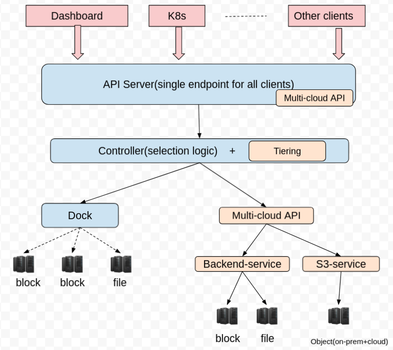
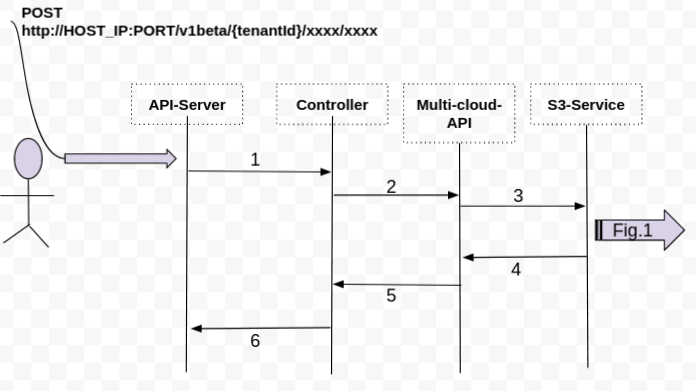
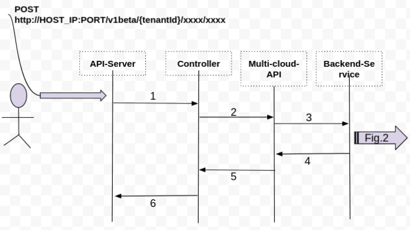
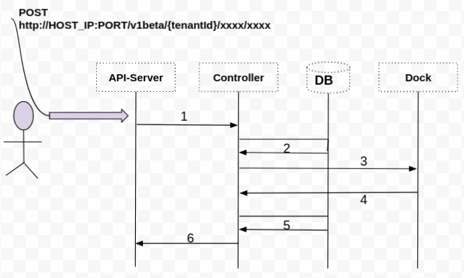
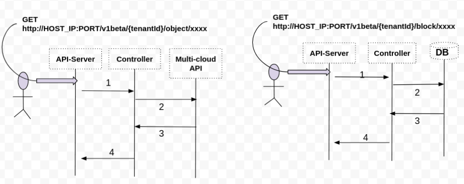
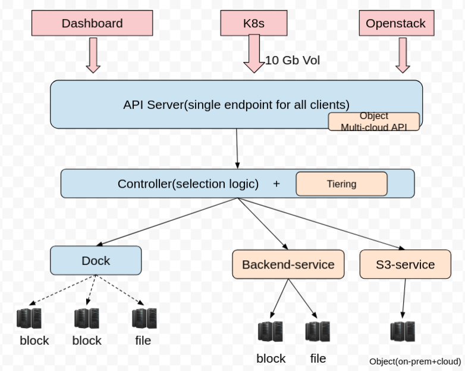

# Unified API for SODA Projects

Author(s): [Pravin Ranjan](https://github.com/PravinRanjan10)

## Motivation and background

SODA is a collection of multiple independent projects. Each project has their own API server and exposes different endpoints. A single project may be able to handle a specific use case but to handle a large set of use-cases, few projects need to be plugged together. And there should be a single endpoint for all projects, so that clients need not to configure multiple endpoints for SODA projects.

### Goals

The main goal is to provide a unified API and single endpoint access for all projects of SODA. The current scope is limited to unification of hotpot and multi-cloud projects API.

### Non-Goals

The current proposal is not focusing on other projects of SODA, Ex: delfin etc.

### Requirement Analysis

##### Functional Requirements

1. A single entity should contain all the SODA projects API. In other words, Unification of API of all below projects.

  [Hotpot API](https://github.com/sodafoundation/api/blob/master/openapi-spec/swagger.yaml)

  [Multi-cloud API](https://github.com/sodafoundation/multi-cloud/blob/master/openapi-spec/swagger.yaml)

2. All the SODA projects should be access from single endpoint

3. All API should return return-code or/and response messages.

4. All the existing features of both projects should be working from Unified API-Server

5. A single swagger should there for Unified APIs


##### Non Functional Requirements

1. The system should be highly available. Multiple users can login to the system and provision resources like, create /volume/fileshare/buckets etc.

2. The system should work with minimum latency.

3. The system should be scalable and it should handle the high amount of users' requests.

## Proposal

To support Unified API for SODA projects, all other project's API can be added to one project named API-Server. Currently API-Server has Hotpot(on-prem storage) related APIs, now other projects like multi-cloud API can also be added to API-Server project which inherently will become similar to API gateway for SODA projects. Further all the request calls coming to API-Server can be validated and forwarded to the Controller project.

Controller is a project, where all the intelligence logics related to selection of on-prem backend storages are there. Basically, this selection logic helps to pick one storage among multiple registered storages based on profile. Later that selected storage can be used for provisioning etc. Now the selection logic can be enhanced to select one storage for provisioning among on-prem and cloud storages. Here selection logic can take input from profile and tiers.

Once the backend storage is selected, calls can be forwarded to either Dock or Multi-cloud API for further processing.

So the overall workflow should looks like:

a. Clients <---> API-Server <---> Controller(<---> DB) ---> Dock <---> Storage Backend

b. Clients <---> API-Server <---> Controller <---> Multi-Cloud API <---> S3-service(<--->DB) <---> Cloud backend

c. Clients <---> API-Server <---> Controller ---> Multi-Cloud API <---> Backend-service(<--->DB) <---> on-prem/cloud backend

In above workflow, two points need to note:
  * For GET API call to hotpot, the results are coming from DB

  * For GET API call to Multi-cloud, the results are coming from Multi-cloud API(i.e, in this case there is no direct access of DB from Controller, Controller has to make Call to Multi-cloud API only for any request)  


The below [sequence diagrams](#Sequence) can be referred to see the end-to-end flow in more detail.

Please find the details of proposed diagram
#### Fig. I: The proposed architecture diagram


### Sequence Diagrams:
1. POST http://HOST_IP:PORT/v1beta/{tenantId}/object/xxx

  

2. POST http://HOST_IP:PORT/v1beta/{tenantId}/object/xxx

  

3. POST http://HOST_IP:PORT/v1beta/{tenantId}/block/xxx

   POST http://HOST_IP:PORT/v1beta/{tenantId}/file/xxx

  

4. GET http://HOST_IP:PORT/v1beta/{tenantId}/object/xxx

   GET http://HOST_IP:PORT/v1beta/{tenantId}/{block or file}/xxx

  


### Data model impact

New data model will be added to the API server and Controller module. Here are some examples:

```
type Backend struct {
	Id         bson.ObjectId `json:"id,omitempty" bson:"_id,omitempty"`
	TenantId   string        `json:"tenantId,omitempty" bson:"tenantId,omitempty"`
	UserId     string        `json:"userId,omitempty" bson:"userId,omitempty"`
	Name       string        `json:"name,omitempty" bson:"name,omitempty"`
	Type       string        `json:"type,omitempty" bson:"type,omitempty"`
	Region     string        `json:"region,omitempty" bson:"region,omitempty"`
	Endpoint   string        `json:"endpoint,omitempty" bson:"endpoint,omitempty"`
	BucketName string        `json:"bucketName,omitempty" bson:"bucketName,omitempty"`
	Access     string        `json:"access,omitempty" bson:"access,omitempty"`
	Security   string        `json:"security,omitempty" bson:"security,omitempty"`
}

type Bucket struct {
	Name               string `xml:"Name"`
	CreateTime         string `xml:"CreateTime"`
	LocationConstraint string `xml:"LocationConstraint"`
	VersionOpts        VersioningConfiguration
	SSEOpts            SSEConfiguration
}
```

The full list of all data model can be referred from here:
1. [Backend service](https://github.com/sodafoundation/multi-cloud/tree/master/backend/pkg/model)
2. [S3-Service](https://github.com/sodafoundation/multi-cloud/tree/master/s3/pkg/model)


### REST API impact
All these below multi-cloud API's will be added to API server(of hotpot)

##### S3-Service specific:

* PutBucket
* GetBucket
* HeadBucket
* DeleteBucket
* PutBucketACL
* GetBucketACL
* PutBucketCors
* DeleteBucketCors
* GetBucketCors
* PutObject
* PutObjectCopy
* GetObject
* HeadObject
* DeleteObject
* Multi-Object Delete
* PutObjectACL
* GetObjectACL
* MultipartUpload
* GetService
* Put Bucket Website
* Get Bucket Website
* Delete Bucket Website
* Put Bucket Versioning
* Get Bucket Versioning

##### Backend Service Specific

* CreateBackend
* UpdateBackend
* DeleteBackend
* GetBackend
* ListBackend

For list of all multi-cloud API's click [here](https://github.com/sodafoundation/multi-cloud/tree/master/openapi-spec)

### Security impact

None

### End user impact
User will have to modify their endpoint as below

The current multi-cloud API's endpoint is:

http://HOST_IP:HOST_PORT/{xxxxx}/

After unification, the endpoint for all API's:

http://HOST_IP:PORT/v1beta/{tenantId}/xxxx/xxxx


### Performance impact

None

### Other deployer impact

None

### Developer impact

None

## Use Cases

## Open Questions:
1. What should be API URI for multi-cloud related API's, specially for cloud's block or file

  Example:

  POST http://HOST_IP:PORT/v1beta/{tenantId}/object/xxx

## Alternatives considered
This diagram is slightly different than [Fig. I](#Proposal)
In Fig. I, Controller was calling the Multi-cloud API for provisioning or registering or getting information from DB. But the alternative proposal is to call respective services of Multi-cloud projects from Controller.
#### Fig. II: The alternative of Proposed architecture diagram

