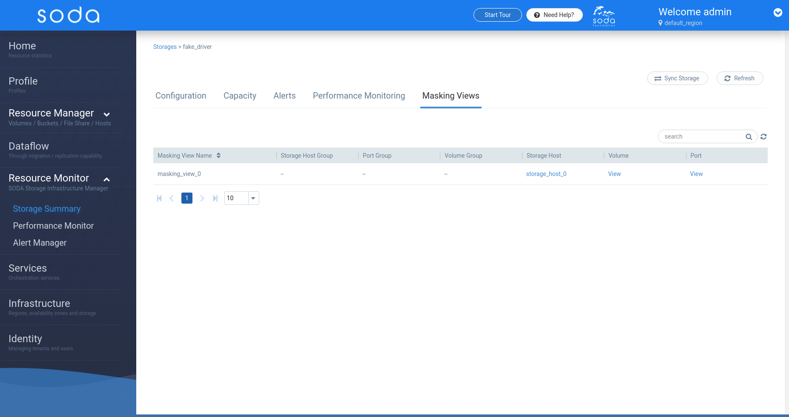
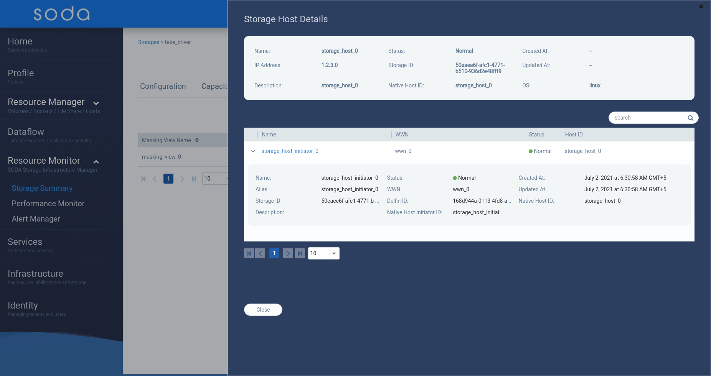
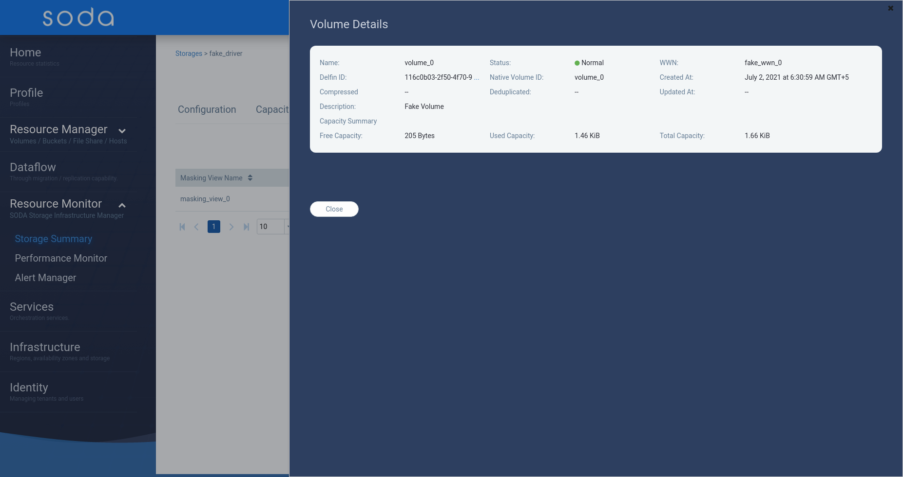
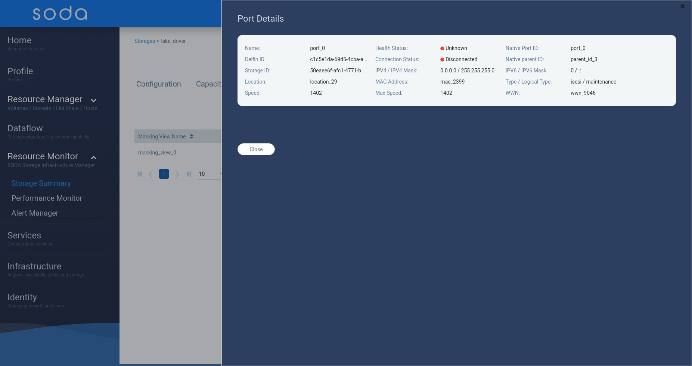

# SODA Dashboard requirements for K release

  

**Author(s)**: [Anvith KS](https://github.com/anvithks)

Major Version Updates

|**Date** | **Version** | **Description** |
|---------|-------------|-----------------|
| 13th September 2021  | v0.1  | This document lists the requirements and changes needed for SODA Dashboard for K release. |


## Goals
- Delfin UI updates
    - Update masking views UI
        - Add Support for Volume Groups API
        - Add support for Port Groups API
        - Add support for Storage Host Groups API
        
- Bug fixes and improvements


## Motivation and background

As part of the quarterly release of SODA Delfin has enhanced the masking views with additional APIs. The same must be supported from the SODA Dashboard to allow users to experience these changes. Additionally any bug fixes and improvements will be covered as part of this release

## Glossary

**Masking view**
---
The masking view identifies the host group (set of hosts), the port group (set of array ports), and the storage group (set of volumes) in a combination which are associated. Masking view represent the LUN masking and mapping information. A masking view will have only one host group, storage group and port group

**Host group**
---
logical grouping of hosts. This could be representing the real back end host group or a dummy object created by delfin. Delfin logic of creating dummy object is explained below. Host group and Storage group together represent the LUN masking.

**Port group**
---
Logical grouping of array ports(target ports) where the volumes are mapped.This could be representing the real back end port group or a dummy object created by delfin. Delfin logic of creating dummy object is explained below. Port group and Storage group together represent LUN mapping.

**Storage group**
---
Logical grouping of volumes . This could be representing the real back end storage group or a dummy object created by delfin. Delfin logic of creating dummy object is explained below.

**Host**
---
Represents a host , consists of multiple initiators

**Initiator**
---
An HBA wwn or iscsi target.

**Port**
---
Array port through which the volume is mapped to the initiator

**Volume**
---
Volume or LUN or logical device or virtual volume which is masked to initiators.

### Requirement Analysis


#### Delfin UI Requirements
---
- **Update Masking views UI**  
    The SODA Dashboard added support for masking views in the [Jerba Release](https://github.com/sodafoundation/soda/releases/tag/v1.4.0) of SODA.  
    As part of the Jerba release the SODA Dashboard supports display of storage host, volume and port only.

    As part of the K release, Delfin has added Storage Host Group, Volume Group and Port Group associations.  


    
    **Add support for Storage Host Groups API**  
    `/v1/storages/{storage_id}/storage-host-groups`

    
    **Add support for Port Groups API**  
    `​/v1​/storages​/{storage_id}​/port-groups`

    
    **Add support for Volume Groups API**  
    `/v1/storages/{storage_id}/volume-groups`

    


### Input Requirements

  
##### Functional Requirements
* User can view the Storage Host Group details
* User can view the storage hosts linked to the Storage Host Group
* User can view the Volume Group details
* User can view the volumes linked to the Volume Group
* User can view the Port Group
* User can view the ports linked to the Port Group.


##### Non Functional Requirements

  
## Architecture Analysis

### Module Architecture
 **Masking View UI**


**Masking Views - Storage Host Details**


**Masking Views - Volume Details**


**Masking Views - Port Details**

## Detailed Design

The current masking views API looks like this:
    
```json
    {
        "masking_views": [
            {
            "created_at": "2021-07-02T06:30:58.291180",
            "updated_at": null,
            "id": "b8bb0e21-aeae-4fbf-8a5e-7f3510951d68",
            "storage_id": "50eaee6f-afc1-4771-b510-936d2e48fff9",
            "name": "masking_view_0",
            "description": "masking_view_0",
            "native_storage_host_group_id": null,
            "native_volume_group_id": null,
            "native_port_group_id": null,
            "native_storage_host_id": "storage_host_0",
            "native_volume_id": "volume_0",
            "native_port_id": "port_0",
            "native_masking_view_id": "masking_view_0"
            }
        ]
    }
```

The updated API includes the `native_storage_host_group_id`, `native_volume_group_id` and `native_port_group_id`.
```json
{
    "masking_views": [
        {
        ...
        "native_storage_host_group_id": "storage_host_group_0",
        "native_volume_group_id": "volume_group_0",
        "native_port_group_id": "port_group_0",
        ...
        }
    ]
}
```
**Update Delfin service**

**Add support for Storage Host Groups API**  
    `/v1/storages/{storage_id}/storage-host-groups`

    ```json
    {
        "storage_hosts": [
            {
            "id": "084bf71e-a102-11e7-88a8-e31fe6d52248",
            "created_at": "2017-07-10T14:36:58.014Z",
            "updated_at": "2017-07-10T14:36:58.014Z",
            "name": "demo storage host",
            "description": "storage host",
            "storage_id": "084bf71e-a102-11e7-88a8-e31fe6d52248",
            "native_storage_host_group_id": "storage_host_group0",
            "storage_hosts": [
                "storage_host_0"
            ]
            }
        ],
        "additionalProp1": {}
    }
    ```
    **Add support for Port Groups API**  
    `​/v1​/storages​/{storage_id}​/port-groups`

    ```json
    {
        "storage_hosts": [
            {
            "id": "084bf71e-a102-11e7-88a8-e31fe6d52248",
            "created_at": "2017-07-10T14:36:58.014Z",
            "updated_at": "2017-07-10T14:36:58.014Z",
            "name": "string",
            "description": "string",
            "storage_id": "084bf71e-a102-11e7-88a8-e31fe6d52248",
            "native_port_group_id": "port_group_0",
            "ports": [
                "port_0"
            ]
            }
        ]
    }
    ```

    **Add support for Volume Groups API**  
    `/v1/storages/{storage_id}/volume-groups`

    ```json
    {
        "storage_hosts": [
            {
            "id": "084bf71e-a102-11e7-88a8-e31fe6d52248",
            "created_at": "2017-07-10T14:36:58.014Z",
            "updated_at": "2017-07-10T14:36:58.014Z",
            "name": "string",
            "description": "string",
            "storage_id": "084bf71e-a102-11e7-88a8-e31fe6d52248",
            "native_volume_group_id": "volume_group_0",
            "volumes": [
                "string"
            ]
            }
        ]
    }
    ```
### Use case View

