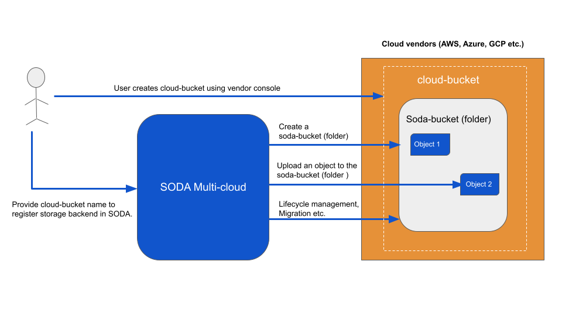
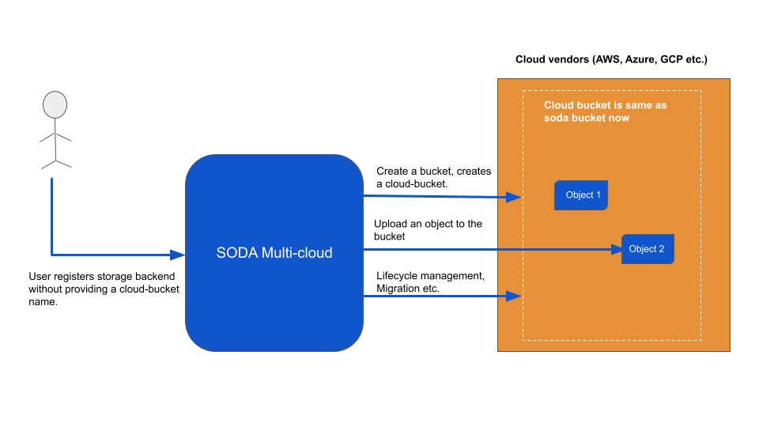

# SODA Dashboard requirements for I release

  

**Author(s)**: [Anvith KS](https://github.com/anvithks)

Major Version Updates

|**Date** | **Version** | **Description** |
|---------|-------------|-----------------|
| 25th February 2021  | v0.1  | This document lists the requirements and changes needed for SODA Dashboard for I release. |
| 9th March 2021  | v0.2  | Updated with further analysis of tasks |


## Goals
- Multicloud UI 
    - Support Heterogenous object storage
    - Register backend with changes needed to support bucket management (AWS, Azure, GCP and Huawei)
    - Bucket Create / Update / Delete on cloud storage
    - Archive / Retrieve support for Azure and GCP
    - Bug fixes and improvements
- Delfin UI updates
    - Add new storage driver registration support 
    - Add new methods of access to Drivers
        - CLI
        - SMI-S
    - Change the configure performance metrics API as per the changes made to Delfin.
    - Add new resource types for only NAS storage device  to support NAS capabilities
        - Qtree
        - File Systems
        - File share   
- Bug fixes and improvements
- SODA Dashboard support for HA


## Motivation and background

The handling of buckets on cloud storage using SODA Multicloud APIs is undergoing a design change as per this pr [architecture-analysis/99](https://github.com/sodafoundation/architecture-analysis/pull/99). This will change the fundamental design of how SODA Multicloud deals with registration of backends and buckets. This requires some modifications in API parameters and some changes to how the Dashboard lists and operates on backends, buckets and objects within those buckets.  
SODA Delfin is adding new drivers support on a regular basis and this requires the Dashboard to be updated to allow the user to register storages for these new drivers.Additionally any bug fixes and improvements will be covered as part of this release


### Requirement Analysis


#### Multicloud - Bucket Management
---
- **Register Backend**  
    The current requirement of creating a bucket on the cloud backend and providing that bucket name for backend registration in SODA Multicloud will be removed for AWS, Azure and GCP backends. User will provide all the other parameters as before for backend registration.
    ```json
        {
            "name": "backend_aws",
            "type": "aws-s3",
            "region": "ap-south-1",
            "endpoint": "s3.amazonaws.com",
            "access": "your_access_key",
            "security": "your_secret_key"            
        }
    ```
- **Create bucket on cloud backend (AWS, Azure, GCP, Huawei and all supported vendors)**  
    The changes required for create bucket are implicitly handled in the backend code. The current implementation maps a SODA bucket to a folder inside the actual bucket on the cloud. When we create a bucket in SODA Multicloud it creates a folder on the cloud bucket. 
    
    After the change is made creating a bucket from SODA Multicloud will create a bucket on the cloud backend. Since there are no changes made in the API structure or the parameters current functionality from the dashboard should work as before.

    One change that will need to be addressed is the read and write access on the bucket. Currently the user creates the bucket manually and sets the policy such that the owner has full access on the bucket and objects. With the new changes the backend registration will have to set the policy on the bucket at the time of bucket creation. 

    When we have a policy API we can allow the user to change the policy on the buckets. This will require new APIs and unification as different cloud providers have different policies and parameters.  
    The AWS bucket policy generator can be viewed [here](https://awspolicygen.s3.amazonaws.com/policygen.html)
    
- **Delete bucket**
    No change needed from dashboard.

- **Bucket lifecycle rules CRUD**  
    The create lifecyle rules API will be modified to accept the bucket name as a parameter for the destination. Currently only the backend name is provided as a parameter. The SODA backend maps the backend to the cloud bucket and performs all the transitions and migrations based on the bucket that is linked to the backend.  

    Now with the new changes each backend can have multiple buckets and the user should be able to choose the bucket to which the objects must be transitioned, within the same backend or across clouds.

- **Bucket ACL CRUD**  
    The bucket ACL currently is in fact just changing the folder access between `read` and `read-write`. 
    Since we will now be working on actual buckets the ACL APIs will in fact have to update the bucket policies to manage the ACL. This will require changes from the dashboard as well the backend.   
    From the dashboard user should still be able to enable and disable Read and Write permissions but the API will have to be a bucket policy update.  
    The AWS bucket policy generator can be viewed [here](https://awspolicygen.s3.amazonaws.com/policygen.html)  

    Based on this and the policies needed for other cloud providers we will have to prepare a unified policy generator for all the common policies and metadata driven approach for all the cloud provider specific properties and parameters.

- **Upload objects to bucket.**  
    No change required from dashboard. 
- **Download object from bucket.**  
    No change required from dashboard.
- **Create a folder in bucket.**  
    No change required from dashboard.
- **Delete folder in bucket.**  
    No change required from dashboard.
- **Upload Object to folder.**  
    No change required from dashboard.
- **Delete object in folder.**  
    No change required from dashboard.
- **Download object from folder.**  
    No change required from dashboard.
- **Archive / Restore object based on storage class**  
    No change needed from Dashboard.
- **Copy / Paste object across buckets**  
    No change required from dashboard. 
- **Migrate Buckets**  
    No change needed from Dashboard since the operation is on the bucket name.  
    There is an issue here since we are only implementing the new bucket changes for AWS, Azure, GCP and Huawei cloud backends. As per the new changes on these three clouds the bucket will be an actual bucket created from SODA. For the other cloud vendors the bucket created from SODA will be a folder. The migration will still take place as the API looks for the bucketname and the object keys. But it will be between a bucket and a folder. 

#### Multicloud - Add Archive / Retrieve support for Azure and GCP 
---  
- **Add archive support for Azure and GCP cloud**  
    Currently the SODA mutlicloud supports archival for AWS only. We add support for Azure and GCP cloud and provide the user the appropriate storage classes based on the backend type. Update the list of storage classes in the dashboard constants file.
- **Add retrieve support for Azure and GCP**  
    

#### Multicloud - High Availablility
---
- **No changes needed in dashboard.**  
    Changes will be needed in the installer to specify a different IP address in case of HA deployment. Currently the installer accepts the HOST_IP of where SODA is deployed and the same IP is used for all the services (SODA API, Multicloud, Dashboard ).  
    In case of a HA deployment the multicloud IP address will be changed to the nodePort of the cluster where the multicloud API service will be exposed. This IP address will need to be updated in the installer. The dashboard container deplyment expects environment variables where this will need to be updated.
#### Delfin UI Requirements
---
- **Register new storage drivers from SODA Dashboard**  
    Update the list of supported devices that is maintained in the dashboard constants to add support for the following devices (if the driver support is included from Delfin). Provide the access mechanism that are supported by the driver and are required by SODA Delfin.
    * Dell EMC VPLEX 
    * Dell EMC VNX 
    * IBM DS8000
    * Dell EMC PowerMax
    * Dell EMC ExtremeIO
    * IBM FlashSystem
    * NetApp FAS
    ```json
    //For ex: 
    'dellemc' : [
                {
                    label: "VMAX",
                    value: {
                        name: 'vmax',
                        rest: true,
                        ssh: false,
                        cli: false,
                        smis: false,
                        extra: true
                    }
                },
            ],
    ```  
    In the above example the we have added support for Dell EMC VMAX. The device requires `REST` access and allows extra attributes.

- **Add new methods of access to storage devices**  
    Currently SODA Delfin allows user to register storage devices and provide `REST` and `SSH` access mechanisms. Some of the new devices that will be added support the following access methods:
    * CLI method
    * SMI-S method  

    For devices that support `CLI` or `SMI-S` the user will be able to provide the access parameters. The same constants file above will be updated to allow the user to add support for the access mechanism.

-  **Change the configure performance metrics API as per the changes made in Delfin.**
    * Performance metrics collection congfiguration is now part of the registration process and does not require  the user to enable. This would mean the current process of clicking on the configure button and submitting the configure form will have to be removed.  

-  **Add new resource types for only NAS storage device  to support NAS capabilities**
    The following new resource types have to be added to 
    * Qtree
    * File Systems
    * File share  
    
    Resource types may be different across device models and across NAS, SAN or unified types. Two different SAN devices may have different resources available.
    For this we maintain a supported resources list by device model at the dashboard and based on the resource support we display the resource information.  
    Based on the resource type support weconditionally show or hide or remove the resource type from the Frontend . The associated API calls also will not be made. For ex: if a device model does not have storage pools then the API to fetch all pools for the device will not be made.
    This requires changes across the code for existing resources and for the new resources (Qtree, Fileshares and Filesystem.)

- **Modify the keys of the performance metrics in the pre-configured Grafana dashboards**  
    If user installs the SRM toolchain we configure and install some Grafana dashboards which show the performance visualizations for all devices and for particular device.  
    The dashboards are configured with some keys that are fetched from the Prometheus datasource. These keys will be changed this change needs to be made in the dashboard `.json` files.


### Input Requirements

* TBD
  
##### Functional Requirements
* User can create, update, delete a bucket on the cloud vendor backend from SODA Dashboard 
* User can create, delete folders on cloud vendor buckets
* User can upload, download and delete objects to and from the cloud vendor buckets
* User can create, update and delete lifecycle rules on buckets
* User can archive and restore objects based on storage tier
* User can copy / paste objects across cloud buckets
* User is able to register new storage devices supported by Delfin
* User is able to view new resource types for NAS storage devices
* User is able to configure performance metric collection for storage devices and customize the Grafana dashboards to show the visualizations.


##### Non Functional Requirements

  
## Architecture Analysis

### Module Architecture


The current SODA Multi-cloud architecture can be seen in Fig-1 below.


The updated proposed architecture can be seen in Fig-2 below.



### Use case View
To create a bucket in SODA a user must register a backend. This registration process requires the user to create a bucket using the cloud console and provide the name of the bucket at the time of backend registration. All further bucket operations in SODA multicloud are currently operations on folders under the bucket created manually.
This poses many challenges and issues when versioning, encryption and other bucket operations are considered.
To solve this issue, the new changes proposed will allow the user to create a bucket on the cloud backend from SODA. The user will be able to set a custom tier policy and apply this tier to the bucket.

Some of the devices that are now supported by Delfin also provide access using CLI and SMI-S access mechanisms. The dashboard should also allow users to register devices with these access mechanisms.

Delfin supports unified and SAN devices and now the support for NAS capable devices has been added. Storage devices may have support for all or a few of the resources and the appropriate resources must be displayed based on the device capability.

