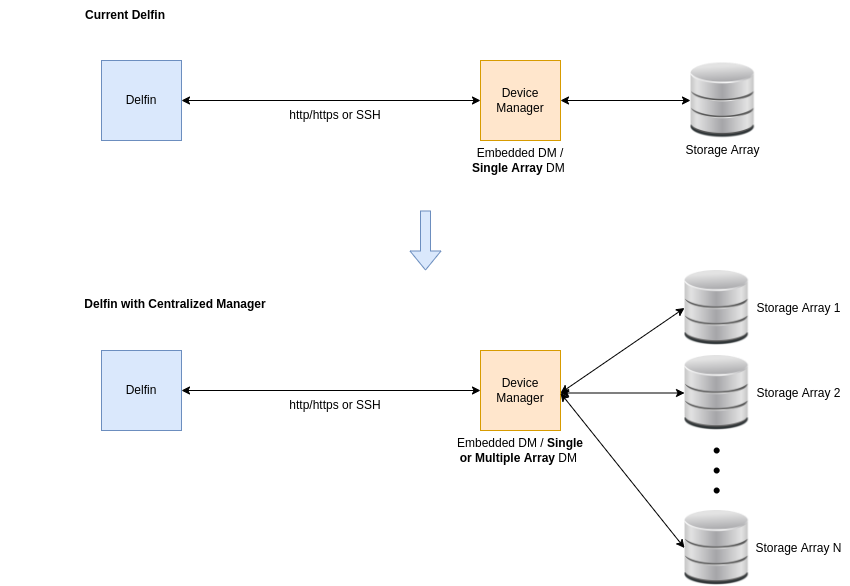
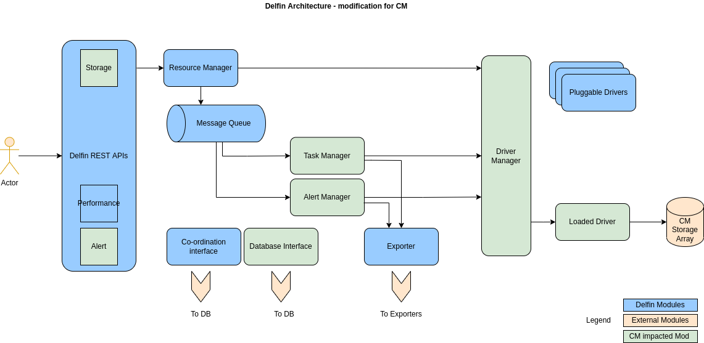
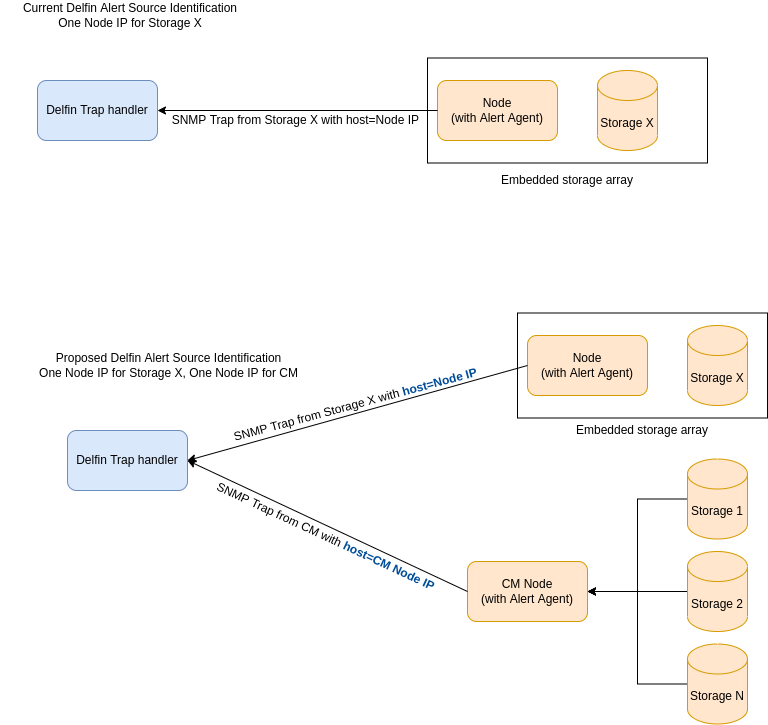
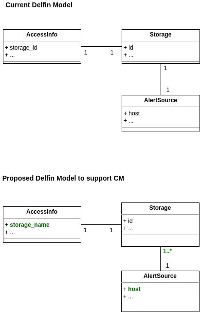
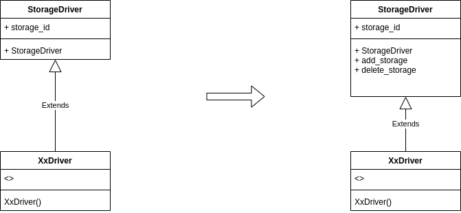
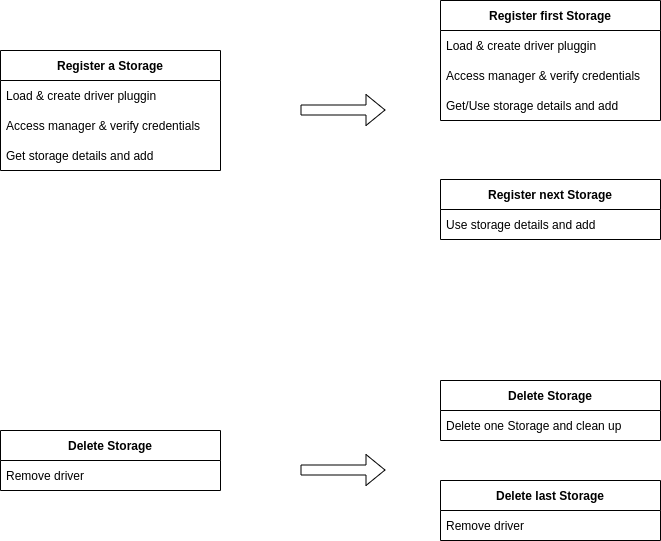

# SODA Delfin - Centralized Manager

Delfin is a Storage Infrastructure Management framework under SODA foundation projects for Heterogenious storage backends (cloud-enabled, offline-storage, etc.) for management, status collection, telemetry and alerting.

## Motivation and background

Storage vendors provide tools, graphical user interfaces (GUI) and other applications for configuring, managing and monitoring their storage devices. This software from the vendor that is used for management of storage devices is called **Device Manager**.

Users of Device Managers can connect with it programmatically by using standard protocols like http/https, SSH, CLI, SMI-S or SNMP.

When the Device manager is deployed in the same array and manages the same array, it is called **Embedded Device Manager**.

When the Device manager is deployed external to the array but in the same network, it can manage one storage device or multiple storage devices connected to the same network.

Delfin currently supports only embedded device managers or device managers that manage a single storage device. But there are device managers from vendors that manage more than one storage device, for example Dell EMC SC, Dell EMC XtremIO, Dell EMC VMAX, HPE Nimble, Hitachi VSP etc.



## Goal

This document analyzes and propose designs for supporting a generic device manager (named here as **Centralized Manager**) in the current Delfin framework that can support multiple storage devices.

## Non-Goals

* Support third party CMs that manages Heterogeneous (multi-vendor) storages
* Explain specific implementation details

## Requirement analysis

### Functional requirements

* Users of Delfin can select a subset of storage devices managed by CM
* SNMP Traps from CM should be mapped to corresponding storage device
* Number of REST Sessions from CM should not exceed than necessary and with in limit
* Existing features to be ensured for CM storage devices
  * The APIs for register and delete of storage needs to be handled for CM scenarios
  * The APIs for update access info needs to be handled for CM scenarios
  * The sync API for resource collection and performance metrics collection needs to be same as before
  * The delfin performance optimizations for scaling and distributed cases needs to be handled for CM scenarios

### Non-Functional requirements

* Solution needs to be compatible with already existing users of Delfin
* Solution needs to be generic for all Centralized Device Managers from multiple vendors

## Architecture Analysis

### Register CM managed storage device

The register storage API is similar to existing, each individual array of the CM can be registered separately

When registering an array, we need to pass an additional, optional information to uniquely identify the array. Proposed parameter is **`storage_name`** as shown below, in the body of register storage API request.

```json
{
    "vendor": "dellemc",
    "model": "vmax",
    "storage_name": "000123000123",
    "rest": {
        "host": "127.0.0.1",
        "port": 8443,
        "username": "username",
        "password": "password"
    }
}
```

Example CM storage register request

```sh
curl --request POST 'http://127.0.0.1:8190/v1/storages' \
--header 'Content-Type: application/json' \
--data-raw '{
    "vendor":"dellemc",
    "model":"vmax",
    "storage_name": "000123000123",
    "rest": {
        "host": "127.0.0.1",
        "port":8443,
        "username":"username",
        "password":"password"
    }
}'
```

This means DB model schema for AccessInfo needs to updated to add `storage_name` field for supporting CM managed arrays.

```python

class AccessInfo(BASE, DelfinBase):
    """Represent access info required for storage accessing."""
    __tablename__ = "access_info"
    storage_id = Column(String(36), primary_key=True)
    storage_name = Column(String(255))
    vendor = Column(String(255))
    model = Column(String(255))
    rest = Column(JsonEncodedDict)
    ssh = Column(JsonEncodedDict)
    cli = Column(JsonEncodedDict)
    smis = Column(JsonEncodedDict)
    extra_attributes = Column(JsonEncodedDict)
```

While registering  an array, if CM driver is already created for previously registered array, reuse the driver for new array. There will be only one instance of the driver for all arrays from a CM

### Delete CM managed storage device

When deleting an array, we need to check if there are any more arrays in the CM that are managed by delfin. If no array for the CM, then only driver instance and access info are removed

### Update CM managed storage device access info

Changing access info can be done using one of the arrays by using PUT API request for access-info resource.

Changing access info for one of the storage array needs to trigger update access info for all arrays of the CM

### SNMP Configuration for CM

SNMP is configured per array basis for CM similar to existing SNMP configure APIs.

The field **`host`** in body of SNMP configure API is updated to support SNMP Trap from both array and CM

Current implementation identifies SNMP Trap source device from host ip address. The AlertSource db Table is searched for host ip field and corresponding unique storage_id is selected.

For supporting SNMP Trap from CM and Array, we need update usage of the field `host` for both CM and Array. Then, for a CM Trap source storage will not be unique. So, driver need to identify the source storage by parsing the Trap content.

### SNMP Trap from CM

SNMP trap is configured to received from both array and CM while registration

There can be only one driver for all arrays of the CM. Driver needs to have a mechanism for reporting the SNMP Trap from CM (or any SNMP Trap forwarder).

Currently, destination driver for SNMP Trap is identified from the IP/Hostname that generated the SNMP Trap. Trap handler call back can identify the driver of CM using  `host` field and map it to right array for reporting

If Trap is for generic CM event, it needs to be exported to user accordingly (It can be duplicating it to all arrays of CM)

### Sessions management of Driver

There can be limit on number of sessions from a node to the storage Device manager server

There can be multiple driver instances if we support distribution of arrays from one CM to multiple nodes

Task distribution and Subprocess optimization needs to be limited for restricting number of sessions from one node

### Sync storage handling

Sync for CM should be per array basis as currently implemented

### Alert list from CM managed arrays

Alert list will be per array basis on a CM managed array. Driver needs to identify and filter array based alert list

### Alert Delete

When deleting CM generated alert, driver needs to handle duplicate CM alerts on all the arrays of CM

### Performance metrics collection handling

Performance metrics collection should be per array basis as currently implemented

## Detailed Design

Adding support for CM requires the update of current storage and alert APIs and DB models. Driver Manager will also require update. Impacted modules of delfin are highlighted below



### High Level Design

To support CM in current Delfin, some of the APIs and models require modification.

* Update the current Delfin Storage & alert APIs to support CM operations

* Update the current Delfin DB models for Access Info and Alert source

### Alert Source Update

In the current implementation, Delfin supports to configure a SNMP alert source from one host IP to a storage . When the SNMP Trap is received at Delfin, the storage is derived from the host ip of the Trap source

But some storages supports SNMP alert sources from storage devices and Device Managers (CM). This requires changes in Delfin drivers parse alert functionality to identify the destination storage from the SNMP Trap content.



### Model update to support CM

Currently Delfin uses Access Info to register one Storage and there is one to one relationship between Access Info and Storage.

When supporting CM, one Access Info can register multiple Storages creating one to many relationship between Access Info and Storage. To make Access Info to storage one to one relationship we need to add one attribute **storage_name** to Access Info



### Driver Manager changes to support CM

Currently Delfin uses pluggable drivers to connect with Device Managers and the driver manage single storage device. To support multiple storage devices from single driver, Driver Manager APIs needs to enhanced with following new APIs

1. Add storage device to the driver
2. Delete storage device from the driver

* **Delfin Driver Manager model changes**

Currently driver instance corresponds to single storage specified by the instance variable `storage_id`



* **Delfin Driver Manager `get_driver()` changes**

For supporting Centralized Manager, we need to able to pass `storage_id` variable to driver API calls. This can be implemented by using `context` parameter of the driver API function.


* **Delfin Storage Registration and Storage Delete steps**

**Register Storage** of Centralized Manager needs to be separated as shown in the steps below, to handle **first** storage registration and subsequent storage registration

Similarly, **Storage Delete** also needs to be separated for **last** storage delete and storage delete when more than one storage is present.



### Design Alternatives and other notes

NA

## Open Issues

* Handle arrays that are deleted from CM by the storage admin but not deleted from Delfin
