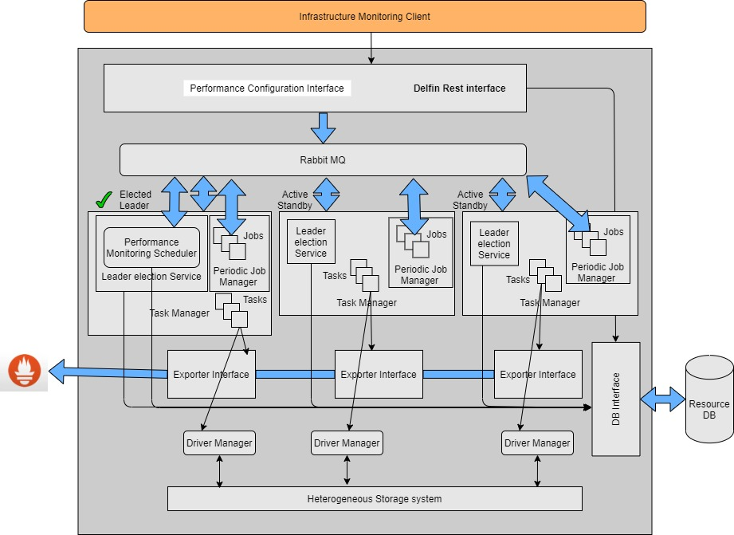
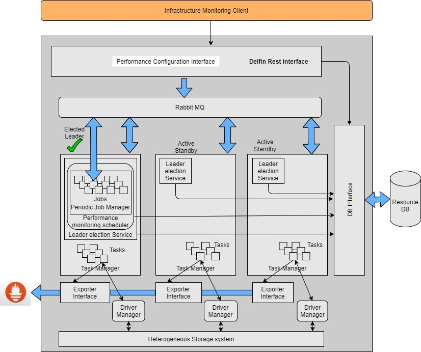
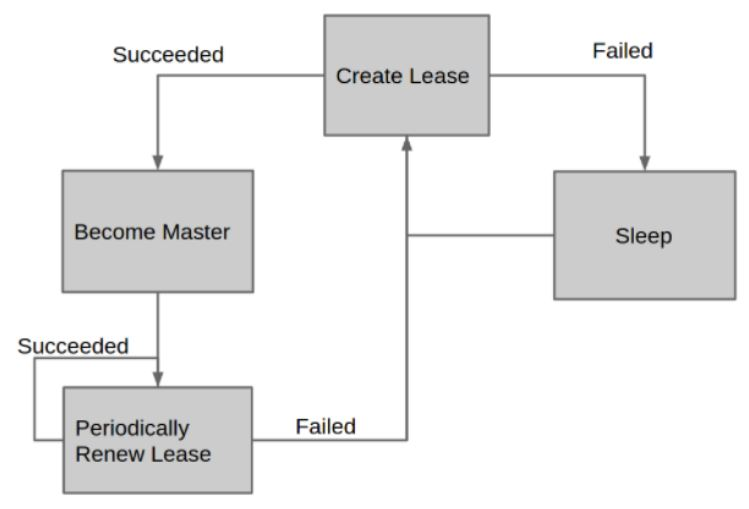
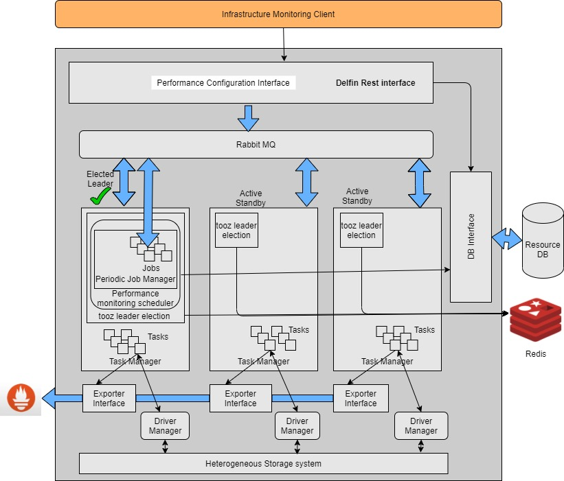
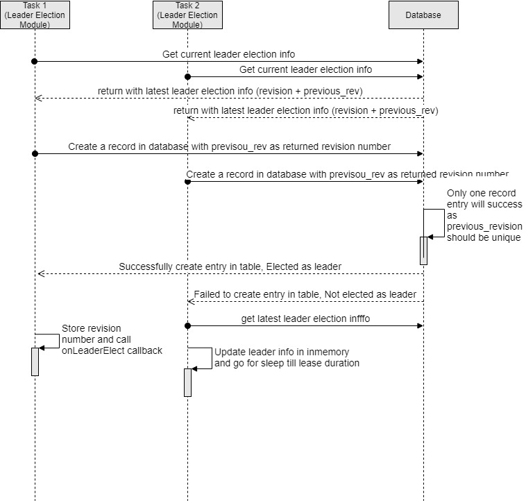
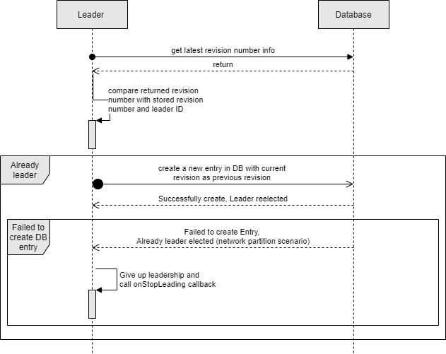
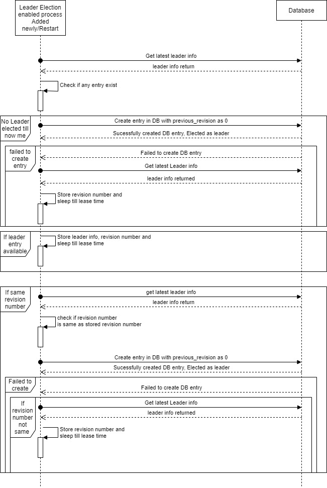

# Distributed performance metric collection Analysis and Design
 
Authors:
- Amit Roushan <amitroushan.cusat11@gmail.com> @AmitRoushan
 
 
# Objective
To enable delfin Performance metric collection for distributed system.
 
# Goals
- The document explains analysis and design of Distributed performance metric collection.
 
# Non-Goals
- Do not explain Metric monitoring configuration APIs
- Do not consider task/exporter/api process life cycle and high availability
- Do not consider API server RPC for performance monitoring
 
# Terminology
- Jobs: Timer triggered execution unit which initiate RPC call for metric collection
- Tasks: Metric collection and exporter unit in Performance metric collection framework 
- Task Manager: Process host RPC interface to perform defined tasks
- Performance monitoring Scheduler: Scheduler which scans DB or accept request from API to schedule a performance metric collection job
- Driver Manager: An interface to communicate with different storage system
- Exporter Interface:  An interface to send the collected metrics to configured datastore
- Leader Election Service: A service to ensure synchronization between all running entity by ensuring running only single entity for decision making
 
# Analysis
Currently the Performance metric collection framework scans registered performance collection information from the database and schedules a timer job to trigger metric collection for the storage system. The job initiates a RPC call to create tasks in The Task Manager processes. Created tasks further perform metric collection and forward to configured datastore. Each Performance metric collection module is deployed in each Task Manager process, hence each Task Manager process independently performs metric collection. 
 

 
With the current approach, There is no synchronization among Task Managers for configured metric collection jobs. Hence current implementation duplicates the monitoring task in each “Task” process.
 
To achieve metric collection job distribution, synchronization, optimal resource utilization and reliability of the monitoring system, a co-ordinated approach is required between Task Managers, 
Following are the key requirements for the approach
- Fault tolerance 
  
  Fault tolerance is the property that enables a system to continue operating properly in the event of the failure of (or one or more faults within) some of its components.
 
- Distributed metric collection 
  
  No user effort should be required in deciding where to execute a task or in initiating remote execution; a user should not even be aware of remote processing, except maybe better 3 performance. 
 
- Scalability
  
  System components can independently grow and shrink based on deployment constraints.
 
 
- Fair scheduling:
  
  The metric collection jobs need to get scheduled fairly across distributed task processes for optimal resource utilization.
 
Each performance monitoring request from the user internally creates a time ticked job which gets triggered in a configured time interval. The real problem is to schedule the timer job here to achieve key requirements.
 
Many research activities are being conducted to develop a good scheduling approach among a set of distributed hosts. The activities vary widely in a number of dimensions, e.g. support for heterogeneous resources, placement objective function(s), scalability, coscheduling methods, and assumptions about system configuration.
Considering the nature of job (parallel and independent), typically scheduler have two approach
 
## Distributed managed/scheduled Jobs
--------------------------------------------
 
- The approach needs a leader scheduler who assigns incoming monitoring request to the respective Task Manager process. 
- The Task Manager process manages the jobs in process and triggers a RPC call to Task manager in the configured time interval.
- RPC call initiate a execution unit which request metrics from respective storages through Driver Manager, request metrics are further pushed to configured datastore using Exporter Interface
 

 
 
### Analysis of Distributed managed/scheduled Jobs 
- Fault tolerance: 
 
    To achieve some node failure tolerance scenario, 
    - A book keeping of all scheduled jobs has to get maintained. The jobs need to get rescheduled in available task processes. 
    - Maintain health check of each nodes
    - Leader node failure scenario require leader election 
             
- Distributed metric collection:
 
  This is an inherent feature for the local scheduled job where incoming jobs are distributed among Task Manager processes and managed locally (inprocess).
 
- Scalability:
    
    As jobs are managed and maintained by respective local Task Manager processes, dynamic scalability takes a hit. The system needs to readjust locally scheduled jobs for each scale in or out
 
- Fair scheduling:
    
    With the approach, jobs are failed scheduled by the Performance metric collection scheduler across the Task Manager process.
 
Pros: 
 
- Performance monitoring scheduler is stateless. Hence It would be easy to restart the scheduler in the leader switch scenario.
 
Cons:
 
- A book keeping of all scheduled jobs has to get maintained.
- Maintain health check of each nodes  
- The system needs to readjust locally scheduled jobs for each scale in or out.
 
## Centrally managed/scheduled Jobs
------------------------------------
 
- The approach scheduler maintains a list of all requested performance monitoring jobs. 
- The jobs are managed and scheduled in the leader Task Manager process. 
- The jobs get triggered at a configured time interval from the leader Task Manager process and triggers a RPC call to Task manager in the configured time interval.
- RPC call initiate a execution unit which request metrics from respective storages through Driver Manager, request metrics are further pushed to configured datastore using Exporter Interface
 

 
 
### Analysis of centrally managed/scheduled Jobs
- Fault tolerance: 
    To achieve some node failure tolerance scenario, 
    - Leader node failure require reelection of leader
    - Need to ensure currently active metric collection retrigger for worker/leader node failure scenario
             
- Distributed metric collection:
    
    This is an inherent feature for the local scheduled job where incoming jobs are distributed among Task Manager processes and managed locally (inprocess).
 
- Scalability:
    As all worker nodes are stateless in nature, scaling is effortless.
 
- Fair scheduling:
    With the approach even though jobs are centrally managed but Metric collection tasks (heavy weight processing) are fairly scheduled across Task Manager processes.
 
Pros:
 
- It's easy to manage jobs as it is centrally managed.
- A metric collection task (heavy weight task) is distributed. It's easy to scale out or scale in.
- Task is always fairly scheduled.
- Job cleanup is easy 
 
Cons:
 
- It might take more time to make Performance scheduling up in the loader switch scenario.
 
 
## With the analysis, Its evident that
- One leader required to manage incoming jobs for both distributed or centrally managed job scheduling. Hence leader election algorithm is required to manage leader nodes across distributed Task Manager processes.
- Scaling is seamless in centrally managed job scheduler
- Fault tolerance is easier to manage in centrally managed schedulers.
- Task distribution is entact for both scheduling
- Performance of scheduled job and metric collection is one key factor. 
Need to evaluate both approaches.
 
 
## Leader election
-----------------------------
 
Leader election is the simple idea of giving one thing (a process, host, thread, object, or human) in a distributed system some special powers. Those special powers could include the ability to assign work, the ability to modify a piece of data, or even the responsibility of handling all requests in the system. 
It is a powerful tool for improving efficiency, reducing coordination, simplifying architectures, and reducing operations. 
 
There are many ways to elect a leader, ranging from 
 
- algorithms like 
    - Paxos
    - Raft
- Software like 
    - Apache ZooKeeper 
    - etcd
- custom hardware, 
- leases based leader election . Leases are the most widely used leader election mechanism. 
 
 
### Leased based leader election
 
Leases work by having a single database that stores the current leader. Then, the lease requires that the leader heartbeat periodically to show that it’s still the leader. If the existing leader fails to heartbeat after some time, other leader candidates can try to take over.
 

 
 
### Leader election with tooz (openstack) module
------------------------------------------------
The principal object provided by tooz is the coordinator. It allows you to use various features, such as group membership, leader election or distributed locking
 
Delfin already uses the tooz module for coordination and the tooz module defines leader election within the coordinated group. The tooz module for the leader election can be used in delfin.
 
Detail:
 
- Tooz offers a leader election with the coordinated group. 
- Each group can elect its own leader. 
- There can be only one leader at a time in a group.
- Only members that are running for the election can be elected. 
- As soon as one leader steps down or dies, a new member that was running for the election will be elected.
 

 
 
Pros:
- Development cycle will be fast 
- Tooz is already battle tested in production
 
Cons:
- Currently redis is used as a backing datastore for coordination in delfin. Need to ensure Radis reliability for the normal working of leader election with tooz.
- New feature addition for leader election might take time as tooz is open source and need to push the code in tooz repo.
 
 
 
### Custom leased based leader election
--------------------------------------
 
Leader election work as a framework which 
- Ensures a single leader in the distributed system by acquiring a distributed lock
- Invoke registered callbacks once elected as leader
- Reelect leader if leader fails to ensure its leadership 
 
#### Interfaces:
 
One need to implement following interface for lease based leader election implementation -
 
##### Lock interface:
 
Interface offers a common interface for locking on arbitrary resources used in leader election.  The Interface is used to hide the details on specific implementations in order to allow them to change over time.
 
```python
class LeaderElectionLockInterface {
    // Get returns the LeaderElectionRecord
    def get() (self, LeaderElectionRecord, []byte)
 
    // Create attempts to create a LeaderElectionRecord
    def create(self, LeaderElectionRecord)
 
    // Update will update and existing LeaderElectionRecord
    def update(self, LeaderElectionRecord) 
 
    // Identity will return the locks Identity
    def identity(self)
 
    // Describe is used to convert details on current resource lock
    // into a string
    def describe(self)
}
```
 
 
##### Callback Interface:
 
```python   
class LeaderCallbackInterface {
 
    // OnStartedLeading is called when elected as leader 
    def onStartedLeading()
 
    // OnStoppedLeading is called when Leader give up its leadership 
    def onStoppedLeading()
}
```
 
The framework ensure 
- Invoking the onStartLeading callback if elected as leader.
- Invoke the onStopLeading callback if leader give up its leadership
- Retry to be a leader if not leader
 
##### Leader election framework interface:
 
```python
class LeaderElection {
 
    // Run starts the leader election loop. Run will not return before the leader  election loop is stopped.
    // Run ensures either the service is elected as leader or keeps trying to be a leader.
    // In case a leader is elected, LeaderCallInterface is used to invoke respective callbacks.
 
    def run(LeaderCallbackInterface )
}
```
 
 
#### Implementation aspects in delfin
 
Leader interface defines a distributed locking system so that the leader is elected based on the acquired lock. For the delfin system, Database can be used for defining a distributed lock.
 
##### Data model for Lock interface
 
| revision(int64) | previous_revision(int64) | leader_id(string) | lease_time(int32) |
| --------------- | ------------------------ | ----------------- | ----------------- |
 
- revision: Primary key with auto increment. It serves as the value of each logical clock. 
- previous_revision: Value of observed previous revision. The value should be unique. 
    previous _revision ensure 
    - Distributed lock: The lock can only be granted if previous_revision is unique.
    - Freshness: The lock can only be granted if previous_revision number is one less than revision number.
- leader_id : leader_id is uniquely value for each leader getting elected
- lease_time : Duration in seconds for which a leader is elected
 
##### Leader election flow
 

 
##### Leader’s lease renew
 

 
##### New Leader election for scaleout/restart flow
 

 
## Impact of Leader election on Performance metric collection framework
-----------------------------------------------------------------------
 
Presently, Performance metric collection frameworks are triggered by calling “start” API call in task manager start flow. 
 
Following are the required changes with Leader Election:
- Each Task Manager process will host two service 
    - Task Manager
    - Leader election 
- Performance metric collection framework will be invoked/managed by Leader Election service i.e        Performance metric collection framework “start” call get registered with ```onStartedLeading``` callback of LeaderCallbackInterface interface.
- Performance metric collection framework needs to add cleanup functionality. The Cleanup call gets registered as ```onStoppedLeading``` of LeaderCallbackInterface.
- Need to update performance metric collection framework for jobs cleanup scenario
- Task manager hosting active standby leader down during metric collection
    - Performance metric collection jobs need to update with a configured number of retry for failed number of metric collection.
    - Also a configured delay need to initialize for retry interval
    - Add last successful metric collection time 
 
 

