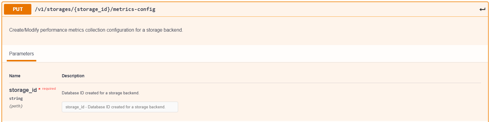
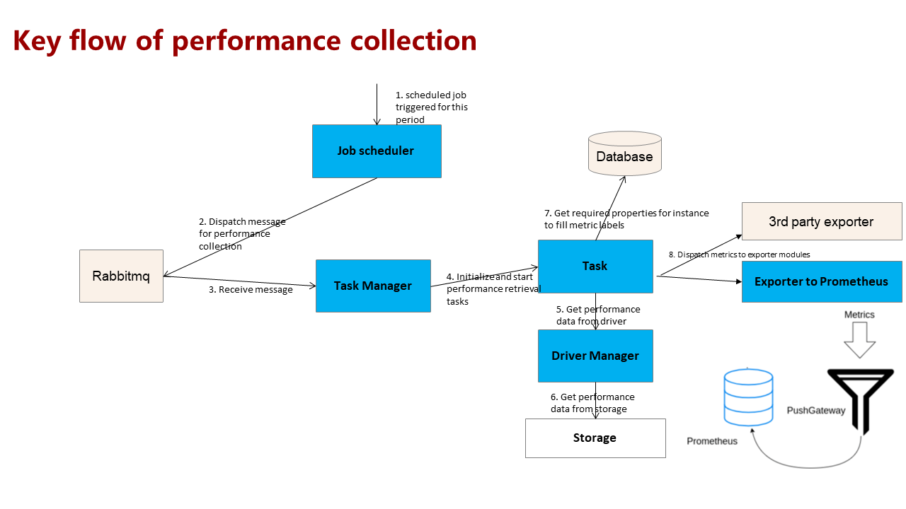


# Performance Monitoring in delfin- design document   

## Requirement analysis

1. User wants to register a device for performance collection
2. User wants to specify a resource  type and interval which he would like to poll
3. User wants to get device (storage) performance information
4. User wants to get other resource (storage-pool, volume, controller, port, disk, etc )performance information.
5. User wants to get performance information for a range , or historic performance:  example :  (real-time, user-defined time segment, and latest 4Hours/12Hours/1Day/1Week/1Month/1Year performance information).
6. User wants to trigger performance collection  of particular storage.
7. User wants to export real time collection data to existing monitoring system.
8. User wants query performance metrics through delfin APIs

## Architecture
Overall architecture spec of delfin is available  [here](./RequirementsDesignSpec.md).
Scope of architecture discussion in this design doc is limited to performance metrics collection and the modules involved for the same.

### Delfin REST interface
Performance configuration API:- This is the external REST interface to configure back ends for performance collection in Delfin.
Performance Query API :- This is the external interface to query the collected metrics. 

### Resource Manager
Act as the API server for all REST requests .
### Scheduler
Delfins internal task scheduler. Scheduler create tasks based on the task configuration set by user.

### Task Manager
Receives tasks from configured message bus, get  required parameter for the tasks from resource DB and invokes driver API for the tasks. Driver response will be verified and push to exporter interface.

### Exporter interface 
Interface to connect Exporters. 
### Prometheus Exporter
A default exporter available with delfin. This exporter convert delfin metric model to Prometheus metric model . Exporter provides a target endpoint for Prometheus. Exporter persist the delfin collected metrics till Prometheus scrape from this target.This exporter will be configured in prometheus to scrape. If user prefer monitoring system other than Prometheus, exporter for the same platform has to be integrated with delfin.
### Prometheus Query adapter
A default prometheus query adapter available with delfin. This module generate PromQL and adapt the Prometheus model to delfin metric model.
### Driver manager 
Act as interface between backend drivers and task manager. Provides a common interface for task manager to call driver functions.

### Architecture considerations
Based on the requirement, user can choose any of the below architecture for deployment of delfin for performance monitoring.

####  1. Delfin as complete monitoring system 


####  2. Delfin as a heterogeneous metrics collection framework for existing monitoring platforms. 


## Delfin metric model and persistence 
Delfin by default  use [Prometheus](https://prometheus.io/) to persist metric data unless user configured a thridparty TSDB. In case user use DB other than Prometheus, an exporter for the same has to be integrated with delfin .
delfin metric data model is inspired from [Prometheus data model](https://prometheus.io/docs/concepts/data_model/) to support time series data persistence .
### data model

| Property  | datatype  | Description                                                     |
|------------|-----------|-----------------------------------------------------------------|
| name       | string    |  Name of the indicator                                          |
| labels     | dict { }   | Any parameters required to distinguish this indicator uniquely as key value map|
| values      | dict {}     | time_stamp as key and metric value as value as a key value map                                         |

### example metric
```
name = read_throuhput
labels = {
			'storage_id': '0000123456789',
			'resource_type': 'port',
			'id': '12c2d52f-01bc-41f5-b73f-7abf6f38a340',
			'native_port_id': 'FF1:001',
			'native_controller_id': ' 'CTRL1',
			'type': 'RAW'
			'unit': 'IOPS'
			'value_type': 'GAUGE'
	}
values = {
    1594635195: 1094.28,
    1594636195: 1234.54
}

```
### Labels model
| | |
|-|-|
|**Resource**|**Required labels**|
|Array| **storage_id** = <storage_id> **resource_type** = array **id** = < delfin id of this resource> |
|Storage-Pool| **storage_id** = <storage_id> **resource_type** = storage_pool **id** = < delfin id of this resource> **native_storage_pool_id** = < associated storage_pool id in backend > **type**=enum **unit** = enum **value_type** = enum|
|Volume|**storage_id** = <storage_id> **resource_type** = volume **id** = < delfin id of this resource> **native_volume_id** = < id of this pool  in back_end> **native_storage_pool_id** = < associated storage_pool id in backend > **type**=enum **unit** = enum **value_type** = enum|

#### enums
| | |
|-|-|
|**Propperty**|**enum**|
|type|RAW,DERIVED,AGGREGATED|
|value_type|COUNTER, RATE, GUAGE,|
|unit|IOPS,MB/s,%,ms,KB,
## REST interface for configuring performance collection 



## Driver interfaces
```
collection_spec = {
'interval':900,
'is_historic':True,
'storage_id': '12c2d52f-01bc-41f5-b73f-7abf6f38a2a6'
}

```
```
keys = ['response_time', 'throughtput', 'bandwidth', 'read_throughtput', 'write_throughtput', 'read_bandwidth', 'write_bandwidth']
```
```
@abc.abstractmethod
def get_storage_perf_metrics(self, context, collection_spec, keys):
    """Get storage device performance metrics  
   Return array of metrics metrics[]"""
    pass

```


## Delfin unified Metrics and mapping with some backends
delfin metrics are unified metrics which are either  mapped to or derived from other platforms metrics . below table is a report from  analysis of different platforms
### Storage
<!DOCTYPE HTML PUBLIC "-//W3C//DTD HTML 4.0 Transitional//EN">

<html>


<body>
<table cellspacing="0" border="0">
	<colgroup width="365"></colgroup>
	<colgroup width="103"></colgroup>
	<colgroup width="169"></colgroup>
	<colgroup width="628"></colgroup>
	<colgroup width="226"></colgroup>
	<colgroup width="209"></colgroup>
	<colgroup width="161"></colgroup>
	<colgroup width="412"></colgroup>
	<colgroup width="169"></colgroup>
	<colgroup width="209"></colgroup>
	<colgroup width="80"></colgroup>
	<colgroup width="446"></colgroup>
	<colgroup span="3" width="87"></colgroup>
	<colgroup width="378"></colgroup>
	<tr>
		<td style="border-top: 1px solid #000000; border-bottom: 1px solid #000000; border-left: 1px solid #000000; border-right: 1px solid #000000" colspan=4 height="56" align="center" valign=middle><b><font face="Arial" color="#C0504D">delfin</font></b></td>
		<td style="border-top: 1px solid #000000; border-bottom: 1px solid #000000; border-left: 1px solid #000000; border-right: 1px solid #000000" colspan=4 align="center" valign=middle><font face="Arial">EMC VMAX</font></td>
		<td style="border-top: 1px solid #000000; border-bottom: 1px solid #000000; border-left: 1px solid #000000; border-right: 1px solid #000000" colspan=4 align="center" valign=middle><font face="Arial">OceanStor</font></td>
		<td style="border-top: 1px solid #000000; border-bottom: 1px solid #000000; border-left: 1px solid #000000; border-right: 1px solid #000000" colspan=4 align="center" valign=middle><font face="Arial">HP</font></td>
		</tr>
	<tr>
		<td style="border-bottom: 2px solid #000000; border-right: 2px solid #000000" height="56" align="left" valign=middle><b><font face="Times New Roman" size=2>Metrics</font></b></td>
		<td style="border-bottom: 2px solid #000000; border-right: 2px solid #000000" align="left" valign=middle><b><font face="Times New Roman" size=2>Unit</font></b></td>
		<td style="border-bottom: 2px solid #000000; border-right: 2px solid #000000" align="left" valign=middle><b><font face="Times New Roman" size=2>Type</font></b></td>
		<td style="border-bottom: 2px solid #000000; border-right: 2px solid #000000" align="left" valign=middle><b><font face="Times New Roman" size=2>Description/enum</font></b></td>
		<td style="border-top: 1px solid #000000; border-left: 1px solid #000000; border-right: 1px solid #000000" align="center" valign=middle><b><font face="Arial">Metrics</font></b></td>
		<td style="border-bottom: 2px solid #000000; border-left: 2px solid #000000; border-right: 2px solid #000000" align="left" valign=middle bgcolor="#FFFFFF"><b><font face="Times New Roman" size=2>Unit</font></b></td>
		<td style="border-top: 1px solid #000000; border-left: 1px solid #000000; border-right: 1px solid #000000" align="center" valign=middle><b><font face="Arial">Type</font></b></td>
		<td style="border-top: 1px solid #000000; border-left: 1px solid #000000; border-right: 1px solid #000000" align="center" valign=middle><b><font face="Arial">Description</font></b></td>
		<td style="border-top: 1px solid #000000; border-left: 1px solid #000000; border-right: 1px solid #000000" align="center" valign=middle><b><font face="Arial">Metrics</font></b></td>
		<td style="border-bottom: 2px solid #000000; border-left: 2px solid #000000; border-right: 2px solid #000000" align="left" valign=middle bgcolor="#FFFFFF"><b><font face="Times New Roman" size=2>Unit</font></b></td>
		<td style="border-top: 1px solid #000000; border-left: 1px solid #000000; border-right: 1px solid #000000" align="center" valign=middle><b><font face="Arial">Type</font></b></td>
		<td style="border-top: 1px solid #000000; border-left: 1px solid #000000; border-right: 1px solid #000000" align="center" valign=middle><b><font face="Arial">Description</font></b></td>
		<td style="border-top: 1px solid #000000; border-left: 1px solid #000000; border-right: 1px solid #000000" align="center" valign=middle><b><font face="Arial">Metrics</font></b></td>
		<td style="border-bottom: 2px solid #000000; border-left: 2px solid #000000; border-right: 2px solid #000000" align="left" valign=middle bgcolor="#FFFFFF"><b><font face="Times New Roman" size=2>Unit</font></b></td>
		<td style="border-top: 1px solid #000000; border-left: 1px solid #000000; border-right: 1px solid #000000" align="center" valign=middle><b><font face="Arial">Type</font></b></td>
		<td style="border-top: 1px solid #000000; border-left: 1px solid #000000; border-right: 1px solid #000000" align="center" valign=middle><b><font face="Arial">Description</font></b></td>
	</tr>
	<tr>
		<td style="border-bottom: 2px solid #000000; border-right: 2px solid #000000" height="91" align="left" valign=middle bgcolor="#F2DCDB"><b><font face="Times New Roman" size=2 color="#000000">response_time</font></b></td>
		<td style="border-bottom: 2px solid #000000; border-right: 2px solid #000000" align="left" valign=middle bgcolor="#F2DCDB"><b><font face="Times New Roman" size=2 color="#000000">ms</font></b></td>
		<td style="border-bottom: 2px solid #000000; border-right: 2px solid #000000" align="left" valign=middle bgcolor="#F2DCDB"><b><font face="Times New Roman" size=2 color="#000000">float</font></b></td>
		<td style="border-bottom: 2px solid #000000; border-right: 2px solid #000000" align="left" valign=middle bgcolor="#F2DCDB"><b><font face="Times New Roman" size=2 color="#000000">Average IO response time</font></b></td>
		<td style="border-bottom: 2px solid #000000; border-left: 2px solid #000000; border-right: 2px solid #000000" align="left" valign=middle><font face="Times New Roman" size=2>ReadResponseTime + Write ResponseTime</font></td>
		<td style="border-bottom: 2px solid #000000; border-left: 2px solid #000000; border-right: 2px solid #000000" align="left" valign=middle bgcolor="#FFFFFF"><font face="Times New Roman" size=2><br></font></td>
		<td style="border-bottom: 2px solid #000000; border-left: 2px solid #000000; border-right: 2px solid #000000" align="left" valign=middle><font face="Times New Roman" size=2>float</font></td>
		<td style="border-bottom: 2px solid #000000; border-left: 2px solid #000000; border-right: 2px solid #000000" align="left" valign=middle><font face="Times New Roman" size=2>Read and write avaible separately</font></td>
		<td style="border-bottom: 2px solid #000000; border-right: 2px solid #000000" align="left" valign=middle><font face="Times New Roman" size=2>Avg.<br>I/O<br>Respon<br>se<br>Time</font></td>
		<td style="border-bottom: 2px solid #000000; border-right: 2px solid #000000" align="left" valign=middle><font face="Times New Roman" size=2>ms</font></td>
		<td style="border-bottom: 2px solid #000000; border-right: 2px solid #000000" align="left" valign=middle><font face="Times New Roman" size=2>float</font></td>
		<td style="border-bottom: 2px solid #000000; border-left: 2px solid #000000; border-right: 2px solid #000000" align="left" valign=middle><font face="Times New Roman" size=2><br></font></td>
		<td style="border-bottom: 2px solid #000000; border-left: 2px solid #000000; border-right: 2px solid #000000" align="left" valign=middle><font face="Times New Roman" size=2><br></font></td>
		<td style="border-bottom: 2px solid #000000; border-left: 2px solid #000000; border-right: 2px solid #000000" align="left" valign=middle bgcolor="#FFFFFF"><font face="Times New Roman" size=2><br></font></td>
		<td style="border-bottom: 2px solid #000000; border-left: 2px solid #000000; border-right: 2px solid #000000" align="left" valign=middle><font face="Times New Roman" size=2><br></font></td>
		<td style="border-bottom: 2px solid #000000; border-left: 2px solid #000000; border-right: 2px solid #000000" align="left" valign=middle><font face="Times New Roman" size=2><br></font></td>
	</tr>
	<tr>
		<td style="border-bottom: 2px solid #000000; border-right: 2px solid #000000" height="37" align="left" valign=middle bgcolor="#F2DCDB"><b><font face="Times New Roman" size=2 color="#000000">throughtput</font></b></td>
		<td style="border-bottom: 2px solid #000000; border-right: 2px solid #000000" align="left" valign=middle bgcolor="#F2DCDB"><b><font face="Times New Roman" size=2 color="#000000">IOPS</font></b></td>
		<td style="border-bottom: 2px solid #000000; border-right: 2px solid #000000" align="left" valign=middle bgcolor="#F2DCDB"><b><font face="Times New Roman" size=2 color="#000000">float</font></b></td>
		<td style="border-bottom: 2px solid #000000; border-right: 2px solid #000000" align="left" valign=middle bgcolor="#F2DCDB"><b><font face="Times New Roman" size=2 color="#000000">total read and write throughput</font></b></td>
		<td align="left" valign=middle>HostIOs</td>
		<td style="border-bottom: 2px solid #000000; border-left: 2px solid #000000; border-right: 2px solid #000000" align="left" valign=middle bgcolor="#FFFFFF"><font face="Times New Roman" size=2>IOPS</font></td>
		<td style="border-bottom: 2px solid #000000; border-left: 2px solid #000000; border-right: 2px solid #000000" align="left" valign=middle><font face="Times New Roman" size=2>float</font></td>
		<td style="border-bottom: 2px solid #000000; border-left: 2px solid #000000; border-right: 2px solid #000000" align="left" valign=middle><font face="Times New Roman" size=2>Read and write avaible separately</font></td>
		<td style="border-bottom: 2px solid #000000; border-right: 2px solid #000000" align="left" valign=middle><font face="Times New Roman" size=2>Total<br>IOPS</font></td>
		<td style="border-bottom: 2px solid #000000; border-right: 2px solid #000000" align="left" valign=middle><font face="Times New Roman" size=2>IO/s</font></td>
		<td style="border-bottom: 2px solid #000000; border-right: 2px solid #000000" align="left" valign=middle><font face="Times New Roman" size=2>float</font></td>
		<td style="border-bottom: 2px solid #000000; border-left: 2px solid #000000; border-right: 2px solid #000000" align="left" valign=middle><font face="Times New Roman" size=2><br></font></td>
		<td style="border-bottom: 2px solid #000000; border-left: 2px solid #000000; border-right: 2px solid #000000" align="left" valign=middle><font face="Times New Roman" size=2>TotalIOs</font></td>
		<td style="border-bottom: 2px solid #000000; border-left: 2px solid #000000; border-right: 2px solid #000000" align="left" valign=middle bgcolor="#FFFFFF"><font face="Times New Roman" size=2><br></font></td>
		<td style="border-bottom: 2px solid #000000; border-left: 2px solid #000000; border-right: 2px solid #000000" align="left" valign=middle><font face="Times New Roman" size=2><br></font></td>
		<td style="border-bottom: 2px solid #000000; border-left: 2px solid #000000; border-right: 2px solid #000000" align="left" valign=middle><font face="Times New Roman" size=2><br></font></td>
	</tr>
	<tr>
		<td style="border-bottom: 2px solid #000000; border-right: 2px solid #000000" height="37" align="left" valign=middle bgcolor="#F2DCDB"><b><font face="Times New Roman" size=2 color="#000000">read_throughtput</font></b></td>
		<td style="border-bottom: 2px solid #000000; border-right: 2px solid #000000" align="left" valign=middle bgcolor="#F2DCDB"><b><font face="Times New Roman" size=2 color="#000000">IOPS</font></b></td>
		<td style="border-bottom: 2px solid #000000; border-right: 2px solid #000000" align="left" valign=middle bgcolor="#F2DCDB"><b><font face="Times New Roman" size=2 color="#000000">float</font></b></td>
		<td style="border-bottom: 2px solid #000000; border-right: 2px solid #000000" align="left" valign=middle bgcolor="#F2DCDB"><b><font face="Times New Roman" size=2 color="#000000">read throughput</font></b></td>
		<td align="left" valign=middle>HostReads</td>
		<td style="border-bottom: 2px solid #000000; border-left: 2px solid #000000; border-right: 2px solid #000000" align="left" valign=middle bgcolor="#FFFFFF"><font face="Times New Roman" size=2>IOPS</font></td>
		<td style="border-bottom: 2px solid #000000; border-left: 2px solid #000000; border-right: 2px solid #000000" align="left" valign=middle><font face="Times New Roman" size=2>float</font></td>
		<td style="border-bottom: 2px solid #000000; border-left: 2px solid #000000; border-right: 2px solid #000000" align="left" valign=middle><font face="Times New Roman" size=2><br></font></td>
		<td style="border-bottom: 2px solid #000000; border-right: 2px solid #000000" align="left" valign=middle><font face="Times New Roman" size=2>Read<br>IOPS</font></td>
		<td style="border-bottom: 2px solid #000000; border-right: 2px solid #000000" align="left" valign=middle><font face="Times New Roman" size=2>IO/s</font></td>
		<td style="border-bottom: 2px solid #000000; border-right: 2px solid #000000" align="left" valign=middle><font face="Times New Roman" size=2>float</font></td>
		<td style="border-bottom: 2px solid #000000; border-left: 2px solid #000000; border-right: 2px solid #000000" align="left" valign=middle><font face="Times New Roman" size=2><br></font></td>
		<td style="border-bottom: 2px solid #000000; border-left: 2px solid #000000; border-right: 2px solid #000000" align="left" valign=middle><font face="Times New Roman" size=2>ReadIOs</font></td>
		<td style="border-bottom: 2px solid #000000; border-left: 2px solid #000000; border-right: 2px solid #000000" align="left" valign=middle bgcolor="#FFFFFF"><font face="Times New Roman" size=2><br></font></td>
		<td style="border-bottom: 2px solid #000000; border-left: 2px solid #000000; border-right: 2px solid #000000" align="left" valign=middle><font face="Times New Roman" size=2><br></font></td>
		<td style="border-bottom: 2px solid #000000; border-left: 2px solid #000000; border-right: 2px solid #000000" align="left" valign=middle><font face="Times New Roman" size=2><br></font></td>
	</tr>
	<tr>
		<td style="border-bottom: 2px solid #000000; border-right: 2px solid #000000" height="37" align="left" valign=middle bgcolor="#F2DCDB"><b><font face="Times New Roman" size=2 color="#000000">write_throughput</font></b></td>
		<td style="border-bottom: 2px solid #000000; border-right: 2px solid #000000" align="left" valign=middle bgcolor="#F2DCDB"><b><font face="Times New Roman" size=2 color="#000000">IOPS</font></b></td>
		<td style="border-bottom: 2px solid #000000; border-right: 2px solid #000000" align="left" valign=middle bgcolor="#F2DCDB"><b><font face="Times New Roman" size=2 color="#000000">float</font></b></td>
		<td style="border-bottom: 2px solid #000000; border-right: 2px solid #000000" align="left" valign=middle bgcolor="#F2DCDB"><b><font face="Times New Roman" size=2 color="#000000">write throughput</font></b></td>
		<td align="left" valign=middle>HostWrites</td>
		<td style="border-bottom: 2px solid #000000; border-left: 2px solid #000000; border-right: 2px solid #000000" align="left" valign=middle bgcolor="#FFFFFF"><font face="Times New Roman" size=2>IOPS</font></td>
		<td style="border-bottom: 2px solid #000000; border-left: 2px solid #000000; border-right: 2px solid #000000" align="left" valign=middle><font face="Times New Roman" size=2>float</font></td>
		<td style="border-bottom: 2px solid #000000; border-left: 2px solid #000000; border-right: 2px solid #000000" align="left" valign=middle><font face="Times New Roman" size=2><br></font></td>
		<td style="border-bottom: 2px solid #000000; border-right: 2px solid #000000" align="left" valign=middle><font face="Times New Roman" size=2>Write<br>IOPS</font></td>
		<td style="border-bottom: 2px solid #000000; border-right: 2px solid #000000" align="left" valign=middle><font face="Times New Roman" size=2>IO/s</font></td>
		<td style="border-bottom: 2px solid #000000; border-right: 2px solid #000000" align="left" valign=middle><font face="Times New Roman" size=2>float</font></td>
		<td style="border-bottom: 2px solid #000000; border-left: 2px solid #000000; border-right: 2px solid #000000" align="left" valign=middle><font face="Times New Roman" size=2><br></font></td>
		<td style="border-bottom: 2px solid #000000; border-left: 2px solid #000000; border-right: 2px solid #000000" align="left" valign=middle><font face="Times New Roman" size=2>WriteIOs</font></td>
		<td style="border-bottom: 2px solid #000000; border-left: 2px solid #000000; border-right: 2px solid #000000" align="left" valign=middle bgcolor="#FFFFFF"><font face="Times New Roman" size=2><br></font></td>
		<td style="border-bottom: 2px solid #000000; border-left: 2px solid #000000; border-right: 2px solid #000000" align="left" valign=middle><font face="Times New Roman" size=2><br></font></td>
		<td style="border-bottom: 2px solid #000000; border-left: 2px solid #000000; border-right: 2px solid #000000" align="left" valign=middle><font face="Times New Roman" size=2><br></font></td>
	</tr>
	<tr>
		<td style="border-bottom: 2px solid #000000; border-right: 2px solid #000000" height="55" align="left" valign=middle bgcolor="#F2DCDB"><b><font face="Times New Roman" size=2 color="#000000">bandwidth</font></b></td>
		<td style="border-bottom: 2px solid #000000; border-right: 2px solid #000000" align="left" valign=middle bgcolor="#F2DCDB"><b><font face="Times New Roman" size=2 color="#000000">MB/s</font></b></td>
		<td style="border-bottom: 2px solid #000000; border-right: 2px solid #000000" align="left" valign=middle bgcolor="#F2DCDB"><b><font face="Times New Roman" size=2 color="#000000">float</font></b></td>
		<td style="border-bottom: 2px solid #000000; border-right: 2px solid #000000" align="left" valign=middle bgcolor="#F2DCDB"><b><font face="Times New Roman" size=2 color="#000000">total bandwidth</font></b></td>
		<td style="border-bottom: 2px solid #000000; border-left: 2px solid #000000; border-right: 2px solid #000000" align="left" valign=middle><font face="Times New Roman" size=2>HostMBReads, HostMBWRITES</font></td>
		<td style="border-bottom: 2px solid #000000; border-left: 2px solid #000000; border-right: 2px solid #000000" align="left" valign=middle bgcolor="#FFFFFF"><font face="Times New Roman" size=2>MB/s</font></td>
		<td style="border-bottom: 2px solid #000000; border-left: 2px solid #000000; border-right: 2px solid #000000" align="left" valign=middle><font face="Times New Roman" size=2>float</font></td>
		<td style="border-bottom: 2px solid #000000; border-left: 2px solid #000000; border-right: 2px solid #000000" align="left" valign=middle><font face="Times New Roman" size=2><br></font></td>
		<td style="border-bottom: 2px solid #000000; border-right: 2px solid #000000" align="left" valign=middle><font face="Times New Roman" size=2>Block<br>Bandwi<br>dth</font></td>
		<td style="border-bottom: 2px solid #000000; border-right: 2px solid #000000" align="left" valign=middle><font face="Times New Roman" size=2>MB/s</font></td>
		<td style="border-bottom: 2px solid #000000; border-right: 2px solid #000000" align="left" valign=middle><font face="Times New Roman" size=2>float</font></td>
		<td style="border-bottom: 2px solid #000000; border-left: 2px solid #000000; border-right: 2px solid #000000" align="left" valign=middle><font face="Times New Roman" size=2><br></font></td>
		<td style="border-bottom: 2px solid #000000; border-left: 2px solid #000000; border-right: 2px solid #000000" align="left" valign=middle><font face="Times New Roman" size=2><br></font></td>
		<td style="border-bottom: 2px solid #000000; border-left: 2px solid #000000; border-right: 2px solid #000000" align="left" valign=middle bgcolor="#FFFFFF"><font face="Times New Roman" size=2><br></font></td>
		<td style="border-bottom: 2px solid #000000; border-left: 2px solid #000000; border-right: 2px solid #000000" align="left" valign=middle><font face="Times New Roman" size=2><br></font></td>
		<td style="border-bottom: 2px solid #000000; border-left: 2px solid #000000; border-right: 2px solid #000000" align="left" valign=middle><font face="Times New Roman" size=2><br></font></td>
	</tr>
	<tr>
		<td style="border-bottom: 2px solid #000000; border-right: 2px solid #000000" height="55" align="left" valign=middle bgcolor="#F2DCDB"><b><font face="Times New Roman" size=2 color="#000000">read_bandwidth</font></b></td>
		<td style="border-bottom: 2px solid #000000; border-right: 2px solid #000000" align="left" valign=middle bgcolor="#F2DCDB"><b><font face="Times New Roman" size=2 color="#000000">MB/s</font></b></td>
		<td style="border-bottom: 2px solid #000000; border-right: 2px solid #000000" align="left" valign=middle bgcolor="#F2DCDB"><b><font face="Times New Roman" size=2 color="#000000">float</font></b></td>
		<td style="border-bottom: 2px solid #000000; border-right: 2px solid #000000" align="left" valign=middle bgcolor="#F2DCDB"><b><font face="Times New Roman" size=2 color="#000000">read bandwidth</font></b></td>
		<td style="border-bottom: 2px solid #000000; border-left: 2px solid #000000; border-right: 2px solid #000000" align="left" valign=middle><font face="Times New Roman" size=2>HostMBReads</font></td>
		<td style="border-bottom: 2px solid #000000; border-left: 2px solid #000000; border-right: 2px solid #000000" align="left" valign=middle bgcolor="#FFFFFF"><font face="Times New Roman" size=2>MB/s</font></td>
		<td style="border-bottom: 2px solid #000000; border-left: 2px solid #000000; border-right: 2px solid #000000" align="left" valign=middle><font face="Times New Roman" size=2>float</font></td>
		<td style="border-bottom: 2px solid #000000; border-left: 2px solid #000000; border-right: 2px solid #000000" align="left" valign=middle><font face="Times New Roman" size=2><br></font></td>
		<td style="border-bottom: 2px solid #000000; border-right: 2px solid #000000" align="left" valign=middle><font face="Times New Roman" size=2>Read<br>Bandwi<br>dth</font></td>
		<td style="border-bottom: 2px solid #000000; border-right: 2px solid #000000" align="left" valign=middle><font face="Times New Roman" size=2>MB/s</font></td>
		<td style="border-bottom: 2px solid #000000; border-right: 2px solid #000000" align="left" valign=middle><font face="Times New Roman" size=2>float</font></td>
		<td style="border-bottom: 2px solid #000000; border-left: 2px solid #000000; border-right: 2px solid #000000" align="left" valign=middle><font face="Times New Roman" size=2><br></font></td>
		<td style="border-bottom: 2px solid #000000; border-left: 2px solid #000000; border-right: 2px solid #000000" align="left" valign=middle><font face="Times New Roman" size=2><br></font></td>
		<td style="border-bottom: 2px solid #000000; border-left: 2px solid #000000; border-right: 2px solid #000000" align="left" valign=middle bgcolor="#FFFFFF"><font face="Times New Roman" size=2><br></font></td>
		<td style="border-bottom: 2px solid #000000; border-left: 2px solid #000000; border-right: 2px solid #000000" align="left" valign=middle><font face="Times New Roman" size=2><br></font></td>
		<td style="border-bottom: 2px solid #000000; border-left: 2px solid #000000; border-right: 2px solid #000000" align="left" valign=middle><font face="Times New Roman" size=2><br></font></td>
	</tr>
	<tr>
		<td style="border-bottom: 2px solid #000000; border-right: 2px solid #000000" height="55" align="left" valign=middle bgcolor="#F2DCDB"><b><font face="Times New Roman" size=2 color="#000000">write_bandwidth</font></b></td>
		<td style="border-bottom: 2px solid #000000; border-right: 2px solid #000000" align="left" valign=middle bgcolor="#F2DCDB"><b><font face="Times New Roman" size=2 color="#000000">MB/s</font></b></td>
		<td style="border-bottom: 2px solid #000000; border-right: 2px solid #000000" align="left" valign=middle bgcolor="#F2DCDB"><b><font face="Times New Roman" size=2 color="#000000">float</font></b></td>
		<td style="border-bottom: 2px solid #000000; border-right: 2px solid #000000" align="left" valign=middle bgcolor="#F2DCDB"><b><font face="Times New Roman" size=2 color="#000000">write bandwidth</font></b></td>
		<td style="border-bottom: 2px solid #000000; border-left: 2px solid #000000; border-right: 2px solid #000000" align="left" valign=middle><font face="Times New Roman" size=2>HostMBWrites</font></td>
		<td style="border-bottom: 2px solid #000000; border-left: 2px solid #000000; border-right: 2px solid #000000" align="left" valign=middle bgcolor="#FFFFFF"><font face="Times New Roman" size=2>MB/s</font></td>
		<td style="border-bottom: 2px solid #000000; border-left: 2px solid #000000; border-right: 2px solid #000000" align="left" valign=middle><font face="Times New Roman" size=2>float</font></td>
		<td style="border-bottom: 2px solid #000000; border-left: 2px solid #000000; border-right: 2px solid #000000" align="left" valign=middle><font face="Times New Roman" size=2><br></font></td>
		<td style="border-bottom: 2px solid #000000; border-right: 2px solid #000000" align="left" valign=middle><font face="Times New Roman" size=2>Write<br>Bandwi<br>dth</font></td>
		<td style="border-bottom: 2px solid #000000; border-right: 2px solid #000000" align="left" valign=middle><font face="Times New Roman" size=2>MB/s</font></td>
		<td style="border-bottom: 2px solid #000000; border-right: 2px solid #000000" align="left" valign=middle><font face="Times New Roman" size=2>float</font></td>
		<td style="border-bottom: 2px solid #000000; border-left: 2px solid #000000; border-right: 2px solid #000000" align="left" valign=middle><font face="Times New Roman" size=2><br></font></td>
		<td style="border-bottom: 2px solid #000000; border-left: 2px solid #000000; border-right: 2px solid #000000" align="left" valign=middle><font face="Times New Roman" size=2><br></font></td>
		<td style="border-bottom: 2px solid #000000; border-left: 2px solid #000000; border-right: 2px solid #000000" align="left" valign=middle bgcolor="#FFFFFF"><font face="Times New Roman" size=2><br></font></td>
		<td style="border-bottom: 2px solid #000000; border-left: 2px solid #000000; border-right: 2px solid #000000" align="left" valign=middle><font face="Times New Roman" size=2><br></font></td>
		<td style="border-bottom: 2px solid #000000; border-left: 2px solid #000000; border-right: 2px solid #000000" align="left" valign=middle><font face="Times New Roman" size=2><br></font></td>
	</tr>
</table>
<!-- ************************************************************************** -->
</body>

</html>


## Performance Collection Flow




## Performance Metric Query Flow
