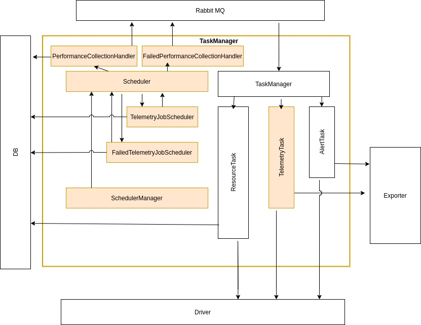
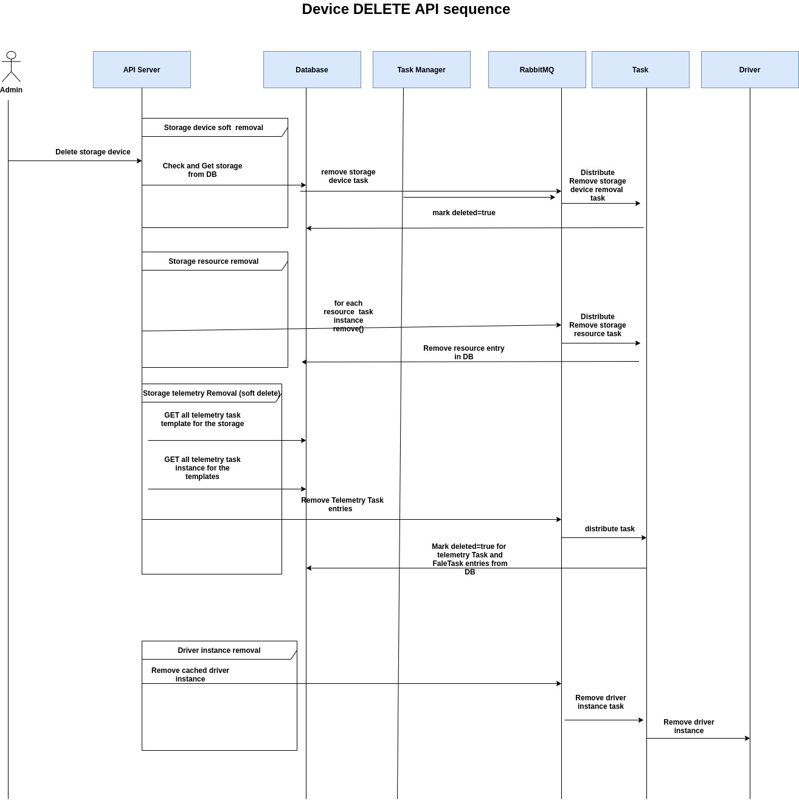


# Performance monitoring design document   

**Authors:** [Najmudheen CT](https://github.com/NajmudheenCT), [Liuyu ](https://github.com/ThisIsClark), [Xulin](https://github.com/wisererik),  [Sushantha Kumar](https://github.com/sushanthakumart), [Amit Roushan](https://github.com/AmitRoushan)


## Goal
Bring out the design considerations and enhancements to delfin framework for metrics collection from heterogeneous back ends
## Motivation and background
Performance metrics are the key indicators of storage devices, which every administrators would like to monitor, analyze and take decisions.
## Non-Goals
This doc covers only performance collection related design aspects and impacts to the framework, other use cases of delfin is not covered.
## Assumptions and Constraints
Performance collection is possible only if the storage is registered for resource collection in delfin. 

## Requirement analysis

### Input Requirements
1. Heterogeneous storage performance monitoring

#### Feature Requirements
1. Enable storage device for performance collection
2. Collect and push performance metrics periodically
3. Provide metric lists supported by driver

#### Requirement Analysis
Requirements are derived from existing SRM use cases and user inputs. 
Competitor analysis report : **Link to be updated**

#### List of Requirements
1. Registration of storage for performance collection
2. Schedule collection job for different resource level metrics.
3. Push collected metrics to delfin client 
4. Provide metric lists supported by driver.

##### Functional Requirements
1. Register a device for performance collection in delfin
2. Provide collection configuration ( resources and interval to poll)
3. Schedule collection job at every interval
4. Retry failed collection jobs
 
5. GET supported metrics list for each device and resources
6. Push collected data to exporters.
7. update/remove performance collection configurations.
8. Remove Performance collection tasks when storage is un-registered.


##### Non Functional Requirements
1. Fault of any task node should not impact collection tasks
2. After process restart, the tasks should be automatically scheduled.
3. Collection failures must be logged


## Architecture Analysis

### System Architecture
Overall system architecture of delfin is available [here](https://github.com/sodafoundation/design-specs/blob/master/specs/SIM/SODA_InfrastructureManagerDesign.md).
Scope of architecture discussion in this design doc is limited to task manager module enhancements, performance metrics collection interfaces, models and the modules involved for the same.

### Module Architecture



Highlighted blocks are the additions to task manager for task scheduling and task handling.

#### SchedulerManager

 A factory for creating periodic scheduling jobs. 
 Currently identified  periodic scheduler jobs  are TelemteryJobcheduler, FailedJobSheduler . 

#### TelemteryJobScheduler

Create scheduled jobs for Metrics collection and add to scheduler. Creation of the job is based on Task table in DB.
Scope of this scheduler are
* schedule job for each entries in task table
* update scheduled jobs when there is a change in task table
* remove schedule jobs for when some tasks are deleted.


#### TelemetryFailedJobScheduler

Create scheduled job for failed metric collections. Creation of the job is based on FailedTask table from DB.
Scope of this scheduler are
* schedule job for each failed tasks in FailedTask table
* remove schedule jobs for when some corresponding  tasks are deleted or retry limit exceeded.


#### Scheduler

A task scheduler library that runs in a thread inside task manager application. Periodic schedulers should use this to set periodic running jobs.

#### PerformanceCollectionHandler


Receives a call back from scheduler for performance collection task for a period and posts the tasks in message queue.  This module also updates the status of task in DB.

#### PerformanceCollectionHandler


Receives a call back from scheduler for failed-performance collection task retry and posts the tasks in message queue.  This module also updates the status of failed_task in DB.

#### TelemtryTask


Telemetry task  is the actual task executor which initiates the collect request to driver and pushes data to exporter.

### Architecture Tenets
**North-bound API** :- REST interface to delfin

**Exporter interface**:- Python class interfaces

**Driver interface**:- Python class interfaces

**Database** :- Any relation databse (sqllite3 by default)

**API server or Resource Manager** :- Process which serves the REST APIs

**Task manager**:- Process which prepares, schedule and update collection jobs.

**Driver**:- An Object which is part of other processes to connect and collect information’s from a back end.

**Exporter**:- An object which is part of task process to push data out.


### High Level Module Architecture
NA

## Detailed Design

### Use case View

#### List of Typical Use cases

- Register a device for performance collection , [Pre-condition : Device is already registered in delfin for resource collection
]

- Schedule collection jobs for newly registered devices .

- While starting/restarting delfin task process, schedule collection jobs for all devices registered.

- Retry collection tasks for all failed collection after a specified interval.

- Remove collection tasks of all succeeded and and retry limit exceeded jobs

- Remove collection tasks when a storage is un-registered from delfin


#### Usecase context model
NA

#### Interface Model


##### External Interfaces
 
###### North-bound REST interfaces

Performance collection related API spec analysis and design doc [here](https://github.com/sodafoundation/architecture-analysis/blob/c1ca8ad63ccd63b782e5adcd4020e784ee2471c5/arch-design/delfin/PerformanceMonitoringAPIs.md)

##### Internal Interfaces

###### Exporter interface 
Exporters need to Interface to push collected metrics through exporters.
```
    def dispatch(self, ctxt, data):
    # ctxt :- Delfin context object
    # data:- Metric data
```
 Metric model reference [here](#metric-model) 
 
Detailed exporter writing user guide [here](https://docs.sodafoundation.io/guides/developer-guides/delfin/exporter-developer-guide/) 

##### Driver interfaces

```python
def collect_perf_metrics(self, context, storage_id, resource_metrics, start_time,
                          end_time):
    """Collect  performance metrics
    storage_id : Defin Id of the storage
    resource_metrics: dictionary represents the collection configuration
        Example:
            
        resource_metrics = {'storage_pool': ['read_throughput', 'write_throughput', 'response_time'],
         'volume': ['read_throughput', 'write_throughput']}
    start_time: first time stamp to query in the range
    end_time : last time to query in the range
     """
```

#### End User Context
NA

### Functional Context

NA

### Non Functional Context

One design aspect considered for running multiple task managers for high availability and load balancing.
#### Design considerations for HA and load balancing

* Multiple task managers will scan the db independently and take decision of creating periodic jobs.


* Given task manager instance may be running periodic jobs as well as backend collection tasks on behalf of some interval. If this instance crashes, both periodic jobs and backend collection tasks will be impacted. 
 

* When one task manager starts, it can not take decision on which are the jobs are already running and which ones need to scheduled again.

Above challenges will be addressed by Designated scheduler approach. where
* One of the task manager should be designated as leader for scheduling the periodic jobs


* Leader election algorithm can be used by SchedulerHandler to decide the master.


* Implementation aspects to be explored further

Another Approach in discussion :- Sharing of periodic job creation among task managers , where

* Some mechanism can be used to designate each storage collection to one of the task managers


* Each task manager handles some portion of periodic job creation


* Details of the approach to be explored further


### Data View

#### Data and Control Data Contexts
NA

#### Data Model

##### Metric Model

| Property  | datatype  | Description                                                     |
|------------|-----------|-----------------------------------------------------------------|
| name       | string    |  Name of the indicator                                          |
| labels     | dict { }   | Any parameters required to distinguish this indicator uniquely as key value pairs|
| values      | dict {}     | time_stamp of metric  as key and value of metric  as value.                                        |

###### metric data example
```
name = read_throuhput
labels = {
			'storage_id': '0000123456789',
			'resource_type': 'port',
			'id': '12c2d52f-01bc-41f5-b73f-7abf6f38a340',
			'resource_id': 'FF1:001',
			'custom_propperty’:  'CTRL1',
			'type': 'RAW'
			'unit': 'IOPS'
			
	}
values = {
    1594635195: 1094.28,
    1594636195: 1234.54
}

```
###### Label guidelines and standards
Every metric will have storage_id, resource_type, unit,type and resource_id as mandatory labels along with other custom labels. This will help the client to uniquely identify the metric.

| | |
|-|-|
|**Resource**|**Required labels**|
|Device| **storage_id** = <storage_id> <br /> **id** = < delfin id> <br />  **resource_type** = device <br /> **resource_id** = < native device id> <br /> **unit** = enum <br /> **type** = enum |
|Storage-Pool| **storage_id** = <storage_id> <br /> **resource_type** = storage_pool <br /> **resource_id** = < native  id of this resource> <br />  **id** = < delfin id> <br />  **type**=enum <br />  **unit** = enum <br />  


###### Label field enums
| | |
|-|-|
|**Propperty**|**enum**|
|type|RAW,DERIVED,AGGREGATED|
|
|unit|IOPS,MB/s,%,ms,KB,

##### Database model

**Table Name : Task**

| Key Name        | Key Type | Description                                                                                                                                                                 | Example                                                                                                                                                                                                                                                                                                       |
| --------------- | -------- | --------------------------------------------------------------------------------------------------------------------------------------------------------------------------- | ------------------------------------------------------------------------------------------------------------------------------------------------------------------------------------------------------------------------------------------------------------------------------------------------------------- |
| id              | uuid     | Telemetry  ID.                                                                                                                                                              | 6cb62086-cec8-411c-9f70-16ff81cf9909                                                                                                                                                                                                                                                                          |
| storage\_id     | uuid     | Storage on which the telemetry needs to be executed                                                                                                                         | c31291c7-781a-47e2-a66f-112f0bc0ef27                                                                                                                                                                                                                                                                          |
| interval        | int      | Telemetry interval, in seconds.                                                                                                                                             | 300                                                                                                                                                                                                                                                                                                           |
| method          | string   | Method/Task Type to Be Executed                                                                                                                                             | delfin.Task.performance\_collect                                                                                                                                                                                                                                                                              |
| args            | dict     | Required parameters                                                                                                                                                         | {<br>"storage\_id": "c31291c7-781a-47e2-a66f-112f0bc0ef27",<br>"resource": {<br>"device": \["CPU usage","Bandwidth","Average I/O response time","IOPS"\],<br>"pool": \["IOPS","Average I/O response time","Bandwidth"\],<br>"lun": \["IOPS","Average I/O response time","Bandwidth","Utilization"\]<br>}<br>} |
| last\_run\_time | int      | Time when a telemetry task instance is created last time. The time is set to the current time initially. The time is updated each time a telemtry task instance is created. | 1611840278  |
| job_id | string      | id created for the job in the scheduler | 1611840278|


**Table name : FailedTask**

| Key Name      | Key Type                           | Description                                                                                                                                                                                                               | Example                                                                                                                                                                                                                                                                                                                                                                  |
| ------------- | ---------------------------------- | ------------------------------------------------------------------------------------------------------------------------------------------------------------------------------------------------------------------------- | ------------------------------------------------------------------------------------------------------------------------------------------------------------------------------------------------------------------------------------------------------------------------------------------------------------------------------------------------------------------------ |
| id            | uuid                               | Telemetry Task ID.                                                                                                                                                                                                        | 7cb25622-93dd-4712-acf2-f3ca79139f8b                                                                                                                                                                                                                                                                                                                                     |
| task\_id | uuid                               | telemetry template ID.                                                                                                                                                                                                    | 6cb62086-cec8-411c-9f70-16ff81cf9909                                                                                                                                                                                                                                                                                                                                     |
| launch\_time  | int                                | telemetry Task execution start time.                                                                                                                                                                                      | 1611840278                                                                                                                                                                                                                                                                                                                                                               |
| storage\_id   | uuid                               | Storage on which the telemetry task needs to be executed                                                                                                                                                                  | c31291c7-781a-47e2-a66f-112f0bc0ef27                                                                                                                                                                                                                                                                                                                                     |
| method        | string                             | Method/Task Type to Be Executed                                                                                                                                                                                           | delfin.Task.performance\_collect                                                                                                                                                                                                                                                                                                                                         |
| args          | dict                               | Required parameters                                                                                                                                                                                                       | {<br>"storage\_id": "c31291c7-781a-47e2-a66f-112f0bc0ef27",<br>"resource": {<br>"device": \["CPU usage","Bandwidth","Average I/O response time","IOPS"\],<br>"pool": \["IOPS","Average I/O response time","Bandwidth"\],<br>"lun": \["IOPS","Average I/O response time","Bandwidth","Utilization"\]<br>},<br>"start\_time": 1611840276,<br>"end\_time": 1611840384,<br>} |
| result        | "succeed"<br>"failed"<br>"running" | Task execution status<br>The task is set to the running state when the task starts.<br>After a task is successfully executed, the task is in the succeeded state.<br>The task status is changed to failed after it fails. | null                                                                                                                                                                                                                                                                                                                                                                     |
| retry\_count  | int                                | Number of retries executed                                                                                                                                                                                                | 0                                                                                                                                                                                                                                                                                                                                                                        |
| job_id | string      | id created for the job in the scheduler | 1611840278|


##### Metric lists
List of unified metrics in delfin can be found [here](https://github.com/sodafoundation/architecture-analysis/blob/4200e725960768ad02be246c700d3e124965f64b/arch-design/delfin/Delfin_Metric_List.md)
### Development and Deployment Context

#### Code

NA

#### Debug Model

NA

  
#### Build & Package

NA

#### Deployment

NA

  
### Execution View

NA


## Sequence diagrams

### Scheduler initialization during task manager start


### Register storage for performance collection


### Performance collection lifecycle


### Failed telemetry job handler


### Performance collection during failed job execution


### Device removal



## Design Alternatives and other notes

NA

## Open Issues

NA

## Design Requirements / Tasks

NA


## Scratchpad


