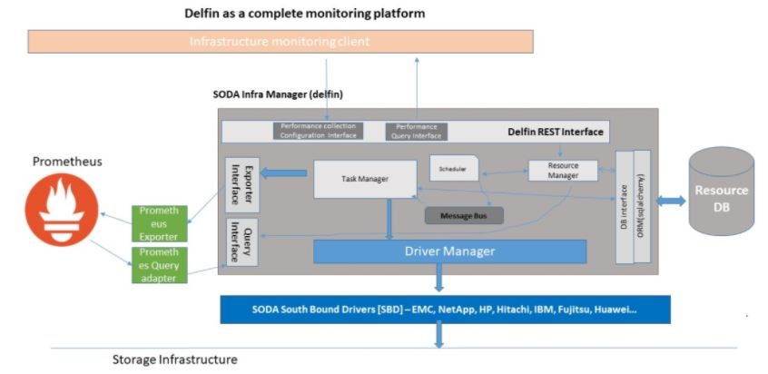

# Performance monitoring APIs document

## Goal
The document is aimed to target northbound APIs required by delfin framework for
- Retrieve supported metrics for specified storage
- Configure delfin framework for metrics collection


## Motivation and background
Performance metrics are the key indicators of storage devices, which every administrators would like to monitor, analyse and take decisions.

# High level Architecture


Performance APIs enable users to 
- Get supported resource metrics for a device
- Register a device for performance collection
- Enable user to start/stop performance collection
- Query performance metrics through delfin APIs

## Non-Goals
- Define database model for API
- Design and framework changes for monitoring APIs
- Define Drivers interfaces for performance monitoring
- Query performance metric through delfin APIs

## Performance Monitoring APIs
Performance monitoring APIs enable users to request a delfin system to collect metrics. Collected metrics are pushed to the configured exporter which further stores it in respective datastore. 
Storage systems typically maintain multiple resources and each resource supports different metrics. The challenge is to define an API to present the resource and respective metrics as a resource object which is flexible enough to present diversity in the system.
Currently the document propose two APIs which 
- Get the supported resource metrics for respective storage system
- An API to configure metrics collection from supported resource metrics

### Expose storage features set
Delfin supports different drivers for respective storage systems. Each driver is actually a representative of a storage system. Hence the driver knows all supported features (specific to Metric collection, Alarm support or device management) of a storage system. The driver needs to register its capabilities to delfin (storing drivers feature is implementation specific). 
The API exposes supported features by the driver. Also the API is a way to know the driver getting used for a storage system including name, version and model.

```
GET   /v1/storages/{id}/capability
```
  
  #### Parameters
  | Name | Description|
  |------|------------|
  | id (in path)    | Unique Storage UUID |
  
  #### API Specifications
  - 200:
    
    Returns storage capabilities
    - Responses:
        <details>
        <summary>Schema :</summary>
        
        ```yaml
        StorageSpecResponse:
          type: object
          required:
            - metadata
            - spec
          properties:
            metadata:
              type: object
              properties:
                name:
                  type: string
                  description: Name of the supported storage (driver)
                uid:
                  type: string
                  format: uuid
                vendor:
                  type: string
                  description: vendor name
            spec:
              type: object
              required:
                - is_historic
              properties:
                is_historic:
                  type: boolean
                  description: Set true during storage driver registration if driver support fetching historic metrics. This enable internal performance framework to either call driver interface to pull real time metrics or historic time series metrics
                resourceMetrics:
                  type: object
                  description: Map of resources and supported metrics of respective resources for storage (driver)
                  additionalProperties:
                    type: array
                    items: 
                      type: object
                      description: list of metrics with supported Units and its description
                      properties:
                        unit:
                          type: string
                          description: supported metric unit
                        description:
                          type: string
                          description: storage specific desctiption for respective metric
        ```
        </details>  
    
        <details>
        <summary>Example :</summary>
    
        ```json
        {
        "metadata": {
            "name": "VMAX250F",
            "uid": "3fa85f64-5717-4562-b3fc-2c963f66afa6",
            "vendor": "Dell EMC"
            },
        "spec": {
            "is_historic": true,
            "resourceMetrics": {
                "StoragePool": [
                  {
                    "throughput": {
                      "unit": "MB/s",
                      "description": "Represents how much data is successfully transferred in MB/s"
                    }
                  },
                  {
                    "readThroughput": {
                      "unit": "MB/s",
                      "description": "Represents how much data read is successfully transferred in MB/s"
                    }
                  },
                ]
            }
          }
        }
        ```
        </details>

  - 400:
    Storage ID not valid


### Configure performance monitoring :
Enable users to configure Performance monitoring task in the delfin system.
Following are different features of the API:
- Users can choose to start/stop a performance monitoring task with the “status” attribute.
- Users can choose to provide different resources and its metrics for the performance monitoring.
- Users can chose polling interval for the configured performance monitoring
- Users can also configure custom labels which gets added in each collected metrics
- If resource metrics not specified, Default behavior is to collect all supported metric for the storage
```
POST   /v1/storages/{storage-id}/telemetry
```

  #### Parameters
  | Name | Description|
  |------|------------|
  | id (in path)    | Unique Storage UUID |

  #### API Specifications
  - 201:
   
    Successfully configured metric collection.
   
    - Request Body:
      <details>
        <summary>Schema :</summary>

        ```yaml
        TelemetryRegistrationReq:
          type: object
          required:
            - metadata
            - spec
          properties:
            metadata:
              type: object
              properties:
                name:
                  type: string
                  description: user defined telemetry name 
                    The name is unique in specific storage domain
            spec:
              type: object
              required:
                - interval
                - enable
              properties:
                interval:
                  type: integer
                  description: metric collection frequency in seconds
                  minimum: 300
                enable:
                  type: boolean
                  enum: [False, True]
                resourceMetrics:
                  type: object
                  description: Map of resources and supported metrics of respective resources for storage (driver)
                  additionalProperties:
                    type: array
                    items: 
                      type: string
                customLabels:
                  type: object
                  description: User defined labels.
                    The labels get added in each collected metric.
                  additionalProperties:
                    type: string
        ```
        </details>  

        <details>
        <summary>Example :</summary>

        ```json
         {
            "metadata": {
              "name": "VMAX-Telemetry"
            },
            "spec": {
              "interval": 900,
              "enable": false,
              "resourceMetrics": {
                "pool": [
                "Capacity",
                "IO",
                "Data"
                ]
            },
            "customLabels": {
                "key1": "value1",
                "key2": "value2"
              }
            }
         }
        ```
        </details>  

    - Response Body:
      <details>
        <summary>Schema :</summary>

        ```yaml
        TelemetryRegistrationRes:
          type: object
          required:
            - metadata
            - spec
          properties:
            metadata:
              type: object
              properties:
                name:
                  type: string
                  description: user defined telemetry name 
                    The name is unique in specific storage domain
            spec:
              type: object
              required:
                - interval
                - enable
              properties:
                interval:
                  type: integer
                  description: metric collection frequency in seconds
                  minimum: 300
                enable:
                  type: boolean
                  enum: [False, True]
                resourceMetrics:
                  type: object
                  description: Map of resources and supported metrics of respective resources for storage (driver)
                  additionalProperties:
                    type: array
                    items: 
                      type: string
                customLabels:
                  type: object
                  description: User defined labels.
                    The labels get added in each collected metric.
                  additionalProperties:
                    type: string
            status:
              type: object
              description: Telemetry Status represents different status for registered metric collection request
              additionalProperties:
                type: array
                items: 
                  type: object
        ```
        </details>  

        <details>
        <summary>Example :</summary>

        ```json
         {
            "metadata": {
              "name": "VMAX-Telemetry"
            },
            "spec": {
              "interval": 900,
              "enable": false,
              "resourceMetrics": {
                "pool": [
                "Capacity",
                "IO",
                "Data"
                ]
            },
            "customLabels": {
                "key1": "value1",
                "key2": "value2"
              }
            },
            "status": {
              "lastPoolStatus": "Success",
              "lastPollTime": 1613006342
            }
         }
        ```
        </details>
  
  - 400:
    invalid request body or invalid storage id
    
### Patch performance monitoring:
Enable users to patch Performance monitoring task in the delfin system.
Following are different feature of the API:
- Users can choose to start/stop a performance monitoring task with the “status” attribute.
- Users can choose to add/replace/modify different resources and its metrics for the performance monitoring.
- Users can update polling interval for the configured performance monitoring

```
PATCH   /v1/storages/{storage-id}/telemetry/(telemetry-name}
```
  #### Parameters
  | Name | Description|
  |------|------------|
  | id (in path)    | Unique Storage UUID |
  |telemetry-name (in path)| Unique telemetry name in storage space |

  #### API Specifications
  - 202:
    
    Successfully updated performance monitoring
      - Request Body:
        <details>
          <summary>Schema :</summary>

          ```yaml
          TelemetryPatchSpec:
            type: array
            items:
              properties:
                op:
                  type: string
                  description: operation to be performed [add, remove, replace]
                path:
                  type: string
                  description: attribute path in telemetry spec
                value:
                  type: object
                  description: value of the operation on the specified path
          ```
          </details>  

          <details>
          <summary>Example :</summary>

          ```json
           [
             {
               "op": "replace",
               "path": "/spec/enable",
               "value": true
             }
           ]
          ```
          </details>  

      - Response Body:
        <details>
          <summary>Schema :</summary>

          ```yaml
          TelemetryRegistrationRes:
            type: object
            required:
              - metadata
              - spec
            properties:
              metadata:
                type: object
                properties:
                  name:
                    type: string
                    description: user defined telemetry name 
                      The name is unique in specific storage domain
              spec:
                type: object
                required:
                  - interval
                  - enable
                properties:
                  interval:
                    type: integer
                    description: metric collection frequency in seconds
                    minimum: 300
                  enable:
                    type: boolean
                    enum: [False, True]
                  resourceMetrics:
                    type: object
                    description: Map of resources and supported metrics of respective resources for storage (driver)
                    additionalProperties:
                      type: array
                      items: 
                        type: string
                  customLabels:
                    type: object
                    description: User defined labels.
                      The labels get added in each collected metric.
                    additionalProperties:
                      type: string
              status:
                type: object
                description: Telemetry Status represents different status for registered metric collection request
                additionalProperties:
                  type: array
                  items: 
                    type: object
          ```
          </details>  

          <details>
          <summary>Example :</summary>

          ```json
           {
              "metadata": {
                "name": "VMAX-Telemetry"
              },
              "spec": {
                "interval": 900,
                "enable": true,
                "resourceMetrics": {
                  "pool": [
                  "Capacity",
                  "IO",
                  "Data"
                  ]
              },
              "customLabels": {
                  "key1": "value1",
                  "key2": "value2"
                }
              },
              "status": {
                "lastPoolStatus": "Success",
                "lastPollTime": 1613006342
              }
           }
          ```
          </details>
      
  - 400:
    
    invalid request body or invalid storage id

### Remove performance monitoring
   Stop and remove performance monitoring from delfin for specified telemetry
   
```
DELETE  /v1/storages/{storage-id}/telemetry/(telemetry-name}
```
  #### Parameters
  | Name | Description|
  |------|------------|
  | id (in path)    | Unique Storage UUID |
  |telemetry-name (in path)| Unique telemetry name in storage space |

  #### API Specifications
  
  - 202:
    
    Successfully accepted to stop and remove performance monitoring

      - Response Body:
        <details>
          <summary>Schema :</summary>

          ```yaml
          TelemetryRegistrationRes:
            type: object
            required:
              - metadata
              - spec
            properties:
              metadata:
                type: object
                properties:
                  name:
                    type: string
                    description: user defined telemetry name 
                      The name is unique in specific storage domain
              spec:
                type: object
                required:
                  - interval
                  - enable
                properties:
                  interval:
                    type: integer
                    description: metric collection frequency in seconds
                    minimum: 300
                  enable:
                    type: boolean
                    enum: [False, True]
                  resourceMetrics:
                    type: object
                    description: Map of resources and supported metrics of respective resources for storage (driver)
                    additionalProperties:
                      type: array
                      items: 
                        type: string
                  customLabels:
                    type: object
                    description: User defined labels.
                      The labels get added in each collected metric.
                    additionalProperties:
                      type: string
              status:
                type: object
                description: Telemetry Status represents different status for registered metric collection request
                additionalProperties:
                  type: array
                  items: 
                    type: object
          ```
          </details>  

          <details>
          <summary>Example :</summary>

          ```json
           {
              "metadata": {
                "name": "VMAX-Telemetry"
              },
              "spec": {
                "interval": 900,
                "enable": false,
                "resourceMetrics": {
                  "pool": [
                  "Capacity",
                  "IO",
                  "Data"
                  ]
              },
              "customLabels": {
                  "key1": "value1",
                  "key2": "value2"
                }
              },
              "status": {
                "lastPoolStatus": "Success",
                "lastPollTime": 1613006342
              }
           }
          ```
          </details>
        
  - 400:

    Storage ID not available or telemetry name not available

### Get performance monitoring information
Retrieve current specification+status of configured performance monitoring

```
GET /v1/storages/{storage-id}/telemetry/(telemetry-name}
```
  #### Parameters
  | Name | Description|
  |------|------------|
  | id (in path)    | Unique Storage UUID |
  |telemetry-name (in path)| Unique telemetry name in storage space |

  #### API Specifications
  
  - 200:
    
    Return current configuration and status of requested telemetry

      - Response Body:
        <details>
          <summary>Schema :</summary>

          ```yaml
          TelemetryRegistrationRes:
            type: object
            required:
              - metadata
              - spec
            properties:
              metadata:
                type: object
                properties:
                  name:
                    type: string
                    description: user defined telemetry name 
                      The name is unique in specific storage domain
              spec:
                type: object
                required:
                  - interval
                  - enable
                properties:
                  interval:
                    type: integer
                    description: metric collection frequency in seconds
                    minimum: 300
                  enable:
                    type: boolean
                    enum: [False, True]
                  resourceMetrics:
                    type: object
                    description: Map of resources and supported metrics of respective resources for storage (driver)
                    additionalProperties:
                      type: array
                      items: 
                        type: string
                  customLabels:
                    type: object
                    description: User defined labels.
                      The labels get added in each collected metric.
                    additionalProperties:
                      type: string
              status:
                type: object
                description: Telemetry Status represents different status for registered metric collection request
                additionalProperties:
                  type: array
                  items: 
                    type: object
          ```
          </details>  

          <details>
          <summary>Example :</summary>

          ```json
           {
              "metadata": {
                "name": "VMAX-Telemetry"
              },
              "spec": {
                "interval": 900,
                "enable": false,
                "resourceMetrics": {
                  "pool": [
                  "Capacity",
                  "IO",
                  "Data"
                  ]
              },
              "customLabels": {
                  "key1": "value1",
                  "key2": "value2"
                }
              },
              "status": {
                "lastPoolStatus": "Success",
                "lastPollTime": 1613006342
              }
           }
          ```
          </details>

  - 400:
    
    Storage ID not available or telemetry name not available  