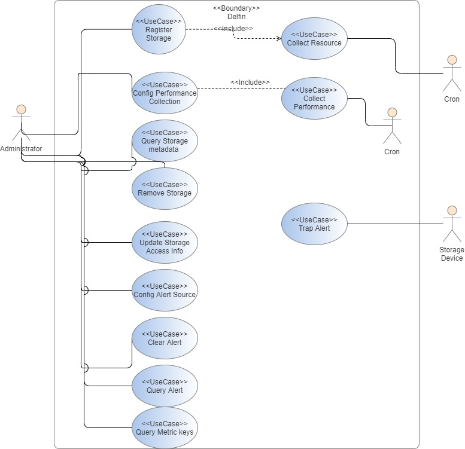
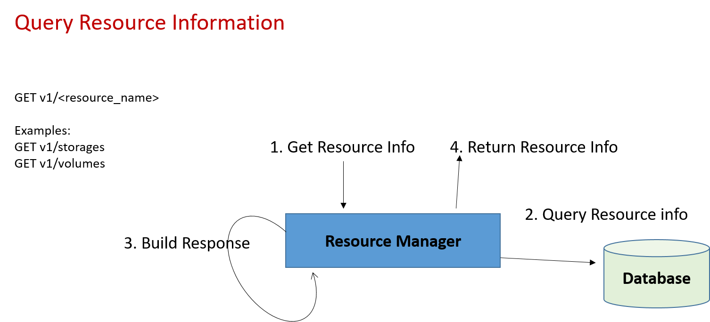
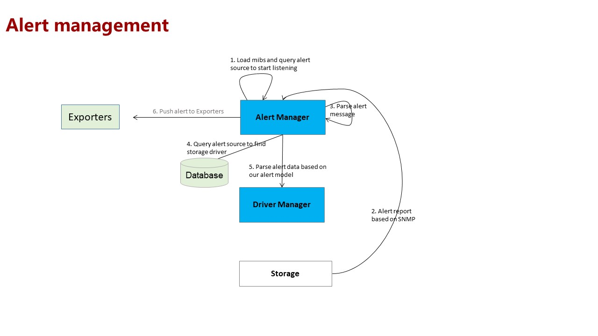


# Delfin (SODA Infrastructure Manager) Requirements & Design
**Authors:** [Najmudheen CT](https://github.com/NajmudheenCT), [Sanil Kumar D](https://github.com/skdwriting), [Xulin](https://github.com/wisererik),  [Ashit Kumar](https://github.com/kumarashit)

This documentation serves as the design spec for SODA Infrastructure Management project Delfin. Delfin is a basic solution for managing heterogeneous storage systems. It uses the standard API model to centrally manage heterogeneous storage systems from different vendors and can be used as a basic framework for other SRM platforms to collect and manage storage metadata. In addition, open southbound standards are provided to help developers quickly develop and access storage product.
## Goal
This document focuses on overall requirement analysis and design of heterogeneous storage monitoring requirements

## Non-Goals

* Storage provisioning 
* Deployment architecture

## Assumptions and Constraints
1. All requirements, models and interfaces discuss here are heterogeneous, not specific to a vendor model.
2. Individual modules and use cases are discussed in different documents and the same will be linked here.

## Motivation and background
Today’s IT infrastructure spans across multi vendor devices and technologies. Administration of heterogeneous platforms is a challenge to storage admins.  Vendor supplied management software is either vendor locked in or not open source.  SODA foundation has vision to standardize and bring heterogeneous device management using a single platform.

## Requirement Analysis

### Input Requirements
1. Storage infrastructure devices and resources monitoring
2. Performance metrics monitoring
3. Alert reporting

### Feature Requirements
**Storage Device Monitoring** 

- Registering a storage device for monitoring

- Updating a storage device access information

- Removing a storage device from monitoring

- Provide storage devices  attributes

- Synchronize storage devices  information periodically and on user request

 

**Storage Resources Monitoring**

- Provide storage resources attributes such as pool, LUN, port, etc Details.

- Synchronize storage resources  attributes periodically and on user request

**Performance Monitoring**

- Register storage for performance monitoring
- Report key performance indicators periodically 

**Alert Monitoring** 

- Real time reporting of events/alerts.

- Pull alerts from back end on user request.

- Clear Alert on user request.

#### Requirement Analysis
Analyzed various Open Source and Enterprise monitoring solutions.

Conclusion:-
There is no open source framework for addressing all requirements in one platform.

#### List of Requirements
##### Functional Requirements
* Registering a storage device
* Removing a storage device
* Get registered storage device list
* Updating storage device access information
* Querying storage device details
* Querying other resource  Information like (LUN,Pool,Disk, etc)
* Provide performance metrics of different resources
* Sync all registered  device collection
* Sync particular  device  collection
* Register alert source to receive alerts
* Report alerts
* Clear alert

##### Non Functional Requirements
**Performance requirements**

NA

**Security requirements**
1. Support secured access to delfin APIS
2. Support secured access to back-ends

**Other non functional requirements (scalability  , HA etc…)**
NA

## Architecture Analysis
### System Architecture

### Module Architecture

NA

### Architecture Tenets
**North-bound API** :- REST interface to delfin

**Exporter interface**:- Python class interfaces to push information out of delfin. 

**Driver interface**:- Python class interfaces to be implemented by driver to collect information's from back end. 

**Database** :- Any relational database.

**API server or Resource Manager** :- Process which serves the REST APIs

**Task manager**:- Process which prepares, schedule and update collection jobs.

**Driver**:- An Object which is part of other processes to connect and collect information’s from a back end.

**Exporter**:- An object which is part of task process to push data out.

### High Level Module Architecture

Task manager module architecture [here](https://github.com/sodafoundation/architecture-analysis/blob/43d1020021e12b6e0dc1833f05d4159623c0ac6e/SIM/RetrievalManagement.md)

Alert Manager module architecture [here](https://github.com/sodafoundation/architecture-analysis/blob/8549aa6ca5bf7296dedbba7b62ef63e0550a83f2/specs/SIM/alert_manager/SODA_AlertManagerDesign.md) 

Driver Manager module architecture [here](https://github.com/sodafoundation/architecture-analysis/blob/694d4aa31dd4577aca5a67668b96f615c4f34be9/specs/SIM/DriverManager/DriverManager.md) 

## Detailed Design

### Use case View

#### List of Typical Use-cases

1. **Adding Storage Devices for monitoring**

    User call APIS by specifying  device access information such as EMC VMax, Hitachi Virtual Storage Platform, or HP 3PAR etc..
    
    Access modes are.

- REST access: You need to enter the IP address, port number, user name, and password. 
- SSH access: you need to provide  the IP address, port number, user name, and password. 
- CLI : Local management CLI access information like host name, port, user name, password
user must set one of the access information type.
- SMI-S : You need to provide SMI provider credentials.

2. **Querying Storage Device Details**

    User initiate GET REST call to list the resources( device, pool, LUN, etc)  to get details of resource such as name, id, capacity, etc..
    
3. **Updating a Storage Device access information**

    User calls REST API to update/modify access information of a already registered storage device by providing authentication information, including the device IP address, port number, user name, and password.

4. **Synchronizing Storage Devices**

    User  Invoke the  API to obtain the latest storage data, including basic information, storage pool information, volume information, and alarm information etc..
    
5. **Removing/Unregistering a Storage Device from Monitoring**

    User invokes an API to DELETE already added storage system. All discovered metadata and other monitoring config will be deleted.
    
6. **Real-time monitoring of storage device alarms** 

    User receives alarm information through a configured exporter . When the system is abnormal, SNMP alarm packets are reported.
    system  Receives and parses alarm messages, and pushes alarm outside through exporters.  
7. **Query Alarm information from device** 

    User invokes API to get rrent alarms (default) and historical alarms, including serial number, severity, policy name, name, devices, first occurrence time, type, and status.
    
    
8. **Clearing Alarms**

    User select an alarm ID and invokes an API to clear from the system. Delfin clears this alarm from the device management platform.
    
9. **Storage Device Performance Information**

    Detailed analysis and models available [here](https://github.com/sodafoundation/architecture-analysis/blob/master/arch-design/delfin/PerfomanceMontoringDesign.md) 

#### Usecase context model
NA

### Interface Model

#### External Interfaces
REST API is provided for configuring devices for monitoring and for querying collected information.  
Detailed API spec is available here [here](https://github.com/sodafoundation/delfin/blob/master/openapi-spec/swagger.yaml) 

#### Internal Interfaces
* Driver Interface : Provides class interfaces for the drivers to implement back end attributes collection. [Driver APIs](https://github.com/sodafoundation/delfin/blob/master/delfin/drivers/driver.py)

* Exporter Interface : Provides class interfaces for the external exporters to get data from Delfin to third party platforms.
[Exporter APIS](https://github.com/sodafoundation/delfin/blob/master/delfin/exporter/base_exporter.py)
* DB Interface : Provides interfaces to access DB . [DB APIS](https://github.com/sodafoundation/delfin/blob/master/delfin/db/api.py)

### End User Context 
NA

### Functional Context

NA

### Non Functional Context

#### Performance
NA
#### Security
NA
#### Other Non Functional Aspects
NA

### Data View

Detailed data model design 
[here](https://github.com/sodafoundation/architecture-analysis/blob/28f8f477a1d8ae3ec1793fc8ea677a0518898339/Analysis/DataStorageProjects/Delfin/ResourceModel/ResourceModel.md)

NAS capability model design [here](https://github.com/sodafoundation/architecture-analysis/blob/648dd3c9fad6fbc51f31ffc51ba392ebd9a14859/Analysis/DataStorageProjects/Delfin/NASModels/NASResources.md)

### Development and Deployment Context
NA

### Execution View

NA

## Sequence Diagrams
### Storage registration

### Resource synchronization 

### Query resource information 

### Alert source configuration

### Alert management

## Design Alternatives and other notes
NA

## Open Issues

Driver session management enhancement proposal . Details  [here](https://github.com/sodafoundation/architecture-analysis/blob/de4a7dfaf04caa004420dfb21f51be6ddd9cedec/Analysis/DataStorageProjects/Delfin/DriverModel/DriverManager-SessionManager.md)

## Design Requirements / Tasks

NA

## Scratchpad

NA

