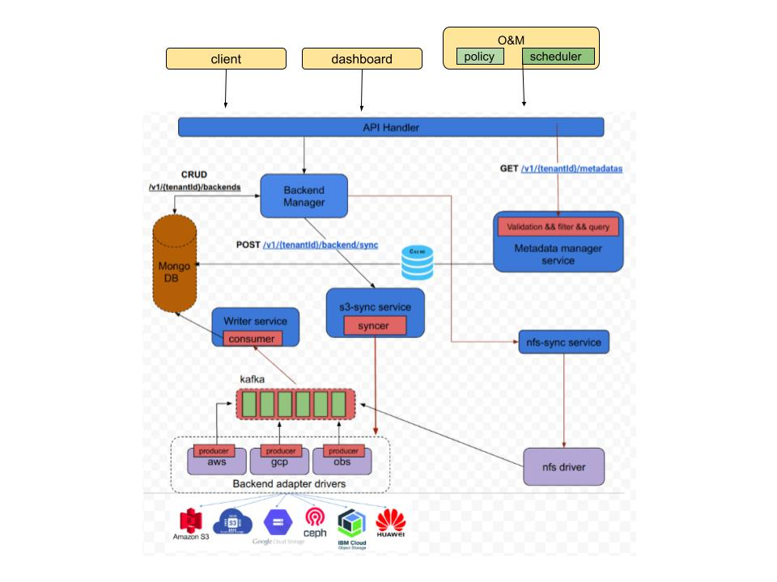

# Metadata Management

## Motivation and background

Metadata gives basic information about data—including type, time of creation,
size of object/buckets, storage class, and more for cloud object storages.
Metadata management is the business discipline of managing the metadata
about data. It can play key roles during decision making activity. Thus
metadata management is required nowadays.

A user may provision s3-cloud buckets using some solution like strato(multi-
cloud project from SODAFOUNDATION) and/or manually. To get and manage
metadata of all buckets/objects provisioned by manually and automatically,
another solution required. Because, there would be no metadata available for
manually provisioned buckets.

## Goals

Develop a Metadata Management Service which can discover, harvest, and
manage all Externally orchestrated S3 buckets and its corresponding
metadata from one place. It should perform following operations:

- Access the Metadata
- Acquire the Metadata
- Store the Metadata
- And, Process the Metadata(search, classify, optimize etc.)

## Non-Goals

- The ability to manage nfs, smb etc will be handled in future
- Unification of metadata interfaces will be handled in future
- Data mover functionality is out of scope of this analysis and design
- API gateway integration will be handled in future

## Requirement Analysis

### Functional Requirements

- Discovery and Extraction: Automate metadata harvesting of externally
  orchestrated S3 buckets from multiple Cloud vendors. This can be done
  as:
   
  ○ Manual Sync  
  ○ Scheduled/policy based Sync  
  ○ Auto sync(event-driven)  
- Metadata Store: A single metadata store for all S3 buckets and objects
  metadata
- Filter and Search: Search metadata across the entire data catalog.
  Filter metadata based on various parameters like, tags, type, size,
  region, etc.
- Classification: Classification of metadata based on some user
  configuration.
- Download the objects
- List/Get/search access for user and admin should be handled properly

### Non Functional Requirements

- The service should be available all the time
- The service should be easily scalable
- Result of Search and Filtration should be fast.

## Design Details

**Below is description of each component:**

1. *API Handler*:
This module expose REST API’s to client.

2. *Metadata Manager*:
This is independent microservice, which has three tasks:
   a. Validation: validations of requests, data type, length etc.
   b. Filter: based on request, filter the metadata.
   c. Query: prepare query structure and get the metadata from db.

3. *Storage adapter*:
It contains all drivers of respective cloud providers.

4. *Backend manager*:
It handles CRUD operations on backend.

