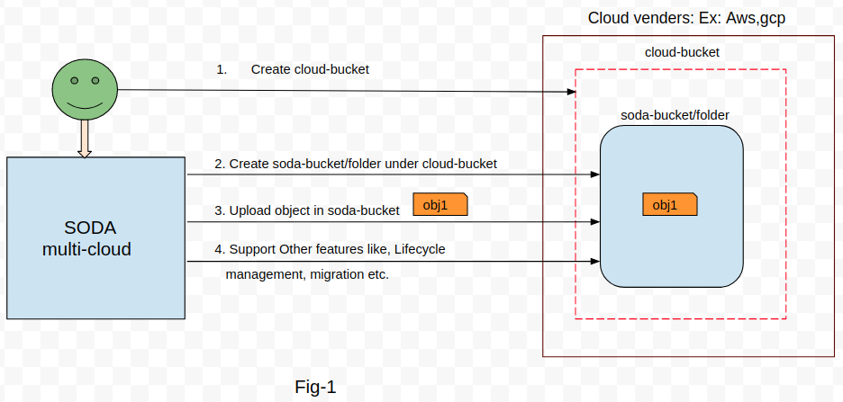
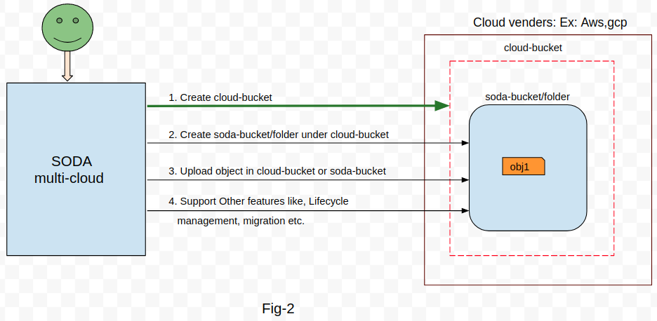
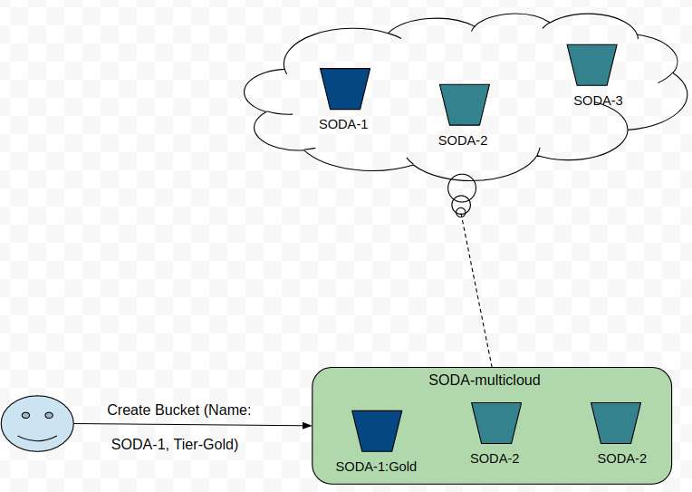

# Bucket management in SODA-multicloud

**Author(s)**: [Pravin Ranjan](https://github.com/PravinRanjan10), [Vineela Pachchipulusu](https://github.com/vineela1999)

## Motivation and background

In the cloud world, every cloud vendor provides object storage space to users. Generally in terms of bucket/container and folder. A user can store the data/objects in a specific bucket or folder.

SODA multi-cloud(gelato) is a project which manages multiple cloud vendors from one place. And also interfaces to use cloud services. So it is important for SODA to provide bucket management support for various cloud vendors. So that user can create and manage buckets from one place(SODA multi-cloud).

## Goals
The document provides the use case, design and implementation guidelines for supporting bucket management from SODA platform. It includes creation, deletion, object uploading, migration etc. in various cloud providers.

### Non-Goals
NA

### Requirement Analysis

##### Functional Requirements

1. Create buckets or.and folders in various cloud providers. Ex: Aws, gcp, azure

2. Delete bucket or/and folder from various cloud providers. Ex: Aws, gcp, azure

3. List all the bucktes

4. Upload objects in bucket or/and folder

5. Download objects from bucket or/and folder

6. Delete object from bucket or/and folder

7. Create/set tier policy for creating bucket. Ex: Gold, silver etc.

8. Migration, copy-paste objects, bucket encryption

9. Lifecycle transition rules

##### Non Functional Requirements

1. The system should be highly available. Multiple users can login to the system and create buckets, folders, upload objects etc.
The design document for this can be referred from [here](https://github.com/SODAfoundation/architecture-analysis/pull/96)

2. The system should work with minimum latency.

3. The system should be scalable and it should handle the high amount of users request.

## Architecture Analysis

The overall multi cloud architecture can be referred from [here](https://github.com/SODAfoundation/architecture-analysis/blob/master/arch-design/multicloud/MultiCloud_Design.md)

### Use case View

For heterogeneous object management, bucket creation is important. Currently SODA-multicloud supports creation of folders under cloud buckets as shown in Fig-1. So, SODA-users must need to create cloud buckets manually and provide a name, AK/SK to SODA for folder creation. As shown in fig-1, step-1 is manual which is performed by the user, whereas step-2,3,4,.. are supported by SODA-multi-cloud.

To avoid manual intervention, step-1 should also be part of SODA-multicloud as shown in Fig-2. This way users need not to do anything manually on the cloud vendors console.

Once the buckets are created, users should perform all the operations supported by SODA-multicloud. For example: Uploading objects, setting lifecycle rules, migration etc.  

#### Sequence to Create buckets:

Step-1. Register Backend

  - Name
  - Type: aws/azure/gcp etc
  - Endpoint:
  - Others headers(like AK/SK etc.)

Step-2. Create Tier policy(configuration), May be the Admin Operation

  - Gold:
      - storageclass: tier_1(Aws:standard, GCP:hot, Azure:xyz)

  - Silver:
    - storageclass: tier_99(Aws:cold, GCP:xxx, Azure:xxx)

  - Bronze:
    - storageclass: tier_999(Aws:xxx, GCP:xxx, Azure:xxx)

Step-3. Create bucket

  - Name:
  - Backend_name
  - Tier-policy

##### The Diagram to show bucket creation:

Below diagram shows two things:

1. Bucket can be created with Tier policy.

2. The Tier policy of bucket will be taged in SODA-multicloud bucket. But there will be not tagging in actual cloud account.

### SODA-API for Bucket management:

#### Create Bucket:

##### [PUT /HTTP/v1/bucket-name]()

###### Request Body:

`type`: string, Type of cloud vendors. Ex: Aws s3, Huawei OBS etc.

`name`: string, Name of bucket. See the Naming convention below.

`backend`: string, Name of registered backend by users.

`policy`: string, Tier policy, Ex: Gold, Silver, Bronze

###### Response:

ReturnCode: integer, Ex:200

Message: string, Ex: Successfully Created!

#### Naming Convention:
##### AWS:
* Bucket names must be between 3 and 63 characters long.

* Bucket names can consist only of lowercase letters, numbers, dots (.), and hyphens (-).

* Bucket names must begin and end with a letter or number.

* Bucket names must not be formatted as an IP address (for example, 192.168.5.4).

* Bucket names can't begin with xn-- (for buckets created after February 2020).

* Bucket names must be unique within a partition. A partition is a grouping of Regions. AWS currently has three partitions: aws (Standard Regions), aws-cn (China Regions), and aws-us-gov (AWS GovCloud [US] Regions).

* Buckets used with Amazon S3 Transfer Acceleration can't have dots (.) in their names. For more information about transfer acceleration, see Amazon S3 Transfer Acceleration.

##### Azure:
* A container name must be a valid DNS name, conforming to the following naming rules:

* Container names must start with a letter or number, and can contain only letters, numbers, and the dash (-) character.

* Every dash (-) character must be immediately preceded and followed by a letter or number; consecutive dashes are not permitted in container names.

* All letters in a container name must be lowercase.
* Container names must be from 3 through 63 characters long.

##### GCP:
* Bucket names must contain only lowercase letters, numbers, dashes (-), underscores (*_)*, and dots (.). Spaces are not allowed

* Names containing dots require verification.

* Bucket names must start and end with a number or letter.

* Bucket names must contain 3-63 characters. Names containing dots can contain up to 222 characters, but each dot-separated component can be no longer than 63 characters.
* Bucket names cannot be represented as an IP address in dotted-decimal notation (for example, 192.168.5.4).

* Bucket names cannot begin with the "goog" prefix.

* Bucket names cannot contain "google" or close misspellings, such as "g00gle".

#### Delete Bucket:
##### [DELETE /HTTP/v1/bucket-name]()

###### Request Body:

`name`: string, Name of bucket. See the Naming convention below.

###### Response:

ReturnCode: Integer, Ex:204

Message: string, Ex: Successfully Deleted!

#### List Buckets:

###### [GET /HTTP/v1/]()

###### Request Body:

NA

###### Response Body:

`id`:	string, The UUID of bucket.

`displayname`:	string, The name of the bucket

`creationdate`: string, The date of creation

`locationconstraint`: string, The backend of logical bucket

`tier`: string

`owner`: string

###### Response:

ReturnCode: Integer, Ex:204

#### List Objects of the bucket:

###### [GET /HTTP/v1/bucket-name]()

###### Request Body:

`name`: string, The name of bucket

###### Response Body:
`delimiter`:	string, Delimiter is a character used to group keys

`isTruncated`: boolean, Flag to indicate whether all of the results that satisfied the search criteria is returned

`marker`:	string, Indicates where in the bucket listing begins.

`name`:	string, Bucket Name

`description`:	Metadata about each object returned

`key`:	string, The name of the Object

`lastModified`:	string, The date the Object was Last Modified

`ETag`:	string, The entity tag is an MD5 hash of the object. ETag reflects only changes to the contents of an object, not its metadata.

`size`:	integer, Size in bytes of the object

`tier`: string

`location`:	string, The backend of object

###### Response:

ReturnCode: Integer

#### Upload objects to the bucket:

###### [PUT /HTTP/v1/bucket-name/object]()

###### Request Body:

`bucketName`: string

`object`: string

###### Responses:
`returnCode`: integer
`message`: string

#### Download objects from the bucket:

###### [GET /HTTP/v1/bucket-name/object]()

###### Request Body:

`bucketName`: string

`object`: string

###### Responses:
`returnCode`: integer
`message`: string

#### Delete objects from the bucket:

###### [DELETE /HTTP/v1/bucket-name/object]()

###### Request Body:

`bucketName`: string

`object`: string

###### Responses:
`returnCode`: integer
`message`: string

##################
### References:

#### List of different cloud API's

List of different cloud vendors api, which can be referred during implementation of -multicloud API.

#### AWS

##### Rules for bucket naming:

The following rules apply for naming S3 buckets:

* Bucket names must be between 3 and 63 characters long.

* Bucket names can consist only of lowercase letters, numbers, dots (.), and hyphens (-).

* Bucket names must begin and end with a letter or number.

* Bucket names must not be formatted as an IP address (for example, 192.168.5.4).

* Bucket names can't begin with xn-- (for buckets created after February 2020).

* Bucket names must be unique within a partition. A partition is a grouping of Regions. AWS currently has three partitions: aws (Standard Regions), aws-cn (China Regions), and aws-us-gov (AWS GovCloud [US] Regions).

* Buckets used with Amazon S3 Transfer Acceleration can't have dots (.) in their names. For more information about transfer acceleration, see Amazon S3 Transfer Acceleration.

##### URI Request Parameters

The request uses the following URI parameters.

`Bucket`: The name of the bucket to create.
 Required: Yes

`x-amz-acl`: The canned ACL to apply to the bucket.

`Valid Values`: private | public-read | public-read-write | authenticated-read

`x-amz-bucket-object-lock-enabled`: Specifies whether you want S3 Object Lock to be enabled for the new bucket.

`x-amz-grant-full-control`: Allows grantee the read, write, read ACP, and write ACP permissions on the bucket.

`x-amz-grant-read`: Allows grantee to list the objects in the bucket.

`x-amz-grant-read-acp`: Allows grantee to read the bucket ACL.

`x-amz-grant-write`: Allows grantee to create, overwrite, and delete any object in the bucket.

`x-amz-grant-write-acp`: Allows grantee to write the ACL for the applicable bucket.

##### API:
***
PUT / HTTP/1.1/BucketName
***
##### Request Body
The request accepts the following data in XML format.

`CreateBucketConfiguration`: Root level tag for the CreateBucketConfiguration parameters. Required: Yes

`LocationConstraint`: Specifies the Region where the bucket will be created. If you don't specify a Region, the bucket is created in the US East (N. Virginia) Region (us-east-1).

Type: String

Valid Values: af-south-1 | ap-east-1 | ap-northeast-1 | ap-northeast-2 | ap-northeast-3 | ap-south-1 | ap-southeast-1 | ap-southeast-2 | ca-central-1 | cn-north-1 | cn-northwest-1 | EU | eu-central-1 | eu-north-1 | eu-south-1 | eu-west-1 | eu-west-2 | eu-west-3 | me-south-1 | sa-east-1 | us-east-2 | us-gov-east-1 | us-gov-west-1 | us-west-1 | us-west-2

Required: No

##### Response body

`return code`: 200

`location`: specifies the Region where the bucket will be created. If you are creating a bucket on the US East (N. Virginia) Region (us-east-1), you do not need to specify the location.

***
DELETE / HTTP/1.1/Bucket
***

URI Request Parameters:

The request uses the following URI parameters.

`Bucket`: Specifies the bucket being deleted.

Required: Yes

`x-amz-expected-bucket-owner`: The account id of the expected bucket owner. If the bucket is owned by a different account, the request will fail with an HTTP 403 (Access Denied) error.

##### Request body:
No body

##### Response:
return code 204

#### Azure:
Azure cloud bucket creation:

##### Rules for Bucket(known as container in azure) naming:

* A container name must be a valid DNS name, conforming to the following naming rules:

* Container names must start with a letter or number, and can contain only letters, numbers, and the dash (-) character.

* Every dash (-) character must be immediately preceded and followed by a letter or number; consecutive dashes are not permitted in container names.

* All letters in a container name must be lowercase.
* Container names must be from 3 through 63 characters long.

##### API:

***
 ##### PUT https://myaccount.blob.core.windows.net/mycontainer?restype=container
***

##### Request headers:

* Authorization     Required.

* Date or x-ms-date     Required.  (Can be automated or manual)

* x-ms-version     Required for all authorized requests.

  x-ms-meta-name:value     Optional.

  x-ms-blob-public-access     Optional.

  x-ms-client-request-id     Optional.

##### Response headers:

`return code`: 200

`ETag`

`Last-Modified`

`x-ms-request-id`

`x-ms-version`

`Date`

`x-ms-client-request-id`

***
##### DELETE    https://myaccount.blob.core.windows.net/mycontainer?restype=container
****
Request headers:

`Timeout`:  Optional

Request headers:

* `Authorization`: Required.

* `Date or x-ms-date`: Required.

* `x-ms-lease-id`: <ID> Required for version 2012-02-12 and newer if the container has an active lease.

* `x-ms-version`:  Required for all authorized requests.

* `x-ms-client-request-id`:   Optional.

Response:

The response includes an HTTP status code and a set of response headers.

`Status Code`: A successful operation returns status code 202 (Accepted).

Response headers:

None.

#### GCP

For GCP bucket creation:

##### Rules for Bucket naming:

 * Bucket names must contain only lowercase letters, numbers, dashes (-), underscores (*_)*, and dots (.). Spaces are not allowed

 * Names containing dots require verification.

* Bucket names must start and end with a number or letter.

* Bucket names must contain 3-63 characters. Names containing dots can contain up to 222 characters, but each dot-separated component can be no longer than 63 characters.
* Bucket names cannot be represented as an IP address in dotted-decimal notation (for example, 192.168.5.4).

* Bucket names cannot begin with the "goog" prefix.

* Bucket names cannot contain "google" or close misspellings, such as "g00gle".

##### API:
***
POST https://storage.googleapis.com/storage/v1/b
***
##### Request parameters:

`project`: (required)    string

`predefinedAcl`:     string

`predefinedDefaultObjectAcl`:     string

`projection`:     string

(Authorization is needed for request)

##### Request body:

`name`:    string, required.

Optional parameters:

`acl`:     list

`billing`:     object

`billing.requesterPays`:     boolean

`cors`:     list

`cors.maxAgeSeconds`:     integer

`cors.method`:     list

`cors.origin`:     list

`cors.responseHeader`:     list     

`defaultEventBasedHold`:     boolean     

`defaultObjectAcl`:     list     

`encryption`:     object     

`encryption.defaultKmsKeyName`:     string     

`iamConfiguration`:     object     

`iamConfiguration.uniformBucketLevelAccess`:     object     

`iamConfiguration.uniformBucketLevelAccess.enabled`:     boolean     

`labels`:     object     

`labels.(key)`:     string     

`lifecycle`:     object     

`location`:     string     

`logging`:     object     

`logging.logBucket`:     string     

`logging.logObjectPrefix`:     string     

`retentionPolicy`:     object     

`retentionPolicy.retentionPeriod`:     string     

`storageClass`:     string     

`versioning`:     object     

`versioning.enabled`:     boolean     

`website`:     object     

`website.mainPageSuffix`:     string     

`website.notFoundPage`:     string    

##### Response:

`return code`: 200

If successful, this method returns a bucket resource in the response body.
***
DELETE https://storage.googleapis.com/storage/v1/b/bucket
***
Request parameters:

Query Parameters

`bucket`: 		string 	 (Name of a bucket.)

Optional query parameters

`ifMetagenerationMatch`: 	long 	(If set, only deletes the bucket if its metageneration matches this value).

`ifMetagenerationNotMatch`: 	long 	(If set, only deletes the bucket if its metageneration does not match this value).  

(Authorization is needed for request)

Request body:

Do not supply a request body with this method.

Response:

If successful, this method returns an empty response body.

#### Scratch Pad:
There are thoughts, what could be the Tier policy. Initially we have added just storageClass but other parameters can also be defined, like IOPS, latency etc.

- Gold:
    - storageclass: tier_1(Aws:standard, GCP:hot, Azure:xyz)
    --------
    - IOPS: 10GB
    - latency: 5 ns
    - Size: 20-400 Gbi
    - AccessMode: ReadWriteMany
    --------

- Silver:
  - storageclass: tier_99(Aws:cold, GCP:xxx, Azure:xxx)
  ------

  - IOPS: 5GB
  - latency: 10 ns
  - Size: 20-200 Gbi
  - AccessMode: ReadOnlyMany
  ------

- Bronze:
  - storageclass: tier_999(aws:xxx, GCP:xxx, Azure:xxx)
  -------
  - IOPS: 2GB
  - latency: 15 ns
  - Size: 20-100 Gbi
  - AccessMode: ReadWriteOnce
