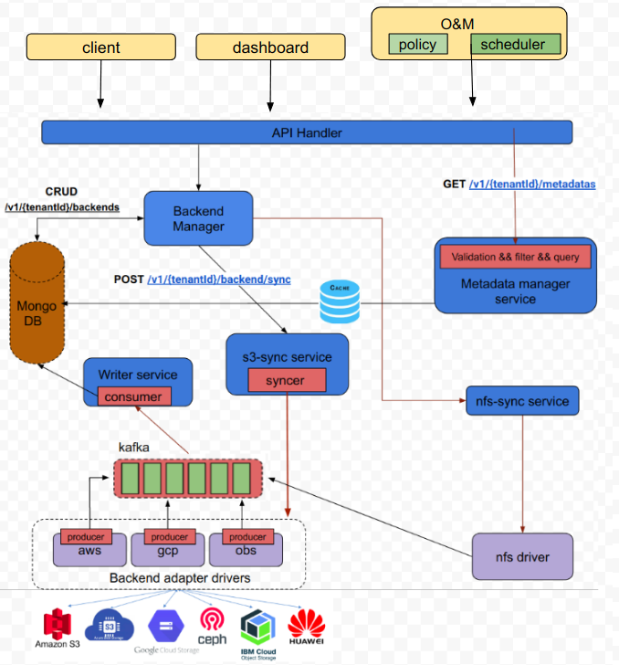
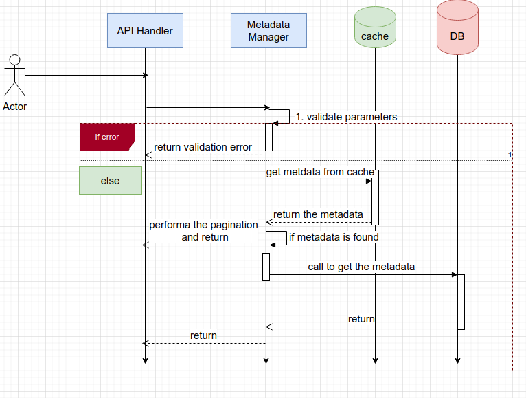

# Metadata management


**Author(s)**: [Pravin Ranjan](https://github.com/PravinRanjan10)

## Motivation and background

Metadata gives basic information about data—including type, time of creation, size of object/buckets, storage class, and more for cloud object storages. Metadata management is the business discipline of managing the metadata about data. It can play key roles during decision making activity. Thus metadata management is required nowadays.

A user may provision s3-cloud buckets using some solution like strato(multi-cloud project from SODAFOUNDATION) and/or manually. To get and manage metadata of all buckets/objects provisioned by manually and automatically, another solution required. Because, there would be no metadata available for manually provisioned buckets

## Goals

Develop a Metadata Management Service which can discover, harvest, and manage all Externally orchestrated S3 buckets and its corresponding metadata from one place. It should perform following operations:
* Access the Metadata
* Acquire the Metadata
* Store the Metadata
* And, Process the Metadata(search, classify, optimize etc.)


### Non-Goals

* The ability to manage nfs, smb etc will be handled in future
* Unification of metadata interfaces will be handled in future
* Data mover functionality is out of scope of this analysis and design
* API gateway integration will be handled in future

### Requirement Analysis

##### Functional Requirements

* Discovery and Extraction: Automate metadata harvesting of externally orchestrated S3 buckets from multiple Cloud vendors. This can be done as:
    * Manual Sync
    * Scheduled/policy based Sync
    * Auto sync(event-driven)

* Metadata Store: A single metadata store for all S3 buckets and objects metadata

* Filter and Search: Search metadata across the entire data catalog. Filter
  metadata  based on various parameters like, tags, type, size, region, etc.

* Classification: Classification of metadata based on some user configuration.

* Download the objects

* List/Get/search access for user and admin should be handled properly

##### Non Functional Requirements

* The service should be available all the time

* The service should be easily scalable

* Result of Search and Filtration should be fast


## Architecture Analysis

##### Below is description of each component:

###### API Handler:
This module expose REST API’s to client

##### Metadata Manager:
This is independent microservice, which has three tasks:

* Validation: validations of requests, data type, length etc

* Filter: based on request, filter the

* Query: prepare query structure and get the metadata from db

##### Storage adapter:
It contains all drivers of respective cloud providers.

##### Backend manager



##### Sequence Diagram:

* Get Metadata:



#### API SPEC:

POST  /v1/{tenantId}/backends

* Create backends

  ```
  Request Body:
  {
    "name": "backend001",
    "type": "aws-s3",
    "region": "ap-south-1",
    "endpoint": "s3.ap-south-1.amazonaws.com",
    "access": “access_key”
    "security": "security_key"
  }

  Response Body:

  {
    "id": "5ea809d2553b0f000116be32",
    "tenantId": "94b280022d0c4401bcf3b0ea85870519",
    "userId": "558057c4256545bd8a307c37464003c9",
     “creationDate”: date
    "name": "backend001",
    "type": "aws-s3",
    "region": "ap-south-1",
    "endpoint": "s3.ap-south-1.amazonaws.com",
    "access": “access_key”
    "security": "security_key"
  }
  ```

* GET /v1/{tenantId}/backends

  List all the backends

  Request Parameters:
 * type: string
 * name: string
 * region: string
 * offset: integer
 * limit: integer
 * sort: asc, dsc
 * tenantId: string

  ```
  Response Body:
  {
    "backends": [
      {
        "id": "5ea809d2553b0f000116be32",
        "tenantId": "94b280022d0c4401bcf3b0ea85870519",
        "userId": "558057c4256545bd8a307c37464003c9",
        "name": "backend001",
        "type": "aws-s3",
        "region": "ap-south-1",
        "endpoint": "s3.ap-south-1.amazonaws.com"
      }
    ],
    "next": 1
  }
  ```

* GET /v1/{tenantId}/backends/{backendId}

  Get the backend

  Request Parameters:
  * tenantId: string
  * backendId: string

  ```
  Response Body:
  {
    "id": "5ea809d2553b0f000116be32",
    "tenantId": "94b280022d0c4401bcf3b0ea85870519",
    "userId": "558057c4256545bd8a307c37464003c9",
    "name": "backend001",
    "type": "aws-s3",
    "region": "ap-south-1",
    "endpoint": "s3.ap-south-1.amazonaws.com"
  }
  ```

* PUT /v1/{tenantId}/backends/{backendId}

 Update backend

 Request Parameters:
 * tenantId: string
 * backendId: string

  ```
  Request Body:
  {
    "access": "access_key",
    "security": "secret_key"
  }

  Response Body:
  {
    "id": "5ea809d2553b0f000116be32",
    "tenantId": "94b280022d0c4401bcf3b0ea85870519",
    "userId": "558057c4256545bd8a307c37464003c9",
    "name": "backend001",
    "type": "aws-s3",
    "region": "ap-south-1",
    "endpoint": "s3.ap-south-1.amazonaws.com",
    "access": "access_key",
    "security": "secret_key"
  }
  ```

* DELETE /v1/{tenantId}/backends/{backendId}

  Delete the backend

  Request Parameters:
  * tenantId: string
  * backendId: string

```
Response Body:
 {
     errorCode: int
     Msg: string
}
```

* POST /v1/{tenantId}/backends/sync

  Collect the metadata for all backends

  Request Body:
  None

```
Response Body:
	{
    errorCode: int
    msg: string // “sync request sent successfully!”
  }
```

* POST /v1/{tenantId}/backends/{backendId}/sync

  Collect the metadata for particular backend

  Request Parameters:
  * backendId: string

  Request Body:
  None

```
Response Body:
	{
    errorCode: int
    msg: string // “sync request sent successfully!”
  }
```

* GET /v1/{tenantId}/metadatas

  List all the metadata for all backends

  ###### Request Query Parameters:
  * limit  int
  * Offset int
  * Type string
  * backendName string
  * Region string
  * bucketName string
  * objectName string
  * sizeOfObject int
  * sizeOfBucket int
  * bucketSizeOperator string

  Request Body:

  NA

  Response Body:

  ```
  {
    "buckets": [
      {
        "id": "084bf71e-a102-11e7-88a8-e31fe6d52248",
        "creationDate: "2022-11-10T14:36:58.014Z",
        "name": "string",  // bucket-01
        "region": "string",  // ap-south-1
        "type": "string"  // aws
        "access": "string"  // Objects can be public
        "numberOfObjects": integer // 50
        "totalSize(in bytes)": integer  // 100
        "tags": {key1: value1}
        "objects": [
            {
  	      "id": "084bf71e-a102-11e7-88a8-e31fe6d52248",
  	      "lastModifiedDate: "2022-11-10T14:36:58.014Z",
  	      "name": string,
  	      "bucketName": string
  	      "size": bytes
  	      "type": string
  	      "serverSideEncryptionEnabled": bool
  	      "versionId": integer
  	      "storageClass": string
  	      "redirectLocation": string
  	      "replicationStatus": string
  	      "expiresDate": string
  	      "grantControl": string
  	      "tags": {string:string}
  	      "metadata": {string:string
           },
         ]
      },
    ]
  }
  ```

##### Analysis:

###### System defined Meta-data for Object and List of s3-api to get these metadata

| Name                                                                                       | Description                                                                                                                                                                                                                                                                                                                                                                                                                                             | Modifiable | Found Api                                                                 |
|--------------------------------------------------------------------------------------------|---------------------------------------------------------------------------------------------------------------------------------------------------------------------------------------------------------------------------------------------------------------------------------------------------------------------------------------------------------------------------------------------------------------------------------------------------------|------------|---------------------------------------------------------------------------|
| Name                                                                                       | Description                                                                                                                                                                                                                                                                                                                                                                                                                                             | Modifiable | Found Api                                                                 |
|                                                                                            |                                                                                                                                                                                                                                                                                                                                                                                                                                                         |            |                                                                           |
| Key                                                                                        | Name of the object                                                                                                                                                                                                                                                                                                                                                                                                                                      |            | ListObjectVersions ListObjects (not recommended) ListObjectsV2            |
| Cache-Control                                                                              | A general header field used to specify caching policies.                                                                                                                                                                                                                                                                                                                                                                                                | Yes        | HeadObject                                                                |
| Content-Disposition                                                                        | Object presentational information.                                                                                                                                                                                                                                                                                                                                                                                                                      | Yes        | GetObject HeadObject                                                      |
| Content-Encoding                                                                           |                                                                                                                                                                                                                                                                                                                                                                                                                                                         |            | HeadObject                                                                |
| Content-Language                                                                           |                                                                                                                                                                                                                                                                                                                                                                                                                                                         |            | HeadObject                                                                |
| Content-Length                                                                             | Object size in bytes.                                                                                                                                                                                                                                                                                                                                                                                                                                   | No         | GetObject HeadObject                                                      |
| Content-Type                                                                               | Object type.                                                                                                                                                                                                                                                                                                                                                                                                                                            | Yes        | GetObject HeadObject                                                      |
| Last-Modified                                                                              | Object creation date or the last modified date, whichever is the latest.                                                                                                                                                                                                                                                                                                                                                                                | No         | GetObject HeadObject                                                      |
| ETag                                                                                       | Represents a specific version of an object. For objects that are not  uploaded as a multipart upload and are either unencrypted or encrypted  by server-side encryption with Amazon S3 managed keys (SSE-S3), the  ETag is an MD5 digest of the data.                                                                                                                                                                                                   | No         | GetObject HeadObject                                                      |
| x-amz-server-side-encryption                                                               | Indicates whether server-side encryption is enabled for the object,  and whether that encryption is from the AWS Key Management Service  (AWS KMS) or from Amazon S3 managed encryption (SSE-S3). For more information, see Protecting data using server-side encryption.                                                                                                                                                                               | Yes        | HeadObject                                                                |
| x-amz-checksum-crc32,  x-amz-checksum-crc32c,  x-amz-checksum-sha1,  x-amz-checksum-sha256 | Contains the checksum or digest of the object. At most, one of  these headers will be set at a time, depending on the checksum algorithm that you instruct Amazon S3 to use. For more information about choosing the checksum algorithm, see Checking object integrity.                                                                                                                                                                                 | No         | HeadObject with x-amz-checksum-mode param                                 |
| x-amz-sdk-checksum-algorithm                                                               | CRC32  CRC32C  SHA-1  SHA-256, For the metadata above this, this one has significance                                                                                                                                                                                                                                                                                                                                                                   |  ?         |                                                                           |
| x-amz-version-id                                                                           | Object version. When you enable versioning on a bucket, Amazon S3 assigns  a version number to objects added to the bucket. For more information, see Using versioning in S3 buckets.                                                                                                                                                                                                                                                                   | No         | HeadObject                                                                |
| x-amz-delete-marker                                                                        | In a bucket that has versioning enabled, this Boolean marker indicates  whether the object is a delete marker.                                                                                                                                                                                                                                                                                                                                          | No         | HeadObject                                                                |
| x-amz-storage-class                                                                        | Storage class used for storing the object. For more information, see  Using Amazon S3 storage classes.                                                                                                                                                                                                                                                                                                                                                  | Yes        | ListObjectsV2  GetObject - doesnt give value if it is Standard HeadObject |
| x-amz-website-redirect-location                                                            | Redirects requests for the associated object to another object in the same bucket or an external URL. For more information, see (Optional) Configuring a webpage redirect. This value is unique to each individual object and is not copied by default.                                                                                                                                                                                                 | Yes        | HeadObject                                                                |
| x-amz-server-side-encryption-aws-kms-key-id                                                | If x-amz-server-side-encryption is present and has the value of aws:kms, this indicates the ID of the AWS KMS symmetric encryption KMS key that was used for the object.                                                                                                                                                                                                                                                                                | Yes        | HeadObject                                                                |
| x-amz-server-side-encryption                                                               | If the object is stored using server-side encryption either with an AWS KMS  customer master key (CMK) or an Amazon S3-managed encryption key, the response includes this header with the value of the server-side encryption algorithm used when storing this object in Amazon S3 (for example, AES256, aws:kms).                                                                                                                                      |            | HeadObject                                                                |
| x-amz-server-side-encryption-customer-algorithm                                            | Indicates whether server-side encryption with customer-provided encryption keys (SSE-C) is enabled. For more information, see Using server-side encryption with  customer-provided keys (SSE-C).                                                                                                                                                                                                                                                        | Yes        | HeadObject                                                                |
| x-amz-server-side-encryption-customer-key-MD5                                              |                                                                                                                                                                                                                                                                                                                                                                                                                                                         |            | HeadObject                                                                |
| x-amz-replication-status                                                                   | Amazon S3 can return this header if your request involves a bucket that is  either a source or destination in a replication rule.                                                                                                                                                                                                                                                                                                                       |            | HeadObject                                                                |
| x-amz-tagging                                                                              | The tag-set for the object. The tag-set must be encoded as URL Query parameters.                                                                                                                                                                                                                                                                                                                                                                        | Yes        | ??                                                                        |
| x-amz-expiration                                                                           | If the object expiration is configured (see PUT Bucket lifecycle), the response  includes this header. It includes the expiry-date and rule-id key-value pairs   providing object expiration information. The value of the rule-id is URL encoded.                                                                                                                                                                                                      |            | HeadObject                                                                |
| Expires                                                                                    | The date and time at which the object is no longer cacheable.                                                                                                                                                                                                                                                                                                                                                                                           |            | HeadObject GetObject                                                      |
| Grant                                                                                      | the access control list (ACL) of an object  Such as grantee, and the permission granted   Eg: {   Grants: [{       Grantee: {         DisplayName: "sodaconf",         ID: "6aa8a154c9827c6fd5b83f2688feda611ff72ae757732c229a7fb5ff2e52ca7a",         Type: "CanonicalUser"       },       Permission: "FULL_CONTROL"     }],   Owner: {     DisplayName: "sodaconf",     ID: "6aa8a154c9827c6fd5b83f2688feda611ff72ae757732c229a7fb5ff2e52ca7a"   } } |            | GetObjectAcl                                                              |
| x-amz-object-lock-legal-hold                                                               | Indicates whether this object has an active legal hold. This field is only returned if you have permission to view an object's legal hold status.                                                                                                                                                                                                                                                                                                       |            | GetObject HeadObject                                                      |
| x-amz-object-lock-mode                                                                     | The Object Lock mode currently in place for this object                                                                                                                                                                                                                                                                                                                                                                                                 |            | HeadObject GetObject                                                      |
| x-amz-object-lock-retain-until-date                                                        | The date and time when this object's Object Lock will expire                                                                                                                                                                                                                                                                                                                                                                                            |            | HeadObject GetObject                                                      |
| x-amz-restore                                                                              | Provides information about object restoration operation and expiration time  of the restored object copy                                                                                                                                                                                                                                                                                                                                                |            | GetObject HeadObject                                                      |


##### User-defined Meta Data for Object

| Name     | Description             | Modifiable | Found Api        |
|----------|-------------------------|------------|------------------|
| Tags     | Tags added by the user  | Yes        | GetObjectTagging |
| Metadata | Metadata added by user  | Yes        | HeadObject       |


  ##### References:

  https://www.cloudysave.com/aws/s3/s3-object-key-and-metadata/
  https://docs.aws.amazon.com/AmazonS3/latest/userguide/Welcome.html
  https://docs.aws.amazon.com/sdk-for-go/api/service/s3/#New
