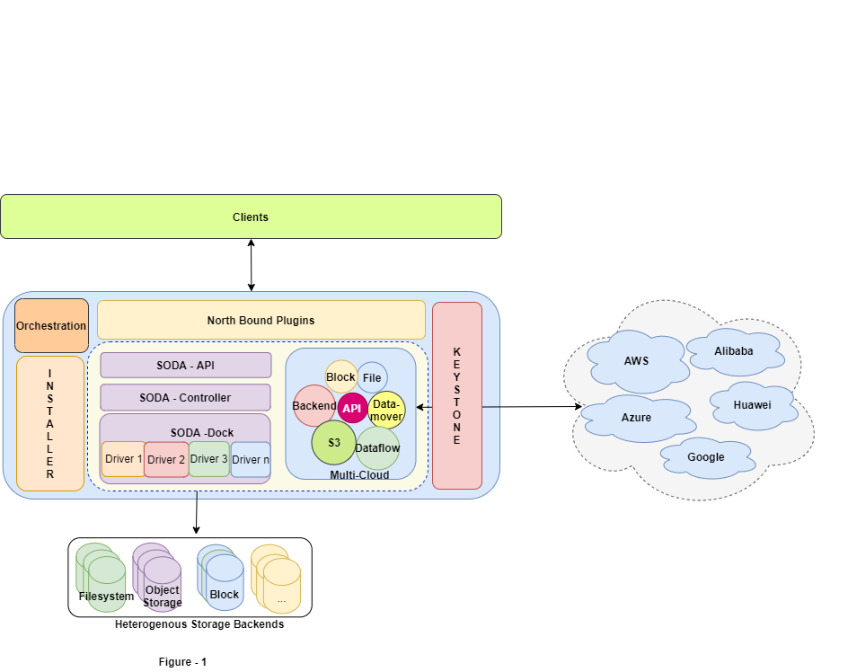

# Multi-Cloud High Availability Design

**Author(s):** [Rajat Verma](https://github.com/rajat-soda)
## Introduction
In the real world, there can be situations when a dip in performance of your servers might occur from events ranging from a sudden spike in traffic can lead to a sudden power outage. It can be much worse and your servers can be crippled- irrespective of whether your applications are hosted in the cloud or a physical machine. Such situations are unavoidable. However, rather than hoping that it doesn’t occur, what you should actually do is to gear up so that your systems don’t encounter failure.
The answer to the problem is the use of High Availability (HA) configuration or architecture. High availability architecture is an approach of defining the components, modules or implementation of services of a system which ensures optimal operational performance, even at times of high loads. Although there are no fixed rules of implementing HA systems, there are generally a few good practices that one must follow so that you gain the most out of the least resources.

**Why do we need High Availability (HA)?**

Let us define downtime before we move further. Downtime is the period of time when your system (or network) is not available for use, or is unresponsive. Downtime can cause a company huge losses, as all their services are put on hold when their systems are down. In August 2013, Amazon went down for 15 minutes (both web and mobile services), and ended up losing over $66000 per minute. Those are huge numbers, even for a company of the size of Amazon.
There are two types of downtimes- scheduled and unscheduled. A scheduled downtime is a result of maintenance, which is unavoidable. This includes applying patches, updating softwares or even changes in the database schema. An unscheduled downtime is, however, caused by some unforeseen event, like hardware or software failure. This can happen due to power outages or failure of a component. Scheduled downtimes are generally excluded from performance calculations.
The prime objective of implementing High Availability architecture is to make sure your system or application is configured to handle different loads and different failures with minimal or no downtime. There are multiple components that help you in achieving this, and we will be discussing them briefly.

## Motivation and background
As SODA provides a critical data management platform for both On-Prem and for Cloud based workloads, it is imperative that there is no bottleneck and the data and services be available even in case of any node going down. However, the current  architecture where all the components of SODA installed on a single node are a Single Point of Failure. In case of any failure of any of the services or the node going down, the data will not be accessible to the user. Hence, it's recommended to have the SODA installation in a High Available configuration, which can withstand failure of nodes and the data and services are accessible in case of any node or service going down. 

## Goal
The document provides the use case, design and implementation guidelines for supporting High Availability in SODA Multi Cloud project. It proposes a generic method of providing High Availability for the Multi Cloud project to begin with and include the other projects in the subsequent releases. To begin with, Kubernetes is considered to provide the High availability for the containers of the Multi Cloud service. (The reasons and benefits of choosing Kubernetes over other tools is analyzed below.)

## Non-Goals
  - Clients' access to the data and services is seamless. 
  - The Services and infrastructure should be available to the user as per the SLA agreed upon.
  - Installation / Uninstallation of SODA provides options to install SODA Multi Cloud in standalone / HA mode. 
  - Installation and configuration of SODA should also take into account the overheads like cost , infrastructure and resource (human & IT) availability. 
     - *For the I release, the scope is limited to single instance of Service and Data failure.

## Assumptions and Constraints
Following are the assumptions to deploy SODA Multi-Cloud in HA configuration.
  - A Kubernetes Cluster is available and accessible to SODA installer. 
    -  A minimum of 3 nodes should be available for the deployment of services to achive a limited high availability in case of services or data node failure.
  - A user is created and configured to enable Multi-Cloud services deployment on Kubernetes Cluster. 
  - With this release, only local hostPath storage is created and used for the databases and Node Port is used to access the services deployed on the Kubernetes Cluster.

## Use case View
- High Availability : To provide High Availability to the SODA Multi Cloud Deployment.
- Load Balancing : To distribute the requests from the clients among the services so that the requests are not skewed between the services and SLA of performance is maintained.

                        
**Current Architecture**

  

Above is a high level architecture diagram of the SODA components at present (Figure -1) . As is clearly evident from the diagram, there are multiple points of failure.  With the current deployment, SODA does not provide protection against 
- Service Failure
- Node Failure 
- Data Center / Region Failure.
- Network splits. 
Failure of any of the levels, be it Services , Node, Region , Network can lead to the services and data being rendered unavailable. 
This analysis presents the minimum viability to provide High Availability for the Services , Node to begin with and Region failure and Network splits at a later stage. 
For the services and data to be Highly Available and accessible at any point in time.
   - At least One Replica of the services should be available
   - At least One of the Nodes hosting the services should be available.
   - Data and Services should be separate, with data being replicated.
   - As the services are stateless, state should be preserved in a replicated NFS (for restarting services). 
As providing Highly Available services comes with extra resources and costs, there is always a trade off between  
 - Availability
 - Performance
 - Durability
 - Consistency 
Depending on the SLAs, these parameters can be tuned at Services and Database levels.

In order to provide a High Availability deployment, various tools were analysed and Kubernetes was choosen to deploy Multi-Cloud Services deployment. Here is the analysis of the tools considered for deployment of Multi-Cloud Services to provide High Availability and Loadbalancing for SODA Multi Cloud services.  

The scope of I release is to provide High Availability for the SODA Multi Cloud Services to begin with and gradually migrate the other components over the subsequent releases. 
With this in mind, the SODA node can serve as the  Controller node, which deploys the services to Container Orchestrator (K8s / Mesos / Docker Swarm) Master node and the Multi Cloud services be deployed on the Deployment Cluster as shown in Figure - 2.
This is a generic architecture giving flexibility to the customer to choose any of the orchestration tools as required. Analysis presented below helps us to conclude that K8s is the tool of choice, however it can be replaced with the customer’s choice (after necessary tests are conducted). 

*Though, this architecture would still not be fully HA , as there is still a single point of failure with the SODA Node not being fully HA and any failure on the SODA Node (Keystone service), would make the whole SODA Setup inaccessible. 

To be fully HA, the  SODA node should be clustered, however due to resource restrictions , it is proposed to go with the Architecture depicted in Figure - 2. 

## Tool for the Trade.
In order to provide High Availability for SODA at various levels, there are a whole host of tools and technologies to choose from. As the application SODA Multi-Cloud, to begin with, is a containerized application, it would need a container orchestration platform to be deployed on. The Container Orchestration that were surveyed all serve the common goals of 
Service management
Scheduling 
Resource Management 
However, there are other criteria to consider before making a foundational decision of selecting an Orchestration tool that is going to impact the whole SODA stack, some of the vital cretia are listed below. 
 
|
- **Active development:**
 The container orchestration world is relatively young. Inactive projects will quickly fall behind and signify that bugs are not being addressed, that is the reason Cattle is on the way out. 
No cloud vendor lock-in: Being tied to a single vendor has its own demerits. Titus falls out here due to its tight integration with AWS, which is definitely a down side here.

- **Simplicity:**
 The more complex a system, the harder it will be to operate it. This requirement causes Mesos to be dropped out of the running, because it is not a container orchestration system first. It tries to be many things to many people, and that feels like a wrong fit.

- **CNI Networking:**
 The ability to have trivial network connectivity between the services is important. Developers should not be spending time on special purpose code for finding dependent services. Docker Swarm and Kubernetes are both still in the running.

- **Namespaces with RBAC :**
  Going forward, in order to provide separate development, QA, staging, and production setups that do not collide, separate clusters can be set up for each, or RBAC  could be used to share the compute power. Docker Swarm loses out here as its RBAC is paid and available in the Enterprise edition. Similarly, Hashicorp too puts this functionality of Nomad behind a paywall.

As a result of the analysis done above, Kubenetes fits the bill as it checks off all the boxes of having an active development with a good amount of community support and adoption. As it is Open Source, it gets rid of the vendor lock-in as well. It provides Simplicity of deployment as its well structured and microservice driven components. It provides simplicity in networking and enables development teams to focus on their tasks. Additionally, Kubernetes brings with it a whole host of other capabilities and ease of forward and backward integration into the whole development to deployment pipeline. 

- **High Availability Capabilities :**   
  Now that it's established that **Kubernetes** offers good capabilities needed by SODA for deployment, let's look into the High Availability aspect of the features as compared to other tools like **HAProxy** .
 
 ## Kubernetes ##
 **Kubernetes (K8s) provides High Availability at various levels in the Application infrastructure.**
 
- **K8s Clusters :**
 K8s applications are generally deployed on a Cluster of nodes. Clusters are a way of providing Highly Available infrastructure, given that applications continue to be served from other nodes, in case of any of the nodes going down/bad on the K8s cluster. 
 
 - **K8s Deployments & Services :**
   Applications deployed on K8s clusters are wrapped in Pods and Pods are the elementary units of deploying applications on K8s. Now, these Pods are not accessed independently, as that would not allow them to Load Balance the requests. Hence, these Pods are deployed by Deployments, which enable the Pods to be replicated upto a desired number of instances for redundancy and High Availability. These Pods are exposed to the outer network via the concept of Services. Services is a layer over the pods, which also takes care of load distribution and routing the requests to healthy pods deployed on the K8s Cluster. 
 
Kubernetes has a declarative way of handling the services, which does not require code changes to scale out the application. It continuously checks for the current state and takes it to the desired state as indicated in the declarations provided by Deployment and Service yaml files.

 Along with Clustering, Deployments and Services are at the core of providing High Availability in Kubernetes

 - **K8s Ingress  & Load Balancing :** Kubernetes Ingress is an API object that provides routing rules to manage external users' access to the services in a Kubernetes cluster, typically via HTTPS/HTTP. With Ingress, rules can be set up for routing traffic without creating a bunch of Load Balancers or exposing each service on the node. This makes it the best option to use in production environments.  

    In production environments, you typically need content-based routing, support for multiple protocols, and authentication. Ingress allows you to configure and manage these capabilities inside the cluster. An Ingress provides the following:
    Externally reachable URLs for applications deployed in Kubernetes clusters
    Name-based virtual host and URI-based routing support
    Load balancing rules and traffic, as well as SSL termination
  
- **Rolling upgrades :**
 Applications downtime is expected during updates and patching . However, with the requirement of making an application Highly Available, downtime is not an option. Users expect applications to be available all the time and developers are expected to deploy new versions of them several times a day. In Kubernetes this is done with rolling updates. Rolling updates allow Deployments' update to take place with zero downtime by incrementally updating Pods instances with new ones. The new Pods will be scheduled on Nodes with available resources.

## HA Proxy ##
 
**High availability**
Just like any serious load balancer, HAProxy cares a lot about availability to ensure the best global service continuity :
  - Only valid servers are used ; the other ones are automatically evicted from  load balancing farms ; under certain conditions it is still possible to  force to use them though;
 
  - Support for a graceful shutdown so that it is possible to take servers out of a farm without affecting any connection;
 
 - Backup servers are automatically used when active servers are down and  replace them so that sessions are not lost when possible. This also allows to build multiple paths to reach the same server (e.g. multiple interfaces);
 
-  Ability to return a global failed status for a farm when too many servers are down. This, combined with the monitoring capabilities makes it possible for an upstream component to choose a different LB node for a given service;
 
- **Stateless design makes it easy to build clusters :** by design, HAProxy does  its best to ensure the highest service continuity without having to store information that could be lost in the event of a failure. This ensures that  a takeover is the most seamless possible;
 
Integrates well with standard VRRP daemon keepalived : HAProxy easily tells  keepalived about its state and copes very well with floating virtual IP addresses. Note: only use IP redundancy protocols (VRRP/CARP) over cluster- based solutions (Heartbeat, ...) as they're the ones offering the fastest,  most seamless, and most reliable switchover.
 
- **Load balancing :**
HAProxy offers a fairly complete set of load balancing features, most of which are unfortunately not available in a number of other load balancing products :
 
 - **No less than 10 load balancing algorithms are supported**, some of which apply to input data to offer an infinite list of possibilities. The most common ones are round-robin (for short connections, pick each server in turn), leastconn (for long connections, pick the least recently used of the servers with the lowest connection count), source (for SSL farms or terminal server farms, the server directly depends on the client's source address), URI (for HTTP caches, the server directly depends on the HTTP URI), hdr (the server directly depends on the contents of a specific HTTP header field), first  (for short-lived virtual machines, all connections are packed on the  smallest possible subset of servers so that unused ones can be powered down);
  
   All algorithms above support per-server weights so that it is possible to   accommodate from different server generations in a farm, or direct a small fraction of the traffic to specific servers (debug mode, running the next version of the software, etc);
 
  - **Dynamic weights are supported for round-robin, leastconn and consistent hashing** ; this allows server weights to be modified on the fly from the CLI or even by an agent running on the server;
 
  - **Slow-start is supported whenever a dynamic weight is supported**; this allows a server to progressively take the traffic. This is an important feature for fragile application servers which require to compile classes at runtime as well as cold caches which need to fill up before being run at full  throttle;
 
 - **Hashing can apply to various elements** such as client's source address, URL    components, query string element, header field values, POST parameter, RDP  cookie;
 
 - **Consistent hashing** protects server farms against massive redistribution when adding or removing servers in a farm. That's very important in large cache farms and it allows slow-start to be used to refill cold caches;
 
 A number of internal metrics such as the number of connections per server,   per backend, the amount of available connection slots in a backend etc makes it possible to build very advanced load balancing strategies.
 
**The Conclusion :** 

From the list of feature analysed above, the indication are pretty vivid, that though HAProxy is strong in providing High Availability Capabilities, Kubernetes has added benefits as well as it provides both backward (into code and build ) and forward (into deployment and delivery) integrations into the development pipeline and is built for the micro services paradigm. Thus Kubernetes provides not just a Deployment and High Availability solution but also as a well rounded ecosystem for the development and delivery lifecycle. 
**Hence Kubernetes is recommended to be used for providing High Availability and Load Balancing capabilities for Multi-Cloud services to begin with, and other SODA Service thereafter.** 

From the analysis of tools for High Availability and Deployments, it is clear that Kubernetes fits the bills and would be a handy  tool not only for being small but also when more services come under its purview. With the microservices architecture becoming the de facto standard of architecting, developing, testing and deploying software, Kubernetes integrates into all the phases of software development and deployment life cycle. It provides High Availability and Load balancing capabilities out of the box. 

**Deployment of SODA HA Solution.**

 

**Figure-2** provides  an extensive architecture diagram of the SODA HA solution. This solution provides protection against.
  - Service Failure
  - Node Failure 
  - Data Center / Region Failure.
  - Network splits.
As it is an extensive solution, it has more components and hence more cost. Along with evaluating the solution, an Service Level Agreement would have to be arrived at and the solutions would have to be deployed accordingly. 

- **Installation :**  Installation would need to take into account the requirements for the Deployment Cluster for the containers. The following would need to be setup 
Kubernetes Cluster (with at least 3 nodes) to deploy the Multi Cloud services. 
Replicated SODA Node 
NFS mount points to be accessible to all the K8S nodes. 
MongoDB to setup in Primary & Secondary and replication established between regions. (or as per SLA) . 
Service Deployment on the Cluster should be automated from Git & Jenkins. 

- **Upgrades :** Given that the deployment would be done on a Kubernetes cluster, upgrades to the services can be done via any of the upgrade method supported by K8s [rolling updates] 

- **Uninstallation :** Uninstallation would need to clean up and return the Nodes in the Cluster to their initial state. This would require uninstalling the components like Databases, Services and the connection established between the Master and the MC-Nodes and the replicated nodes. 

- **Database :** As the Database (Mongo) chosen in Multi Cloud are distributed in nature and support Active - Active deployment and sharding as well. They could be deployed in either of the configurations , depending on the SLA. As indicated earlier, the various configurations of Mongo are capable of providing 
  - Availability
  - Performance
  - Durability
  - Consistency
Not all these parameters can be satisfied simultaneously, hence as per the SLA appropriate tuning has to be done to provide one capability over the other.

- **SODA Node :** The SODA node , would be replicated and be served via a HA-Proxy layer to the client. This redundancy is needed in order to protect the SODA Node failure. 

- **Multi-Cloud Cluster :** The Multi-Cloud Cluster is a Kubernetes cluster (typically 3 nodes to begin with) with each node running Kubernetes agent , i.e kubelet and being managed by the SODA Node which hosts the Multi-Cloud Master . The Master node would start, stop, replicate Pods running the Multi Cloud Services. Having 3 nodes in the cluster, would prevent any one node going down. This is the minimum configuration to start with. 
The Kubernetes Ingress service would distribute the load over the services running in the cluster thus providing Load Balancing capabilities for the Multi Cloud Services. 
High Availability of the Multi Cloud Services would be provided by having at least one instance of the service running at any point in time. This would be taken care of by the Kubernetes Deployment. 

- **Client Access :** The clients would access the redundant SODA Node via HA-Proxy. The HAProxy layer would provide access to the SODA Ne, incase of any Node failure. This is needed to prevent data access loss in case the SODA Node goes down. 

- **Failure Cases :** The Multi Cloud services are stateless, hence when any service goes down and comes back up again, it would not have any history of the operations performed previously. In order to retain state of the services, a NFS mount point would be provided via Persistent Volume to each of the services . The services can write data to the mount point and it can be used, when the service restarts . The NFS backend would be shared between the zones and would be deployed in HA mode themselves, so as to protect the NFS data in case of NFS failures. 

- **CI / CD :** Kubernetes fits well with the Continuous Integration and Continuous Deployment methods and tools of development 

**Inputs & Citations.** 
The main reason we have chosen Kubernetes over Docker Swarm is related to the following artifacts:
Key features: Easy and flexible installation, Clear dashboard, Great scaling operations, Monitoring is an integral part, Great load balancing concepts, Monitors the condition and ensures compensation in the event of failure.

- **Applications:** An application can be deployed using a combination of pods, deployments, and services (or micro-services).
  
- **Functionality:** Kubernetes has a complex installation and setup process, but it is not as limited as Docker Swarm.

- **Monitoring:** It supports multiple versions of logging and monitoring when the services are deployed within the cluster (Elasticsearch/Kibana (ELK), Heapster/Grafana, Sysdig cloud integration).
Scalability: All-in-one framework for distributed systems.

- **Other Benefits:** Kubernetes is backed by the Cloud Native Computing Foundation (CNCF), a huge community among container orchestration tools, it is an open source and modular tool that works with any OS.

**Zenko :** www.zenko.io
As per inputs from Zenko following were the reasons to choose Kubernetes over Docker Swarm. 
The team ran into certain Networking issues in Docker Swarm (Details not available as of now) 
As Distributed Storage management is sensitive to Network configurations, it was decided to move away from Docker Swarm and try Kubernetes. 
Kubernetes on the other hand provides many benefits
Automated deployments.
Job / Cron Jobs are not supported in Docker Swarm
Kind / HBS allow for easier Kubernetes deployment, though these may not be production ready, however these can be used for development.
Helm Chart makes it easy to deploy applications and easy to adopt.

## Conclusion and Near Term Scope: ##
With the analysis and comparative study of various Container Orchestration tools available, it is recommended that Kubernetes be used for deploying Multi Cloud Services to provide High Availability of data and services. 

Though the architecture is extensive and provides High Availability against failure of 
  - Services
  - Nodes
  - Regions
  - Network Splits.
Due to resource limitations, it is proposed that a scaled down version of the architecture. I.e. only one region of the HA architecture be targeted for this release. As SODA is in its early phases of deployment, and majority of the Storage infrastructure it manages are located in a Data Center or Region, requirement for the multi region deployment is not seen at the time of writing the document. 
However as per the SLA, the multi-region deployment can be done with appropriate changes and testing. 

## Next steps... ## 

 

Once the initial deployment of the Multi Cloud services is done on a Kubernetes Cluster, next steps will be to move the SODA HOT POT Services to the Kubernetes Cluster and designate the SODA Node as a SODA Controller Cluster. As depicted in the Fig.3 above, all the SODA core coponents have been moved to the Kubernetes Cluster and SODA Controller Cluster serves as the managemet entity for the SODA Kubernetes Cluster

The SODA Core services will be deployed in a replicated manner alongside the Multi Cloud Services. The SODA Master node will be made failure resilient by clustering the Master node, as shown in Figure 3. Other interfaces to the Client , Cloud would remain the same.  

## References ##
**Trust Radius** https://www.trustradius.com/products/kubernetes/reviews?qs=pros-and-cons 

**Kubernetes** https://kubernetes.io/docs/

**HAProxy** https://stackshare.io/stackups/haproxy-vs-kubernetes

