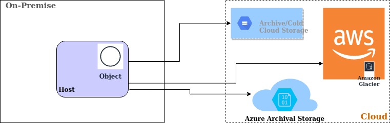
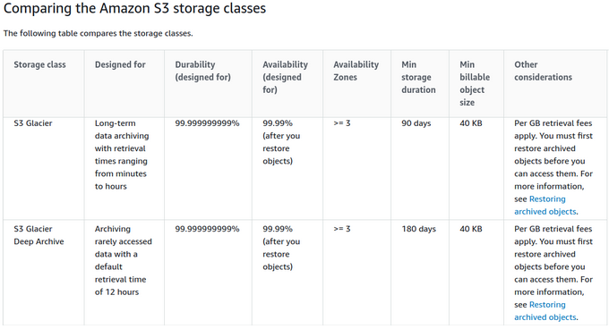
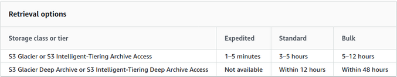
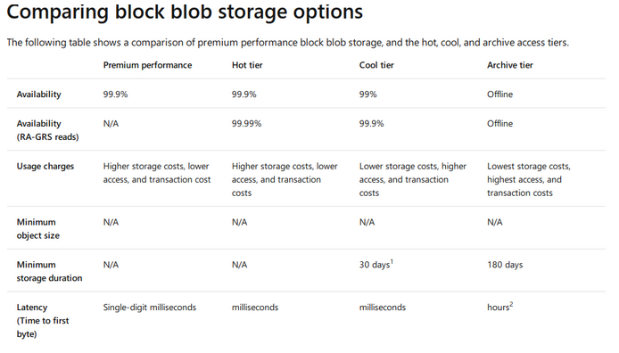
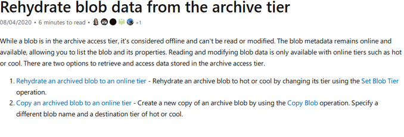
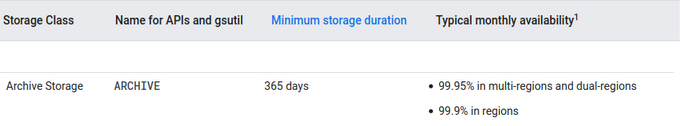
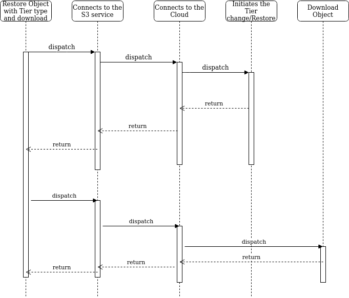

# Data Archival and Retention in Hybrid Cloud
  

## Goal
High Level Requirement and Design proposal for the Data Archival and Retention in Hybrid Cloud.

## Motivation and background
Archiving data which is important but intermittently used, is valuable to keep it safe and save cost and resource.
Also, retrieving the archived data whenever required as per need and also retrieving it when the local data is lost is an important requirement for Availability and Business continuity.

## Non-Goals

This is a pure archival solution and should be considered separate from Backup. This solution considers only the archival as Cloud Object Storage

## Assumptions and Constraints
Archival storage is available only for Object Storage and for the Cloud providers which support archival storage.
Retrieval option and the time for the availability of data from archival storage is completely dependent upon the Cloud vendor

## Requirement Analysis

### Input Requirements
TBD
 
### List of Requirements

1.  Provide option to archive data in the selected Cloud
2.  Provide option to retrieve data from archived location
3.  Provide retrieval time tuning
4.  Advance option can be to provide tiering option. Based upon the frequency of data access, policy can be set to move it to the respective cloud archival storage
5.  Data tiering in Hybrid Cloud: Based upon the data access frequency or activity, data can be classified into Hot, Warm and Cold. This can help in Archival
6.  This feature can be combined with the Gelato Lifecycle Management. Consider data residing in Tier1 (Standard/Hot) of Cloud. Data activity can be monitored periodically and based upon that suggestion can be made to move it another storage. This suggestion can be combined with current Policy based Lifecycle Management or Migration

#### Functional Requirements
1.  User can configure Cloud (Public/Private supported by SODA)
2.  User gets the option to Archive data into Cloud object Storage
3.  User get the option to retrieve objects from archived storage
4.  API should be provided to POST/PUT/DELETE objects in the Bucket and on Archival storage class
5.  API should be provided to GET/RETRIEVE objects as and when required. Proper SLAs are provided for object retrieval
6.  Provide Cost analysis based upon the Cloud Tiering and the predictions (Future)
    

#### Non Functional Requirements
1.  Any data archival operation should not affect local archival or any ongoing IOs
2.  Retrieval should be based upon the SLAs provided by the cloud
3.  Data in flights and Data at rest should be secured.

## Architecture Analysis

### Module Architecture



### High Level Module Architecture

High Level module architecture can be found here:


## Use case View

##### Data Archival for:
1.  Long-term analytics
2.  Media contents which requires durable storages and quick retrieval as and when required
3.  Healthcare system for storing patient data on low cost and durable storage
4.  Regulatory and compliance
5.  Cost Optimization for inactive/non-frequently accessed data
6.  Increased security, as archived data access is restricted for any malicious attacks, unless the retrieval is requested

##### Data Retrieval for:
1.  Quickly restore from an archive if the local copy is lost or corrupted
2.  Meeting first data byte access based upon the defined SLAs
 

### Interface Model
1.  REST APIs
2.  SODA Dashboard for the experience

External Interfaces
TBD

  

## Development and Deployment Context

### Technical considerations for different Cloud Providers:

##### Archival in AWS:


[https://docs.aws.amazon.com/AmazonS3/latest/dev/storage-class-intro.html#sc-glacier](https://docs.aws.amazon.com/AmazonS3/latest/dev/storage-class-intro.html#sc-glacier)

#### Retrieval in AWS:


[https://docs.aws.amazon.com/AmazonS3/latest/dev/restoring-objects.html](https://docs.aws.amazon.com/AmazonS3/latest/dev/restoring-objects.html)

 ##### Archival in Azure:


[https://docs.microsoft.com/en-in/azure/storage/blobs/storage-blob-storage-tiers?tabs=azure-portal](https://docs.microsoft.com/en-in/azure/storage/blobs/storage-blob-storage-tiers?tabs=azure-portal)

###### Changes in SODA multi-cloud:
Check the value of request header X-Amz-Storage-Class, set the Storage class in call to SetTier()

```
// If the Storage Class is defined from the API request Header, set it else define defaults
       var storClass string

       if storageClass != "" {
               storClass = storageClass
       } else {
               if object.Tier == 0 {
                       // default
                       object.Tier = utils.Tier1
               }
               storClass, err = osdss3.GetNameFromTier(object.Tier, utils.OSTYPE_Azure)
               if err != nil {
                       log.Infof("translate tier[%d] to azure storage class failed", object.Tier)
                       return result, ErrInternalError
               }
}
....
....
_, err = blobURL.SetTier(ctx, azblob.AccessTierType(storClass), azblob.LeaseAccessConditions{})
    if err != nil {
        log.Errorf("set azure blob tier[%s] failed:%v\n", object.Tier, err)
        return result, ErrPutToBackendFailed
    }

```

#### Retrieval in Azure:
Archive Storage currently supports 2 rehydrate priorities, High and Standard, that offers different retrieval latencies


[https://docs.microsoft.com/en-in/azure/storage/blobs/storage-blob-rehydration?tabs=azure-portal](https://docs.microsoft.com/en-in/azure/storage/blobs/storage-blob-rehydration?tabs=azure-portal)


##### Rehydrate an archived blob to an online tier

-   Standard priority: The rehydration request will be processed in the order it was received and may take up to 15 hours.
    
-   High priority: The rehydration request will be prioritized over Standard requests and may finish in under 1 hour for objects under ten GB in size.

###### Changes in SODA multi-cloud
SODA uses azure-storage-blob-go lib to connect to Azure object/blob service 
This lib has been updated with version 0.10.x to support **rehydratePriority**
So this lib version need to be updated in go mod

This also, changes signature of SetTier(). This need to be updated
  
#### Archival in Google Cloud Storage: 


#### Retrieval in Google Cloud Storage:

Unlike the "coldest" storage services offered by other Cloud providers, data is available within milliseconds, not hours or days.

[https://cloud.google.com/storage/docs/storage-classes#descriptions](https://cloud.google.com/storage/docs/storage-classes#descriptions)

##### Changes required in SODA multi-cloud
Currently SODA used webrtcn/s3client to connect to GCP object services. This will not help to update storage class. SODA need to use the cloud.google..com/go/storage lib.
GCP support changing storage class of object within a bucket through rwriting the object. To retrive archived object, GCP supports just changing the storage class

```
import (
        "context"
        "fmt"
        "io"
        "time"

        "cloud.google.com/go/storage"
)

// changeObjectStorageClass changes the storage class of a single object.
func changeObjectStorageClass(w io.Writer, bucket, object string) error {
        // bucket := "bucket-name"
        // object := "object-name"
        ctx := context.Background()
        client, err := storage.NewClient(ctx)
        if err != nil {
                return fmt.Errorf("storage.NewClient: %v", err)
        }
        defer client.Close()

        ctx, cancel := context.WithTimeout(ctx, time.Second*10)
        defer cancel()

        bkt := client.Bucket(bucket)
        obj := bkt.Object(object)
        // See the StorageClass documentation for other valid storage classes:
        // https://cloud.google.com/storage/docs/storage-classes
        newStorageClass := "COLDLINE"
        // You can't change an object's storage class directly, the only way is
        // to rewrite the object with the desired storage class.
        copier := obj.CopierFrom(obj)
        copier.StorageClass = newStorageClass
        if _, err := copier.Run(ctx); err != nil {
                return fmt.Errorf("copier.Run: %v", err)
        }
        fmt.Fprintf(w, "Object %v in bucket %v had its storage class set to %v\n", object, bucket, newStorageClass)
        return nil
}

From GCP storage doc: https://cloud.google.com/storage/docs/changing-storage-classes#storage-change-object-storage-class-go
```

### Sample Code

Azure: [https://github.com/Azure/azure-sdk-for-go/](https://github.com/Azure/azure-sdk-for-go/)

AWS: [https://docs.aws.amazon.com/sdk-for-go/api/service/s3/#PutObjectInput](https://docs.aws.amazon.com/sdk-for-go/api/service/s3/#PutObjectInput)

GCP: [https://cloud.google.com/storage/docs/json_api/v1/objects](https://cloud.google.com/storage/docs/json_api/v1/objects)

Sample code for directly uploading into AWS Glacier Storage Class

```

    sess := session.Must(session.NewSession())

    uploader := s3manager.NewUploader(sess)

    input := &s3manager.UploadInput{

        Body: bytes.NewReader([]byte("large_multi_part_upload")),

        Bucket: aws.String("myBucket"),

        Key:  aws.String("1.txt"),

        StorageClass: aws.String("GLACIER"),

    }

    result, err := uploader.Upload(input)

    if err != nil {

        fmt.Println("Received error %v", err)

        return

    }

    fmt.Println("Result: %v", result)

    }

```

  

API

Put Object into the Bucket with StorageClass defined

[PUT]

/{bucketName}/{object}

```
parameters:
- name: bucketName

in: path

description: the name of bucket

required: true

schema:

type: string

- name: object

in: path

description: the name of object

required: true

schema:

type: string

- name: Range

in: query

description: >-

the Header parameter Range value like "bytes:1-10",used for multipart

download

required: false

schema:

type: string

- name: uploads

in: query

description: The format is ''/{object}?uploads'',used for init multipartupload

required: false

schema:

type: string

- name: partNumber

in: query

description: >-

the format is

'/{object}?partNumber={partNumber}&uploadId={UploadId}',must be used

with uploadId parameter ,used for upload a part

required: false

schema:

type: string

- name: uploadId

in: query

description: >-

the format is '/{object}?uploadId={UploadId}',used for compelete

multipart upload and abort multiparupload

required: false

schema:

type: string

  

responses:

'200':

description: Successful Upload Object

'403':

description: Forbidden; Access Denied, InvalidAccessKey, SignatureDoesNotMatch

'404':

description: Not Found i.e. No Such Bucket

Request Header:

X-Amz-Storage-Class: <Name of the Archival Storage>
```

### Restore Object:Before downloading an Object from archived Storage, we need to first restore/rehydrate it

[POST] /{bucketname}/{Object}?restore

```
- name: bucketName

in: path

description: the name of bucket

required: true

schema:

type: string

- name: object

in: path

description: the name of object

required: true

schema:

type: string

- name: days

In: query

Description: The Days element is required for regular restore

Required: true

Schema:

Type: int

```

### Build & Package
1.  Dockerized
2.  Service available through s3 docker container
    

### Deployment
Similar to existing SODA multi-cloud. No installer changes required

## Sequence Diagrams
Here is the sequence diagram for Archival API


Here is the sequence diagram for retrieval/restore API. It need to first restore from cloud and then download/GET object


