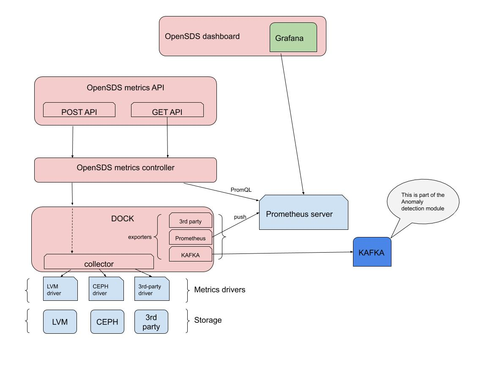

---
"# Telemetry Design"
---

**Authors:** [Xing Yang](<https://github.com/xing-yang>), [Sanil Kumar D](https://github.com/skdwriting), [Prakash R](https://github.com/rhsakarpos), [Najmudheen CT](https://github.com/NajmudheenCT)

This documentation serves as the design spec for monitoring and alerting

## Background
------------

Currently there is no mechanism for monitoring in OpenSDS. Volume metrics will
be introduced as the first step to support monitoring.

## Objectives
------------

Here are the objectives for this design.

### Goals
------------

* Retrieve volume level metrics from various storage backends.

* Retrieve pool or backend level metrics from backends.

* Retrieve metrics to measure storage operations.

* Register metrics with Prometheus.

* Provide APIs to expose metrics.

* Display metrics in OpenSDS dashboard, integrating with Grafana.

### Non Goals
------------

* Monitoring of Dock can be considered for the next phase.

* Host information won’t be collected as new metrics, but we can get them from
Prometheus node-exporter.

* Network information won’t be collected here, but we can possibly get it from
other tools

* Monitoring of Gelato and multi-cloud

## Architecture Diagram
------------

Components in the following diagram are shown in different colors. Boxes in blue
represent components directly related to Telemetry. Components in green are part
of Anomaly Detection module that consumes metrics from Telemetry. Only part of
Hotpot is shown here for illustration purpose, but we do intent to collect
metrics from other modules including Gelato as well (in a future release).


Note: Volume Metrics Exporter should be on both controller node and Dock node.
This way a storage backend with only Cinder driver can implement only the metric
volume interfaces and it can be used next to the Cinder driver.

We can leverage existing exporters for Ceph backend.

-   Ceph exporter available in Prometheus:
    <https://github.com/digitalocean/ceph_exporter>

-   Also got radosgw exporter:
    <https://github.com/blemmenes/radosgw_usage_exporter>

*A Detailed Diagram*



OpenSDS will provide Metrics REST APIs.

The ML module of OpenSDS or a 3rd-party consumer of the OpenSDS Metrics module
will make a POST request, asking for metrics, using OpenSDS Metrics REST API,
possibly running some cron jobs. The request will be sent to the OpenSDS Metrics
Controller, and then to the Dock.

On the Dock there will be a Collector which collects metrics from Metric
drivers.

There will be a Metrics driver for every storage backend. We need to define
Metrics driver interfaces based on what data to collect. Performance related
data will be the main focus for Capri.

After the Collector receives data from the Metric driver, the data gets
processed by an Adapter. The Adapter component includes a Converter and an
Exporter.

1.  The Converter converts the data to a proper format that can be understood by
    the receiving end. For example, the Prometheus Converter converts data to a
    format that Prometheus can understand.

2.  The Exporter sends(emits) the data to the intended destination.

The following Adapters will be developed:

1.  Adapter to emit data to Prometheus

    1.  Including a converter and an exporter.

2.  Adapter to send data to Kafka

3.  3rdparty Adapter to send data to specified destination

How often to generate data?

1.  Metrics will be collected when OpenSDS Metrics API is called. (higher
    priority than \#2)

2.  OpenSDS will also collect data about each volume operation when it happens
    and emits in Prometheus format so it will be gathered by the Prometheus
    server.

Note: OpenSDS does not store these data in its own database. It will be stored
in Prometheus if the Prometheus adapter is used. Consumer of the metrics data,
i.e. the OpenSDS ML module, will use OpenSDS Metrics API to retrieve data.
OpenSDS controller will convert the request to a REST API call to Prometheus
asking for the data.

*Description*
--

*UI*

1.  Integrate Grafana into the OpenSDS UI. Prometheus is configured as a data
    source in Grafana, dashboards are defined and integrated into OpenSDS

2.  The access control, authentication etc. are handled in the OpenSDS UI

*API SERVER*

1.  APIs include a metrics GET API and POST API, explained below

2.  GET API - to get the collected metrics from Prometheus. This API request
    will be passed to the controller to translate to a PromQL call, get the data
    from Prometheus and return it to the caller.

3.  POST API - to collect metrics from the driver. Typically, this will be
    called by a 3rd party. The API server passes this call to the controller to
    generate metrics from the metrics drivers.

*CONTROLLER*

Controller handles POST and GET requests from API server.

1.  The controller will translate requests from the GET API to a PromQL call,
    get the data from Prometheus and send back to the API server.

2.  The controller gets POST request from API server, sends requests to Dock to
    generate metrics from the metrics drivers. Metrics collected this way will
    be converted and pushed to the exporters that are configured.

*PROMETHEUS*

1.  This is installed and configured by default, can be optionally removed.

2.  This can collect data in two ways and stored it to the TSDB

    1.  The exporter in the dock will send data to the Prometheus. Here, we have
        2 options, have prototyped both, will select one of them

        1.  Use the Prometheus API to send metrics to the push gateway (after a
            collection happened in response to a POST call)

        2.  Configure the text collector of the Node exporter in Prometheus (the
            collector writes the text file with the metrics and the text
            collector pushes them to Prometheus)
            <https://github.com/prometheus/node_exporter#textfile-collector>

    2.  Prometheus is configured to scrape the exporter end points periodically
        (PULL mode)

3.  OpenSDS will ship with guidelines and example configuration of Prometheus
    for both modes

*DOCK*

1.  A collector module is added to the dock, which collects metrics in response
    to the POST API call

2.  Collected metrics are then sent to all the exporters that are configured

3.  The exporters do 2 things

    1.  Conversion

    2.  Sending to the requisite endpoint (Prometheus push gateway, KAFKA etc.)

4.  The exporters are designed to be extendable...to be able to convert and send
    data to a custom 3rd party endpoint

5.  The Prometheus exporter also exposes a HTTP endpoint so it can be scraped by
    the Prometheus server (in PULL mode)

*DRIVER*

1.  The metrics driver for a particular storage can be added to an existing
    volume driver, or it can be an independent Metrics driver. The metrics driver interface is defined below
    ```go
        // MetricDriver is an interface for exposing metrics collection operation of different components (Volume/CPU/Memory etc)
        type MetricDriver interface {
                //Any initialization the Metric driver does while starting.
                Setup() error
                //Any operation the Metric driver does while stopping.
                Unset() error
                //Every POST operation will trigger a CollectMetrics operation for specific MetricDriver
                //metricList:- Controller  passed list of metrics .
                //instanceID:- is the component name/id (VolumeID,CPU_ID)
                //*model.Metric:-  The array of metrics collected .
                CollectMetrics([]metricList string,instanceID string) ([]*model.Metric, error)
                }
    ```

<br>**Alerting**
------------

OpenSDS will use the Alertmanager, which is part of Prometheus, for alerting.
There are 2 mechanisms to raise Alerts, described below

1.  The alert rules are configured in Prometheus, and on the thresholds being
    crossed, Prometheus will raise an alert to the AlertManager. Alerts can be
    defined on raw metrics and derived metrics.

    1.  Example - in the sample configuration entry below, we derive a metric
        called *fs_used_percents,* with a custom formula using two raw metrics.
        Then, we define an alerting rule, to raise an alert when the
        *fs_used_percents* is \>= 90 (file system percentage used exceeds 90)

>   *groups:*

>   *- name: recording_rules*

>   *interval: 5s*

>   *rules:*

>   *- record: node_exporter:node_filesystem_free:fs_used_percents*

>   *expr: 100 - 100 \* ( node_filesystem_free{mountpoint="/"} /
>   node_filesystem_size{mountpoint="/"} )*

>   *- record: node_exporter:node_memory_free:memory_used_percents*

>   *expr: 100 - 100 \* (node_memory_MemFree / node_memory_MemTotal)*

>   *- name: alerting_rules*

>   *rules:*

>   *- alert: DiskSpace10%Free*

>   *expr: node_exporter:node_filesystem_free:fs_used_percents \>= 90*

>   *labels:*

>   *severity: moderate*

>   *annotations:*

>   *summary: "Instance {{ \$labels.instance }} is low on disk space"*

>   *description: "{{ \$labels.instance }} has only {{ \$value }}% free."*

1.  The Anomaly detector detects an anomaly, raises a custom alert to
    AlertManager using the REST API interface of AlertManager

2.  Example script to send Alert using AlertManager API

>   *alertsender.sh*
```sh
alerts1='[
        {
                "labels": {
                        "alertname": "DiskRunningFull",
                        "dev": "sda1",
                        "instance": "example1"
                },      
                "annotations": {
                        "info": "The disk sda1 is running full",
                        "summary": "please check the instance example1"
                }
        }
]'
curl -XPOST -d"\$alerts1" http://\<alertmanagerIP\>:9093/api/v1/alerts
```

### Metric Format and Data Collection
------------

Metric notation in Prometheus is a metric name and a set of labels.

\<metric name\>{\<label name\>=\<label value\>, ...}

Prometheus Naming standards:- <https://prometheus.io/docs/practices/naming/>

Prometheus Data model:- <https://prometheus.io/docs/concepts/data_model/>

Metric collector in OpenSDS collects from different targets. Data model
represents the structure of a metric in hotpot project. Data exporter
(Prometheus push/ Kafka consumer) and metric Controller can use this generic
type to derive function logic.

metricName can be formed by concatenating some values of struct field.

## Example: 

*node_disk_read_bytes_total* , where

node-\> Source of collection

disk-\> component which the metric is collected from

read-\> name of the KPI

bytes-\> unit

total-\> if it is a aggregated metric

### Here is the proposed metric data model and mapping to Prometheus data model
```go
type Metric struct {

        // Following are the labels associated with Metric, same as Prometheus labels

        // Example: {device="dm-0",instance="121.244.95.60:12419",job="prometheus"}

        // Instance ID -\> volumeID/NodeID  
        instanceID string

        // instance name -\> volume name / node name etc.  
        instanceName string

        // job -\> Prometheus/openSDS  
        job string //Optional

        /*associator - Some metric would need specific fields to relate components.
        Use case could be to query volumes of a particular pool. Attaching the related
        components as labels would help us to form promQl query efficiently.

        Example: node_disk_read_bytes_total{instance="121.244.95.60"}

        Above query will respond with all disks associated with node 121.244.95.60

        Since associated components vary, we will keep a map in metric struct to denote
        the associated component type as key and component name as value

        Example: associator[pool]=pool1 */

        associator map[string]string //Optional

        // Following fields can be used to form a unique metric name

        // source -\> Node/Dock  
        source string //Optional

        // component -\> disk/logicalVolume/VG etc  
        component string

        // name -\> metric name -\> readRequests/WriteRequests/Latency etc  
        name string

        // unit -\> seconds/bytes/MBs etc  
        unit string

        // is aggregated

        isAggregated bool //Optional

        // aggr_type-\> Can be used to determine Total/Sum/Avg etc

        /*If isAggregated ='True' then type of aggregation can be set in this field
        ie:- if collector is aggregating some metrics and producing a new metric of
        higher level constructs, then this field can be set as 'Total' to indicate it is
        aggregated/derived from other metrics.*/  
        aggr_type AGGR_TYPE //Optional  

        //timestamp
        timestamp int64
        
        //value
        value float64
        }
```

Volume metrics will be emitted using [Prometheus
format](<https://prometheus.io/docs/instrumenting/exposition_formats/>). Metrics
APIs will be provided by OpenSDS. A collector that understands how to parse
Prometheus metric format can collect metrics from the metrics HTTP endpoints.

The following data will be collected:

### Performance (Capri)

**Performance measurement data** will be the focus for Capri.

* IOPs (IO/s): number of individual read/write requests a storage system can
service per second.

* Bandwidth (throughput) (MB/s): capability of a storage system to transfer a
fixed amount of data in a measured time, i.e. metabytes per second.

* Latency (response time) (s) - time to complete a single I/O operation.

Above data will be collected as total, read, write, read to total ratio, write
to total ratio, and average.

Metrics to be collected for controller:

* IOPs

* Bandwidth

* Latency

* Average CPU usage (%)

*Custom metrics:*

* Cache hit ratio (%)

Metrics to be collected for volume:

* IOPs

* Bandwidth

* Latency

Metrics to be collected for disk:

* IOPs

* Bandwidth

* Latency

Metrics to be collected for storage pool:

* IOPs

* Bandwidth

* Latency

Metrics to be collected for filesystem (later):

* IOPs

* Bandwidth

* Latency

Each Metrics driver should implement recommended metrics. Each driver can have
its own custom metrics (key value pairs?).

Action Item: Investigate how to store and retrieve custom metrics from
Prometheus.

Reference: http://stor2rrd.com/support_matrix.htm

Open Issue: Metrics should be collected for ports as well. However ports are not
managed by OpenSDS currently. This will be addressed later after we’ve decided
whether/how to manage ports or not.

### Pool or Backend Level

* Capacities reported by the storage backend will be collected as metrics and
emitted in Gauge metric type. The following will be collected at the storage
backend pool level:

* Volume_stats_total_capacity** (backend level) - Capri

* Volume_stats_free_capacity** (backend level) - Capri

TODO: more pool level stats

Stats to monitor the health of the storage backend

* Total number of volumes, snapshots, attached volumes, etc.

* Configuration data

* Data protection plan

### Volume Level

* Capacity data can also be collected at the per-volume level:

* Volume_size (volume level) - Capri

* Snapshot_size (volume level)

TODO: more volume level stats

* Volume_available_capacity (volume level)

* Volume_total_capacity (volume level)

* Volume_used_capacity (volume level)

Note: More with thin provisioning support.

### Operation Level

* Count(or rate) and time it takes to perform certain volume operation will be
collected and [Histogram
type](<https://prometheus.io/docs/practices/histograms/>) will be used for
emitting these metrics. For block storage service, this includes create volume,
delete volume, expand volume, attach volume, detach volume, create snapshot,
delete snapshot, create volume from snapshot. These data can be collected by the
volume controller. An example is as follows:

storage_operation_duration_seconds { storage_backend = "poolA", operation_name =
"volume_create" }

* Count of volume operation failures will be collected and emitted in histogram
type as well.

storage_operation_errors_total { storage_backend = "poolA", operation_name =
"volume_attach" }

* Count(or rate) and time it takes to perform create replication, delete
replication, failover replication.

* Count(or rate) and time it takes to perform upload object, download object,
migrate object, etc. (multicloud local backend)

### Metrics APIs
-------------------

*Metrics API*

1.  POST API to trigger a collection

/v1/{tenantId}/metrics

*JSON request body*
```json
{
"instanceId" : "1",
"metrics" : ["a","b"],
}
```

1.  instanceId is the specific instance of an entity like a pool or a volume

2.  metrics is a list of metrics to be collected

*Response*

1.  200 OK

2.  500 Internal server error

3.  401 Unauthorized

4.  400 Bad Request

```json
[
        {
                "parameterName":"instanceId",
                "errorMessage":"instance not found"
        },
        {
                "parameterName":"metricName",
                "errorMessage":"unsupported metric"
        }
]
```

1.  GET API to get collected metrics

        /v1/{tenantId}/metrics

*JSON request body*
```json
{
"instanceId" : "1",
"metrics" : ["a","b"],
"endTime" : "",
"startTime" : "",
"latestOnly" : "true"
}
```
1.  instanceId is the specific instance of an entity like a pool or a volume
2.  metrics is a list of metrics to be retrieved
3.  endTime is the end time format based on rfc3339, UTC time
4.  startTime is the start time format based on rfc3339, UTC time
5.  latestOnly is a boolean, indicating to retrieve only the last known metric
    value. If this is “true”, endTime and startTime are ignored

*Response*

1.  200 OK
```json
[
        {
                "collectedAt": "2019-03-26T08:49:19.573Z",
                “instanceId” : “string”,
                "metricName": "string",
                "value":"string0"
        },
        {
                "collectedAt": "2019-03-26T08:50:19.573Z",
                “instanceId” : “string”,
                "metricName": "string",
                "value":"string1"
        },
        {
                "collectedAt": "2019-03-26T08:50:19.573Z",
                “instanceId” : “string”,
                "metricName": "string",
                "value":"string1"
        }
]
```

1.  500 Internal server error

2.  401 Unauthorized

3.  400 Bad Request

``` json
[
        {
                "parameterName":"instanceId",
                "errorMessage":"instance not found"
        },
        {
                "parameterName":"metricName",
                "errorMessage":"unsupported metric"
        }
]
```

### Alert APIs (WIP)
-----------------------

### Create Alert

* v1/{tenantId}/alerts

* Method: POST

* Description: Create a alert

### List Alerts

* v1/{tenantId}/alerts

* Method: GET

* Description: List all alerts

Question: Do we need composite APIs for metrics which will produce forms?

Answer: No. We only need simple REST APIs.

Action Item:

* Investigate how to convert data in Prometheus format and emit to Prometheus.

* Investigate how to use Prometheus REST API to retrieve metrics.

## References
-----------------------

[Kubernetes Storage Metrics via
Prometheus]([https://docs.google.com/document/d/1Fh0T60T_y888LsRwC51CQHO75b2IZ3A34ZQS71s_F0g/edit\#](https://docs.google.com/document/d/1Fh0T60T_y888LsRwC51CQHO75b2IZ3A34ZQS71s_F0g/edit))

## Appendix
-----------------------

### IO Performance Capabilities (Swordfish)

IOPerformanceLoSCapabilities can be used to describe the capabilities of the
system to support various IO performance service options.

-   AverageIOOperationLatencyMicroseconds

>   Number. The value shall be the expected average IO latency in microseconds
>   calculated over sample periods.

-   IOOperationsPerSecondIsLimited

>   Boolean. If true, the system should not allow IOPS to exceed
>   MaxIoOperationsPerSecondPerTerabyte \* VolumeSize. Otherwise, the system
>   shall not enforce a limit. The default value for this property is false.

-   **MaxIOOperationsPerSecondPerTerabyte**

>   Number. The value shall be the amount of IOPS a volume of a given committed
>   size in Terabytes can support. This IOPS density value is useful as a metric
>   that is independent of capacity. Cost is a function of this value and the
>   AverageIOOperationLatencyMicroseconds.

>   number, null (1/s/TBy) read-write

-   SamplePeriod

>   String. The value shall be an ISO 8601 duration specifying the sampling
>   period over which average values are calculated.

Quick overview of Prometheus


1.  Has a server, which includes 3 components

    1.  collector/retrieval module - periodically scrapes the HTTP endpoints on
        the exporters that are configured, gets the metrics from these endpoints
        and stores the metrics in the TSDB

    2.  TSDB - stores the metrics with timestamps

    3.  HTTP server - allows HTTP based retrieval of metrics using the powerful
        syntax of PromQL

2.  PromQL - very powerful query language (NOT SQL) to

    1.  Enable metrics data retrieval from the TSDB

    2.  Support filters, time range selection and mathematical operations on the
        retrieved data

Examples


