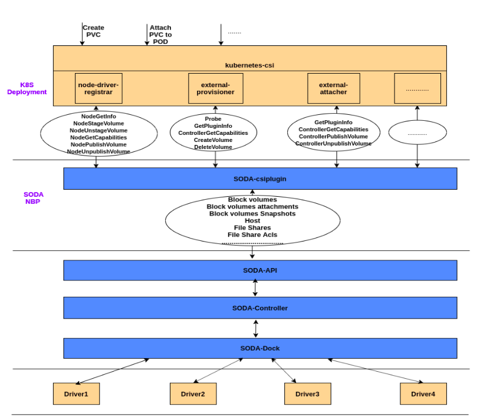
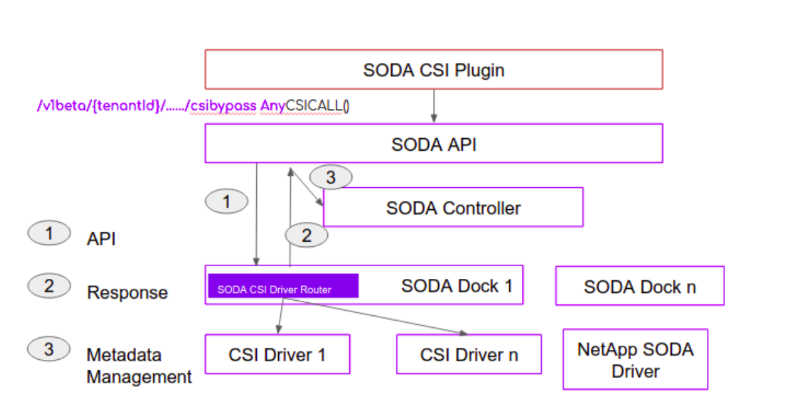

# SODA-CSI Plug-N-Play

This plugin facilitates the provisioning of the Storage using heterogeneous CSI Storage drivers in Kubernetes.


## Goals
Provide a plug and play option for standard CSI drivers to SODA On prem data platform

### Motivation and background

 - All the available CSI drivers for Storage backends can be supported with SODA quickly. (Large storage backend support quickly)
 - Easy management of CSI backends for the user from Kubernetes (Single CSI plugin from SODA can manage huge number of drivers)
 - All the SODA platform features will be available for all those backends (migration, telemetry and all)
 - CSI Drivers are mostly supported by the vendors directly , hence easy production ready solutions for kubernetes on SODA platform

 
 
 ## CSI Flow with current architecture
 -  SODA CSI Plugin runs along with k8s sidecar containers
 -  Profile info is the one helps to determine the desire backend
 -  SODA CSI Plugin converts CSI calls to SODA API calls  
 -  All the storage resources provisioned are visible at SODA ecosystem through API Server

  
 
 
 ## CSI PlugNPlay
 There are many third party CSI plugins available with many providers such as NetAPP, IBM etc..
 If there can be a way to plugin them directly to SODA ecosystem and configure them use dynamically, northbound management platforms can be benefited
 Most of these CSI drivers are supported by the vendor. Hence, automatically SODA will have vendor supported backends available.
 
 

 ### Volume provisioning flow with PlugNPlay

 
 - Soda CSI Plugin is updated to pass the csi volume create request as it is to the SODA API, 
 - Soda API is updated to process the create volume request and update the csi volume request parameters to etcd
 - Soda provisioner is anew component which watches etcd for any csi volume create requests and then triggers the third party csi driver grpc calls   

 ### Deployment Steps
  - Deploy kubernetes cluster along with soda components, Refer : https://github.com/sodafoundation/api/wiki/OpenSDS-Integration-with-Kubernetes-CSI
 
  - Deploy soda provisioner  
  
 ``` 
 git clone https://github.com/sushanthakumar/soda-provisoner
 cd soda-provisioner
 go build -ldflags '-w -s' build/soda-provisioner cmd
 cd build
 ./soda-provisioner
      
```               
  - Deploy csi lvm plugin, Refer : https://github.com/wavezhang/k8s-csi-lvm
 
  -  Volume creation steps
  ```go
# Change the workplace
 cd /opt/opensds-sushi-linux-amd64

# Create example nginx application
         kubectl create -f csi/examples/kubernetes/nginx.yaml

# Check for the volume create 
kubectl get pv
kubectl get pvc

```

  
 ***Note***:  Parallely we are also exploring and experimenting an alternate design for CSI PlugNPlay, more details related to this design can be founded [here](./alternate-design/Readme.md). 
