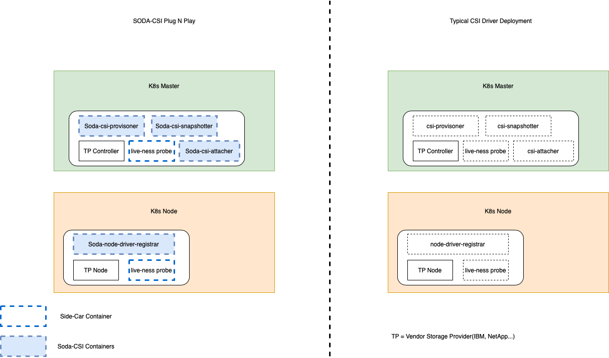
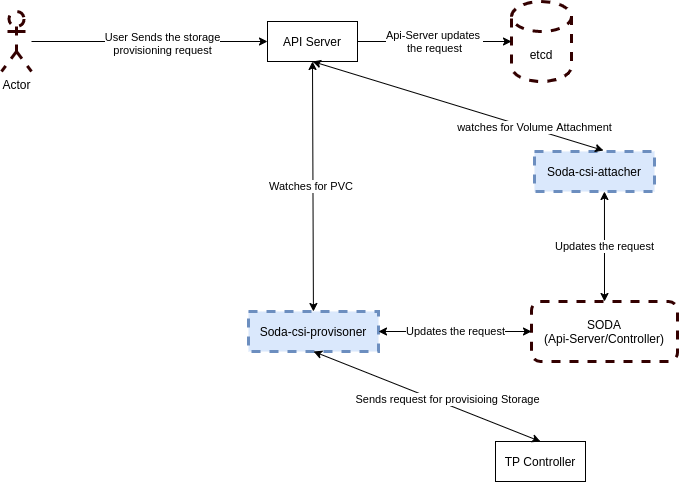

# SODA-CSI Plug-N-Play

This plugin facilitates the provisioning of the Storage using heterogeneous CSI Storage drivers in Kubernetes.

## Goals
Make a single CSI Plug-N-Play mechanism which helps to:
 - Provision and manage the Storage of heterogeneous Storage providers.
 - Third party CSI drivers should be used directly from Vendors so that SODA/Users need not worry about it's maintenance.
 - Use Soda Profile ID to determine which storage vendor drivers need to be used to provision the storage.
 - Experience all the features set of SODA.
 
 
 ## Proposed Architecture
 
 The goal is to make the SODA CSI plugin which can help to use the ThirdParty Storage CSI drivers in SODA way and get all the advantages of SODA frameworks.  
 This will help the users to use heterogeneous storage backends using a unified way provided by SODA.
 ~~~
apiVersion: storage.k8s.io/v1
kind: StorageClass
metadata:
  name: csi-soda-example--block
provisioner: csi-soda                 # This is the provisioner provided by SODA
parameters:
  attachMode: rw
  profile: XXXXXXXXXXXXXXXXXXXXXXXXXXXX     # This profile will help to use the hetrogeneous storage backend in a similar way
 ~~~
 
 ### Deployment View
 
 
 ### Call Flows  
   
 
  A typical call flow for SODA CSI Plug-N-Play mechanism will be:
   - Once the PVC Object is created by user then soda-csi-provisioner will get a request to provision the Storage.
   - soda-csi-provisioner will interact with SODA API's to get the profile details and other parameters to determine if the required driver is same as the current driver in a pod.
   - soda-csi-provisioner updates the SODA API server with the volume provisioning request and gather the required intelligence from SODA about the current provisioning.
   - soda-csi-provisioner will forward the request to CSI driver in the same pod to do the actual provisioing.
   
 
 ### Highlights
  - A simple design which let's user to patch the existing Third party CSI drivers deployment whithout any changes to actual CSI driver containers provided by TP vendors.
  - All the side car containers which will be used by TP CSI drivers will be provided by SODA.
  - Robust and easy to maintain design which can be used by heterogeneous csi storage providers with minimal changes to side cars.
  - Easy to upgrade along with TP CSI driver.
  - Easy to maintain the side car code as the code-base will be used from kubernetes-csi org and the SODA features will be added to it as a plugin, so it's easy to upgrade side-car as k8s csi spec evolves.
 
 ### Known Challenges
  - How to determine the plugin capabilities when heterogeneous drivers are there with different capabilities.
  - There is technical challenges to interact with soda-api-server to get the profile details as well as update the PV/PVC object status in soda etcd. Current sodafoundation/api doesn't supports to use the Client as it is in csi-porvisioner because of log initilaization issue as well as auth and connection issues because soda-api server runs as a process and the cert files needs to be mounted in exisiting deployment which will be mostly handled by third party providers.
 
 ### How different it is from existing soda-csi-plugin.
 The existing soda-csi plugin uses driver routers to interact with heterogeneous backends thus adding the extra hop and management layer between k8s api server and actual storage backend.
 However in the new plug-n-play mechanism the intelligence to choose the backend sits inside the provisioner so the extra hop is removed.
 
 
 ***Note*** : The new plug-n-play mechanism is the experimenting effort which we are doing to finalize the best design for unified csi plugin for soda. Both the design options will be available and after a through review  one of the design will be finalized, till then we can expect refactoring in the proposed design.
 
  
