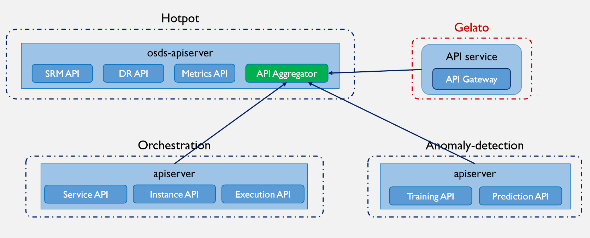
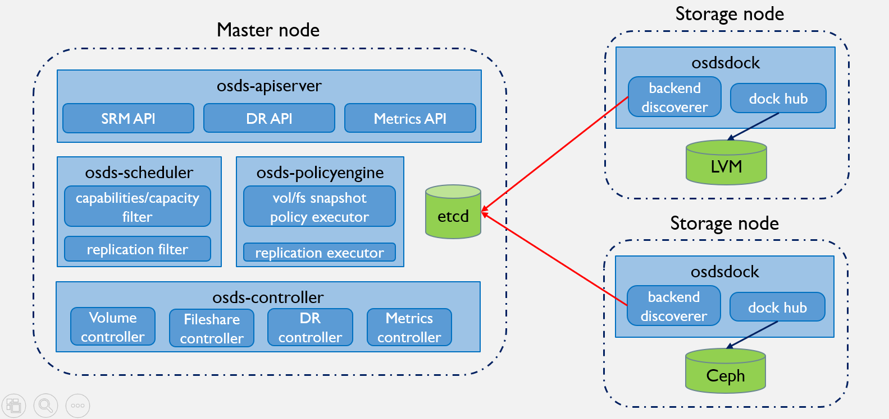
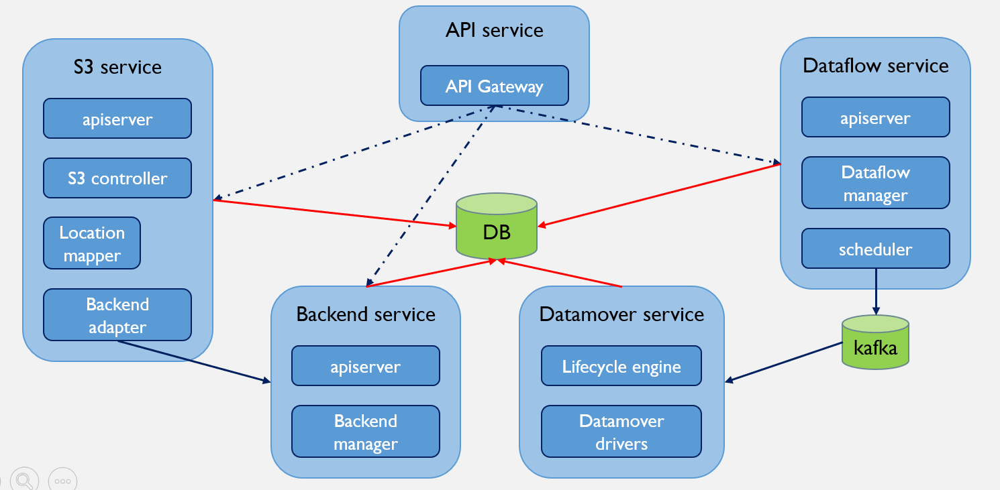
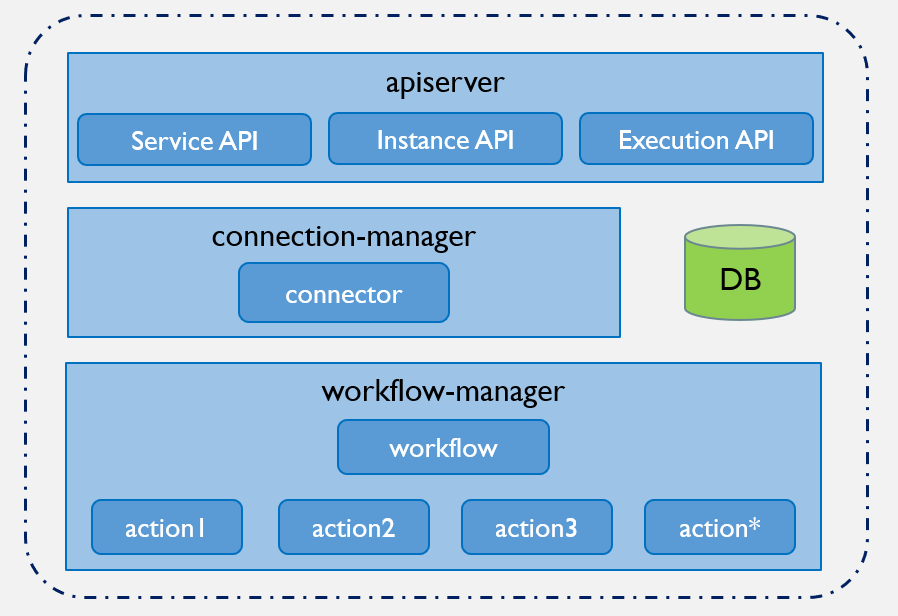
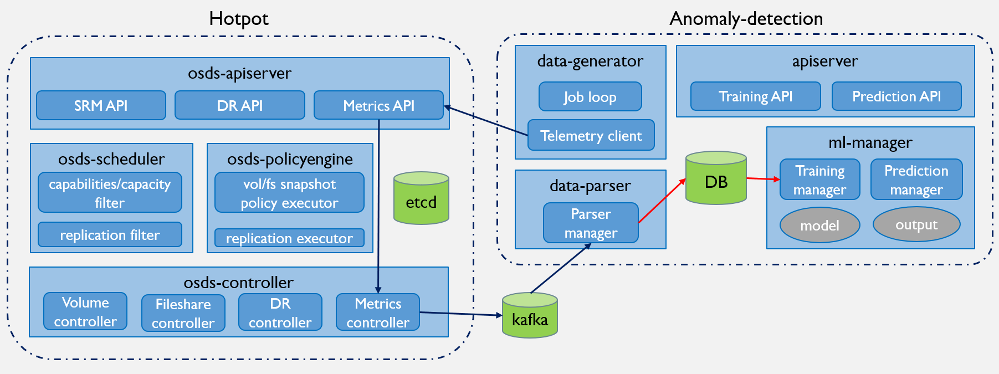

# Formalizing OpenSDS API with Aggregator

**Author(s)**: [Leon Wang](https://github.com/leonwanghui)

## Summary

This document is designed to provide a unified API for all OpenSDS services (containing [Hotpot](https://github.com/opensds/opensds), [Gelato](https://github.com/opensds/multi-cloud), [Orchestration](https://github.com/opensds/orchestration) and [Anomaly-detection](https://github.com/opensds/anomaly-detection) for now) to the public using API aggregator mechanism.

## Motivation

As we all know, OpenSDS is initially designed for addressing the storage integration challenges of both the cloud native environment and traditional IT environment, so Hotpot and Sushi project were created at Aug, 2017. But as the idea of SODA (Smart Open Data Autonomy) was born and the core goal of community was extended to intelligent data lifecycle management, some new projects like Gelato, Orchestration and Anomaly-detection were published one after another. And now it's time to discuss the scalability for OpenSDS unified framework.

Here are some problems found for current framework design:
* It's difficult for communicaiton between any services (such like Hotpot to Gelato) because of separate connection and authenticating configuration.
* Need a API Gateway for unified authentication and service discovery to be exposed to outside of the world (UI, osdsctl, etc).
* Arbitrary validation checks and unified version management are not supported so far.

To solve the problems above, we borrowed some ideas from [K8S Aggregation](https://kubernetes.io/docs/concepts/extend-kubernetes/api-extension/apiserver-aggregation/) and design a new API aggregator module to host all OpenSDS APIs.

### Goals

* Design the framework of api aggregator and integration with Hotpot existing api-server module.
* Design the service discovery and unified authentication of aggregator.
* Design the integration between aggregator and other projects. 

### Non-Goals

* The refactor work for other projects when integrating with aggregator.
* The side-effect for some deployment in [opensds-installer](https://github.com/opensds/opensds-installer).

## Design Details

To make it more clear how API aggregator works, the current design of OpenSDS projects are presented below:

* Hotpot

* Gelato

* Orchestration

* Anomaly-detection

### Data model impact

Does the proposal affect data model?

### REST API impact

Does the proposal affect API?

### Security impact

Does it affect security?

### Other end user impact

Other than API, are there other changes that affect a user? For example the CLI changes.

### Performance impact

Is there any performance impact?

### Other deployer impact

How does it affect the deployment? Are there config option changes?

### Developer impact

Does this affect other developers?

## Use Cases

List use cases for the proposal.

## Implementation

Describe how the feature will be implemented. This can be a list of work items.

## Alternatives considered

Describe alternative solutions to be considered.

## Open issues

Describe some open issues to be considered.
