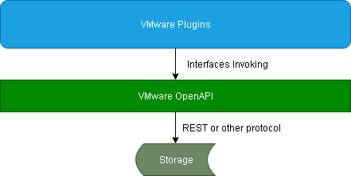
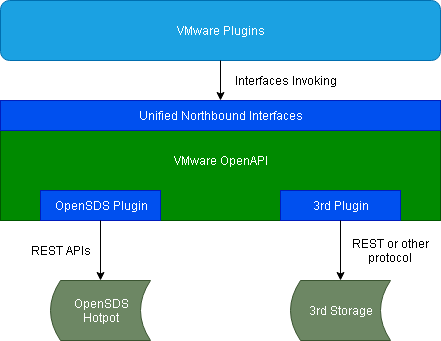

# VMware Ecosystem OpenAPI

**Author(s)**: [zengyingzhe](https://github.com/zengyingzhe)

## Summary

This documentation serves as the design spec for VMware OpenAPI.
VMware OpenAPI is a framework which provides generic storage related APIs to upper VMware plugins.

## Motivation

VMware is one of the most important and popular virtualization platforms that depends on storage, so it is very necessary to integrate OpenSDS to VMware platform, and this will also benefit for OpenSDS' further development.
To achieve various purposes, VMware supports multiple types of plugins. All of them rely on storage APIs to interact with backend storage system.
So if we implement a common framework that encapsulates API details of backend storage and provisions more generic interfaces, it would be much easier for plugin developers to implement a plugin, because developers can concern more to plugin itself's logic, not stuck in communication with storage.

Generally the upper layer VMware plugins should be provided by 3rd-party vendors who want to intergate their storages to VMware, so for the OpenSDS instance, OpenSDS community should implement these plugins and push them to community.
This OpenAPI might be used for the following VMware plugins.

| Plugin | Description |
|--|--|
| NGC(Next Generation Client) | Provide integrated storage management for VMware, including storage discovery, datastore provisioning, backup/restore service and so on. |
| VASA(vSphere APIs for Storage Awareness) Provider | Provide VMware virtual volumes(VVOLs) from storages. |
| VRO(vRealize Orchestrator) | Simplily the automation of complex IT tasks for storage management. |
| SRA(Storage Replication Adapter) | Cooperate with VMware SRM to provide the VMs protection by using storage-based replication. |
| vROps(vRealize Operations) | Provide integrated performance, capacity and configuration monitoring capabilities for storages. |
| vRLog(vRealize Log Insight) | Provide intuitive, actionable dashboards, sophisticated analytics for storages. |

### Goals

* Provide northbound generic APIs that encapsulate storage northbound APIs(through REST or others).
* Open scalable&pluggable framework, 3rd parties can encapsulate its own storage's APIs following northbound interfaces' definition.
* Integrate OpenSDS with the VMware infrastructure and allow users to view and use storage provisioned through OpenSDS or 3rd party storages.

### Non-Goals

None.

## Design Details

### OpenAPI Usage Architecture

VMware OpenAPI is a language dependent library, such as a Jar package for Java.
For VMware plugins, they should import the OpenAPI library and call its northbound interfaces to communicate with corresponding storage.
This design only focuses on OpenAPI itself. VMware plugins are supposed to be desgined separately by other spec.

### OpenAPI Module

VMware OpenAPI provides unified northbound interfaces to VMware plugins, no matter what southbound storages connected.
This could filter the differences between various of storages. Here we also see OpenSDS as a storage.
To achieve the storage-not-aware purpose, each storage vendor must provide its own plugin to OpenAPI, which encapsulates storage calls based on storage's API definition.
VMware OpenAPI's northbound interfaces invokes these plugins' functions to actually interact with storages.

For the instance of integrating with OpenSDS Hotpot, OpenSDS community should push a customed plugin to OpenAPI framework.
This plugin is supposed to inherit and implement northbound interfaces, and it calls the REST APIs that OpenSDS Hotpot provides to achieve interfaces' function.

### Data model impact

No.

### REST API impact

May require OpenSDS to provide more REST APIs, depending on the VMware plugins' requirements that might need in the future.

### Security impact

No.

### Other end user impact

No.

### Performance impact

No.

### Other deployer impact

No.

### Developer impact

Developers can participate in VMware OpenAPI to implement more functions, so that it can provide more interfaces to VMware plugins.
Or developers can commit 3rd-party plugin to scale OpenAPI up to other storages.

## Use Cases

For VMware OpenAPI, various of VMware plugins are users.
Whenever VMware plugins want to operate with storages, they invoke unified interfaces of OpenAPI.

## Implementation

### DeviceFactory Definition

*DeviceFactory* is a factory that responsible for plugin loading and initializing, according to what storage VMware plugin want to use.

### Device Northbound Interface Definitions

For this very first version of VMware OpenAPI, we only support the most basic interfaces that VMware plugins might use.
Further functions will be gradually added based on requirements later.

| Interface | Description |
|--|--|
| Login | Login to storage |
| Logout | Logout from storage |
| CreateVolume | Create a LUN |
| DeleteVolume | Delete a LUN |
| ListVolumes | Batch query LUNs info |
| AttachVolume | Attach a LUN to host |
| DetachVolume | Detach a LUN from host |
| ListStoragePools | Batch query storage pools info |

1. Login
   - parameters
     **ip**: manage ip of storage
	 **port**: manage port of storage
	 **user**: user name of storage authentication
	 **password**: password of storage authentication
   - return
     **void**

2. Logout
   - parameters
     **void**
   - return
     **void**

3. CreateVolume
   - parameters
     **name**: volume name
	 **pool**: storage pool which volume belongs
	 **allocType**: thin or thick
	 **capacity**: volume capacity
   - return
     **Volume object**

4. DeleteVolume
   - parameters
     **volume**: volume object to delete
   - return
     **void**

5. ListVolumes
   - parameters
     **pool**: (Optional)query all volumes belong to pool if specified, otherwise query all volumes in storage
   - return
     **List of volume object**

6. AttachVolume
   - parameters
     **volume**: volume object to attach
	 **host**: host object to attach, which includes informations such as host name, os type, ip, initiators, etc.
   - return
     **void**

7. DetachVolume
   - parameters
     **volume**: volume object to detach
	 **host**: host object to detach from
   - return
     **void**

8. ListStoragePools
   - parameters
     **void**
   - return
     **List of all pools in storage**

## Alternatives considered

No.

## Open issues

No.