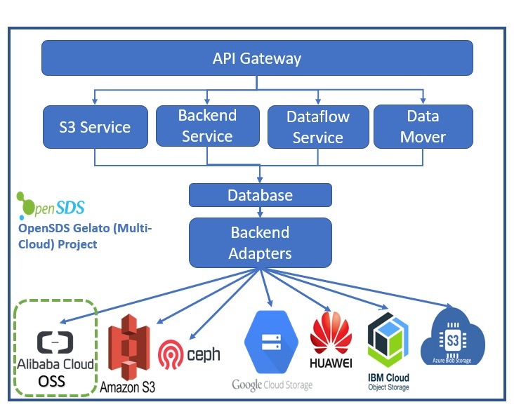

# Integration of Alibaba Cloud in as a backend in OpenSDS/Multi-cloud
**Author(s)**:  [Click2Cloud Technology Services India Pvt. Ltd.](https://github.com/Click2Cloud)
### Summary
Using this feature, user will be able to do object management mechanism and migration for Alibaba Cloud in multi-cloud .
### Motivation
In existing OpenSDS Gelato project, we don't have any option using which user can manage object management mechanism and migration for Alibaba Cloud. So we adding  alibaba as backend for Object management and migration.
### Goals

* Add support of Alibaba OSS service in OpenSDS Gelato Project.


### Design Details


                    Figure: Architure of Integration of Alibaba Cloud in OpenSDS/Multi-cloud


By adding Alibaba OSS as back-end in OpenSDS will help users to perform all object storage related operations such as Create Bucket, Delete Bucket, Upload Object, Download Object, Delete Object,Lifecycle management,manage Access control directly from OpenSDS application. Also, user will be able to migrate its bucket from any OpenSDS supported public cloud or local storage to Alibaba cloud and vice-versa.

### REST API impact
Register Backend

Here, user can use ***alibaba-oss*** as ***type*** while registering backend


****POST****: http://127.0.0.1:8089/v1/adminTenantId/backends


***Request Body***
```cassandraql
{  
   "type": "alibaba-oss", 
   "name": "alibababackend", 
   "endpoint": "cn-beijing",
   "region": "oss-cn-beijing.aliyuncs.com",
    "bucketName": "wbtestbuckt",
    "access" : "access",
    "security": "security"
 }  

```
***Response Body***
```cassandraql
{
 "id": "5bd94a83d84b8000014a1309",
 "name": "alibababackend",
 "type": "alibaba-oss",
 "region": "cn-beijing",
 "endpoint": "oss-cn-beijing.aliyuncs.com",
 "bucketName": "wbtestbuckt",
 "access": "access",
 "security": "security"
}
```
### References
[Alibaba OSS SDK](https://www.alibabacloud.com/help/doc-detail/32145.htm?spm=a2c63.p38356.b99.308.558b7165BZv8Tp)