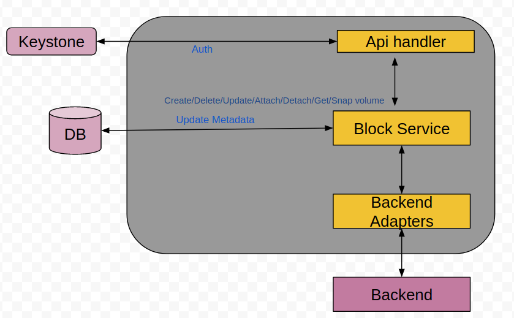
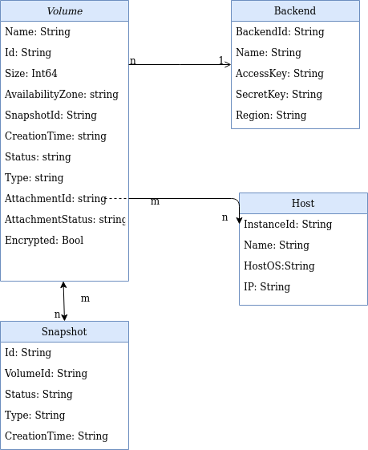
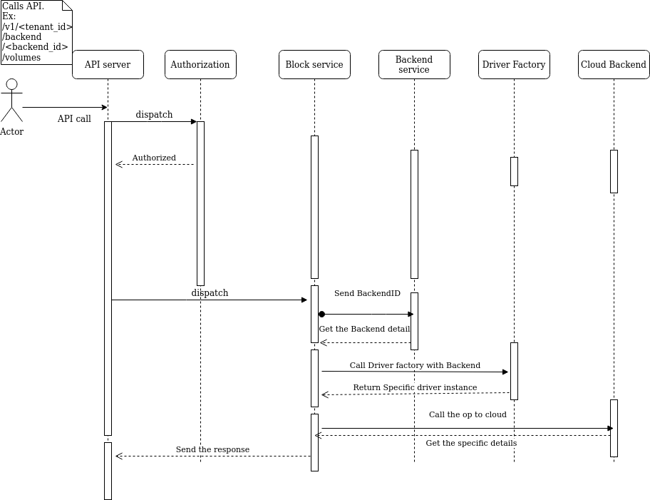

# Block Device Management in Multi-Cloud

## Goals

Block device management for multi-cloud. Cloud Block Device support for:
1.  AWS EBS
2.  Google Cloud Storage

-   This proposal addresses only the creation/deletion/update of Cloud block devices
-   This proposal addresses the Snapshot creation and Lifecycle management only within the Cloud
   
## Motivation and background

SODA Foundation Gelato project provides policy based data mobility across public, private and Hybrid clouds. This mobility is currently limited to Object Storage only.

The proposal here is to broaden the scope to Block Storage also. Different Cloud vendors provide block storage services. Block storage is important for the applications of instances. Some of the Block storage being available to the instances over network i.e. Network attached, makes the storage accessible across the instances.

These block devices provide services which fits into the services multicloud provides.
1.  Availability: The block device/volume snapshots provide the backup
2.  Security: The Block device/volume can be encrypted for security. Similar to the encryption provided for Objects/Blob storage
3.  Data Lifecycle Management: Block device Snapshots management for creation and deletion on custom schedule
4.  Data Migration and availability: Block volume snapshots are available across the AZs of a region. Point-in-time snapshots can be migrated across instances in the AZs.

The basic idea behind adding block support is to create a Distributed Data Store(DDS) going ahead. Distributed across on-premise and cloud.
This block device support in multi-cloud is a step forward to achieve the DDS.

## Non-Goals
1.  Host Management for the Volumes are not part of SODA Faroe release
2.  With Faroe release, only Create and List for AWS EBS will be available as experimental feature

### Requirement Analysis
1.  Block Storage support for multi cloud
2.  Snapshot management for multi cloud

### Input Requirements
High level requirement is to add Block and File storage for Cloud Data Management. Already Object storage is supported for in multi-cloud for Data Migration and Lifecycle policies

## Feature Requirements
Add Block Storage Management in SODA multi-cloud/Gelato

### Requirement Analysis
Block Device Management: Though Object storage solves the provisioning management issues presented by the storage expansion and data growth needs as well as the need for the resiliency, Block storage still holds its own place because of multiple reasons. Like:
1.  Ability to incrementally edit one part of the file/block
2.  Direct OS access to the mounted storage
3.  Flexibility and usability provided by the FS on top of the block storage
4.  Object storage is good for unstructured data but for structured data storage and access one need the block storage
 
Gelato/SODA multi-cloud project should provide the flexibility and unified ease of use for managing the Block devices. This include:
1.  Block Device creation/deletion/update
2.  Block Device attach/detach to the compute
3.  Snapshots of the block device for Lifecycle and data migration

### Functional Requirements
1.  SODA multi-cloud project should be able to Manage Cloud Volumes like AWS EBS, Google Cloud Persistent Storage
2.  These Block devices can be managed by the Multi-Cloud APIs
3.  Management of block device includes, Creation, Deletion, Updation, Attach and Detach
4.  Services are provided for different Cloud Providers like AWS,GCP, IBM etc
5.  Use the Cloud Credentials in a multi-tenant environment for providing services
 

### Non Functional Requirements
1.  Include the Vendor libs for Block Device management
2.  SODA multi-cloud installation handles any specific library installation/uninstallation requirements for Block Device support

## Architecture Analysis
Here is the High level Architecture for multi cloud Block storage support
 

### Module Architecture


### High Level Module architecture
1.  Client calls multi-cloud API for Block Device
2.  Call is handled by API Handler
3.  Authenticates the API call
4.  Send the request to the new service called “Block Service”
5.  Block service updates the metadata and call the Backend adapter
6.  Backend adapter based upon the request connects to the required/specific Cloud backend and serves the request back
7.  Any required data received from Backend is updated in DB
 

### Development and Deployment Context

Sample code for AWS EBS services
[https://github.com/kumarashit/cloud_test/blob/master/aws/aws_connect.go](https://github.com/kumarashit/cloud_test/blob/master/aws/aws_connect.go)
  

## Use case View
1.  Replicate Cloud Volume Using DRBD and Three site replication
2.  User wants on-demand block device availability for the Cloud instances it is using
3.  User wants the backup of the Block device it uses. This can be achieved by taking on-demand or scheduled snapshots/backup.
4.  K8s pods can leverage the  awsElasticBlockStore  to mount a AWS EBS volume into the pods. These volume contents are preserved when the pods are removed and it’s merely the action of unmounting the volume from pods. This behavior is unlike to the emptyDir where the contents are removed when the pod is removed
5.  Lifecycle policy for Block Device snapshot transition or deletion
6.  Cloud Volume as iSCSI to the other site using VPN
7.  On-premise storage like HPE Cloud Volume or ONTAP Cloud Volume for cloning and sharing across Clouds
8.  Block Volume snapshot migration across the Availability Zones in a region make it available for instances across AZs
9.  Cost efficiency: Use on-premise native storage hardware for backup. Move Cloud Volume snapshots to on-premise backup


## Interface Model

Block Device Service is available through any client which can use the Cloud Block Device SODA API
1.  SODA Dashboard
2.  SODA REST APIs

### APIs
```
Create a Block device
[POST] /v1/<tenantId>/volumes
Request:
Response:
```

``` 
List all volumes
[GET] /v1/<tenantId>/volumes
```

```
Get details of a volume
[GET] /v1/<tenantId>/volumes/<volume-id>
```

```
Get volumes of a specific Cloud backend
[GET] /v1/<tenantId>/volumes?backendId=<backendId>
```


## References

[https://docs.aws.amazon.com/sdk-for-go/api/service/ec2/](https://docs.aws.amazon.com/sdk-for-go/api/service/ec2/)
[https://cloud.google.com/compute/docs/reference/rest/v1/disks](https://cloud.google.com/compute/docs/reference/rest/v1/disks)
 

## Data Model
Data Structures, key points considered, open and alternate points etc…All the data structure to be added here


### Comparison for cloud

## Sequence Diagrams
### Backend registration:
Block service backend registration is tied to a region.


  
### Block service API call


## Open Issues

