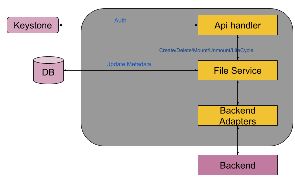

# Fileshare Management in Multi-Cloud

## Goals

This document provides the requirement, use case, design and implementation guidelines for supporting File Storage support in SODA core project: multi-cloud (Gelato).

It will discuss different aspects and considerations for supporting File Storage support for different cloud providers.

With SODA V1 release, it should deliver Cloud File Share or Filestore management support for:
1.  AWS EFS
2.  Azure File Share
3.  Google Cloud Filestore

With subsequent release, it will target to support more Cloud vendors.
Multi-cloud File Storage service will provide
1.  Creation/Deletion/Updation of File shares
2.  Creating/Deleting/Updating the mount-targets
3.  Set/Un-set File Share Access Policies
    
## Motivation and background
SODA Foundation multi-cloud (Gelato) project provides policy based data mobility across public, private and Hybrid clouds. This mobility is currently limited to Object Storage only.

The purpose is to provide a unified Data framework acros core and cloud. Currently SODA Core projects already provide the native Fileshare support for on-premise clusters. This support of Cloud Fileshare/Storage will extend this support to Cloud.

The purpose is to narrow the gap between on-premise and Cloud File Storage access.
The proposal here is to broaden the scope to File Storage for multi-cloud. Different Cloud vendors provide File storage services. Filesystem based storage is important for the applications of instances.

File storage commonly referred to as Network Fileshare is the centralized repository for files. It is very useful for sharing the contents across multiple servers. Fileshares can be accessed by instances into the Cloud as well as the on-premise instances and across AZs and Regions.

These File storage provides services which fits into the services multicloud provides.
   
   **Availability**: The File share snapshots provide the feature to create backup and recover as and when required.
   
   **Data Lifecycle Management**: File shares provide the lifecycle better storage and cost management. Infrequently accessed shares can be moved to low cost storage. (This capability depends upon the service by Cloud providers)
    Example: For AWS: There are two storage Classes 1) Standard 2) EFS IA

   **Scalability**: Cloud FileShare/File Storage can scale to PBs without affecting the underlying applications

   **Security**: The File Storage provided by the vendors provide data security for both Data at Rest as well Data in-transit
   
   **Extensibility**: The server data can be shared across Cloud as well as on-premises
    
## Non-Goals
1.  Creating network and security for mounting the File Shares across VPC/Region/Cloud-premise
2.  Instance creation
3.  Mounting the File Shares
4.  AWS FSx support
5.  Creation/Deletion of File and Directory on Shares

## Assumptions and Constraints
TBD

## Use case View
   **Migration**: Migrate on-premise File or File-Share based applications to cloud. Simply mount the Cloud FileShare to your on-premise server and copy data.

   **LTR (Long Term Retention)**: Data Deluge, ever changing business requirements and different compliance regulations demands LTR. With Cloud Vendor File Share backups or moving on-premises data to Cloud can help for Long term retention

   **Cloudburst**: Copy on-premises data to Cloud FileShare, analyze the data and get back the report on-premise. Additional benefit to it is the FileShare scalability, performance, throughput and low TCO
    
   **LiftNShift**:  Fileshares are commonly used storage on-premise. While migrating to Cloud this can be simply a lift and shift using Cloud services like AWS Manage Fileshares or Azure File Service
    
   **User Local Data Space**: Fileshares can be used as the private space for users. They can use File storage for accessing the data from any Cloud instance inside the region
   
   **Lifecycle policy**:  Life Cycle for File shares to move the infrequently accessed shares to low cost storage. (Similar to object storage lifecycle management)
    
## Requirements
1.  File Storage support for multi cloud
2.  File Share management for multi cloud
 
### Input Requirements

High level requirement is to add File storage for Cloud Data Management. Already Object storage is supported for in multi-cloud for Data Migration and Lifecycle policies

### Feature Requirements
Add File Storage Management in SODA multi-cloud/Gelato.

#### Requirement Analysis
File Storage Management: Though Object storage solves the provisioning management issues presented by the storage expansion and data growth needs as well as the need for resiliency, File storage provides easy integration. Object Storage provides the Web based storage service where one needs to use the RESTFull API calls. Whereas one can access FileShares using the familiar Operating System calls which makes it an easy integration for existing services.

Gelato/SODA multi-cloud project should provide the flexibility and unified ease of use for managing the File shares. This include:
1.  Fileshare creation/deletion/update
2.  Fileshare mount targets management
3.  Lifecycle Management policy
    
#### Functional Requirements
1.  SODA multi-cloud project should be able to Manage Cloud File storage like Azure File System, AWS EFS, Google Cloud Filestor
2.  Services are provided for different Cloud Providers like AWS, Azure, GCP, IBM etc
3.  Use the Cloud Credentials in a multi-tenant environment for providing services

#### Non Functional Requirements
1.  Include the Vendor libs for File Storage management
2.  SODA multi-cloud installation handles any specific library installation/uninstallation requirements for File storage support
 

## Architecture Analysis
Here is the High level Architecture for multi cloud File storage support

 


### Module Architecture
 



  
### High Level Module architecture
1.  Client calls multi-cloud API for File Shares
2.  Call is handled by API Handler
3.  Authenticates the API call
4.  Send the request to the new service called “File Service”
5.  File service updates the metadata and call the Backend adapter
6.  Backend adapter based upon the request connects to the required/specific Cloud backend and serves the request back
7.  Any required data received from Backend is updated in DB
 

## Development and Deployment Context
##### AWS EFS Go-SDK:
[https://docs.aws.amazon.com/sdk-for-go/api/service/efs/](https://docs.aws.amazon.com/sdk-for-go/api/service/efs/)

##### GCP Cloud Filestorage REST API
[https://cloud.google.com/filestore/docs/reference/rest](https://cloud.google.com/filestore/docs/reference/rest)

##### Azure FileShare API
[https://docs.microsoft.com/en-us/rest/api/storageservices/File-Service-REST-API?redirectedfrom=MSDN](https://docs.microsoft.com/en-us/rest/api/storageservices/File-Service-REST-API?redirectedfrom=MSDN)
[https://godoc.org/github.com/Azure/azure-sdk-for-go/storage](https://godoc.org/github.com/Azure/azure-sdk-for-go/storage)
[https://github.com/Azure/azure-storage-file-go/](https://github.com/Azure/azure-storage-file-go/)
 
#### Sample code for AWS EFS services
[https://github.com/kumarashit/cloud_test/blob/master/aws/aws_connect.go](https://github.com/kumarashit/cloud_test/blob/master/aws/aws_connect.go)

#### Sample code for create and List shares in Azure
```
import (
    "context"
    "net/url"
    "fmt"
    "github.com/Azure/azure-storage-file-go/azfile"
    "github.com/Azure/azure-sdk-for-go/storage"
    log "github.com/sirupsen/logrus"
)

// Reference: https://godoc.org/github.com/Azure/azure-storage-file-go/azfile
func ListFileshares(accountName, accountKey string) {
   credential, err := azfile.NewSharedKeyCredential(accountName, accountKey)
   u, _ := url.Parse(fmt.Sprintf("https://%s.file.core.windows.net/aks-share2", accountName))
   if err != nil {
     log.Infof("create credential[Azure Blob] failed, err:%v\n", err)
     return
    }
    shareURL := azfile.NewShareURL(*u, azfile.NewPipeline(credential, azfile.PipelineOptions{}))
    ctx := context.Background()
    _, err = shareURL.Create(ctx, azfile.Metadata{"createdby": "AKS"}, 2)
    if err != nil {
        log.Fatal(err)
    }
    // List file share
    basicClient, client_err := storage.NewBasicClient(accountName, accountKey)
    if client_err != nil {
        fmt.Println("Error in getting client")
        return
    }
    fsc := basicClient.GetFileService()
    rsp, rsp_err := fsc.ListShares(storage.ListSharesParameters{})
    if rsp_err != nil {
        fmt.Println("Error in response")
        return
    }
    fmt.Println(rsp)
```

### Interface Model
FileShare Service is available through any client which can use the Cloud File Storage SODA API
1.  SODA Dashboard
2.  SODA REST APIs

#### Requirements for User Interface:
1.  Provide option to register backend
2.  Type: AWS-Storage/GCP-Storage/Azure-Storage
3.  Required params: Access Key, Secret Key and Region
4.  Create Fileshare
5.  Update/Edit Fileshare
6.  Delete FileShare
7.  Get/List FileShare
   
### Data Model
Comparision for parameters/attributes across different cloud vendors. This is as per the APIs/Interface provided by the cloud


### API spec

#### List all shares
   
```
[GET] /v1/<tenantId/file/shares
```
##### Request
```
    “tenantId” : “<string>”
```
##### Response

```
[
    {“Name” : “Name of the FS”,
    “ID” : “FS ID”,
    “Size” : <Size or quota”,
    “Encrypted” : Bool,
    “Creation time” : “<Time of creation of FS>”,
    “Metadata” : [{Key: <KeyName>, Value: <Value>}]
    }
]
```

#### Get details of a share
```
[GET] /v1/<tenantId/file/shares/<shareId>
```
##### Request
```
    “tenantId” : “<string>”,
    “shareId” : “<string>”
```
##### Response
```
    “Name” : “Name of the FS”,
    “ID” : “FS ID”,
    “Size” : <Size or quota”,
    “Encrypted” : Bool,
    “Creation time” : “<Time of creation of FS>”,
    “Metadata” : [{Key: <KeyName>, Value: <Value>}]
```
#### Create a File share
```
[POST] /v1/<tenantId/file/shares
```
##### Request
```
    “tenantId” : “<string>”
    “Metadata” : “{Key=Value}”,
    “Name” : “<Name of the Share>”,
    “Size” : “<Size or Quota for the File Share>”
```
##### Response
```
    "Name” : “Name of the FS”,
    “ID” : “FS ID”,
    “Size” : <Size or quota”,
    “Encrypted” : Bool,
    “Creation time” : “<Time of creation of FS>”,
    “Metadata” : [{Key: <KeyName>, Value: <Value>}]
```
#### Modify/Update a File share
```
[PUT] /v1/<tenantId/file/shares/<shareId>
```
##### Request:
```
    “tenantId”: “<string>”,
    “shareId” : “<share ID or name of the share to be modified>”,
    “Metadata” : “{key=value}”
```
##### Response
```
    “Name” : “Name of the FS”,
    “ID” : “FS ID”,
    “Size” : <Size or quota”,
    “Encrypted” : Bool,
    “Creation time” : “<Time of creation of FS>”,
    “Metadata” : [{Key: <KeyName>, Value: <Value>}]
```
#### Delete a File Share
```
[DELETE] /v1/<tenantId/file/shares/<shareId>
```
##### Request
```
    “tenantId” : “<string>”,
    “shareId” : “<Share ID or Name of the Share to be deleted>”
```
###### Response

  

### Build & Package
#### Deployment
New  containerized File Service added

## Sequence Diagrams

#### Backend Registration:
```
/<tenant_id>/backends [POST]
```

Request:
```
{
    "type": "aws-block",
    "name": "aks-aws",
    "region": "ap-south-1",
    "access": "XXXXXXXXXXXXXXXXXXX",
    "security": "XXXXXXXXXXXXXXXXXXXXXXXXXX"
}
```
Response:
```
{
    "id": "5ece62ab8f17eb0001e1bc4d",
    "tenantId": "94b280022d0c4401bcf3b0ea85870519",
    "userId": "XXXXXXXXXXXXXXXXXXXX",
    "name": "aks-aws",
    "type": "aws-block",
    "region": "ap-south-1",
    "access": "XXXXXXXXXXXXXXXXXXXXXXXX",
    "security": "XXXXXXXXXXXXXXXXXXXXXXXXXXX"
}
```


  

#### Fileshare API:
```
/v1/<tenant_id/file/shares [GET]
```


## Notes

### Response of AWS Create File Share:

    {

        CreationTime: 2020-06-03 10:46:16 +0000 UTC,

        CreationToken: "tokenstring",

        Encrypted: false,

        FileSystemId: "fs-4ffe7d9e",

        LifeCycleState: "creating",

        Name: "aks_fs1",

        NumberOfMountTargets: 0,

        OwnerId: "75027",

        PerformanceMode: "generalPurpose",

        SizeInBytes: {

        Value: 0,

        ValueInIA: 0,

        ValueInStandard: 0

        },

        Tags: [{

        Key: "Name",

        Value: "aks_fs1"

        }],

        ThroughputMode: "bursting"

    }

  

### Response of AWS List File Shares:

    {
        FileSystems: [{
        CreationTime: 2020-06-03 10:46:16 +0000 UTC,
        CreationToken: "tokenstring",
        Encrypted: false,
        FileSystemId: "fs-4ffe7d9e",
        LifeCycleState: "available",
        Name: "aks_fs1",
        NumberOfMountTargets: 0,
        OwnerId: "75027",
        PerformanceMode: "generalPurpose",
        SizeInBytes: {
        Value: 6144,
        ValueInIA: 0,
        ValueInStandard: 6144
        },
        Tags: [{
        Key: "Name",
        Value: "aks_fs1"
        }],
        ThroughputMode: "bursting"
        },{
        CreationTime: 2020-05-28 06:11:14 +0000 UTC,
        CreationToken: "console-0ed22229",
        Encrypted: false,
        FileSystemId: "fs-d97bfa08",
        LifeCycleState: "available",
        Name: "aks_efs",
        NumberOfMountTargets: 3,
        OwnerId: "75027",
        PerformanceMode: "generalPurpose",

        SizeInBytes: {
        Timestamp: 2020-06-03 11:05:32 +0000 UTC,
        Value: 6144,
        ValueInIA: 0,
        ValueInStandard: 6144
        },

        Tags: [{
        Key: "Name",
        Value: "aks_efs"
        }],

        ThroughputMode: "bursting"
        }]
    }
