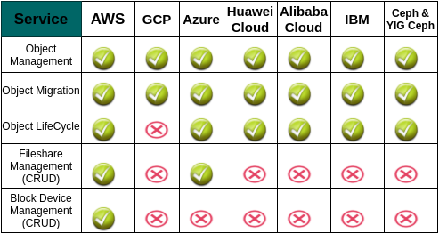
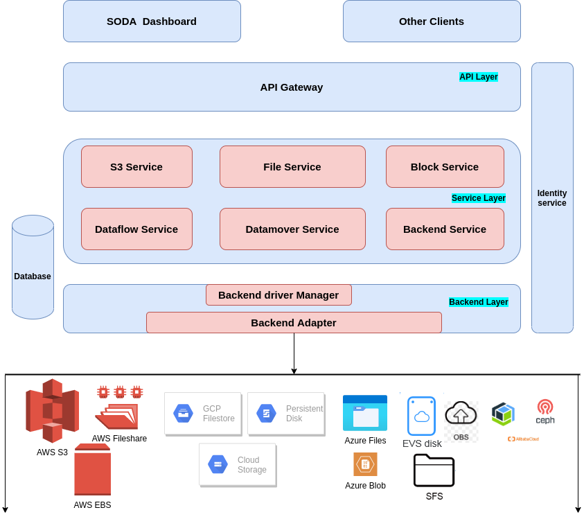

# Add support for Huawei File and Block devices
Author(s): [Ashit Kumar](https://github.com/kumarashit), [Himanshu Varshney](https://github.com/himanshuvar)

## Introduction
SODA Foundation multi-cloud (Gelato) project provides policy based data mobility across multi-clouds. It supports public and Hybrid clouds. Gelato supports different types of storages like Object, File and Block. The supported cloud vendors are AWS, Azure, GCP, Huawei, IBM, Ceph, YIG-Ceph and Alibaba
Currently it provides solution for Object Migration, Policy Based Lifecycle Management of Objects in-cloud as well as Cross-cloud. It also provided File and Block Management operations.


## Motivation and Background
As of now, the supportability matrix for Vendors and Features stands as:


To create an unified mulitcloud management solution, there is need to support different cloud vendors for different services.
Huawei Cloud being one of the major cloud providers for Hybrid Cloud Solution, support for the Fileshare and Disk service alongwith the currently supported object storage will add value.

### Huawei Cloud Scalable File Service

Scalable File Service (SFS) provides reliable, high-performance shared file storage hosted on HUAWEI CLOUD. With SFS, you can enjoy shared file access spanning multiple Elastic Cloud Servers (ECSs), Bare Metal Servers (BMSs), and containers created on Cloud Container Engine (CCE) and Cloud Container Instance (CCI).

### Huawei Cloud Elastic Volume Service

Elastic Volume Service (EVS) provides persistent block storage for services such as Elastic Cloud Server (ECS) and Bare Metal Server (BMS). With advanced data redundancy and cache acceleration capabilities, EVS offers high availability and durability.

## GOALS
- Extend support for Huawei Cloud
- Add SFS to multi-cloud File service
- Add EVS to multi-cloud Block service
- Provide API interface
- Provide any installation support for the services to be available

## Non Goals
- Only CRUD operations are scoped under this
- Other operations like mount or any operations related to compute is not scoped as part of this
- Only SFS is supported, no SFS-Turbo support

## Requirement analysis
### Input requirement
- Provide support for Huawei Cloud SFS
- Provide support for Huawei Cloud EVS

### Feature Requirements
- Add basic CRUD operations for Huawei Cloud SFS
- Add basic CRUD Operations for Huawei Cloud EVS
- These features form the building block for other features to be extended for Hybrid Cloud support

## Architecture 
### Here is the high level architecture for multicloud


### Here is the high level design for File service


### Here is the high level design for Block service


## Interface Model
### API
#### Elastic Volume service
**Register backend**
POST: http://192.168.20.163:8089/v1/94b280022d0c4401bcf3b0ea85870519/backends
Request: (project_name is the region alias too)
```
{
    "type": "hw-block", 
    "name": "<Name of the backend>", 
    "region": "<project_name>", 
    "access": "<AK>", 
    "security": "<SK>"
}
```
Response:
```
{
    "id": "5f883c933e3fd2000142e072",
    "tenantId": "94b280022d0c4401bcf3b0ea85870519",
    "userId": "558057c4256545bd8a307c37464003c9",
    "name": "hpc_new",
    "type": "hw-block",
    "region": "<project_name>", 
    "access": "<AK>",
    "security": "<SK>"
}
```
**List Backend**
GET:
Response:
```
{
    "backends": [
            {
            "id": "5f883c933e3fd2000142e072",
            "tenantId": "94b280022d0c4401bcf3b0ea85870519",
            "userId": "558057c4256545bd8a307c37464003c9",
            "name": "hpc_new",
            "type": "hw-block",
            "region": "<project_name>:<project_id>"
        }
    ],
    "next": 1
}
```
**Create Volume**
POST: http://192.168.20.163:8089/v1/94b280022d0c4401bcf3b0ea85870519/volumes
Request:
```
{
    "name": "VolNew",
    "backendId": "5f883c933e3fd2000142e072",
    "availabilityZone": "<AZ>",
    "size": 10737418240,
    "type": "SAS"
    
}
```

Response:
```
{
    "id": "5f8899b355bc5a0001a49531",
    "createdAt": "2020-10-16T00:19:23",
    "updatedAt": "2020-10-16T00:19:23",
    "name": "VolNew",
    "tenantId": "94b280022d0c4401bcf3b0ea85870519",
    "userId": "558057c4256545bd8a307c37464003c9",
    "backendId": "5f883c933e3fd2000142e072",
    "backend": "hpc_new",
    "size": 10737418240,
    "type": "SAS",
    "region": "<REGION>",
    "availabilityZone": "<AZ>",
    "status": "creating",
    "metadata": {
        "fields": {
            "CreationTimeAtBackend": {
                "Kind": {
                    "StringValue": "2020-10-15T18:49:23.273116"
                }
            },
            "VolumeId": {
                "Kind": {
                    "StringValue": "e6cf2434-b215-4148-b1bf-2c97fdc91700a"
                }
            }
        }
    }
}
```
**List volumes**
GET: http://192.168.20.163:8089/v1/94b280022d0c4401bcf3b0ea85870519/volumes
Response:
```
{
    "volumes": [
        {
            "id": "5f86e70de0a1010001623dd6",
            "createdAt": "2020-10-14T17:24:53",
            "updatedAt": "2020-10-14T17:24:53",
            "name": "volTest12",
            "tenantId": "94b280022d0c4401bcf3b0ea85870519",
            "userId": "558057c4256545bd8a307c37464003c9",
            "backendId": "5f858d0bf649800001f4ae66",
            "backend": "hpc",
            "size": 10737418240,
            "region": "<REGION>",
            "availabilityZone": "<AZ>",
            "status": "creating",
            "metadata": {
                "fields": {
                    "CreationTimeAtBackend": {
                        "Kind": {
                            "StringValue": "2020-10-14T11:54:53.266799"
                        }
                    },
                    "VolumeId": {
                        "Kind": {
                            "StringValue": "437be963-75d7-44a6-afbe-ac4a061a52"
                        }
                    }
                }
            }
        },
        {
            "id": "5f87471d85580e00019b0fa9",
            "createdAt": "2020-10-15T00:14:45",
            "updatedAt": "2020-10-15T13:25:24",
            "name": "avolTestMM",
            "tenantId": "94b280022d0c4401bcf3b0ea85870519",
            "userId": "558057c4256545bd8a307c37464003c9",
            "backendId": "5f858d0bf649800001f4ae66",
            "backend": "hpc",
            "size": 10737418240,
            "type": "SAS",
            "region": "<REGION>",
            "availabilityZone": "<AZ>",
            "status": "available",
            "metadata": {
                "fields": {
                    "CreationTimeAtBackend": {
                        "Kind": {
                            "StringValue": "2020-10-14T18:44:44.634215"
                        }
                    },
                    "VolumeId": {
                        "Kind": {
                            "StringValue": "bffc75ff-badf-4a4d-9446-6243662187"
                        }
                    }
                }
            }
        },
        {
            "id": "5f8899b355bc5a0001a49531",
            "createdAt": "2020-10-16T00:19:23",
            "updatedAt": "2020-10-16T00:19:30",
            "name": "New",
            "tenantId": "94b280022d0c4401bcf3b0ea85870519",
            "userId": "558057c4256545bd8a307c37464003c9",
            "backendId": "5f883c933e3fd2000142e072",
            "backend": "hpc_new",
            "size": 10737418240,
            "type": "SAS",
            "region": "<REGION>",
            "availabilityZone": "<AZ>,
            "status": "available",
            "metadata": {
                "fields": {
                    "CreationTimeAtBackend": {
                        "Kind": {
                            "StringValue": "2020-10-15T18:49:23.273116"
                        }
                    },
                    "VolumeId": {
                        "Kind": {
                            "StringValue": "e6cf2434-b215-4148-b1bf-2c97fdc9170f"
                        }
                    }
                }
            }
        }
    ],
    "next": 3
}
```

**Get details of a volume**
GET: http://192.168.20.163:8089/v1/94b280022d0c4401bcf3b0ea85870519/volumes/5f8899b355bc5a0001a49531
Response:
```
{
    "id": "5f8899b355bc5a0001a49531",
    "createdAt": "2020-10-16T00:19:23",
    "updatedAt": "2020-10-16T00:19:30",
    "name": "VolNew",
    "tenantId": "94b280022d0c4401bcf3b0ea85870519",
    "userId": "558057c4256545bd8a307c37464003c9",
    "backendId": "5f883c933e3fd2000142e072",
    "backend": "hpc_new",
    "size": 10737418240,
    "type": "SAS",
    "region": "<REGION>",
    "availabilityZone": "<AZ>,
    "status": "available",
    "metadata": {
        "fields": {
            "CreationTimeAtBackend": {
                "Kind": {
                    "StringValue": "2020-10-15T18:49:23.273116"
                }
            },
            "VolumeId": {
                "Kind": {
                    "StringValue": "e6cf2434-b215-48-b1bf-2c97fdc9170f"
                }
            }
        }
    }
}
```
**Update name of the Volume**
PUT: http://192.168.20.163:8089/v1/94b280022d0c4401bcf3b0ea85870519/volumes/5f8899b355bc5a0001a49531
Request:
```
{
    "name": "VolOld"
}
```
Response:
```
{
    "id": "5f8899b355bc5a0001a49531",
    "createdAt": "2020-10-16T00:19:23",
    "updatedAt": "2020-10-16T00:27:08",
    "name": "VolOld",
    "tenantId": "94b280022d0c4401bcf3b0ea85870519",
    "userId": "558057c4256545bd8a307c37464003c9",
    "backendId": "5f883c933e3fd2000142e072",
    "backend": "hpc_new",
    "size": -2147483648,
    "type": "SAS",
    "region": "<REGION>",
    "availabilityZone": "<AZ>",
    "status": "updating",
    "metadata": {
        "fields": {
            "CreationTimeAtBackend": {
                "Kind": {
                    "StringValue": "2020-10-15T18:49:23.273116"
                }
            },
            "VolumeId": {
                "Kind": {
                    "StringValue": "ef2434-b215-4148-b1bf-2c97fdc9170f"
                }
            }
        }
    }
}
```

**Delete the volume**
DELETE: http://192.168.20.163:8089/v1/94b280022d0c4401bcf3b0ea85870519/volumes/5f8899b355bc5a0001a49531
Response:
```
{}
```

#### Scalable File Service
**Register a Backend**

Registering an Huawei Cloud Backend for File Share

POST http://192.168.20.162:8089/v1/94b280022d0c4401bcf3b0ea85870519/backends

Request:
```
{
  "name": "hw-backend-file",
  "type": "hw-file",
  "Region": "<region>",
  "Access": "<access_key>",
  "Security": "<secret_key>"
}
```
```
{
    "id": "5f87b48ea35cea0001db816d",
    "tenantId": "94b280022d0c4401bcf3b0ea85870519",
    "userId": "558057c4256545bd8a307c37464003c9",
    "name": "hw-backend-file",
    "type": "hw-file",
    "region": "<region>",
    "access": "<access_key>",
    "security": "<secret_key>"
}
```

**List Backend:**

GET http://192.168.20.162:8089/v1/94b280022d0c4401bcf3b0ea85870519/backends

Response:

```
{
    "backends": [
        {
            "id": "5f87b48ea35cea0001db816d",
            "tenantId": "94b280022d0c4401bcf3b0ea85870519",
            "userId": "558057c4256545bd8a307c37464003c9",
            "name": "hw-backend-file",
            "type": "hw-file",
            "region": "<region>"
        }
    ],
    "next": 1
}
```
**Create a File share**

Creating SFS File Share for Hw Cloud Backend

POST http://192.168.20.162:8089/v1/94b280022d0c4401bcf3b0ea85870519/file/shares

Request:

```
{
    "name": "Newfs",
    "description": "Huawei SFS FileShare",
    "backendId": "5f87b48ea35cea0001db816d",
    "type": "cloudFS",
    "size": 1073741824,
    "availabilityZone": "cn-north-1b",
    "protocols": ["NFS"],
    "tags": [
        {
        "key": "Name",
        "value": "Newfs"
        }
    ],
    "encrypted": true,
    "encryptionSettings": {
        "KmsKeyId": "<KmsKeyId>",
        "KmsKeyName": "<KmsKeyName>",
        "DomainId": "<KmsKeyName>"
    },
    "metadata": {
        "VpcID": "<VpcID>",
        "HwSFSType": "SFS"
    }
}
```

Response:

```
{
    "id": "5f87b9bc90f7e10001fa260c",
    "createdAt": "2020-10-15T08:23:48",
    "updatedAt": "2020-10-15T08:23:48",
    "name": "Newfs",
    "description": "Huawei SFS FileShare",
    "tenantId": "94b280022d0c4401bcf3b0ea85870519",
    "userId": "558057c4256545bd8a307c37464003c9",
    "backendId": "5f87b48ea35cea0001db816d",
    "backend": "hw-backend-file",
    "size": 1073741824,
    "type": "cloudFS",
    "region": "cn-north-1",
    "availabilityZone": "cn-north-1b",
    "status": "creating",
    "protocols": [
        "NFS"
    ],
    "tags": [
        {
            "key": "Name",
            "value": "Newfs"
        }
    ],
    "encrypted": true,
    "encryptionSettings": {
        "DomainId": "<DomainId>",
        "KmsKeyId": "<KmsKeyId>",
        "KmsKeyName": "<KmsKeyName>"
    },
    "metadata": {
        "fields": {
            "CreatedAt": {
                "Kind": {
                    "StringValue": "2020-10-15T02:53:47.914879Z"
                }
            },
            "ExportLocation": {
                "Kind": {
                    "StringValue": ""
                }
            },
            "Host": {
                "Kind": {
                    "StringValue": ""
                }
            },
            "HwSFSType": {
                "Kind": {
                    "StringValue": "SFS"
                }
            },
            "IsPublic": {
                "Kind": {
                    "BoolValue": false
                }
            },
            "Links": {
                "Kind": {
                    "StructValue": {
                        "fields": {
                            "href": {
                                "Kind": {
                                    "StringValue": "<Links>"
                                }
                            },
                            "rel": {
                                "Kind": {
                                    "StringValue": "self"
                                }
                            }
                        }
                    }
                }
            },
            "ProjectID": {
                "Kind": {
                    "StringValue": "<ProjectID>"
                }
            },
            "ShareID": {
                "Kind": {
                    "StringValue": "cf149d37-09f6-45eb-8c73-8713f0abffeb"
                }
            },
            "ShareNetworkID": {
                "Kind": {
                    "StringValue": ""
                }
            },
            "ShareType": {
                "Kind": {
                    "StringValue": "default"
                }
            },
            "SnapshotID": {
                "Kind": {
                    "StringValue": ""
                }
            },
            "VolumeType": {
                "Kind": {
                    "StringValue": "default"
                }
            }
        }
    }
}
```
**List File shares**

GET http://192.168.20.162:8089/v1/94b280022d0c4401bcf3b0ea85870519/file/shares

Response:

```
{
    "fileshares": [
        {
            "id": "5f87b9bc90f7e10001fa260c",
            "createdAt": "2020-10-15T08:23:48",
            "updatedAt": "2020-10-15T08:23:57",
            "name": "Newfs",
            "description": "Huawei SFS FileShare",
            "tenantId": "94b280022d0c4401bcf3b0ea85870519",
            "userId": "558057c4256545bd8a307c37464003c9",
            "backendId": "5f87b48ea35cea0001db816d",
            "backend": "hw-backend-file",
            "size": 1073741824,
            "type": "cloudFS",
            "region": "cn-north-1",
            "availabilityZone": "cn-north-1b",
            "status": "available",
            "protocols": [
                "NFS"
            ],
            "tags": [
                {
                    "key": "Name",
                    "value": "Newfs"
                }
            ],
            "encrypted": true,
            "encryptionSettings": {
                "DomainId": "<DomainId>",
                "KmsKeyId": "<KmsKeyId>",
                "KmsKeyName": "<KmsKeyName>"
            },
            "metadata": {
                "fields": {
                    "CreatedAt": {
                        "Kind": {
                            "StringValue": "2020-10-15T02:53:47.914879Z"
                        }
                    },
                    "ExportLocation": {
                        "Kind": {
                            "StringValue": "<ExportLocation>"
                        }
                    },
                    "ExportLocations": {
                        "Kind": {
                            "StringValue": "<ExportLocation>"
                        }
                    },
                    "Host": {
                        "Kind": {
                            "StringValue": ""
                        }
                    },
                    "HwSFSType": {
                        "Kind": {
                            "StringValue": "SFS"
                        }
                    },
                    "IsPublic": {
                        "Kind": {
                            "BoolValue": false
                        }
                    },
                    "Links": {
                        "Kind": {
                            "StructValue": {
                                "fields": {
                                    "href": {
                                        "Kind": {
                                            "<Links>"
                                        }
                                    },
                                    "rel": {
                                        "Kind": {
                                            "StringValue": "self"
                                        }
                                    }
                                }
                            }
                        }
                    },
                    "ProjectID": {
                        "Kind": {
                            "StringValue": "<ProjectID>"
                        }
                    },
                    "ShareID": {
                        "Kind": {
                            "StringValue": "cf149d37-09f6-45eb-8c73-8713f0abffeb"
                        }
                    },
                    "ShareNetworkID": {
                        "Kind": {
                            "StringValue": ""
                        }
                    },
                    "ShareType": {
                        "Kind": {
                            "StringValue": "default"
                        }
                    },
                    "SnapshotID": {
                        "Kind": {
                            "StringValue": ""
                        }
                    },
                    "VolumeType": {
                        "Kind": {
                            "StringValue": "default"
                        }
                    }
                }
            }
        }
    ],
    "next": 1
}
```

**Get File share**

GET http://192.168.20.162:8089/v1/94b280022d0c4401bcf3b0ea85870519/file/shares/5f87b9bc90f7e10001fa260c

Response:

```
{
    "id": "5f87b9bc90f7e10001fa260c",
    "createdAt": "2020-10-15T08:23:48",
    "updatedAt": "2020-10-15T08:23:57",
    "name": "Newfs",
    "description": "Huawei SFS FileShare",
    "tenantId": "94b280022d0c4401bcf3b0ea85870519",
    "userId": "558057c4256545bd8a307c37464003c9",
    "backendId": "5f87b48ea35cea0001db816d",
    "backend": "hw-backend-file",
    "size": 1073741824,
    "type": "cloudFS",
    "region": "cn-north-1",
    "availabilityZone": "cn-north-1b",
    "status": "available",
    "protocols": [
        "NFS"
    ],
    "tags": [
        {
            "key": "Name",
            "value": "Newfs"
        }
    ],
    "encrypted": true,
    "encryptionSettings": {
        "DomainId": "<DomainId>",
        "KmsKeyId": "<KmsKeyId>",
        "KmsKeyName": "<KmsKeyName>"
    },
    "metadata": {
        "fields": {
            "CreatedAt": {
                "Kind": {
                    "StringValue": "2020-10-15T02:53:47.914879Z"
                }
            },
            "ExportLocation": {
                "Kind": {
                    "StringValue": "<ExportLocation>"
                }
            },
            "ExportLocations": {
                "Kind": {
                    "StringValue": "<ExportLocation>"
                }
            },
            "Host": {
                "Kind": {
                    "StringValue": ""
                }
            },
            "HwSFSType": {
                "Kind": {
                    "StringValue": "SFS"
                }
            },
            "IsPublic": {
                "Kind": {
                    "BoolValue": false
                }
            },
            "Links": {
                "Kind": {
                    "StructValue": {
                        "fields": {
                            "href": {
                                "Kind": {
                                    "StringValue": "<Links>"
                                }
                            },
                            "rel": {
                                "Kind": {
                                    "StringValue": "self"
                                }
                            }
                        }
                    }
                }
            },
            "ProjectID": {
                "Kind": {
                    "StringValue": "<ProjectID>"
                }
            },
            "ShareID": {
                "Kind": {
                    "StringValue": "cf149d37-09f6-45eb-8c73-8713f0abffeb"
                }
            },
            "ShareNetworkID": {
                "Kind": {
                    "StringValue": ""
                }
            },
            "ShareType": {
                "Kind": {
                    "StringValue": "default"
                }
            },
            "SnapshotID": {
                "Kind": {
                    "StringValue": ""
                }
            },
            "VolumeType": {
                "Kind": {
                    "StringValue": "default"
                }
            }
        }
    }
}
```

Updating SFS File Share for Hw CloudBackend

PUT http://192.168.20.162:8089/v1/94b280022d0c4401bcf3b0ea85870519/file/shares/5f87b9bc90f7e10001fa260c

Request:

```
{
    "description": "HW SFS FileShare Updated",
    "size": 2147483648
}
```
Response:
```
{
    "id": "5f87b9bc90f7e10001fa260c",
    "createdAt": "2020-10-15T08:23:48",
    "updatedAt": "2020-10-15T08:37:20",
    "name": "Newfs",
    "description": "HW SFS FileShare Updated",
    "tenantId": "94b280022d0c4401bcf3b0ea85870519",
    "userId": "558057c4256545bd8a307c37464003c9",
    "backendId": "5f87b48ea35cea0001db816d",
    "backend": "hw-backend-file",
    "size": 1073741824,
    "type": "cloudFS",
    "region": "cn-north-1",
    "availabilityZone": "cn-north-1b",
    "status": "updating",
    "protocols": [
        "NFS"
    ],
    "encrypted": true,
    "encryptionSettings": {
        "DomainId": "<DomainId>",
        "KmsKeyId": "<KmsKeyId>",
        "KmsKeyName": "<KmsKeyName>"
    },
    "metadata": {
        "fields": {
            "CreatedAt": {
                "Kind": {
                    "StringValue": "2020-10-15T02:53:47.914879Z"
                }
            },
            "ExportLocation": {
                "Kind": {
                    "StringValue": "<ExportLocation>"
                }
            },
            "ExportLocations": {
                "Kind": {
                    "StringValue": "<ExportLocation>"
                }
            },
            "Host": {
                "Kind": {
                    "StringValue": ""
                }
            },
            "HwSFSType": {
                "Kind": {
                    "StringValue": "SFS"
                }
            },
            "IsPublic": {
                "Kind": {
                    "BoolValue": false
                }
            },
            "Links": {
                "Kind": {
                    "StructValue": {
                        "fields": {
                            "href": {
                                "Kind": {
                                    "StringValue": "<Links>"
                                }
                            },
                            "rel": {
                                "Kind": {
                                    "StringValue": "self"
                                }
                            }
                        }
                    }
                }
            },
            "ProjectID": {
                "Kind": {
                    "StringValue": "<ProjectID>"
                }
            },
            "ShareID": {
                "Kind": {
                    "StringValue": "cf149d37-09f6-45eb-8c73-8713f0abffeb"
                }
            },
            "ShareNetworkID": {
                "Kind": {
                    "StringValue": ""
                }
            },
            "ShareType": {
                "Kind": {
                    "StringValue": "default"
                }
            },
            "SnapshotID": {
                "Kind": {
                    "StringValue": ""
                }
            },
            "VolumeType": {
                "Kind": {
                    "StringValue": "default"
                }
            }
        }
    }
}
```
**Delete File share**

DELETE http://192.168.20.162:8089/v1/94b280022d0c4401bcf3b0ea85870519/file/shares/5f87b9bc90f7e10001fa260c

Response:

```
{}
```

## Dependencies:
The support for Huawei cloud SFS and EVS will use the GOLANG SDK provided. Here is the reference:
SFS:
[https://github.com/huaweicloud/golangsdk](https://github.com/huaweicloud/golangsdk)
EVS
[https://github.com/huaweicloud/huaweicloud-sdk-go-v3](https://github.com/huaweicloud/huaweicloud-sdk-go-v3)

## Dashboard changes: 
SODA Dashboard need to be updated to accomodate the new Vendor, Huawei Cloud, in the support for File and Block Service

## References:
[https://github.com/sodafoundation/design-specs/blob/master/specs/multicloud/Block_Storage_Service.md](https://github.com/sodafoundation/design-specs/blob/master/specs/multicloud/Block_Storage_Service.md)
[https://github.com/sodafoundation/design-specs/blob/master/specs/multicloud/File_Storage_Service.md](https://github.com/sodafoundation/design-specs/blob/master/specs/multicloud/File_Storage_Service.md)
[https://support.huaweicloud.com/en-us/productdesc-evs/en-us_topic_0014580741.html](https://support.huaweicloud.com/en-us/productdesc-evs/en-us_topic_0014580741.html)
[https://support.huaweicloud.com/intl/en-us/api-sfs/sfs_02_0002.html](https://support.huaweicloud.com/intl/en-us/api-sfs/sfs_02_0002.html)

