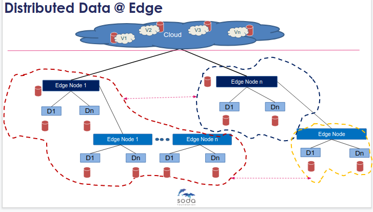

# SODA @ Edge Analysis and Design

Author(s): [Sanil Kumar](https://github.com/skdwriting)

Major Version Updates

Date : Version : Description : Author

25-Sep-2020 : 0.1 : Initial Draft with initial analysis and KubeEdge integration proposal: Sanil

## Goals

-   Inputs to Analysis and Architecture for Data Management @Edge as a focus for SODA
    
-   SODA Running at Edge for heterogeneous data management for Edge Computing Clusters
    
-   SODA Integration with Edge Computing platforms
    

## Motivation and background

Today most of the technologies are data intrinsic! However, the data explosion starts from Edge. Hence each technology like cloud, bigdata AI/ML, tries to research the possibilities of data processing closer to the source of the data generation. Data and Data Management at Edge has many difference challenges than core/cloud. Also the SODA Open Data Framework has a roadmap to support unified data framework for edge, core and cloud.

As the data related challenges at Edge are high; high demand of use cases; high demand for real time performance; huge data generation at edge; at the same time, the solutions and research are in its initial phases. So it is the right time to analyse and refine the architecture solution for SODA

### Non-Goals

-   Not overall SODA Design and Architecture for core and cloud
    
-   Focus to Edge data management
    

### Assumptions and Constraints

TBD

### Requirement Analysis

### Edge Data Management Challenges

#### Multi-Source Data Generation

-   Data from Each Device at the Edge
    
-   Data from Each Node at the Edge
    
-   Data from each cloud vendor
    
-   Data Operated from multiple sources from Edge to Core to Cloud!
    

#### Heterogeneous Data Storage

-   Store at Edge
    
-   Store at Core
    
-   Store at Cloud
    
-   Different Kinds of Storages (Object, File, Block)
    
-   Different Types (SSD, Flash..)
    
-   Different Vendors
    
-   Data Stored in heterogeneous storages across Edge,Core and Cloud!
    
-     
#### Real Distributed

-   Real P2P Network
    
-   Huge Number of Devices/Nodes
    
-        

#### Data Ownership and Consistency

-   Multi-point Data Access and Ownership
    
-   Making Data Consistency
    
-   Real time consistency?
    
#### Low Latency

-   Less Bandwidth, yet low latency demand for real time response
    
-   Made for Real-Time Response
    
-   Low-latency edge computing
    
-   low-latency distributed data stores
    
-   The heterogeneity of the storage nodes at the Edge is far more diverse than the Cloud
    
-   Diverse Data Store Design
    
-   What should be the caching strategy?
    
-     
A uniform storage tiering architecture – software defined across heterogeneous storage architectures

#### Offline Scenarios

-   A Key feature of Edge Architecture is Offline Data storage and processing capacity
-   Network failure
-   Congestion
-   Planned upgrade
-   Ability to aggregate data from Devices/Sensors in offline environment
-   How is the data synced with the cloud backend?
-   A data synchronization framework that works across storage systems
-   Storage that supports Offline-first application architecture

#### Data Mobility

-   Device, Node... Entry Exit
-   Node to Node, Cluster to Cluster Data Mobility
-   There is an implicit storage hierarchy
-   Workload/Use case demands may vary
-   Data mobility is the movement of Data from – Device, Node, Core to Cloud.
    
-   The protocol, lifecycle management, and data protection are key to data mobility
-   Modern Data requirements drive mobility:
-   supported for application development and test
-   backup, disaster recovery
-   analytics,
-   Archive
-   And more….
    
### Requirements

A data platform with:

-   Heterogeneous Data Framework
    
-   Open
    
-   Vendor Agnostic
    
-   Platform Agnostic
    
-   Distributed
    
-   Low Resource
    
-   Extensible or Shrinkable
    
-   Standardized
    

### Non Functional Requirements

TBD

Performance Requirements

Security Requirements

TBD

Other Non-Functional Requirements (Scalability, HA etc…)

## Architecture Analysis

### Architecture Tenets

-   Heterogeneous Data Framework
    
-   Open
    
-   Vendor Agnostic
    
-   Platform Agnostic
    
-   Distributed
    
-   Low Resource
    
-   Extensible or Shrinkable
    
-   Standardized
    

### High Level Architecture

SODA Framework need to work with Edge Computing platforms (just like it works with platforms in core/cloud). The overall solution for Data@Edge could be:

Edge Computing Platform + Distributed & Heterogeneous Data Management Platform

How SODA can be that distributed & Heterogeneous Data Management platform.

### Design Feasibility Analysis with Cloud Native Data Management at Edge

As SODA supports the CSI interface which can help to connect to heterogeneous storage backends and data operation features, CSI based platform can directly work with SODA at Edge.

High Level Design with CSI Compatible Edge platform (Example : Kube Edge)

#### Data Deployment View at Edge

#### SODA High Level Architecture

#### KubeEdge High Level Architecture

#### SODA & Kube Edge Integration Architecture

## Scratchpad

NA
